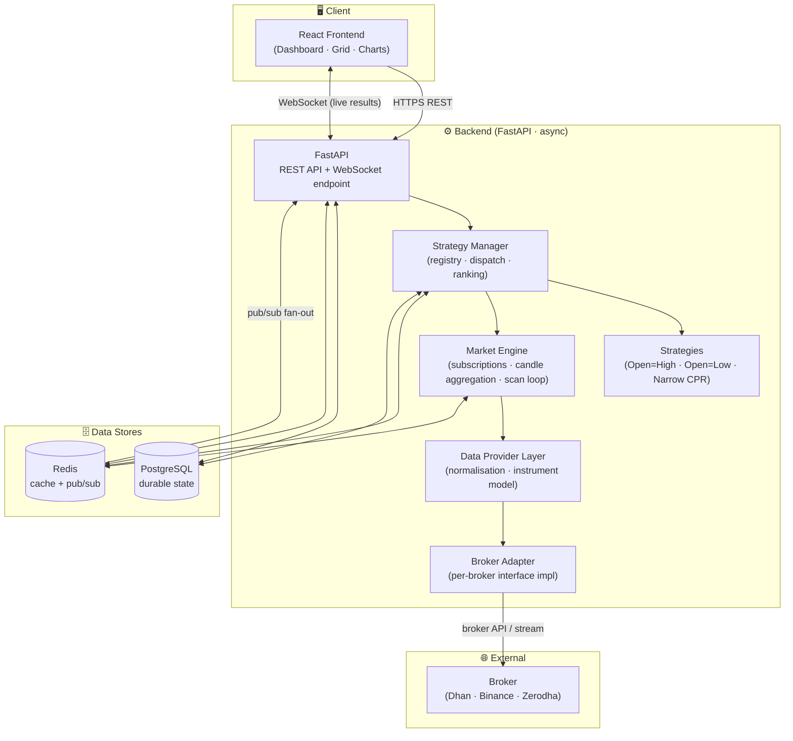
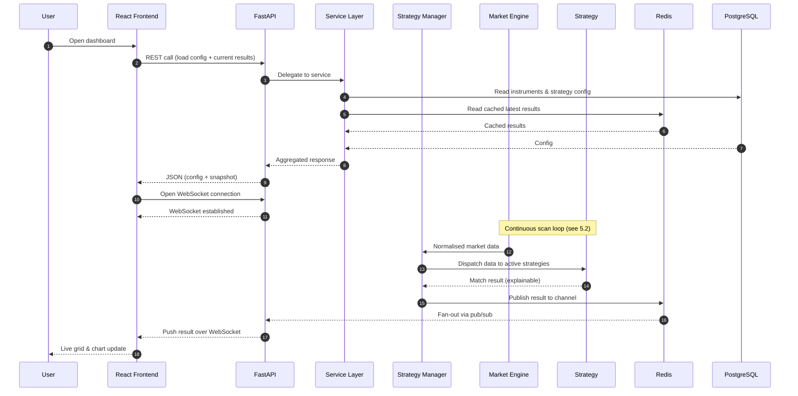
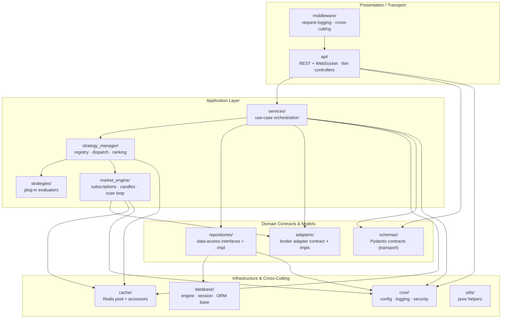
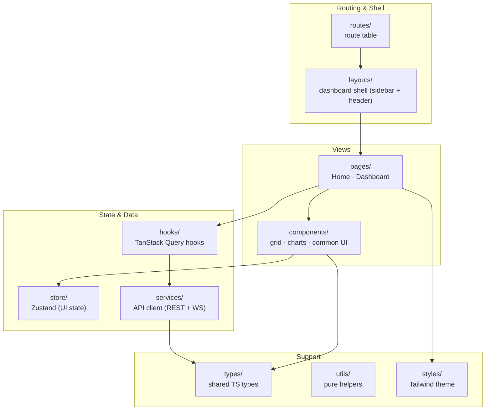
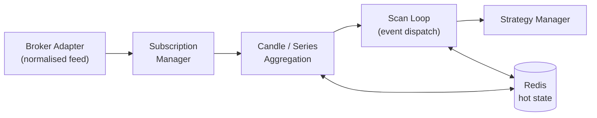
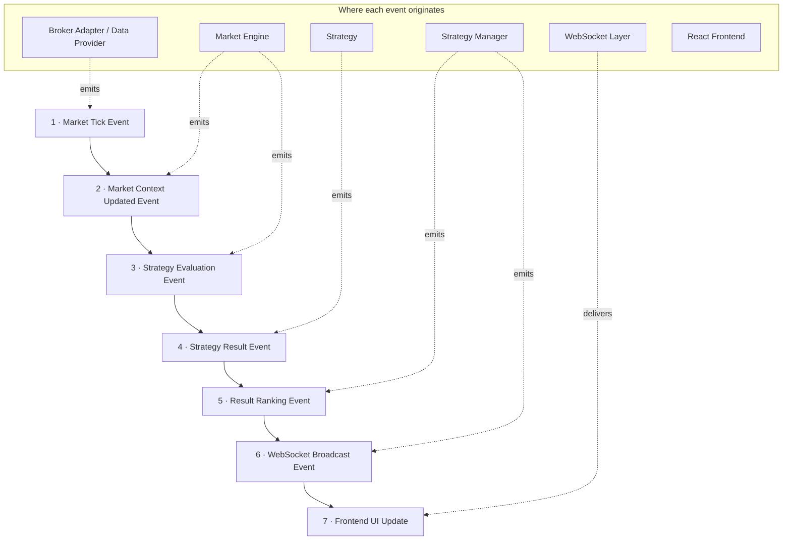

# ApexScan System Architecture

> **Document status:** Official — **Master Architecture Document**
> **Owner:** Platform Architecture
> **Audience:** Engineering, QA, DevOps, Product
> **Precedence:** This is the authoritative architecture reference. Every
> future component, module, and design document (`02`–`12`) must conform to the
> layering, dependency rules, and principles defined here. Where a lower-level
> document conflicts with this one, **this document wins** until it is formally
> updated.
> **Related documents:** `00_PROJECT_OVERVIEW.md` (why), this document (how the
> pieces fit), `02`–`09` (per-layer detail).

---

## Table of Contents

1. [Executive Summary](#1-executive-summary)
2. [Architecture Principles](#2-architecture-principles)
3. [High Level Architecture](#3-high-level-architecture)
4. [Layer Responsibilities](#4-layer-responsibilities)
5. [Complete Data Flow](#5-complete-data-flow)
6. [Backend Component Diagram](#6-backend-component-diagram)
7. [Frontend Component Diagram](#7-frontend-component-diagram)
8. [Market Engine Overview](#8-market-engine-overview)
9. [Event Architecture](#9-event-architecture)
10. [Cross-Cutting Concerns](#10-cross-cutting-concerns)
11. [Architecture Governance & Extension Rules](#11-architecture-governance--extension-rules)

---

## 1 Executive Summary

ApexScan is built as a **layered, event-driven, async-first** platform whose
guiding philosophy is **the isolation of volatility behind stable interfaces**.
The parts of a trading system that change most often and least predictably —
the brokers we connect to and the strategies we run — are pushed to the edges
of the architecture and hidden behind narrow contracts. The core of the system
depends only on those contracts, never on the volatile details behind them.

### 1.1 Architecture philosophy

Three ideas govern every decision in this document:

1. **Depend on abstractions, not details.** The scanning core knows *that* a
   broker can supply market data and *that* a strategy can evaluate it. It does
   not know *which* broker or *what* the strategy computes. Brokers and
   strategies are replaceable plug-ins.

2. **React to events; do not poll.** Market data arrives as a stream of events
   (ticks, candle closes). Computation is triggered by those events and results
   propagate outward — through the strategy engine, into the cache, and out to
   connected clients — as they happen.

3. **Never block.** Every layer that touches the network, disk, or another
   process does so asynchronously. A slow broker or a busy database degrades
   throughput gracefully rather than freezing the whole process.

### 1.2 Why the system is layered

The system is divided into layers — **Presentation → API → Application
(Services & Engine) → Domain contracts → Infrastructure (persistence, cache,
brokers)** — because layering gives us four concrete properties:

| Property | What layering buys us |
|----------|-----------------------|
| **Replaceability** | The UI can be rewritten, a broker swapped, or PostgreSQL upgraded without touching the domain. |
| **Testability** | Each layer is tested against the interface of the layer beneath it, using substitutes for the rest. |
| **Comprehensibility** | An engineer can reason about one layer knowing only the contract of its neighbours. |
| **Controlled change** | A change is contained to a layer; its blast radius is bounded by an interface. |

### 1.3 Why every module is isolated

Isolation is not decoration — it is the mechanism that makes the roadmap in
`00_PROJECT_OVERVIEW.md` achievable. When the market engine depends on a broker
*interface* rather than a concrete broker, adding Binance alongside Dhan is an
*addition* (a new adapter) rather than a *modification* (surgery on the core).
When the strategy engine dispatches to a strategy *contract*, scaling from 3
strategies to 100+ requires no change to the engine at all.

> **📌 Architecture callout — The two seams that matter most.**
> The **Broker Adapter interface** and the **Strategy contract** are the two
> load-bearing boundaries of the entire system. Almost every architectural
> property in this document is a consequence of keeping these two seams clean.
> Any change that leaks broker-specific or strategy-specific knowledge across
> these seams is an architecture violation, not a shortcut.

---

## 2 Architecture Principles

These principles are binding. They are the criteria against which every design
review and code review is conducted.

### 2.1 Layered Architecture
The system is organised into horizontal layers with a fixed order. A layer may
depend on the layer directly beneath it (through an interface) and must not
depend on layers above it. This produces a predictable, one-directional flow of
dependencies.

### 2.2 Clean Architecture
Dependencies point **inward**, toward the domain. Frameworks (FastAPI,
SQLAlchemy), the UI (React), and external systems (brokers, Redis, PostgreSQL)
are *outer-ring details*. The inner rings — services, the engine, the strategy
and adapter contracts — know nothing about the frameworks that host them and
can, in principle, be lifted onto a different technology stack unchanged.

### 2.3 The Dependency Rule
Source-code dependencies may only point **inward**. Nothing in an inner circle
may name anything in an outer circle. Concretely:

- Services depend on **repository and adapter interfaces**, never on the ORM
  session or a concrete broker SDK.
- The market engine depends on the **broker adapter contract**, never on Dhan,
  Binance, or Zerodha directly.
- The strategy engine depends on the **strategy contract**, never on a specific
  strategy.

> **⚠️ Warning — The Dependency Rule is absolute.**
> If you find yourself importing an infrastructure or framework type into a
> service or the engine, stop. Introduce an interface at the boundary instead.
> Violations of the Dependency Rule are the fastest way to erode every other
> guarantee in this document.

### 2.4 Low Coupling
Modules interact through the smallest possible surface. A module knows the
*interface* of its collaborators, not their internals. Changing a module's
implementation must not force changes in its collaborators.

### 2.5 High Cohesion
Everything inside a module serves a single, well-defined responsibility.
Market-data concerns live in the market engine; persistence lives in
repositories; presentation lives in the frontend. Unrelated responsibilities
are never bundled together.

### 2.6 Event Driven
Market events drive computation. The pipeline is a chain of reactions —
data event → strategy evaluation → result event → broadcast — rather than a
schedule of polls. This minimises latency and avoids wasted work when nothing
has changed.

### 2.7 Async First
All I/O-bound operations are non-blocking. A single backend process handles
many concurrent operations (broker streams, database queries, cache access,
WebSocket clients) cooperatively, without a thread per connection.

### 2.8 Modular Design
The system is a set of cohesive modules with explicit boundaries. Modules are
added, replaced, or removed with predictable, bounded impact. The physical
folder structure mirrors these module boundaries (see
[Section 6](#6-backend-component-diagram)).

### 2.9 Broker Agnostic
No core module references a specific broker. Broker-specific authentication,
data formats, endpoints, and quirks are confined entirely to adapters and
normalised to a common internal model at the boundary.

### 2.10 Strategy Agnostic
The engine treats every strategy as a contract-conforming black box. It knows
how to register, enable, feed, and collect results from a strategy — never what
any strategy computes internally.

> **💡 Tip — Principles compound.**
> Broker- and strategy-agnosticism are *consequences* of the Dependency Rule
> plus Low Coupling. You do not need to enforce ten rules independently; enforce
> the Dependency Rule rigorously and most of the others follow.

---

## 3 High Level Architecture

The system is composed of a browser frontend, an async backend hosting the
scanning runtime, two data stores (PostgreSQL and Redis), and a set of broker
adapters that connect to external brokers. Live results reach the browser over
a WebSocket channel fed by Redis pub/sub.

### 3.1 Primary request & data path

### 3.2 Reading the diagram

- **Downward arrows** are the control/data-acquisition path: a request or a
  scan cycle flows from the frontend down through the API, strategy manager,
  market engine, data provider, and adapter to the broker.
- **The broker adapter is the only component that talks to a broker.** Nothing
  above it knows which broker is in use.
- **Redis is both a cache and a message bus.** The market and strategy layers
  publish results into Redis; the API's WebSocket endpoint subscribes and fans
  those results out to browsers.
- **PostgreSQL holds durable state** (instruments, strategy configuration, scan
  metadata); Redis holds ephemeral/hot state.

> **📌 Architecture callout — Two directions of flow.**
> There is a *pull* path (frontend → API → engine → broker, to acquire and
> configure) and a *push* path (broker → engine → strategies → Redis → WebSocket
> → frontend, to deliver results). The push path is the real-time heart of the
> system; the pull path configures and queries it.

---

## 4 Layer Responsibilities

Each layer below is defined by its **responsibility**, its **allowed
dependencies**, and its **prohibitions** (what it must never do). The
prohibitions are as important as the responsibilities.

### 4.1 Frontend
- **Responsibility:** Render the scanner dashboard — live result grid, charts,
  configuration controls — and manage client-side UI state.
- **Depends on:** The REST API (configuration & historical reads) and the
  WebSocket channel (live updates).
- **Must never:** Contain scanning, strategy, or market logic. It displays
  state and expresses intent; it does not compute results.

### 4.2 API
- **Responsibility:** Expose a versioned REST contract and the WebSocket
  endpoint; validate inputs at the boundary; translate HTTP into service calls.
- **Depends on:** The service layer (via dependency injection).
- **Must never:** Contain business logic or touch the database/broker directly.
  Controllers stay thin and declarative.

### 4.3 Strategy Manager
- **Responsibility:** Maintain the registry of available strategies; enable and
  disable them; dispatch normalised market data to active strategies; collect,
  rank, and forward their results.
- **Depends on:** The **strategy contract**, the market engine (as its data
  source), and the cache/persistence layers (to publish and store results).
- **Must never:** Embed strategy-specific mathematics or know the identity of
  any particular strategy beyond its contract.

### 4.4 Strategy
- **Responsibility:** Evaluate normalised market data for one specific pattern
  and emit explainable matches conforming to the strategy contract.
- **Depends on:** Only the normalised data it is given and shared utilities.
- **Must never:** Reach out to brokers, the database, or the network directly.
  A strategy is a pure evaluation unit; the engine provides everything it needs.

> **⚠️ Warning — Strategies are sandboxed evaluators.**
> A strategy that performs its own I/O, holds global state, or crashes the
> process violates the isolation guarantee that lets us run 100+ of them safely.
> Strategy failures must be *contained* by the manager, never propagated.

### 4.5 Market Engine
- **Responsibility:** Acquire market data through the data provider layer,
  manage subscriptions, aggregate raw data into candles/derived series, and run
  the scan loop that feeds the strategy manager.
- **Depends on:** The **data provider layer** (which fronts broker adapters) and
  Redis (state, coordination).
- **Must never:** Know which broker supplies the data, nor what any strategy
  does with it.

### 4.6 Services
- **Responsibility:** Implement application/business use cases by orchestrating
  repositories, adapters, and the engine. The single place the API calls into.
- **Depends on:** Repository and adapter **interfaces**, and engine/manager
  entry points.
- **Must never:** Contain persistence details (SQL) or transport details
  (HTTP). It coordinates; it does not implement infrastructure.

### 4.7 Broker Adapter
- **Responsibility:** Implement the broker adapter contract for one broker —
  authentication, market-data access, instrument metadata — and normalise
  responses into the internal model.
- **Depends on:** The external broker API/SDK and the adapter contract it
  implements.
- **Must never:** Leak broker-specific types or behaviour upward. Everything
  broker-specific stops here.

### 4.8 Database
- **Responsibility:** Durably persist instruments, strategy configuration, scan
  runs, and result metadata, with integrity enforced by constraints.
- **Depends on:** Nothing above it; accessed exclusively through repositories.
- **Must never:** Host business logic beyond data integrity. Behaviour lives in
  services.

### 4.9 Cache
- **Responsibility:** Provide low-latency access to hot data and act as the
  pub/sub backbone that fans live results out to WebSocket clients.
- **Depends on:** Nothing above it.
- **Must never:** Be the sole home of anything that must survive a restart.
  Redis is ephemeral by design; durable truth lives in PostgreSQL.

> **📌 Architecture callout — Allowed-dependency summary.**
> Frontend → API → Services → {Strategy Manager, Repositories, Adapter
> interfaces} → {Market Engine → Data Provider → Broker Adapter} and
> {PostgreSQL, Redis}. Read every arrow as "may depend on." No arrow ever points
> backward.

---

## 5 Complete Data Flow

This section traces a request end to end, then describes the continuous
real-time update loop.

### 5.1 Dashboard load & scan configuration (pull path)

### 5.2 The narrative flow

1. **User opens the dashboard.** The browser loads the React application.
2. **Frontend issues a REST call.** It requests current configuration and a
   snapshot of the latest results.
3. **FastAPI receives the request** and delegates to the service layer via
   dependency injection — the controller itself does no work beyond validation.
4. **Service layer reads state:** durable configuration from PostgreSQL and the
   most recent cached results from Redis.
5. **Market Engine is already running** its scan loop independently of any
   single request: it acquires and normalises market data continuously.
6. **Strategy Manager dispatches** each normalised data event to every active
   strategy.
7. **Strategies evaluate** the data and return explainable matches (the
   instrument, the pattern, and *why* it matched).
8. **Results are published to Redis**, which serves both as the cache for the
   latest snapshot and as the pub/sub bus.
9. **Redis fans results out** to the WebSocket endpoint.
10. **Frontend receives the push** and updates the grid and charts in real time
    — no polling, no manual refresh.

### 5.3 WebSocket update loop (push path)

The WebSocket channel is the mechanism that makes ApexScan *real time*:

- On dashboard load, the frontend opens a persistent WebSocket connection to the
  API.
- The API's WebSocket endpoint **subscribes to Redis channels** carrying scan
  results.
- Whenever the strategy manager publishes a new or changed match, Redis
  **fans it out** to every subscribed connection.
- The frontend applies the update to its local view (grid row, chart marker)
  immediately.

> **📌 Architecture callout — REST configures, WebSocket delivers.**
> REST is used for request/response interactions (load config, read history,
> change settings). The WebSocket carries the continuous stream of live results.
> Keeping these two channels distinct keeps each simple and correctly scoped.

> **💡 Tip — Redis decouples producers from consumers.**
> Because results are published to Redis rather than pushed directly to sockets,
> the scanning runtime does not need to know how many clients are connected, and
> the WebSocket layer does not need to know how results are produced. This is the
> Low Coupling principle applied to real-time delivery — and the seam along which
> the system scales horizontally.

---

## 6 Backend Component Diagram

The backend is organised into modules whose physical location (under
`backend/app/`) mirrors their architectural role. The diagram shows allowed
dependencies (arrows point toward the dependency).

### 6.1 Module responsibilities

| Module (`backend/app/…`) | Responsibility |
|--------------------------|----------------|
| **`api`** | HTTP/WebSocket boundary. Versioned routers, thin controllers, dependency wiring. Delegates all work to services. |
| **`core`** | Cross-cutting foundation: configuration (single source of truth), structured logging, and the reserved security layer. Depended upon by everything; depends on nothing above it. |
| **`market_engine`** | Acquires and normalises market data, manages subscriptions, aggregates candles, and runs the scan loop. Depends on the adapter contract and cache. |
| **`strategies`** | The plug-in strategy evaluators. Each is a self-contained, contract-conforming unit with no I/O of its own. |
| **`strategy_manager`** | Registers, enables/disables, and dispatches data to strategies; collects and ranks results; publishes them. Knows the strategy *contract*, not any strategy. |
| **`database`** | SQLAlchemy async engine, session factory, and declarative base. Owns connection lifecycle; holds no business logic. |
| **`repositories`** | Data-access layer implementing the Repository Pattern. The only code that touches the ORM session. Exposes intention-revealing methods to services. |
| **`services`** | Application/business logic. Orchestrates repositories, adapters, and the engine to fulfil use cases. The sole layer the API calls into. |
| **`schemas`** | Pydantic v2 request/response and transfer contracts. Defines the validation boundary; kept separate from ORM models. |
| **`middleware`** | Cross-cutting request handling (structured access logging today; request IDs, rate limiting, auth context in future). Observes traffic; never contains domain logic. |
| **`cache`** | Redis connection pool and accessors for caching and pub/sub. Ephemeral by design. |
| **`utils`** | Small, pure, dependency-free helpers shared across layers. Contains no domain knowledge. |

> **⚠️ Warning — `utils` is not a dumping ground.**
> If a helper needs to know about instruments, strategies, or brokers, it is not
> a utility — it belongs in a service or the relevant module. `utils` stays pure
> and generic, or it becomes a hidden coupling point.

---

## 7 Frontend Component Diagram

The frontend is a React + TypeScript SPA organised by concern. Server state
(from the API) and client state (UI) are deliberately kept in separate
mechanisms.

### 7.1 Frontend responsibilities

| Concern (`frontend/src/…`) | Responsibility |
|----------------------------|----------------|
| **Pages** | Route-level views composing components and hooks into a screen (Home, Dashboard). |
| **Layouts** | The persistent application shell — sidebar and header — wrapping routed content. |
| **Components** | Reusable UI: the result **Grid** (AG Grid), price **Charts** (TradingView Lightweight Charts), and common chrome. |
| **Store** | Client/UI state via Zustand (e.g. sidebar collapse, view preferences). Not server data. |
| **API (services)** | A thin, typed client that centralises the backend base URL, REST calls, and the WebSocket connection. |
| **Charts** | Presentation of price/series data using TradingView Lightweight Charts, driven by data from hooks. |
| **Grid** | Dense, sortable, filterable presentation of live scan results using AG Grid. |
| **Hooks** | TanStack Query hooks that fetch and cache server state and subscribe to live updates; the template for all data access. |
| **Utilities** | Pure, framework-free helpers (formatting, transforms). No React, no domain logic. |

> **📌 Architecture callout — Two kinds of state, two mechanisms.**
> **Server state** (results, config from the backend) is owned by TanStack
> Query, which handles caching, refetching, and invalidation. **Client state**
> (UI toggles, local preferences) is owned by Zustand. Never store server data
> in Zustand or UI toggles in Query — conflating them reintroduces the bugs this
> separation exists to prevent.

---

## 8 Market Engine Overview

> This section is a **high-level** orientation. The detailed design —
> subscription lifecycle, candle aggregation, and the scan loop internals —
> lives in `06_MARKET_ENGINE.md`. No implementation is defined here.

### 8.1 Role in the architecture

The Market Engine is the **heart of the pull-then-push pipeline**. It sits
between the broker adapters (its data source) and the strategy manager (its
consumer). Its job is to turn a raw, broker-specific stream of market data into
a clean, normalised, engine-owned stream that strategies can evaluate — and to
do so continuously and asynchronously.

### 8.2 High-level responsibilities

| Responsibility | Description (high-level) |
|----------------|--------------------------|
| **Subscription management** | Track which instruments are being watched and ensure the underlying adapter is subscribed to them, avoiding redundant subscriptions. |
| **Normalisation intake** | Consume the already-normalised feed from the data provider layer and maintain the engine's own view of current market state. |
| **Aggregation** | Build the derived series (e.g. candles) that strategies require from raw incoming data. |
| **Scan loop** | React to market events by dispatching the relevant data to the strategy manager, which in turn feeds active strategies. |
| **Hot-state coordination** | Use Redis for fast shared state and coordination, keeping durable truth in PostgreSQL. |

### 8.3 Boundaries

- The engine **does not** know which broker is behind the adapter.
- The engine **does not** know what any strategy computes — it only knows how to
  deliver data and receive results via the strategy manager.
- The engine **does not** talk to the frontend; results reach clients through
  the strategy manager → Redis → WebSocket path.

> **💡 Tip — The engine is a data pipeline, not a decision-maker.**
> The market engine's success is measured by the *quality, timeliness, and
> normalisation* of the data it delivers — never by trading outcomes. Keep
> decision logic out of it; that belongs to strategies.

---

## 9 Event Architecture

ApexScan's real-time behaviour is expressed as a **chain of events**. Each stage
of the pipeline reacts to an event, does its one job, and emits the next event.
No stage calls the next stage directly by name; it *publishes* an event and lets
whoever is interested *subscribe*. This is the concrete realisation of the
**Event Driven** principle (§2.6) and the **Low Coupling** principle (§2.4).

### 9.1 The event chain

> **📌 Architecture callout — Events flow one way.**
> The chain is strictly forward: tick → context → evaluation → result → ranking
> → broadcast → UI. A later stage never reaches backward to an earlier one. This
> is the Dependency Rule (§2.3) expressed in time as well as in code.

### 9.2 Event-by-event reference

Each event below is described by its **meaning**, its **publisher** (who emits
it), its **subscriber(s)** (who react to it), and the **payload intent** (what
information it carries — described conceptually, not as a schema).

---

#### Event 1 — Market Tick Event

| Aspect | Description |
|--------|-------------|
| **Meaning** | A new unit of raw market data (a price/volume tick or a closed candle) has arrived from a broker for a subscribed instrument. This is the *ignition* event of the entire pipeline. |
| **Publisher** | The **Broker Adapter**, via the **Data Provider layer**, which normalises the broker-specific message into the internal market-data model before emitting. |
| **Subscriber** | The **Market Engine** (its subscription/intake stage). |
| **Payload intent** | Instrument identity, timestamp, and the normalised price/volume data for that moment. |

> **📝 Note — Normalisation happens before the event, not after.**
> By the time a Market Tick Event exists, all broker-specific quirks are already
> gone. Every subscriber downstream sees identical data regardless of which
> broker produced it — this is what makes the system **broker-agnostic** (§2.9).

---

#### Event 2 — Market Context Updated Event

| Aspect | Description |
|--------|-------------|
| **Meaning** | The engine has folded the new tick into its running view of an instrument — updating the current candle, derived series, and any maintained context — and that instrument's market context is now current. |
| **Publisher** | The **Market Engine** (its aggregation stage). |
| **Subscriber** | The **Market Engine's scan loop**, which decides whether the update warrants strategy evaluation. |
| **Payload intent** | Instrument identity plus a reference to the freshly-updated market context (current candle/series state). |

> **💡 Tip — Not every tick needs a full re-scan.**
> Separating "context updated" from "evaluate strategies" lets the engine debounce
> or batch: many ticks may update context, but evaluation can be triggered on a
> meaningful boundary (e.g. candle close). The event boundary is where that policy
> lives.

---

#### Event 3 — Strategy Evaluation Event

| Aspect | Description |
|--------|-------------|
| **Meaning** | A request to evaluate the current market context for one or more instruments against the active strategies. It says "this data is ready — strategies, take a look." |
| **Publisher** | The **Market Engine** (scan loop). |
| **Subscriber** | The **Strategy Manager**, which dispatches the context to every enabled strategy. |
| **Payload intent** | The instrument(s) and the market context to be evaluated; implicitly, the set of strategies currently active. |

> **📌 Architecture callout — The manager fans out; strategies stay blind to each other.**
> One Strategy Evaluation Event fans out to N strategies. Each strategy evaluates
> in isolation and knows nothing of the others. This is what allows the strategy
> count to grow to 100+ without any strategy or the engine changing (§2.10).

---

#### Event 4 — Strategy Result Event

| Aspect | Description |
|--------|-------------|
| **Meaning** | A single strategy has finished evaluating and has produced an outcome — either a match (with the reason it matched) or a no-match. |
| **Publisher** | An individual **Strategy** (the plug-in evaluator). |
| **Subscriber** | The **Strategy Manager**, which collects results from all strategies for the evaluation cycle. |
| **Payload intent** | The strategy identity, the instrument, whether it matched, and — crucially — the **explanation** (the values/conditions that produced the match). |

> **⚠️ Warning — A failing strategy emits a contained failure, not a crash.**
> If a strategy errors, the manager treats that as a (failed) Strategy Result
> Event for that strategy only — logged and isolated. The evaluation cycle
> continues for every other strategy. A single plug-in must never be able to halt
> the pipeline (§4.4).

---

#### Event 5 — Result Ranking Event

| Aspect | Description |
|--------|-------------|
| **Meaning** | The collected matches for an evaluation cycle have been ordered/prioritised into the shape the dashboard will present (e.g. grouped by strategy, ranked by relevance). |
| **Publisher** | The **Strategy Manager** (its collection/ranking stage). |
| **Subscriber** | The **broadcast stage** of the Strategy Manager and the **persistence path** (which stores/updates the latest snapshot). |
| **Payload intent** | The ordered set of matches for the cycle, ready for delivery, plus what should be cached as the current snapshot. |

> **📝 Note — Ranking is a presentation-ordering concern, not trading advice.**
> "Ranking" here means *ordering results for display*. It carries no notion of a
> trade recommendation. Keeping this distinction explicit prevents scope creep
> toward execution logic (out of scope for V1 — see `00_PROJECT_OVERVIEW.md` §4).

---

#### Event 6 — WebSocket Broadcast Event

| Aspect | Description |
|--------|-------------|
| **Meaning** | Ranked results are published onto the real-time bus so that all connected clients can receive them. |
| **Publisher** | The **Strategy Manager**, publishing to a **Redis pub/sub channel**. |
| **Subscriber** | The **WebSocket layer** in the API, which is subscribed to the channel and fans the message out to every connected browser. |
| **Payload intent** | The ranked matches (or an incremental update) destined for clients. |

> **💡 Tip — Redis is the decoupling seam for broadcast.**
> The producer publishes once to Redis and is done; it neither knows nor cares how
> many clients are connected. The WebSocket layer owns fan-out. This is the seam
> along which the delivery tier scales horizontally (§5.3).

---

#### Event 7 — Frontend UI Update

| Aspect | Description |
|--------|-------------|
| **Meaning** | The browser has received a broadcast and updates the live view — a grid row appears/changes, a chart marker is placed — without any user action or page refresh. |
| **Publisher** | The **WebSocket layer** (delivers the message over the open socket). |
| **Subscriber** | The **React Frontend** — the WebSocket-aware hook updates local state, and the affected components (Grid, Charts) re-render. |
| **Payload intent** | The ranked match data the UI renders. |

> **📌 Architecture callout — The UI is the final subscriber, never a publisher of results.**
> The frontend consumes result events and renders them. It never produces a
> result event or performs scanning. It may issue *intent* (REST calls to change
> configuration), but that travels the separate pull path (§5.1), not this chain.

### 9.3 Publisher / subscriber summary

| # | Event | Publisher | Subscriber(s) |
|---|-------|-----------|---------------|
| 1 | Market Tick | Broker Adapter → Data Provider | Market Engine (intake) |
| 2 | Market Context Updated | Market Engine (aggregation) | Market Engine (scan loop) |
| 3 | Strategy Evaluation | Market Engine (scan loop) | Strategy Manager |
| 4 | Strategy Result | Strategy (plug-in) | Strategy Manager |
| 5 | Result Ranking | Strategy Manager (ranking) | Broadcast stage + persistence |
| 6 | WebSocket Broadcast | Strategy Manager → Redis pub/sub | WebSocket layer (API) |
| 7 | Frontend UI Update | WebSocket layer | React Frontend |

### 9.4 Why event-driven architecture was chosen

The pipeline could, in principle, be a chain of direct function calls. It is
deliberately modelled as events instead, for reasons that map directly to the
project goals in `00_PROJECT_OVERVIEW.md`.

| Reason | Benefit to ApexScan |
|--------|---------------------|
| **Loose coupling** | Each stage knows the *event* it consumes and the *event* it emits — not the identity of its neighbours. Stages are replaced or added without editing the rest of the chain. |
| **Low latency** | Work is triggered the instant data arrives, not on a polling timer. The system reacts at the speed of the market rather than the speed of a schedule. |
| **No wasted work** | If nothing changes, no event fires and no computation happens. Compute is spent only in response to real market activity. |
| **Natural fan-out** | One event (e.g. Strategy Evaluation) fans out to many subscribers (100+ strategies) with no change to the publisher. This is how the platform scales in strategy count. |
| **Horizontal scalability** | Because broadcast goes through Redis pub/sub, producers and consumers are decoupled across processes. Delivery and (later) evaluation tiers can scale out independently. |
| **Fault isolation** | A failure in one subscriber (a broken strategy) is contained to its own event handling; the chain continues for everyone else. Reliability (§NFR) is a structural property, not an afterthought. |
| **Testability** | Each stage can be exercised by feeding it an input event and asserting the output event, in isolation from the rest of the pipeline. |
| **Extensibility** | New subscribers (e.g. a future paper-trading recorder, an analytics sink) attach to existing events without touching producers — the Open/Closed principle in action. |

> **⚠️ Warning — Events are a contract, not a convenience.**
> Once a stage publishes an event, other stages depend on its meaning and intent.
> Changing what an event *means* is a breaking change to every subscriber. Treat
> event definitions with the same care as the broker adapter and strategy
> contracts — they are load-bearing boundaries.

> **📌 Architecture callout — Event-driven complements layering.**
> Layering (§2.1) governs *code dependencies*; the event chain governs *runtime
> flow*. Together they guarantee that both compile-time structure and run-time
> behaviour point in one consistent direction — inward and forward.

---

## 10 Cross-Cutting Concerns

Some responsibilities span every layer. They are addressed uniformly rather
than reinvented per module.

| Concern | Approach |
|---------|----------|
| **Configuration** | A single, typed, injected configuration source (`core/config`). No module reads environment variables directly; no global config object is mutated at runtime. |
| **Logging** | Structured (JSON) logs to standard output, with per-request context added by middleware. Suitable for aggregation in any log platform. |
| **Error handling** | Fail fast with clear, actionable, context-rich errors. Failures in volatile components (strategies, broker connections) are contained and logged, never allowed to crash the platform. |
| **Security** | Secrets live only in environment configuration, never in source control. Inputs are validated at the API boundary. Broker credentials are handled through the reserved security layer. |
| **Dependency Injection** | Collaborators (settings, DB session, cache client) are injected at the boundary and flow inward. This is the mechanism that makes the Dependency Rule enforceable and the system testable. |
| **Observability** | Health and version endpoints expose liveness and build metadata today; the design anticipates metrics and dashboards as the platform matures. |

> **⚠️ Warning — Cross-cutting does not mean scattered.**
> A cross-cutting concern is handled in *one* place and applied everywhere
> (e.g. logging via middleware, config via injection). Re-implementing it inside
> individual modules is duplication and drift waiting to happen.

---

## 11 Architecture Governance & Extension Rules

This document is the contract every future component must honour. The following
rules make that contract enforceable.

### 10.1 Adding a broker
Implement the **broker adapter contract** in a new adapter module. Normalise all
broker-specific data at that boundary. **No change** to the market engine,
strategy manager, or any strategy is permitted or required. If adding a broker
seems to require touching the core, the abstraction is wrong — fix the boundary,
not the core.

### 10.2 Adding a strategy
Implement the **strategy contract** as a new plug-in under `strategies/` and
register it with the strategy manager. The strategy receives normalised data and
returns explainable matches. It performs **no I/O** of its own. **No change** to
the engine is permitted or required.

### 10.3 Adding an API endpoint
Add a thin controller that validates input and delegates to a service. Business
logic goes in the service, data access in a repository. Controllers never
contain logic or touch infrastructure directly.

### 10.4 The non-negotiables
1. **The Dependency Rule holds everywhere** — source dependencies point inward.
2. **Brokers and strategies stay behind their contracts** — no leakage upward.
3. **No global mutable state** — dependencies are injected.
4. **Async for all I/O** — nothing blocks the event loop.
5. **Durable truth in PostgreSQL; hot/ephemeral state in Redis.**
6. **The UI computes nothing** — it renders state and expresses intent.

### 10.5 Changing this document
This is a living document. When implementation reveals a superior design, the
change and the documentation update land **together**. Until this document is
updated, its rules stand — even over a lower-level design document that
disagrees.

> **📌 Architecture callout — Conformance is reviewed, not assumed.**
> Every pull request is checked against Sections 2, 4, and 11. An elegant
> implementation that violates the Dependency Rule or leaks a broker/strategy
> detail across a seam is rejected regardless of how well it works today —
> because it will not keep working as the system grows.

---

*End of document. This is the master architecture reference for ApexScan and is
maintained by the Platform Architecture team. All component designs (`02`–`12`)
derive from and must conform to it.*
