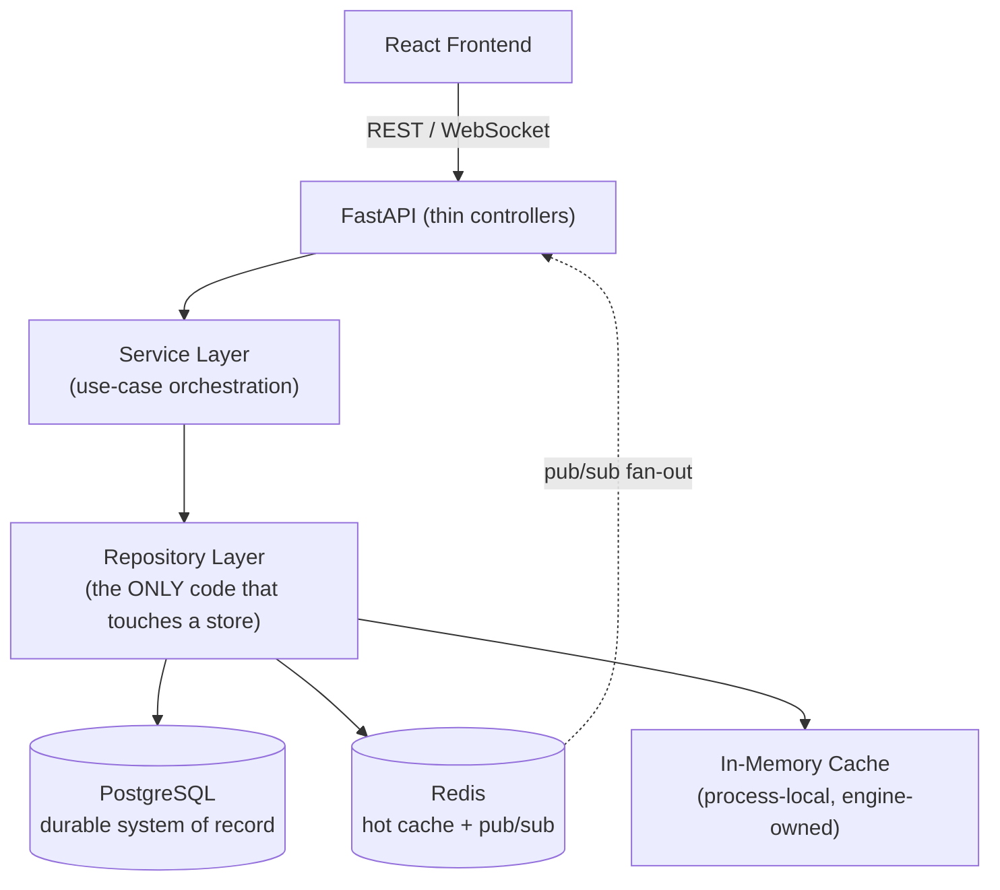
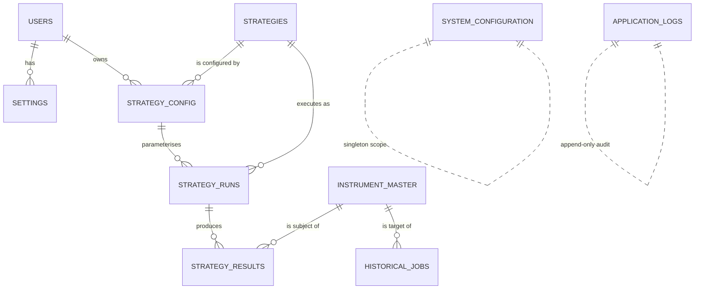

# ApexScan Database Design

> **Document status:** Official — **Database Design Document**
> **Owner:** Data / Platform Architecture
> **Audience:** Backend Engineering, DBA, QA, DevOps
> **Nature:** This is a **design** document, not an implementation document. It
> defines *what* the data model is, *where* each kind of data lives, and *who*
> owns it. It intentionally contains **no SQL, no DDL, no column definitions,
> and no migrations**.
> **Precedence:** Every future database change — new table, new store, new
> ownership boundary — must conform to this document. Where a migration or code
> change would contradict it, this document is updated *first*, in review, and
> the change follows.
> **Related documents:** `00_PROJECT_OVERVIEW.md`, `01_SYSTEM_ARCHITECTURE.md`
> (the Dependency Rule and layering this document obeys).

---

## Table of Contents

1. [Executive Summary](#1-executive-summary)
2. [Database Architecture](#2-database-architecture)
3. [Storage Strategy](#3-storage-strategy)
4. [Database Naming Standards](#4-database-naming-standards)
5. [Entity Relationship Overview](#5-entity-relationship-overview)
6. [Table Responsibilities](#6-table-responsibilities)
7. [Data Ownership Matrix](#7-data-ownership-matrix)
8. [Indexing & Performance Principles](#8-indexing--performance-principles)
9. [Data Lifecycle & Retention](#9-data-lifecycle--retention)
10. [Change Governance](#10-change-governance)

---

## 1 Executive Summary

ApexScan's data layer is a **hybrid storage system**. It uses the right store
for each kind of data rather than forcing everything into a single technology.
Durable truth lives in **PostgreSQL**, hot and ephemeral state lives in
**Redis**, and the highest-velocity, most transient data lives only in
**process memory**. The design philosophy is simple and strict:

> **Persist what must survive. Cache what must be fast. Keep in memory what is
> cheap to rebuild and expensive to store.**

### 1.1 Why PostgreSQL

PostgreSQL is the **system of record** — the single source of durable truth.

- **Relational integrity.** Instruments, strategies, configuration, runs, and
  results have real relationships. Foreign keys and constraints let the
  database *enforce* those relationships rather than trusting application code
  to remember them.
- **Transactional guarantees (ACID).** Configuration changes and result
  snapshots must be atomic and durable. A crash must never leave the record of
  truth half-written.
- **Query power.** Rich SQL, indexing, and JSON support let us answer
  historical and analytical questions without a second analytical engine in V1.
- **Operational maturity.** Backups, replication, and monitoring are
  well-understood and production-proven.

### 1.2 Why Redis

Redis is the **speed and coordination layer** — never the source of truth.

- **Low-latency reads.** Hot reference data and the latest result snapshot are
  served from memory-speed storage instead of hitting PostgreSQL on every tick.
- **Pub/Sub backbone.** Redis fans live results out to WebSocket clients,
  decoupling producers (the strategy manager) from consumers (connected
  browsers) — the seam described in `01_SYSTEM_ARCHITECTURE.md` §9.
- **Ephemeral shared state.** Sessions, short-lived coordination, and
  cross-process hot state live here with TTLs, so nothing lingers by accident.

### 1.3 Why hybrid storage

A single store cannot serve every access pattern well. Durable relational data
and 10,000-ticks-per-second streaming data have opposite requirements. Forcing
both into PostgreSQL would overload it with write churn; forcing durable
configuration into Redis would risk losing the source of truth on restart. The
hybrid model assigns each data class to the store whose guarantees match its
needs — durability, speed, or disposability.

### 1.4 Why some data stays only in memory

The market data stream is **high-volume, high-velocity, and cheap to
reconstruct**. Raw ticks and the live market context change constantly and are
re-derived from the incoming feed. Persisting every tick would generate
enormous write load for data that has little standalone value once aggregated.
Such data lives in the market engine's process memory (with Redis used only for
the *shared* hot state that other processes need), and only the **meaningful,
durable outcomes** — configuration, result snapshots, and (later) aggregated
historical candles — are written to PostgreSQL.

> **📌 Architecture callout — Storage choice follows the Dependency Rule.**
> The database layer is *infrastructure* (`01` §4.8–4.9). Services depend on
> **repository interfaces**, never on PostgreSQL, Redis, or memory directly.
> Which store backs a given piece of data is an implementation detail hidden
> behind the repository — this document decides it; the domain never sees it.

---

## 2 Database Architecture

Data access is strictly layered. The frontend never touches a store; requests
flow down through thin controllers into services, and **only the repository
layer touches PostgreSQL, Redis, or the in-memory cache**.

### 2.1 Layer responsibilities (data perspective)

| Layer | Responsibility | Must never |
|-------|----------------|------------|
| **Frontend** | Displays data; issues intent via the API. | Access any store or hold durable truth. |
| **API** | Validates input, delegates to services. | Run queries or touch a store directly. |
| **Service Layer** | Orchestrates use cases; decides *what* data is needed and *when*. | Contain SQL or store-specific access; it calls repositories. |
| **Repository Layer** | The sole gateway to every store. Translates domain operations into store operations and hides which store is used. | Contain business logic or transport concerns. |
| **PostgreSQL** | Durable relational system of record. | Host business logic beyond integrity constraints. |
| **Redis** | Hot cache and pub/sub fan-out. | Be the only home of anything that must survive a restart. |
| **In-Memory Cache** | Process-local hot state (market context) owned by the market engine. | Be relied on as shared or durable state. |

> **⚠️ Warning — The repository layer is the only door.**
> If service code, an endpoint, or the engine reaches a store without going
> through a repository, the storage-choice abstraction breaks and this design
> document loses its authority. All store access is repository-mediated,
> without exception.

---

## 3 Storage Strategy

Each class of data is deliberately assigned to a store based on its durability
needs, access pattern, and cost to reconstruct.

| Data Type | Storage | Persistence | Reason | Examples |
|-----------|---------|-------------|--------|----------|
| **Configuration** | PostgreSQL | Durable | Source of truth that must survive restarts and be auditable. | Strategy thresholds, feature flags, defaults |
| **Users** | PostgreSQL | Durable | Identity and access must be consistent and permanent. | Accounts, roles |
| **Strategies** | PostgreSQL | Durable | The registry of available strategies and their enabled state. | Strategy definitions, enabled/disabled flags |
| **Strategy Results** | PostgreSQL (history) + Redis (latest snapshot) | Hybrid | History must be durable; the live snapshot must be instant. | Matches with their explanation, per run |
| **Historical Data** | PostgreSQL *(dedicated time-series store in a later version)* | Durable | Needed for analysis/backtesting (future); write-once, read-many. | Aggregated OHLC candles |
| **Instrument Master** | PostgreSQL (truth) + Redis / memory (hot) | Hybrid | Reference data read constantly on the scan path; rarely changes. | Symbols, exchange, lot size |
| **Market Context** | In-Memory (engine) + Redis (shared hot) | Ephemeral | Recomputed from the feed every tick; changes constantly. | Current candle, derived series state |
| **Market Tick** | In-Memory / transient stream | Transient | Highest volume; little standalone value once aggregated. | Raw price/volume ticks |
| **Session Cache** | Redis | Ephemeral | Fast lookups with natural expiry; loss is harmless (re-auth). | Sessions, short-lived tokens |
| **WebSocket Cache** | Redis (pub/sub) | Ephemeral | Delivery/fan-out channel, not a store of record. | Latest broadcast payloads |
| **Application Logs** | Stdout → external aggregator *(optional audit table in PostgreSQL for domain events)* | Durable (external) | Operational logs belong in a log platform, not the primary DB. | Structured JSON access/app logs; domain audit events |
| **Temporary Objects** | In-Memory / Redis with TTL | Transient | Scratch computation; must never accumulate. | Dedup sets, in-flight batches |

### 3.1 Why each belongs where it does

- **Durable, relational, low-churn → PostgreSQL.** Configuration, users,
  strategies, instrument truth, and result history need integrity, atomicity,
  and permanence. They change infrequently relative to the tick stream and are
  queried in relational ways.
- **Hot, shared, disposable → Redis.** Sessions, the latest result snapshot,
  and broadcast fan-out need memory-speed access across processes, but losing
  them on restart is harmless — they are rebuilt or re-established.
- **High-velocity, cheap-to-rebuild → Memory.** Raw ticks and the live market
  context are recreated continuously from the feed. Persisting them would trade
  enormous write load for negligible value.
- **Operational output → log platform, not the DB.** Application logs are
  observability data. Routing them through the primary database would couple
  operational noise to transactional storage. A *separate, narrow* audit table
  may exist for domain-significant events, but operational logs go to stdout for
  aggregation (`01` §9).

> **💡 Tip — When in doubt, ask three questions.**
> *Must it survive a restart? Is it read on the hot path? Is it cheap to
> rebuild?* The answers place any new data class into PostgreSQL, Redis, or
> memory without further debate.

---

## 4 Database Naming Standards

Consistent naming makes the schema self-describing and predictable. These
conventions are **mandatory** for every future table and column in PostgreSQL.

| Element | Convention | Rationale |
|---------|-----------|-----------|
| **Tables** | `snake_case`, **plural** nouns (e.g. *strategies*, *strategy_results*) | Reads naturally as a collection of rows; consistent with SQL norms. |
| **Columns** | `snake_case`, singular, descriptive (no abbreviations) | Self-documenting; avoids ambiguity across the team. |
| **Primary Keys** | A single surrogate key named `id` per table | Uniform join/reference pattern; decouples identity from business values. |
| **Foreign Keys** | `<referenced_table_singular>_id` (e.g. *strategy_id*) | The name states exactly what it references. |
| **Indexes** | `ix_<table>_<column(s)>`; unique indexes `uq_<table>_<column(s)>` | Purpose and target are readable from the name alone. |
| **Constraints** | `ck_<table>_<rule>` (check), `fk_<table>_<ref>` (foreign key) | Predictable, greppable constraint names in errors and migrations. |
| **Timestamp fields** | `created_at`, `updated_at`, and event-specific `*_at` (e.g. *started_at*, *completed_at*); stored in **UTC** | Consistent temporal semantics; `_at` always means a point in time. |
| **Boolean fields** | Prefixed with `is_` / `has_` (e.g. *is_enabled*, *has_error*) | Reads as a yes/no question; unambiguous at call sites. |
| **Status fields** | `status` or `<thing>_status`, backed by a defined set of allowed values | Encodes lifecycle state explicitly and consistently. |

### 4.1 General rules

- **UTC everywhere.** All timestamps are stored in UTC; time-zone conversion is
  a presentation concern handled at the edges.
- **No reserved words** as identifiers.
- **Singular referenced table in foreign keys, plural table names** — this pair
  is intentional and consistent (`strategy_results.strategy_id → strategies.id`).
- **Enumerations are explicit.** Status and type fields draw from a documented
  set of allowed values, defined per entity in a later schema document — never
  free-form strings invented ad hoc.

> **⚠️ Warning — Naming is a contract, not a preference.**
> Once a table or column is named and shipped, renaming it is a breaking
> migration. Apply these standards from the first table so we never pay the
> rename tax later.

---

## 5 Entity Relationship Overview

This is a **high-level** conceptual model. It names the core entities and the
relationships between them. It deliberately shows **no columns, no SQL, and no
CREATE statements** — attributes are defined in a later schema document, subject
to the naming standards in Section 4.

### 5.1 Entity descriptions

| Entity | Description (conceptual) |
|--------|--------------------------|
| **Strategies** | The registry of available scanner strategies and their global enabled state. One row per strategy plug-in known to the system. |
| **Strategy Config** | Per-strategy (and per-user) tunable parameters — the settings a strategy runs with. Separates *what a strategy is* from *how it is currently tuned*. |
| **Strategy Runs** | A record of each execution/scan cycle of a strategy: when it ran, against what, and its outcome status. The parent of the results it produced. |
| **Strategy Results** | The individual matches produced by a run — the instrument matched and the *explanation* of why. The core output of the platform. |
| **Users** | Platform accounts and their roles. The owner of settings and strategy configuration. |
| **Settings** | Per-user preferences (UI and behavioural). Distinct from system-wide configuration. |
| **Instrument Master** | Reference data for tradeable instruments (symbol, exchange, metadata). Read constantly on the scan path; the anchor that results and jobs point to. |
| **Historical Jobs** | Records of historical-data acquisition/aggregation tasks per instrument (a forward-looking entity supporting later backtesting). |
| **Application Logs** | An append-only audit trail of domain-significant events. *Distinct from operational stdout logging* (see §3). |
| **System Configuration** | Global, system-wide settings and feature flags — effectively a single logical scope, not per-user. |

### 5.2 Relationship explanations

- **A user has many settings and owns many strategy configurations.** Identity
  is the anchor for personalised state.
- **A strategy is configured by many strategy configs.** The strategy
  definition is stable; configurations tune it (per user, over time).
- **A strategy config parameterises many strategy runs; a strategy executes as
  many runs.** Each scan cycle is a run tied to both the strategy and the
  configuration it used.
- **A run produces many strategy results.** One evaluation cycle yields the set
  of instruments that matched.
- **An instrument is the subject of many strategy results and the target of
  many historical jobs.** The Instrument Master is the shared reference point
  across the result and historical domains.
- **System Configuration and Application Logs stand largely alone** — global
  config is a single scope; the audit log is append-only and not relationally
  central.

> **📌 Architecture callout — Results are explainable by design.**
> The `Strategy Runs → Strategy Results → Instrument Master` chain exists so
> that every match can be traced back to *which run, of which strategy, with
> which configuration, against which instrument*. Explainability
> (`00_PROJECT_OVERVIEW.md` objective O3) is a **data-model property**, not an
> afterthought bolted on in the UI.

---

## 6 Table Responsibilities

For each entity, this section defines its **purpose**, the **module that owns
it** (the single writer of truth), the **modules that read it**, the **modules
that write it**, and its expected **future growth**. Columns are intentionally
**not** defined here — that belongs to the schema document.

### 6.1 Strategies
- **Purpose:** Registry of available strategies and their enabled state.
- **Owner module:** Strategy Manager.
- **Read modules:** Strategy Manager, Services (API), Market Engine (to know
  what is active).
- **Write modules:** Strategy Manager (registration/enablement) via Services.
- **Future growth:** Versioning of strategies; categorisation; ownership by
  authors (toward the future marketplace).

### 6.2 Strategy Config
- **Purpose:** Tunable parameters a strategy runs with, per user.
- **Owner module:** Services (configuration use cases).
- **Read modules:** Strategy Manager, Strategies (at dispatch time), Services.
- **Write modules:** Services (on user configuration changes).
- **Future growth:** Config templates, sharing, and validation rules per
  strategy type.

### 6.3 Strategy Runs
- **Purpose:** Record of each scan/execution cycle and its status.
- **Owner module:** Strategy Manager.
- **Read modules:** Services (history/queries), Strategy Manager.
- **Write modules:** Strategy Manager (opens/closes each run).
- **Future growth:** Run metrics (duration, instruments scanned), scheduling
  metadata, links to backtesting runs.

### 6.4 Strategy Results
- **Purpose:** The matches produced by runs, with explanations.
- **Owner module:** Strategy Manager.
- **Read modules:** Services (API reads, snapshots), WebSocket layer
  (indirectly, via the cached snapshot).
- **Write modules:** Strategy Manager (durable history) + cache writes for the
  live snapshot.
- **Future growth:** High volume — the primary scaling concern; candidate for
  partitioning/retention policies (see §9).

### 6.5 Users
- **Purpose:** Accounts and roles.
- **Owner module:** Services (with the security layer, future).
- **Read modules:** Services, API (auth context, future).
- **Write modules:** Services.
- **Future growth:** Roles/permissions, multi-tenancy, external identity
  providers.

### 6.6 Settings
- **Purpose:** Per-user preferences.
- **Owner module:** Services.
- **Read modules:** Services, Frontend (via API).
- **Write modules:** Services.
- **Future growth:** Richer personalisation, saved layouts, alerting prefs.

### 6.7 Instrument Master
- **Purpose:** Reference data for tradeable instruments.
- **Owner module:** Services (instrument/reference-data use cases), fed by
  Broker Adapters via the Data Provider layer.
- **Read modules:** Market Engine, Strategy Manager, Strategies, Services — read
  constantly on the scan path (hence cached in Redis/memory).
- **Write modules:** Services (on refresh/sync from adapters).
- **Future growth:** Multi-exchange, multi-asset-class expansion; corporate
  actions; symbol history.

### 6.8 Historical Jobs
- **Purpose:** Track historical-data acquisition/aggregation tasks.
- **Owner module:** A future historical-data service.
- **Read modules:** Services, future backtesting engine.
- **Write modules:** The historical-data service.
- **Future growth:** Central to the Version 3 backtesting roadmap; job
  scheduling, retries, and provenance.

### 6.9 Application Logs
- **Purpose:** Append-only audit trail of domain-significant events.
- **Owner module:** Cross-cutting (written by services at meaningful events).
- **Read modules:** Services (audit/review), operations tooling.
- **Write modules:** Services (append only).
- **Future growth:** Retention tiers; likely migration to a dedicated
  audit/observability store as volume grows.

### 6.10 System Configuration
- **Purpose:** Global settings and feature flags.
- **Owner module:** Services (application configuration use cases).
- **Read modules:** Effectively all backend modules (through configuration
  accessors).
- **Write modules:** Services (administrative changes).
- **Future growth:** Environment-scoped overrides; dynamic feature flagging.

> **💡 Tip — One writer, many readers.**
> Every entity has exactly **one owning module** that writes its truth. Many
> modules may read it. This single-writer rule prevents the "who last changed
> this row and why" ambiguity that plagues shared-write schemas, and it keeps
> the ownership matrix in Section 7 unambiguous.

---

## 7 Data Ownership Matrix

Ownership is explicit: for each module, which entities it **owns** (is the
authoritative writer of), which it **reads**, and which it **writes**. "Owns"
implies "writes"; a module may also write to entities it does not own only
through the owner's service boundary — never by reaching around it.

| Module | Owns | Reads | Writes |
|--------|------|-------|--------|
| **Strategy Manager** | Strategies, Strategy Runs, Strategy Results | Strategy Config, Instrument Master | Strategies, Strategy Runs, Strategy Results |
| **Market Engine** | *(none — owns no durable table)* | Strategies (active set), Instrument Master, Strategy Config | *(writes only ephemeral market context to memory/Redis)* |
| **Services (Application)** | Users, Settings, Strategy Config, Instrument Master, System Configuration | All entities (orchestration & API reads) | Users, Settings, Strategy Config, Instrument Master, System Configuration, Application Logs |
| **Broker Adapter / Data Provider** | *(none — feeds Services)* | *(none directly; hands normalised data to Services/Engine)* | *(none directly; Instrument Master is written by Services)* |
| **WebSocket Layer** | *(none)* | Strategy Results (via cached snapshot) | *(none — read/deliver only)* |
| **Historical-Data Service** *(future)* | Historical Jobs | Instrument Master | Historical Jobs, Historical Data |
| **Security Layer** *(future)* | *(shares Users with Services)* | Users | *(auth-related fields via Services)* |

### 7.1 Ownership rules

1. **Single owner per entity.** Exactly one module is the authoritative writer.
2. **Reads are open; writes are gated.** Any module may read (through
   repositories); only the owner writes, and only through its service boundary.
3. **The engine owns no durable table.** The market engine's state is ephemeral
   by design; its durable outputs are written by the Strategy Manager.
4. **Adapters never write the database directly.** Normalised reference data
   flows through Services, preserving the Dependency Rule and keeping brokers at
   the edge (`01` §2.9).

> **📌 Architecture callout — Ownership mirrors the module boundaries in `01`.**
> This matrix is not a new set of rules; it is the data-layer projection of the
> module responsibilities in `01_SYSTEM_ARCHITECTURE.md` §4 and §6. If a future
> change needs a module to own an entity this matrix does not grant it, that is
> an architecture change requiring an update here first.

---

## 8 Indexing & Performance Principles

Detailed index definitions belong to the schema document; the **principles** are
set here and are binding.

- **Index the read path, not the write path blindly.** Add indexes to support
  the queries the scan and dashboard paths actually run; every index is a write
  cost, so each must earn its place.
- **Foreign keys are indexed.** Relationship columns used for joins/filters are
  indexed by default.
- **High-volume tables get a growth plan.** Strategy Results is the primary
  volume concern; its design anticipates partitioning and retention before it
  becomes a problem, not after.
- **Hot reads are cached, not re-queried.** Instrument Master and the latest
  result snapshot are served from Redis/memory; PostgreSQL is not on the
  per-tick hot path.
- **Measure before optimising.** Index and query changes are justified by
  observed access patterns and query plans, not speculation.

> **⚠️ Warning — Every index is a trade-off.**
> Indexes speed reads and slow writes. On a high-write table like Strategy
> Results, an unnecessary index is a permanent tax on the hot path. Justify each
> one against a real query.

---

## 9 Data Lifecycle & Retention

Each data class has an explicit lifecycle so the database does not grow without
bound and ephemeral data does not linger.

| Data class | Lifecycle |
|------------|-----------|
| **Configuration, Users, Strategies, Instrument Master** | Long-lived; retained for the life of the system; changes are auditable. |
| **Strategy Runs / Results** | Durable but subject to a retention policy — recent history is kept hot/queryable; older data is archived or pruned per a defined window (to be set with product). |
| **Market Context / Ticks** | Ephemeral; exist only for the current session in memory and are never persisted raw. |
| **Session / WebSocket / Temporary** | TTL-bound in Redis; expire automatically; loss is harmless. |
| **Application Logs (audit)** | Append-only with a retention tier; migrated to a dedicated store as volume grows. |

> **💡 Tip — Retention is a design input, not a cleanup afterthought.**
> Deciding how long Strategy Results live *before* the table grows large is far
> cheaper than retrofitting partitioning under load. The window is a product
> decision recorded here once set.

---

## 10 Change Governance

Because every future database change must conform to this document, the process
for changing it is explicit.

### 10.1 What requires updating this document first
- Adding, removing, or renaming an entity.
- Changing which module **owns** an entity (the ownership matrix in §7).
- Moving a data class between stores (PostgreSQL ↔ Redis ↔ memory).
- Introducing a new store or persistence technology.

### 10.2 The change flow
1. **Design first.** Update this document (entity, storage strategy, ownership)
   and have it reviewed.
2. **Then migrate.** Schema changes are applied through Alembic migrations —
   forward-only, reviewed, and reversible where practical.
3. **Then implement.** Repositories and services are updated to match, behind
   their interfaces.
4. **Verify.** Tests confirm behaviour; the ownership and naming rules are
   checked in review.

### 10.3 Non-negotiables
1. **PostgreSQL is the only source of durable truth.** Redis and memory are
   never the sole home of data that must survive a restart.
2. **All store access goes through repositories.** No direct store access from
   services, endpoints, or the engine.
3. **One owning module per entity.** Reads are open; writes are gated by the
   owner's service boundary.
4. **Naming standards (§4) apply to every new table and column** from creation.
5. **UTC for all timestamps.**
6. **Storage placement follows §3** — persist what must survive, cache what must
   be fast, keep in memory what is cheap to rebuild.

> **📌 Architecture callout — This document is the schema's constitution.**
> Individual migrations are laws; this document is the constitution they must
> not contradict. When reality and this document diverge, we fix the divergence
> deliberately — by amending the document in review — never silently in a
> migration.

---

*End of document. This is the official database design reference for ApexScan
and is maintained by Data / Platform Architecture. Column-level schema and
migrations are defined elsewhere and must conform to the entities, storage
strategy, naming standards, and ownership defined here.*
