# ApexScan Backend Architecture — Part 1

> **Document status:** Official — **Backend Design Document (Part 1 of 2)**
> **Owner:** Backend / Platform Architecture
> **Audience:** Backend Engineering, QA, DevOps
> **Nature:** Architecture only. This document contains **no code, no Python, no
> SQL, no API endpoint definitions, and no database tables**. It defines the
> shape every backend implementation must take *before a line of code is
> written*.
> **Precedence:** Every backend implementation must conform to this document. It
> derives from and obeys `01_SYSTEM_ARCHITECTURE.md` (the master architecture)
> and `02_DATABASE_DESIGN.md`. Where they conflict, the master architecture wins.
> **Scope of Part 1:** Sections 1–10 (philosophy → logging). Part 2 will cover
> the runtime internals (engine loop, event bus, workers, error taxonomy,
> testing strategy).

---

## Table of Contents

1. [Executive Summary](#1-executive-summary)
2. [Backend Design Principles](#2-backend-design-principles)
3. [Backend Folder Structure](#3-backend-folder-structure)
4. [Module Dependency Rules](#4-module-dependency-rules)
5. [Backend Layer Responsibilities](#5-backend-layer-responsibilities)
6. [Backend Startup Sequence](#6-backend-startup-sequence)
7. [Backend Shutdown Sequence](#7-backend-shutdown-sequence)
8. [Configuration Architecture](#8-configuration-architecture)
9. [Logging Architecture](#9-logging-architecture)
10. [Summary](#10-summary)

---

## 1 Executive Summary

### 1.1 Backend philosophy

The ApexScan backend is a **layered, modular, event-driven, async-first**
application built on **Clean Architecture**. Its guiding idea, inherited from
the master architecture, is the **isolation of volatility behind stable
interfaces**: the things that change most — brokers and strategies — live at the
edges behind contracts, and the core depends only on those contracts.

The backend is not "a web server with some logic attached." It is a **scanning
runtime** that happens to expose an HTTP/WebSocket surface. Its centre of
gravity is the market-data pipeline (acquire → normalise → evaluate → rank →
broadcast), and the web framework is merely the outermost delivery mechanism.

### 1.2 Why FastAPI

| Reason | What it gives the backend |
|--------|---------------------------|
| **Native async** | First-class `async`/`await` support matches an I/O-bound workload (market feeds, DB, cache, sockets) without a thread-per-request model. |
| **Dependency injection** | A built-in DI system lets us inject settings, sessions, and cache clients at the boundary — the mechanism that makes the Dependency Rule enforceable and the code testable. |
| **Typed validation** | Request/response validation via Pydantic v2 gives a strong, declarative boundary between the outside world and the domain. |
| **WebSocket support** | The real-time push channel and the REST surface live in one framework, one process model. |
| **Automatic contract docs** | The API contract is self-describing, keeping the surface honest as it evolves. |

### 1.3 Why Async

Scanning is overwhelmingly **I/O-bound**: waiting on broker streams, database
queries, cache lookups, and many concurrent WebSocket clients. An async model
lets a single process interleave thousands of in-flight operations cooperatively.
A slow broker or a busy database degrades throughput *gracefully* rather than
blocking unrelated work. Synchronous, thread-per-request designs would waste
memory and context-switching on work that is almost entirely *waiting*.

### 1.4 Why Modular

The backend is decomposed into cohesive modules whose **physical folders mirror
their architectural roles** (Section 3). Modularity is what makes the roadmap
achievable: adding a broker is a new adapter module; adding a strategy is a new
plug-in module; neither touches the core. A change is contained to a module, and
its blast radius is bounded by an interface.

### 1.5 Why Event Driven

The scan pipeline is modelled as a **forward chain of events** (see
`01_SYSTEM_ARCHITECTURE.md` §9). Each stage reacts to an event, does one job, and
emits the next. This yields low latency (work fires when data arrives, not on a
timer), natural fan-out (one evaluation event reaches 100+ strategies), and fault
isolation (a failing subscriber does not halt the chain).

### 1.6 Why Clean Architecture

Dependencies point **inward**, toward the domain. FastAPI, SQLAlchemy, Redis, and
the broker SDKs are *outer-ring details*. The inner rings — services, the engine,
the strategy and adapter contracts — know nothing about the frameworks that host
them. This is what allows any outer detail to be replaced without disturbing the
core.

### 1.7 How the backend evolves without changing its architecture

The architecture is designed so that **growth is addition, not modification**:

| Change | How it happens | What it must NOT touch |
|--------|----------------|------------------------|
| New broker | Add an adapter implementing the broker contract | Market engine, strategies, services |
| New strategy | Add a plug-in implementing the strategy contract | The engine, other strategies |
| New API capability | Add a thin controller delegating to a service | Repositories, stores directly |
| New persistence need | Add a repository behind its interface | Services' knowledge of the store |
| New background job | Add a worker subscribing to an event | Producers of that event |
| Scale out | Run more instances; Redis decouples producers/consumers | The domain code |

> **📌 Architecture callout — The architecture is a set of *seams*, not a set of *files*.**
> Every evolution above slots into an existing seam (adapter contract, strategy
> contract, service boundary, event, repository interface). If a proposed change
> requires editing the core to accommodate an edge concern, the seam is in the
> wrong place — fix the seam, do not bend the core.

---

## 2 Backend Design Principles

These principles are binding and are the criteria for design and code review.
Each is stated with its **purpose**, its **benefits**, and a **conceptual
example** (described in prose — no code).

### 2.1 SOLID
- **Purpose:** Keep modules single-purpose, open to extension but closed to
  modification, substitutable behind interfaces, and dependent on abstractions.
- **Benefits:** Predictable change; new brokers/strategies plug in without core
  edits; components are independently testable.
- **Conceptual example:** The market engine accepts *any* object satisfying the
  broker adapter contract. Swapping Dhan for Binance substitutes one
  implementation for another with no change to the engine (Liskov + DIP).

### 2.2 DRY (Don't Repeat Yourself)
- **Purpose:** Each piece of knowledge has one authoritative home.
- **Benefits:** A rule changes in one place; no divergent copies drift apart.
- **Conceptual example:** Normalisation of an instrument identifier lives once in
  the data-provider layer; every strategy and result path relies on that single
  definition rather than re-deriving it.

> **⚠️ Warning — DRY is earned, not presumed.**
> Extract shared logic only once duplication is real (the "rule of three" from
> the project standards). Premature abstraction couples things that merely look
> alike, which is worse than a little duplication.

### 2.3 KISS (Keep It Simple)
- **Purpose:** Prefer the simplest design that satisfies the requirement.
- **Benefits:** Lower cognitive load; fewer defects; easier onboarding.
- **Conceptual example:** V1 broadcasts full result snapshots; a more elaborate
  incremental-diff protocol is deferred until measurement shows it is needed.

### 2.4 Separation of Concerns
- **Purpose:** Each layer/module addresses exactly one concern.
- **Benefits:** Changes to transport do not affect logic; changes to storage do
  not affect strategies.
- **Conceptual example:** The API worries about HTTP shape; services worry about
  use cases; repositories worry about persistence. None reaches into another's
  concern.

### 2.5 Dependency Injection
- **Purpose:** Collaborators are provided from the outside, not constructed or
  read from globals inside a module.
- **Benefits:** Testability (substitutes injected in tests), no hidden coupling,
  a single composition root.
- **Conceptual example:** A service receives a database session and a cache
  client as inputs; in tests it receives fakes; it never reaches for a global.

### 2.6 Repository Pattern
- **Purpose:** All persistence flows through repositories exposing
  intention-revealing operations.
- **Benefits:** The domain is isolated from storage; the store can change behind
  the interface; data access is testable.
- **Conceptual example:** A service asks a repository for "the active strategies"
  and does not know or care whether the answer came from PostgreSQL, a Redis
  cache, or both.

### 2.7 Service Layer
- **Purpose:** Business/use-case logic lives in services that orchestrate
  repositories, adapters, and the engine.
- **Benefits:** Thin controllers, reusable logic, one place to reason about a
  use case.
- **Conceptual example:** "Update a strategy's configuration" is a service
  operation that validates intent, writes through a repository, and signals the
  engine — invoked identically whether triggered by REST today or a scheduler
  tomorrow.

### 2.8 Broker Agnostic
- **Purpose:** No core module references a specific broker.
- **Benefits:** Multi-broker support is additive; broker outages/changes are
  contained.
- **Conceptual example:** The word "Dhan" appears only inside the Dhan adapter;
  the engine, strategies, and services never name it.

### 2.9 Strategy Agnostic
- **Purpose:** The engine treats every strategy as a contract-conforming black
  box.
- **Benefits:** Scale to 100+ strategies with zero engine changes.
- **Conceptual example:** The strategy manager dispatches normalised data to
  every active strategy without knowing whether one computes "Open = High" or
  something entirely new.

### 2.10 Async First
- **Purpose:** All I/O is non-blocking.
- **Benefits:** High concurrency in one process; graceful degradation under load.
- **Conceptual example:** While one instrument's data awaits a database write,
  the event loop is already processing ticks for hundreds of others.

> **⚠️ Warning — One blocking call poisons the loop.**
> A single synchronous, blocking operation on the event loop stalls *every*
> concurrent task. Blocking or CPU-heavy work must be delegated off the loop
> (worker/executor), never run inline in an async path.

### 2.11 Configuration Driven
- **Purpose:** Behaviour is governed by validated configuration, not hard-coded
  constants or scattered environment reads.
- **Benefits:** The same build runs in every environment; no code change to
  re-point a dependency.
- **Conceptual example:** Database and Redis endpoints, CORS origins, and log
  level all come from one typed configuration source (Section 8).

### 2.12 Testability
- **Purpose:** Every unit is designed to be tested in isolation.
- **Benefits:** Confidence to change; regressions caught early; behaviour, not
  implementation, is verified.
- **Conceptual example:** Because dependencies are injected and stores sit behind
  repositories, a service is tested by feeding it fakes and asserting outcomes —
  no database or broker required.

> **📌 Architecture callout — The principles reinforce one another.**
> DI enables Testability; the Repository and Service patterns enforce Separation
> of Concerns; broker- and strategy-agnosticism are consequences of SOLID. Enforce
> the Dependency Rule rigorously and most of the rest follow.

---

## 3 Backend Folder Structure

The physical layout **enforces** the architecture: a folder's location signals
its layer and its allowed dependencies. Below, each folder is described by its
**purpose**, **responsibilities**, **allowed dependencies**, **forbidden
dependencies**, and **future expansion**.

> **📝 Note — Present vs. planned.**
> `workers/` and `events/` are **planned** folders that formalise runtime
> concerns covered in Part 2; they are not yet in the Phase 1 skeleton.
> `config/` is realised today as `core/config`. This section describes the
> **target** structure that implementation must grow into.

```
backend/
└── app/
    ├── api/            Presentation — REST + WebSocket controllers
    ├── core/           Cross-cutting foundation
    │   └── config/     Typed configuration (single source of truth)
    ├── database/       Engine, session, ORM base (infrastructure)
    ├── repositories/   Persistence gateway (Repository Pattern)
    ├── services/       Application/use-case orchestration
    ├── market_engine/  Data acquisition, aggregation, scan loop
    ├── strategy_manager/ Strategy registry & dispatch
    ├── strategies/     Strategy plug-ins (evaluators)
    ├── adapters/       Broker adapters (contract + per-broker impls)
    ├── cache/          Redis pool & accessors
    ├── schemas/        Pydantic transport contracts
    ├── models/         ORM models (domain persistence shapes)
    ├── middleware/     Cross-cutting request handling
    ├── websocket/      Real-time delivery layer
    ├── utils/          Pure, generic helpers
    ├── workers/        (planned) background jobs / async consumers
    └── events/         (planned) event definitions & dispatch contracts
    tests/              Backend test suites (unit, integration)
```

### 3.1 `api/` — Presentation / Transport
- **Purpose:** The HTTP/WebSocket boundary; versioned, thin controllers.
- **Responsibilities:** Validate input, delegate to services, shape responses.
- **Allowed dependencies:** `services`, `schemas`, `core`, `middleware`.
- **Forbidden dependencies:** `repositories`, `database`, `cache`, `adapters`,
  the engine — **directly**. No store or broker access from a controller.
- **Future expansion:** New API versions as sibling packages; auth context.

### 3.2 `core/` (incl. `config/`) — Cross-cutting foundation
- **Purpose:** Configuration, logging, and security primitives.
- **Responsibilities:** Provide the single typed settings source; configure
  structured logging; house auth/credential primitives (future).
- **Allowed dependencies:** None above it (it is the innermost utility).
- **Forbidden dependencies:** Anything in `api`, `services`, `market_engine`,
  etc. Core must not know its consumers.
- **Future expansion:** A configuration-server client; secret-manager
  integration; richer security utilities.

### 3.3 `database/` — Persistence infrastructure
- **Purpose:** Own the async engine, session factory, and declarative base.
- **Responsibilities:** Connection lifecycle; session provisioning.
- **Allowed dependencies:** `core`.
- **Forbidden dependencies:** `services`, `repositories`, the engine — it is
  depended upon, it depends on nothing above.
- **Future expansion:** Read replicas; connection-pool tuning.

### 3.4 `repositories/` — Persistence gateway
- **Purpose:** The sole code that touches PostgreSQL/Redis for durable/hot data.
- **Responsibilities:** Translate domain operations into store operations; hide
  which store is used.
- **Allowed dependencies:** `database`, `cache`, `models`, `core`.
- **Forbidden dependencies:** `api`, `market_engine`, `strategies`, `adapters`.
  Repositories contain **no** business logic.
- **Future expansion:** Caching decorators; new aggregates as they appear in
  `02_DATABASE_DESIGN.md`.

### 3.5 `services/` — Application layer
- **Purpose:** Orchestrate use cases; the only layer the API calls into.
- **Responsibilities:** Coordinate repositories, adapters, and the engine to
  fulfil use cases; enforce application rules.
- **Allowed dependencies:** `repositories`, `adapters` (via interfaces),
  `strategy_manager`/`market_engine` entry points, `schemas`, `core`.
- **Forbidden dependencies:** SQL/store internals; HTTP/transport details.
- **Future expansion:** New use-case services as features land.

### 3.6 `market_engine/` — Central processing
- **Purpose:** Acquire and normalise market data; manage subscriptions;
  aggregate; run the scan loop.
- **Responsibilities:** Turn broker feeds into a clean event stream for
  strategies.
- **Allowed dependencies:** `adapters` (contract), `cache`, `core`, `events`.
- **Forbidden dependencies:** A concrete broker; `api`; `repositories` for
  durable writes (its outputs are persisted by the strategy manager).
- **Future expansion:** Parallel/sharded engines; additional derived series.

### 3.7 `strategy_manager/` — Strategy registry & dispatch
- **Purpose:** Register/enable/disable strategies; dispatch data; collect and
  rank results.
- **Responsibilities:** Own the strategy registry and the fan-out to strategies;
  publish results.
- **Allowed dependencies:** `strategies` (contract), `market_engine`, `cache`,
  `repositories` (for durable result history, via services boundary), `events`.
- **Forbidden dependencies:** Strategy-specific logic; a concrete broker.
- **Future expansion:** Prioritisation, scheduling, per-strategy metrics.

### 3.8 `strategies/` — Strategy plug-ins
- **Purpose:** Self-contained evaluators, one pattern each.
- **Responsibilities:** Evaluate normalised data; emit explainable results.
- **Allowed dependencies:** `schemas`/contracts, `utils`.
- **Forbidden dependencies:** `adapters`, `database`, `cache`, network — **any
  I/O**. A strategy is a pure evaluation unit.
- **Future expansion:** Growth to 100+ strategies; categories; versioning.

> **⚠️ Warning — Strategies perform no I/O.**
> A strategy that reads the database, calls a broker, or opens a socket breaks
> the isolation guarantee that lets us run and trust 100+ of them. The engine
> hands a strategy everything it needs; the strategy returns a verdict.

### 3.9 `adapters/` — Broker adapters
- **Purpose:** Implement the broker contract per broker; normalise at the edge.
- **Responsibilities:** Auth, market-data access, instrument metadata for one
  broker; translate to the internal model.
- **Allowed dependencies:** External broker SDKs, `schemas`/contracts, `core`.
- **Forbidden dependencies:** `services`, the engine, `strategies` — adapters are
  leaves, not orchestrators.
- **Future expansion:** Dhan, Binance, Zerodha, and beyond — each a sibling
  package.

### 3.10 `cache/` — Hot cache & pub/sub
- **Purpose:** Redis connection pool and accessors.
- **Responsibilities:** Provide caching and the pub/sub fan-out backbone.
- **Allowed dependencies:** `core`.
- **Forbidden dependencies:** `services`, `api` — it is infrastructure depended
  upon from above.
- **Future expansion:** Cluster mode; keyspace/namespacing policy.

### 3.11 `schemas/` — Transport contracts
- **Purpose:** Pydantic request/response and internal transfer models.
- **Responsibilities:** Define and validate the boundary shape.
- **Allowed dependencies:** `core`.
- **Forbidden dependencies:** ORM models, stores, the engine. Schemas are pure
  data contracts, kept separate from persistence shapes.
- **Future expansion:** Versioned schema sets alongside API versions.

### 3.12 `models/` — Persistence shapes
- **Purpose:** ORM models mapping entities to tables (per `02_DATABASE_DESIGN.md`).
- **Responsibilities:** Define the durable shapes and relationships.
- **Allowed dependencies:** `database` (base), `core`.
- **Forbidden dependencies:** `services`, `api`, `schemas`. Models are not
  transport objects.
- **Future expansion:** New aggregates as the data model grows.

### 3.13 `middleware/` — Cross-cutting request handling
- **Purpose:** Wrap every request (logging today; request IDs, rate limiting,
  auth context later).
- **Responsibilities:** Observe/annotate traffic; never alter domain outcomes.
- **Allowed dependencies:** `core`.
- **Forbidden dependencies:** `services` logic, stores. Middleware is transport,
  not domain.
- **Future expansion:** Correlation-ID propagation (Section 9); throttling.

### 3.14 `websocket/` — Real-time delivery
- **Purpose:** Manage client connections; broadcast results from Redis pub/sub.
- **Responsibilities:** Connection lifecycle; fan-out delivery.
- **Allowed dependencies:** `cache` (subscribe), `core`, `schemas`.
- **Forbidden dependencies:** The engine/strategies directly; it delivers state,
  it does not compute it.
- **Future expansion:** Subscriptions/filtering per client; back-pressure.

### 3.15 `utils/` — Pure helpers
- **Purpose:** Small, generic, dependency-free helpers.
- **Responsibilities:** Formatting, time, ids — pure functions.
- **Allowed dependencies:** Standard library only.
- **Forbidden dependencies:** Anything domain-aware (instruments, strategies,
  brokers). Domain-aware helpers belong in the relevant module.
- **Future expansion:** Grows slowly and deliberately.

### 3.16 `workers/` — (planned) Background jobs
- **Purpose:** Long-running or off-loop async consumers (e.g. future historical
  jobs, heavy aggregation).
- **Responsibilities:** Subscribe to events; do work off the request path.
- **Allowed dependencies:** `services`, `events`, `cache`, `core`.
- **Forbidden dependencies:** `api`. Workers are not request handlers.
- **Future expansion:** Central to Version 3 (backtesting/historical) work.

### 3.17 `events/` — (planned) Event definitions
- **Purpose:** Define the event vocabulary and dispatch contracts of the pipeline
  (`01` §9).
- **Responsibilities:** Declare event meanings/payload intent; provide the
  publish/subscribe seam.
- **Allowed dependencies:** `core`, `schemas`.
- **Forbidden dependencies:** Concrete producers/consumers — events must not
  depend on who emits or handles them.
- **Future expansion:** New events (e.g. paper-trade recorded) added additively.

### 3.18 `tests/` — Test suites
- **Purpose:** Unit and integration verification of backend behaviour.
- **Responsibilities:** Assert behaviour (not implementation) at each layer.
- **Allowed dependencies:** All application modules (as the system under test).
- **Forbidden dependencies:** Reaching real external services in unit tests;
  boundaries are mocked.
- **Future expansion:** Contract tests per adapter and per strategy.

---

## 4 Module Dependency Rules

This is one of the most important sections in the document. **Source-code
dependencies point in one direction only**; anything else is an architecture
violation.

### 4.1 Allowed dependency graph

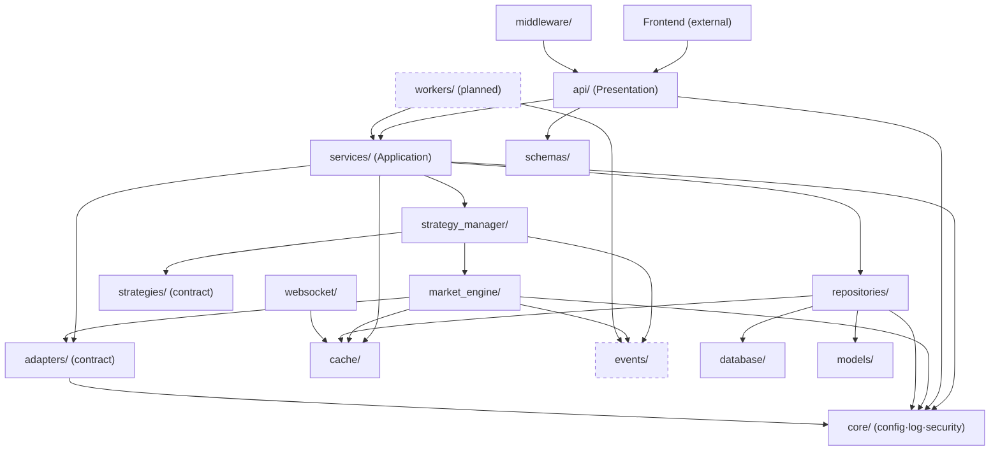

### 4.2 Allowed communication

| From | May call / depend on |
|------|----------------------|
| Frontend | `api` only |
| `api` | `services`, `schemas`, `middleware`, `core` |
| `services` | `repositories`, `adapters` (contract), `strategy_manager`, `market_engine`, `cache`, `schemas`, `core` |
| `strategy_manager` | `strategies` (contract), `market_engine`, `events`, `cache` |
| `market_engine` | `adapters` (contract), `cache`, `events`, `core` |
| `repositories` | `database`, `models`, `cache`, `core` |
| `websocket` | `cache`, `core`, `schemas` |
| everything | `core`, `utils` |

### 4.3 Forbidden communication

| Forbidden path | Why it is forbidden |
|----------------|---------------------|
| **Strategy → Database** | Strategies perform no I/O; data comes only from the engine. |
| **Strategy → Broker** | Strategies never touch a broker; the adapter/engine own that. |
| **API → Database / Cache / Broker** | Controllers must delegate to services; no direct store/broker access. |
| **Services → concrete Broker** | Services depend on the *adapter contract*, never a named broker. |
| **Market Engine → concrete Broker** | The engine knows only the adapter contract. |
| **Adapter → Services / Engine** | Adapters are leaves; they never orchestrate. |
| **Any inner layer → API** | Dependencies point inward; the domain never imports the presentation layer. |

### 4.4 Worked examples

**✔ Allowed** — the canonical read path:

```
Frontend → API → Services → Repositories → Database
```

**❌ Forbidden** — a strategy reaching persistence directly:

```
Strategy → Database        (NOT ALLOWED)
```

**❌ Forbidden** — a strategy reaching a broker directly:

```
Strategy → Broker          (NOT ALLOWED)
```

Everything must flow through the approved layers. A strategy that needs data
receives it from the engine; a controller that needs data calls a service; a
service that needs persistence calls a repository.

> **⚠️ Warning — "It was easier" is not a defense.**
> The most common way this architecture erodes is a well-meaning shortcut: a
> controller that "just" runs a quick query, or a strategy that "just" reads one
> value from Redis. Each shortcut is a new inward-pointing crack. Review rejects
> them regardless of convenience.

> **📌 Architecture callout — The graph is acyclic and inward.**
> There are no cycles in the allowed graph, and every edge points toward more
> stable, more abstract code. If you can draw an arrow the diagram does not
> contain, you are proposing an architecture change — raise it, do not merge it.

---

## 5 Backend Layer Responsibilities

The modules of Section 3 group into five architectural layers. Each layer is
defined by what it **owns**, what it **consumes**, and what it **produces**.

### 5.1 Presentation Layer
- **Purpose:** Expose the backend to the outside world (REST + WebSocket).
- **Owns:** Controllers, route wiring, transport-level middleware.
- **Consumes:** Services; transport schemas.
- **Produces:** Validated requests inbound; shaped responses / streamed messages
  outbound.
- **Examples of members:** `api/`, `websocket/`, `middleware/`.

### 5.2 Application Layer
- **Purpose:** Implement use cases by orchestrating the domain and infrastructure.
- **Owns:** Services and the orchestration of the engine/manager entry points.
- **Consumes:** Repository and adapter interfaces; engine/manager; schemas.
- **Produces:** Use-case outcomes; commands to the engine; data for the API.
- **Examples of members:** `services/`, and the orchestration surface of
  `strategy_manager/`.

### 5.3 Domain Layer
- **Purpose:** The core scanning logic and its contracts — the stable heart.
- **Owns:** The strategy contract and strategies; the market-engine processing
  model; the event vocabulary; the broker-adapter *contract*.
- **Consumes:** Only normalised data and abstractions; nothing framework-specific.
- **Produces:** Strategy results and pipeline events.
- **Examples of members:** `strategies/`, `market_engine/` (logic),
  `events/`, adapter *contract* in `adapters/base`.

> **📌 Architecture callout — The Domain Layer names no framework.**
> If FastAPI, SQLAlchemy, Redis, or a broker SDK is imported into the domain
> layer, the layering has failed. The domain is expressed in terms of contracts
> and normalised data only.

### 5.4 Infrastructure Layer
- **Purpose:** Concrete integrations with the outside world.
- **Owns:** Broker adapter *implementations*; the Redis cache client;
  cross-cutting `core` services (config/logging/security).
- **Consumes:** External SDKs/APIs; environment configuration.
- **Produces:** Normalised data (from adapters); cache/pub-sub operations;
  configured logging.
- **Examples of members:** `adapters/<broker>`, `cache/`, `core/`.

### 5.5 Persistence Layer
- **Purpose:** Durable and hot storage access.
- **Owns:** The database engine/session, ORM models, and repositories.
- **Consumes:** The relational store (PostgreSQL) and hot store (Redis) for
  durable/cached data.
- **Produces:** Persisted state and query results, exposed via repository
  operations.
- **Examples of members:** `database/`, `models/`, `repositories/`.

| Layer | Owns | Consumes | Produces |
|-------|------|----------|----------|
| Presentation | Controllers, WS, middleware | Services, schemas | Validated I/O |
| Application | Services, orchestration | Repos/adapters (iface), engine | Use-case outcomes, commands |
| Domain | Strategies, engine logic, events, contracts | Normalised data, abstractions | Results, events |
| Infrastructure | Adapter impls, cache client, core | External SDKs, config | Normalised data, cache ops |
| Persistence | Engine/session, models, repos | PostgreSQL, Redis | Persisted state, queries |

---

## 6 Backend Startup Sequence

Startup is **ordered and deterministic**. Each step establishes something the
next depends on; nothing serves traffic until the pipeline is ready.

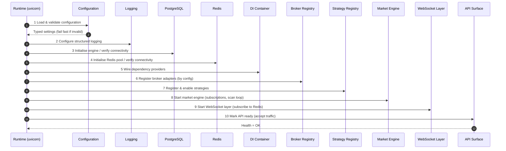

### 6.1 Step-by-step

| # | Step | What it establishes | Failure policy |
|---|------|---------------------|----------------|
| 1 | **Configuration** | The typed settings every other step reads. | **Fail fast** — invalid config aborts boot. |
| 2 | **Logging** | Structured logging so all later steps are observable. | Fail fast. |
| 3 | **Database** | The durable source of truth is reachable. | Fail fast (or controlled retry). |
| 4 | **Redis** | Hot cache and pub/sub backbone are reachable. | Fail fast (or controlled retry). |
| 5 | **Dependency Injection** | Providers for settings/session/cache are wired at the composition root. | Fail fast. |
| 6 | **Broker Registration** | Configured broker adapters are instantiated behind the contract. | Degrade or abort per policy. |
| 7 | **Strategy Registration** | Available strategies are registered and enabled. | A bad strategy is skipped, not fatal. |
| 8 | **Market Engine** | Subscriptions and the scan loop begin. | Fail fast if it cannot start. |
| 9 | **WebSocket Layer** | Subscribed to Redis, ready to fan out. | Fail fast. |
| 10 | **API Ready** | The process accepts traffic; health reports OK. | — |

> **📝 Note — Readiness ≠ liveness.**
> The process may be *live* (running) before it is *ready* (pipeline up).
> Orchestrators should route traffic only when the API-ready signal (step 10) is
> observed, not merely when the process starts.

> **⚠️ Warning — Order is a contract.**
> Later steps assume earlier ones succeeded (the engine assumes Redis; the API
> assumes the engine). Re-ordering startup silently breaks these assumptions.
> Changes to this sequence are architecture changes.

---

## 7 Backend Shutdown Sequence

Shutdown is **graceful and reverse-ordered**: stop accepting new work, drain
in-flight work, then release resources from the outside in.

| # | Step | Purpose |
|---|------|---------|
| 1 | **Stop accepting new requests / connections** | Quiesce the inbound edge so nothing new enters mid-teardown. |
| 2 | **Close WebSocket connections** | Notify and cleanly disconnect clients rather than dropping sockets. |
| 3 | **Flush buffers** | Ensure pending results/snapshots and buffered writes are persisted or published. |
| 4 | **Stop workers** | Halt background consumers so no new work is picked up. |
| 5 | **Stop the market engine** | End the scan loop and cancel subscriptions in an orderly way. |
| 6 | **Disconnect Redis** | Close the pub/sub subscriptions and the connection pool. |
| 7 | **Close PostgreSQL** | Dispose the engine/pool so connections are released. |
| 8 | **Release remaining resources** | Final cleanup; process exits cleanly. |

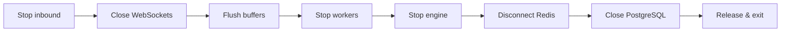

> **📌 Architecture callout — Drain before you disconnect.**
> Resources are released only *after* in-flight work is drained and buffers are
> flushed. Tearing down Redis or PostgreSQL while results are still being written
> risks losing the very outputs the system exists to produce.

> **⚠️ Warning — Respect the shutdown signal window.**
> Orchestrators grant a bounded grace period before a hard kill. The drain steps
> must complete within it; anything that can block indefinitely (a hung flush)
> must have a timeout so shutdown always makes progress.

---

## 8 Configuration Architecture

Configuration is **typed, validated, injected, and singular**. No module reads
the environment directly; no global mutable config object exists.

### 8.1 Environment variables
The environment is the primary configuration input. Variables carry endpoints,
credentials, CORS origins, log level, and environment name. A committed example
file documents every variable; the real values live only in an environment file
that is never committed (per project standards and `ADR-001` context).

### 8.2 Configuration loading
A single typed settings object is loaded **once** at startup (step 1 of the boot
sequence) and provided everywhere through dependency injection. This is the
single source of truth for runtime configuration.

### 8.3 Validation
Configuration is validated at load time. Missing or malformed values **fail
fast** with a clear, actionable message — the process must not boot in a
half-configured state.

### 8.4 Secrets
Secrets (database passwords, broker credentials) are supplied via the environment
and never committed to source control. They are read through the same typed
settings surface, so no module improvises its own secret handling. A future
secret-manager integration slots in behind this surface without touching callers.

### 8.5 Runtime configuration
Values that may change while running (e.g. which strategies are enabled) are
**data**, not process configuration — they live in the database
(`02_DATABASE_DESIGN.md`) and are changed through services, not by editing
environment variables or restarting.

### 8.6 Future configuration server
The typed settings surface is the seam for a future **configuration server**:
centralised, dynamic configuration can back the same accessors, so application
code that reads settings never changes.

### 8.7 Configuration precedence
When a value can come from multiple sources, precedence is **explicit and
highest-wins**:

| Priority | Source | Typical use |
|----------|--------|-------------|
| 1 (highest) | Explicit process environment variables | Deployment-time overrides, secrets |
| 2 | Environment file (`.env`, non-committed) | Local/dev defaults |
| 3 (lowest) | In-code typed defaults | Safe fallbacks for optional values |

> **⚠️ Warning — Never read the environment ad hoc.**
> Reaching for an environment variable inside a module bypasses validation and
> precedence, and reintroduces the global state this architecture forbids. All
> configuration flows through the one typed, injected settings surface.

---

## 9 Logging Architecture

Logging is **structured, contextual, and routed to stdout** for aggregation
(never into the primary database as operational noise — see
`02_DATABASE_DESIGN.md` §3).

### 9.1 Log categories

| Category | Purpose |
|----------|---------|
| **Application logs** | Lifecycle and general application events (startup, shutdown, state changes). |
| **Access logs** | One structured record per request: method, path, status, latency (via middleware). |
| **Error logs** | Failures with context — what operation, what input, and a suggested cause — never silent. |
| **Strategy logs** | Per-strategy evaluation and *contained* failures, tagged with the strategy identity. |
| **Broker logs** | Adapter-level connectivity, throttling, and normalisation events, tagged with the broker. |
| **Audit logs** | Domain-significant events for review (distinct from operational logs; may also be persisted per `02` §3). |

### 9.2 Log levels

| Level | Use |
|-------|-----|
| `DEBUG` | Development detail; off in production by default. |
| `INFO` | Normal, noteworthy events (request served, engine started). |
| `WARNING` | Recoverable anomalies (retryable broker hiccup, skipped strategy). |
| `ERROR` | A failed operation requiring attention. |
| `CRITICAL` | The process cannot continue safely. |

The active level is **configuration-driven** (Section 8), not hard-coded.

### 9.3 Correlation IDs
Every inbound request is assigned a **correlation ID** (propagated by middleware)
that is attached to all log lines produced while handling it — and carried
through to downstream events where practical. This makes a single request or scan
cycle traceable across modules and (later) across processes.

> **📌 Architecture callout — Structured, not string-formatted.**
> Logs are emitted as structured records (key/value), not hand-formatted
> sentences. Structure is what lets a log platform filter by broker, strategy,
> correlation ID, or status without brittle text parsing.

### 9.4 Future centralized logging
Because logs are structured and written to stdout, shipping them to a central
platform (aggregation, search, dashboards, alerting) is a **deployment concern**,
not a code change. The application's responsibility ends at emitting good
structured logs; where they go is wired at the infrastructure layer.

> **⚠️ Warning — Never log secrets or raw credentials.**
> Broker credentials, tokens, and personal data must never reach the logs.
> Logging is observability, not an audit of sensitive values; redact at the
> boundary.

---

## 10 Summary

The ApexScan backend is a **scanning runtime with a web surface**, built on five
non-negotiable ideas:

1. **Clean, layered architecture** — dependencies point inward; the domain names
   no framework.
2. **Modularity that mirrors the folders** — growth is *addition* (a new adapter,
   a new strategy, a new worker), never *modification* of the core.
3. **Event-driven flow** — a forward chain of events gives low latency, natural
   fan-out to 100+ strategies, and fault isolation.
4. **Async-first execution** — one process interleaves thousands of I/O
   operations and degrades gracefully under load.
5. **Configuration-driven, observable operation** — one typed settings surface,
   structured contextual logging, deterministic startup and graceful shutdown.

The two seams that carry the whole design — the **broker adapter contract** and
the **strategy contract** — are guarded above all else. Every rule in Sections 3
and 4 exists to keep those seams clean, so that ApexScan can scale from three
strategies on one data source to hundreds across many brokers **without changing
its architecture**.

> **📝 Note — This is Part 1.**
> Part 2 continues into the runtime internals: the market-engine loop in detail,
> the event bus and worker model, the error/exception taxonomy, resilience
> patterns (timeouts, retries, back-pressure), and the backend testing strategy.

---

*End of Part 1. This is the official backend architecture reference for ApexScan
and is maintained by Backend / Platform Architecture. All backend implementation
must conform to it and to `01_SYSTEM_ARCHITECTURE.md`.*

---
---

# ApexScan Backend Architecture — Part 2

> **Continuation of the Backend Design Document.** Part 2 covers the runtime
> internals: dependency injection, the persistence and application layers in
> depth, the event bus, middleware, exception handling, validation, the worker
> model, and the end-to-end request lifecycle. Sections and numbering continue
> from Part 1; the principles, layering, and dependency rules of Part 1 remain
> in force and are not restated here.

### Part 2 contents

11. [Dependency Injection Architecture](#11-dependency-injection-architecture)
12. [Repository Pattern](#12-repository-pattern)
13. [Service Layer](#13-service-layer)
14. [Event Bus Architecture](#14-event-bus-architecture)
15. [Middleware Architecture](#15-middleware-architecture)
16. [Exception Handling Architecture](#16-exception-handling-architecture)
17. [Validation Architecture](#17-validation-architecture)
18. [Worker Architecture](#18-worker-architecture)
19. [Request Lifecycle](#19-request-lifecycle)
20. [Part 2 Summary](#20-part-2-summary)

---

## 11 Dependency Injection Architecture

Dependency Injection (DI) is the mechanism that makes the Dependency Rule of
Part 1 (§2.5, §4) *enforceable in practice*. Instead of a module reaching out for
what it needs, everything it needs is handed to it from the outside, at a single
composition root.

### 11.1 Why Dependency Injection
- **Testability.** A unit under test receives fakes in place of real
  collaborators — no database, broker, or cache required.
- **Explicit dependencies.** A component's needs are visible in its signature,
  not hidden in global lookups.
- **Single composition root.** Wiring lives in one place (the application
  boundary), so the dependency graph is auditable.
- **No global state.** DI is how the "no global mutable state" rule is honoured.

### 11.2 Container philosophy
ApexScan uses the framework's **built-in DI as its container** — a lightweight,
declarative provider system — rather than a heavyweight external container. The
philosophy is *minimalism*: providers declare how to obtain a dependency;
consumers declare what they need; the framework resolves the graph per scope.
There is no service-locator, no runtime "get me X" lookup, and no ambient
context.

### 11.3 Service registration
Dependencies are registered as **providers** at the composition root during
startup (boot step 5, Part 1 §6):

| Registered dependency | Kind |
|-----------------------|------|
| Typed settings | Singleton provider |
| Database session | Per-request provider (yields, then closes) |
| Redis client | Per-request handle over an app-lifetime pool |
| Strategy registry / Broker registry | Singleton providers |
| Market engine handle | Singleton provider |
| Repositories & services | Composed from the above |

### 11.4 Lifetime management
Every dependency has an explicit **lifetime**. Mixing lifetimes incorrectly
(e.g. holding a request-scoped session in a singleton) is a classic source of
subtle bugs and is forbidden.

| Lifetime | Meaning | Examples |
|----------|---------|----------|
| **Singleton (app)** | One instance for the process lifetime. | Settings, DB engine, Redis pool, strategy/broker registries, market engine |
| **Scoped (request)** | One instance per request/connection, released at the end. | DB session, Redis client handle, request/correlation context |
| **Transient** | Created on demand, cheap, stateless. | Lightweight services composed per use |

> **⚠️ Warning — Never capture a scoped dependency in a singleton.**
> A request-scoped database session held by an app-lifetime object outlives its
> scope, leaks connections, and shares state across unrelated requests. Scoped
> dependencies flow *downward per request* and are never cached in singletons.

### 11.5 Dependency graph

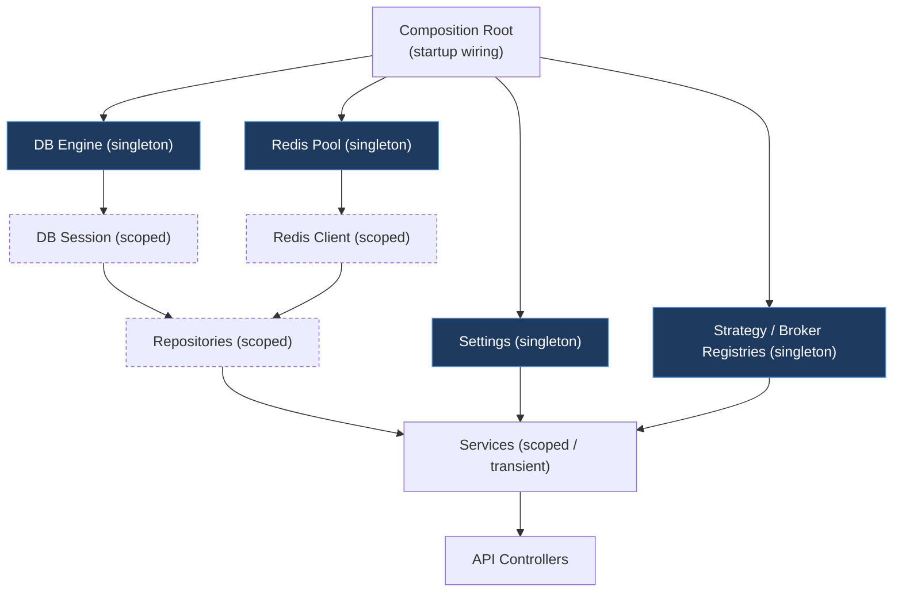

### 11.6 Constructor injection
Services and repositories receive their collaborators **as inputs at
construction** (constructor injection), never by reaching for globals. At the
transport edge, the framework performs the equivalent injection into request
handlers. The rule is uniform: *a component declares what it needs; something
outside it supplies them.*

### 11.7 Allowed / forbidden

| Allowed | Forbidden |
|---------|-----------|
| Injecting settings, sessions, cache clients, repositories, registries | Reading environment variables ad hoc (§8) |
| Declaring dependencies in signatures | Global singletons / module-level mutable state |
| Composing services from injected repositories | A service constructing its own DB engine or Redis pool |
| Substituting fakes in tests | A service-locator "give me X" lookup at call time |

### 11.8 Future extensibility
Because wiring is centralised, new cross-cutting dependencies (a secret-manager
client, a metrics recorder, a feature-flag provider) are added by registering a
new provider — consumers opt in by declaring the need. The composition root is
the one place that changes.

> **📌 Architecture callout — DI is the enforcement arm of the Dependency Rule.**
> Layering *describes* the allowed dependencies; DI is *how* they are actually
> supplied. If something cannot be obtained through injection, that is a signal it
> is being reached for illegitimately — treat it as an architecture smell.

---

## 12 Repository Pattern

### 12.1 Purpose
Repositories are the **only** code that touches a data store for durable/hot
data. They translate domain-shaped operations ("get the active strategies",
"save this run's results") into store operations, hiding *which* store is used
and *how* (per `02_DATABASE_DESIGN.md` §2).

### 12.2 Responsibilities
- Provide **intention-revealing** operations to services.
- Encapsulate query/persistence details for exactly one aggregate.
- Map between ORM models and the data services need.
- Choose the backing store (PostgreSQL, Redis, or both) behind the interface.

### 12.3 Benefits
- **Isolation:** the domain never imports the ORM or a store client.
- **Swappability:** the backing store changes without touching services.
- **Testability:** services are tested against repository *interfaces* with fakes.
- **Consistency:** all access to an aggregate funnels through one place.

### 12.4 Repository boundaries & ownership
Each repository owns **one aggregate** and is the funnel for its persistence.
Ownership mirrors the Data Ownership Matrix (`02` §7): the module that owns an
entity is the one whose services drive that entity's repository.

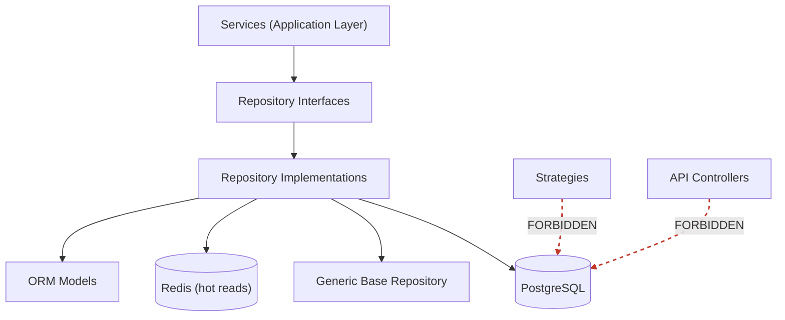

### 12.5 Generic repository philosophy
A **generic base repository** captures the shape common to all data-access
objects (bound to a session and a model type). Concrete repositories extend it
with aggregate-specific operations. The generic base reduces duplication *without*
becoming a leaky "god" data layer — it provides the skeleton, not the domain
operations.

### 12.6 Read vs. write repositories
Conceptually, read and write concerns are separated (a lightweight CQRS
posture):

| Aspect | Read repositories | Write repositories |
|--------|-------------------|--------------------|
| Purpose | Serve queries/snapshots for the API and engine | Persist durable state and history |
| Store bias | May prefer hot reads from Redis | Write the source of truth to PostgreSQL |
| Optimised for | Latency, projection shape | Integrity, atomicity |
| Example use | "latest results snapshot", "active strategies" | "record a strategy run", "append results" |

This separation is a *design posture*, not a mandate for two class hierarchies in
V1; it guides where caching and durability responsibilities sit.

### 12.7 What repositories MUST NOT do

> **⚠️ Warning — Repositories hold data access, never decisions.**
> A repository that starts making choices has become a hidden service.

- **No business logic** — no rules, no orchestration, no "if this then also that".
- **No cross-aggregate orchestration** — coordinating multiple aggregates is a
  *service* responsibility.
- **No transport concerns** — no HTTP, no response shaping.
- **No calls "upward"** — a repository never calls a service, the engine, or a
  strategy.
- **No broker access** — reference data arrives via services from adapters.

### 12.8 Future repository extensions
New aggregates from `02_DATABASE_DESIGN.md` (historical jobs, audit) get their
own repositories; caching decorators may wrap read repositories transparently;
read models may specialise as query patterns mature.

---

## 13 Service Layer

### 13.1 Purpose
Services are the **application layer** — the home of business/use-case logic and
the single layer the API calls into. They orchestrate repositories, the engine,
the strategy manager, and adapters to fulfil a use case.

### 13.2 Responsibilities & coordination role

| Responsibility | Description |
|----------------|-------------|
| **Use-case orchestration** | Sequence the steps of a use case across collaborators. |
| **Business validation** | Enforce domain rules that go beyond input shape (§17). |
| **Transaction boundary** | Decide the unit of work; commit/rollback around a use case. |
| **Coordination** | Combine repository reads/writes with engine/manager commands. |
| **Translation** | Convert between transport schemas and domain/persistence shapes. |

### 13.3 Business orchestration & validation
A service owns the *meaning* of an operation. It validates intent (is this
configuration change permitted? is this strategy known?), performs the work
through repositories/registries, and returns a result. Input *shape* is validated
at the boundary (schemas); **business** validity is the service's job.

### 13.4 Interaction map

| Collaborator | How the service interacts | What it must not do |
|--------------|---------------------------|---------------------|
| **Repositories** | Reads/writes for durable & hot data; owns the transaction boundary. | Never bypass a repository to touch a store. |
| **Market Engine** | Issues commands/queries via the engine's entry points (e.g. adjust subscriptions). | Never reach into engine internals or the scan loop. |
| **Strategy Manager** | Enable/disable/configure strategies; read result snapshots. | Never embed strategy-specific logic. |
| **Broker Adapter** | Consume normalised data via the **adapter contract** (e.g. refresh instruments). | Never name a concrete broker or call a broker SDK. |

### 13.5 Service boundaries
- A service is **stateless** between calls (state lives in stores/registries).
- A service does **not** know about HTTP or WebSockets — it is transport-agnostic
  and reusable by a controller, a worker, or a scheduler alike.
- A service does **not** contain SQL or store-specific code.

### 13.6 Future services

| Future service | Purpose |
|----------------|---------|
| Instrument sync service | Refresh the instrument master from adapters. |
| Historical-data service | Drive historical jobs (Version 3 backtesting). |
| Paper-trading service | Consume signals to simulate execution (Version 2). |
| Notification/alert service | Deliver user-configured alerts on matches. |

> **📌 Architecture callout — Services are the reuse boundary.**
> Because a service is transport-agnostic and stateless, the *same* "update
> strategy configuration" operation serves a REST call today and a scheduled job
> tomorrow. If logic lives in a controller, it cannot be reused — push it down
> into a service.

---

## 14 Event Bus Architecture

### 14.1 Why an event bus
The scan pipeline is a forward chain of events (`01` §9). An **event bus**
decouples the *producer* of an event from its *consumers*: a producer publishes
and moves on, unaware of who (or how many) will react. This is what enables
fan-out to 100+ strategies, additive new subscribers, and fault isolation.

### 14.2 Publishers and subscribers

| Role | Examples |
|------|----------|
| **Publishers** | Data provider (Market Tick), Market Engine (Context Updated, Evaluation), Strategy (Result), Strategy Manager (Ranking, Broadcast) |
| **Subscribers** | Market Engine, Strategy Manager, persistence path, WebSocket layer, (future) workers such as paper-trade recorder |

### 14.3 Event routing & lifecycle

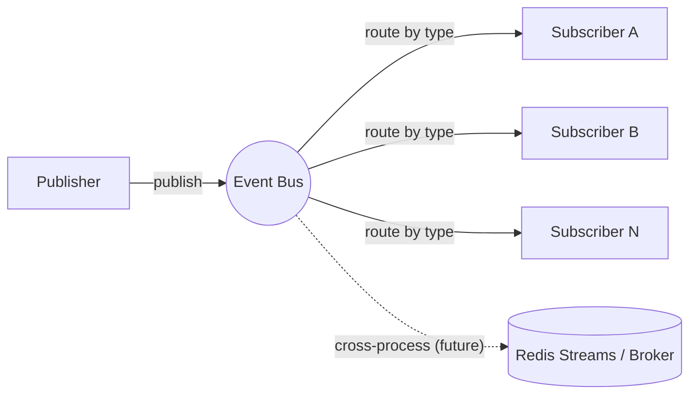

An event's lifecycle: **created → published → routed to subscribers by type →
handled (each subscriber independently) → completed**. In-process routing backs
the low-latency path today; the broadcast step already crosses processes via
Redis pub/sub.

### 14.4 Event categories

| Category | Meaning | Examples |
|----------|---------|----------|
| **Domain events** | Something meaningful happened in the scanning domain. | Strategy Result produced, Ranking completed |
| **System events** | Lifecycle/operational occurrences. | Engine started, Broker connection lost, Config reloaded |

### 14.5 Event ordering
Ordering is guaranteed **per instrument / per logical stream**, not globally.
Two ticks for the same instrument are processed in arrival order; ticks for
different instruments may be processed concurrently. Subscribers must not assume a
global total order across the whole market.

### 14.6 Failure isolation & retry philosophy
- **Isolation:** a subscriber that fails handling an event fails **alone** — its
  error is contained and logged; other subscribers are unaffected (a broken
  strategy cannot stall the chain).
- **Retry:** retries apply to **transient, idempotent** handling only (e.g. a
  momentary cache blip), with bounded attempts. Non-idempotent or clearly
  non-retryable failures are logged and dropped rather than retried blindly (§16).

### 14.7 Event replay philosophy
V1 does **not** persist the raw event stream for replay (raw ticks are transient
by design — `02` §3). Replay is a **future** capability that arrives with the
historical-data pipeline: recorded, durable events (not raw ticks) could be
replayed through the same handlers for backtesting.

### 14.8 Future distributed event bus
The in-process bus is an abstraction. When horizontal scale demands it, the same
publish/subscribe contract can be backed by a **distributed** transport (Redis
Streams or a message broker) so producers and consumers run in separate
processes — with **no change to publishers or subscribers**, only to the
transport behind the bus.

> **⚠️ Warning — Events are a contract.**
> Changing what an event *means* or its payload intent is a breaking change to
> every subscriber. Event definitions (the planned `events/` module, Part 1 §3.17)
> are load-bearing boundaries, versioned and reviewed like any other contract.

---

## 15 Middleware Architecture

Middleware forms an **onion** around every request: each layer wraps the next,
runs on the way in, and unwinds on the way out. Order matters — the outermost
middleware sees the request first and the response last.

### 15.1 Middleware components

| Middleware | Responsibility |
|------------|----------------|
| **Request Context** | Assign/propagate a correlation ID and request-scoped context (§9.3). |
| **Logging (Access)** | Emit one structured record per request: method, path, status, latency. |
| **Exception** | Catch anything unhandled and convert it to a consistent error response (§16). |
| **Authentication** *(future)* | Establish *who* the caller is; attach identity to the context. |
| **Authorization** *(future)* | Enforce *what* the caller may do for this route. |
| **Rate Limiting** *(future)* | Protect the backend from abusive/excessive traffic. |
| **Performance** *(future)* | Record timing/metrics for observability and SLAs. |

### 15.2 Execution order
The pipeline is ordered so that context and safety wrap everything, identity is
established before authorization, and limits are applied before real work:

```mermaid
flowchart LR
    REQ["HTTP Request"] --> RC["Request Context"]
    RC --> EXC["Exception (guard)"]
    EXC --> LOG["Access Logging"]
    LOG --> AUTHN["Authentication (future)"]
    AUTHN --> AUTHZ["Authorization (future)"]
    AUTHZ --> RL["Rate Limiting (future)"]
    RL --> PERF["Performance (future)"]
    PERF --> ROUTE["Router → Controller"]
    ROUTE --> RESP["Response (unwinds outward)"]
```

- **Request Context is outermost** so every later layer (including error handling)
  has a correlation ID.
- **Exception handling wraps the work** so any failure below it becomes a clean,
  consistent response.
- **Authentication precedes Authorization** — you cannot check permissions before
  you know the identity.
- **Rate limiting precedes the controller** so rejected traffic never reaches
  business logic.

> **📌 Architecture callout — Middleware observes and guards; it never decides domain outcomes.**
> Middleware may reject, annotate, time, or log a request. It must never contain
> business logic — that belongs to services. A middleware that starts making
> domain decisions has escaped its layer.

### 15.3 Future middleware
Compression, security headers, request-size limits, and idempotency-key handling
are candidates that slot into the same onion at a defined position.

---

## 16 Exception Handling Architecture

Errors are **typed, contextual, and handled centrally**. The philosophy is *fail
fast with clear, actionable messages* while *isolating* failures so one bad
operation does not cascade.

### 16.1 Error categories

| Category | Meaning | Typical handling |
|----------|---------|------------------|
| **Validation errors** | Input violates shape/rules at the boundary. | Rejected with a clear, structured 4xx-style error; never retried. |
| **Business errors** | A domain rule is violated (e.g. unknown strategy). | Surfaced as a meaningful domain error to the caller. |
| **Infrastructure errors** | A dependency (cache, network) misbehaves. | May be retried if transient; otherwise degraded/logged. |
| **Broker errors** | Adapter-level failures (auth, throttling, outage). | Contained in the adapter; classified retryable/non-retryable. |
| **Database errors** | Persistence failures (integrity, connectivity). | Transaction rolled back; integrity violations are non-retryable. |
| **Unexpected errors** | Anything unclassified. | Caught centrally, logged with context, returned as a safe generic error. |

### 16.2 Propagation & central handling
Errors **propagate upward** to the layer equipped to handle them. The
**Exception middleware** (§15) is the central catch-all: any error not handled by
a more specific layer is converted there into a **consistent error response**.
Individual layers do not each invent their own error formats.

### 16.3 Error response philosophy
Every error returned to a client follows **one consistent structure** — a stable
error identity, a human-readable message, and the correlation ID for tracing —
without leaking internals (stack traces, SQL, credentials). Errors are honest but
safe.

### 16.4 Retryable vs. non-retryable

| Retryable (transient) | Non-retryable (deterministic) |
|-----------------------|-------------------------------|
| Momentary cache/network blip | Validation failure |
| Broker throttling / brief disconnect | Business-rule violation |
| Transient DB connectivity | Integrity constraint violation |
| — | Unknown strategy / bad configuration |

Retries are **bounded**, apply only to **idempotent** operations, and back off;
retrying a deterministic failure only wastes resources and delays the honest
error.

### 16.5 Failure isolation & recovery
- **Isolation:** a failing strategy or a flaky broker is contained (Part 1 §4.4,
  §14.6) — the platform keeps scanning.
- **Recovery:** infrastructure connections self-heal via health checks and
  reconnection (bounded); the market engine resumes subscriptions after a broker
  reconnect; durable truth in PostgreSQL means transient losses do not corrupt
  state.

> **⚠️ Warning — Never swallow an exception silently.**
> Catching an error and continuing as if nothing happened hides real failures and
> corrupts trust in the system. Every caught error is either handled meaningfully
> or re-raised — always logged with context.

---

## 17 Validation Architecture

Validation is **layered**: each layer validates what it is responsible for, and
no layer trusts that another already did its job for the wrong concern.

| Validation type | Where it happens | What it checks |
|-----------------|------------------|----------------|
| **Input validation** | API boundary (schemas) | Request shape, types, required fields, ranges. |
| **Configuration validation** | Startup (§8.3) | Presence/validity of settings; fail fast. |
| **Business validation** | Service layer | Domain rules (permitted actions, referential validity). |
| **Strategy validation** | Strategy Manager | A registered strategy's configuration is coherent for its contract. |
| **Broker validation** | Adapter boundary | Broker responses are well-formed before normalisation. |
| **Database validation** | Persistence (constraints) | Integrity: uniqueness, foreign keys, non-null (`02` §4). |
| **Output validation** | API boundary (schemas) | Responses conform to the published contract. |

### 17.1 Validation responsibilities
- **Shape is validated once, at the boundary** — services receive already
  well-shaped input and focus on *meaning*.
- **Meaning is validated in services** — rules that require domain knowledge or
  cross-checks live here, never in controllers.
- **Integrity is enforced by the database** — the last line of defence; the app
  never relies on it as the *only* line.
- **The boundary is the trust perimeter** — anything crossing into the backend is
  untrusted until validated.

> **📌 Architecture callout — Validate at the edge, enforce in depth.**
> Boundary validation gives fast, friendly rejection; service and database
> validation guarantee correctness even if the boundary is bypassed (e.g. an
> internal caller). Defence in depth, not a single gate.

---

## 18 Worker Architecture

Workers run **off the request path**. Anything long-running, scheduled, or too
heavy for the event loop belongs to a worker, so request latency and the scan
loop stay unaffected.

### 18.1 Worker types

| Worker | Purpose |
|--------|---------|
| **Background workers** | Async consumers that react to events off the request path. |
| **Scheduler** | Fire time-based work (periodic refresh, maintenance windows). |
| **Job execution workers** | Run discrete units of work (e.g. an instrument sync). |
| **Retry workers** | Re-attempt bounded, idempotent operations that failed transiently. |
| **Cleanup workers** | Enforce retention/TTL housekeeping (`02` §9); prune/archive. |
| **Historical workers** *(future)* | Drive historical-data acquisition/aggregation (Version 3). |

### 18.2 Worker lifecycle
Workers **start after** the engine during boot (as part of the runtime coming up)
and **stop before** stores during shutdown (Part 1 §7): they must stop accepting
new work and drain in-flight work before Redis/PostgreSQL are closed.

### 18.3 Ownership & communication
- **Ownership:** each worker has a single responsibility and a single owning
  concern, mirroring module ownership (Part 1 §3).
- **Communication:** workers communicate **through the event bus / queues**, not
  by calling controllers or each other directly. They consume events and invoke
  **services** to do domain work — never reaching into stores themselves.

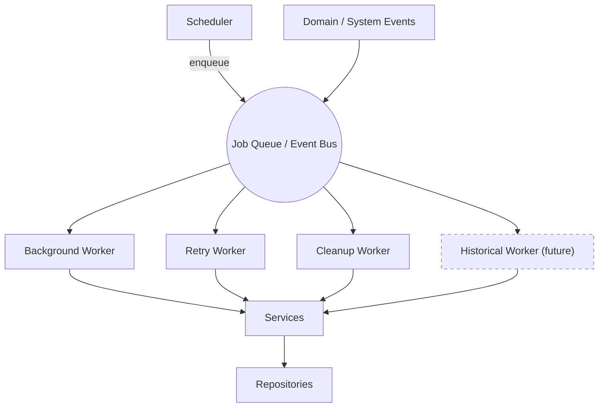

### 18.4 Future distributed workers
As with the event bus, the worker model is transport-agnostic. When scale
demands, workers run as **separate processes/containers** consuming from a
distributed queue — the same "consume event → call service" shape, only
physically distributed.

> **⚠️ Warning — Workers do domain work through services, never around them.**
> A worker that queries the database or calls a broker directly re-creates the
> tangled coupling the layering exists to prevent. Workers are just another
> *caller* of the service layer.

---

## 19 Request Lifecycle

### 19.1 HTTP request lifecycle

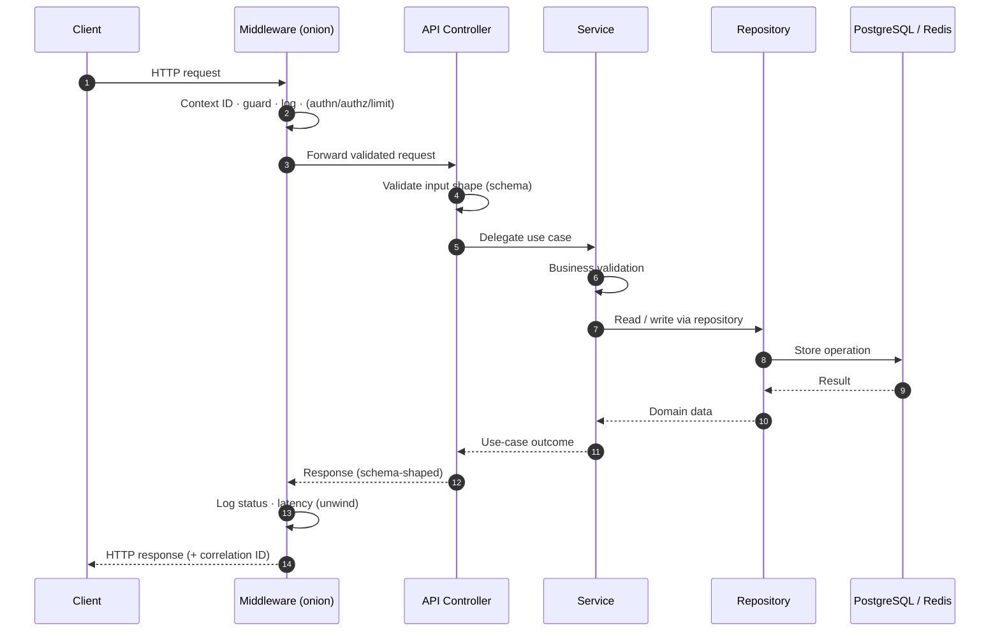

The flow is strictly **HTTP → Middleware → API → Service → Repository →
Database → Response**. No arrow skips a layer; a controller never talks to the
database, and a repository never talks to the client.

### 19.2 WebSocket request lifecycle

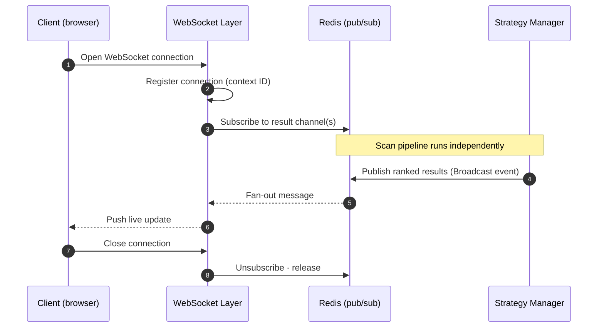

Unlike REST, a WebSocket connection is **long-lived**: it is established once,
subscribes to Redis, and thereafter *receives pushes* driven by the scan pipeline
— it does not poll and does not compute.

### 19.3 Background worker lifecycle

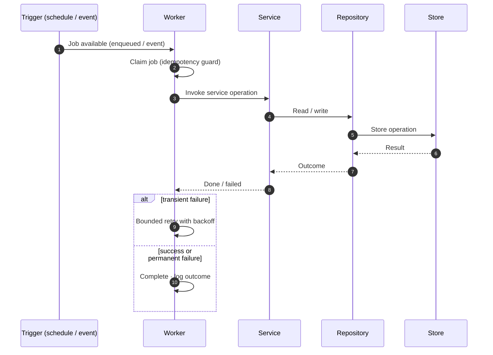

A worker's path mirrors a request's — **through services and repositories** —
but is triggered by a schedule or event rather than a client, and carries its own
retry semantics (§16.4).

---

## 20 Part 2 Summary

Part 2 defined the **runtime machinery** that operates inside the layers Part 1
established:

| Concern | Essence |
|---------|---------|
| **Dependency Injection** | The enforcement arm of the Dependency Rule: everything is supplied from a single composition root, with explicit lifetimes and no globals. |
| **Repositories** | The sole gateway to stores; intention-revealing, one aggregate each, **no business logic** and **no upward calls**. |
| **Services** | The transport-agnostic application layer; the only caller of repositories/engine/manager/adapters; home of business orchestration and validation. |
| **Event Bus** | Decouples producers from consumers; enables fan-out, additive subscribers, per-stream ordering, contained failures, and a future distributed transport. |
| **Middleware** | An ordered onion that adds context, guards, logs, and (later) authenticates/authorizes/limits — observing and guarding, never deciding domain outcomes. |
| **Validation** | Layered defence in depth: shape at the edge, meaning in services, integrity in the database. |
| **Exception Handling** | Typed categories, central conversion to consistent safe responses, explicit retryable/non-retryable classification, and failure isolation. |
| **Workers** | Off-loop execution triggered by schedules/events, always doing domain work **through services**, with bounded idempotent retries and a distributable model. |

Together, Parts 1 and 2 describe a backend that is **layered, injected,
event-driven, and async-first** — one where every kind of growth (a new broker, a
new strategy, a new worker, a new subscriber) is an *addition at a seam* rather
than a *modification of the core*.

> **📝 Note — What Part 2 deliberately left out.**
> Concrete error codes, endpoint contracts, schema fields, table columns, and any
> implementation remain out of scope by design. Those live in `08_API_SPECIFICATION.md`,
> `02_DATABASE_DESIGN.md`, and the code itself — all of which must conform to the
> architecture set out here.

---

*End of Part 2. All backend implementation must conform to Parts 1 and 2 and to
`01_SYSTEM_ARCHITECTURE.md`. Part 3 (final) continues below.*

---
---

# ApexScan Backend Architecture — Part 3 (Final)

> **Final part of the Backend Design Document.** Part 3 covers execution and
> operability: the async model, caching, broker integration, engine
> integration, performance, observability, security, testing, and scalability —
> and closes with a **compliance checklist** for verifying that future
> implementations honour this architecture. Sections and numbering continue from
> Part 2; all rules from Parts 1–2 remain in force.

### Part 3 contents

21. [Async Architecture](#21-async-architecture)
22. [Cache Architecture](#22-cache-architecture)
23. [Broker Integration Architecture](#23-broker-integration-architecture)
24. [Market Engine Integration](#24-market-engine-integration)
25. [Performance Architecture](#25-performance-architecture)
26. [Observability Architecture](#26-observability-architecture)
27. [Security Architecture](#27-security-architecture)
28. [Testing Architecture](#28-testing-architecture)
29. [Scalability & Future Architecture](#29-scalability--future-architecture)
30. [Backend Architecture Summary](#30-backend-architecture-summary)
- [Backend Architecture Checklist](#backend-architecture-checklist)

---

## 21 Async Architecture

### 21.1 Async-first philosophy
The backend is **async-first** because its workload is overwhelmingly
I/O-bound: waiting on broker feeds, the database, the cache, and many WebSocket
clients. A single event loop interleaves thousands of in-flight operations
cooperatively, so *waiting* consumes almost no resources and unrelated work
proceeds in parallel.

### 21.2 Coroutines & the event loop
Work is expressed as **coroutines** scheduled on a single **event loop** per
process. A coroutine runs until it awaits an I/O operation, then yields control
so the loop can advance other coroutines. This cooperative model gives high
concurrency without the memory and context-switch cost of a thread per request.

### 21.3 Concurrent task execution
Independent operations run **concurrently** as tasks (e.g. many instruments'
data handled at once). Concurrency is deliberate and bounded — fan-out is
structured so failures and lifetimes are tracked, never fire-and-forget tasks
that leak.

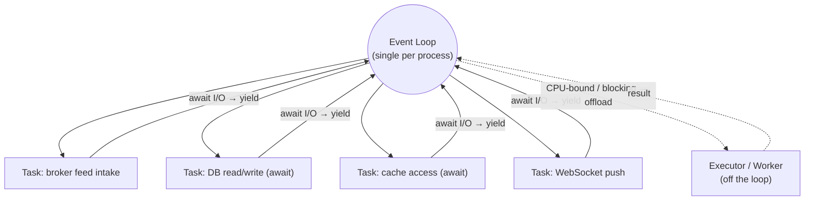

### 21.4 Back-pressure
When a downstream stage (e.g. a slow consumer or a saturated store) cannot keep
up, the system applies **back-pressure** — bounded queues and buffers signal
producers to slow rather than accumulating unbounded work. The alternative
(unbounded buffering) trades a latency problem for a memory-exhaustion outage.

### 21.5 Cancellation
Long-running or awaited operations are **cancellable**. When a request is
abandoned, a connection drops, or shutdown begins, in-flight work is cancelled
cleanly so resources are released promptly rather than orphaned.

### 21.6 Timeouts
Every outbound I/O (broker call, DB query, cache op) runs under a **bounded
timeout**. An operation that never returns must not pin a coroutine forever;
timeouts convert an indefinite hang into a handled, classifiable error (§16).

### 21.7 Async boundaries
There is a clear **async boundary**: the entire request/scan path is async, and
any synchronous or blocking dependency is quarantined behind an offload point.
The boundary is explicit so no blocking call sneaks onto the loop.

### 21.8 CPU-bound vs I/O-bound workloads

| Workload | Nature | Where it runs |
|----------|--------|---------------|
| Market feed intake, DB, cache, sockets | **I/O-bound** | On the event loop (await-driven). |
| Heavy computation / blocking libraries | **CPU-bound** | **Offloaded** to an executor/worker, never inline. |

> **⚠️ Warning — One blocking call stalls everything.**
> A synchronous, CPU-heavy, or blocking call on the event loop freezes *every*
> concurrent task until it returns. CPU-bound and blocking work is always
> offloaded (§21.3 diagram). This is the single most important async rule.

### 21.9 Future distributed execution
The async model scales *up* within a process; to scale *out*, work is
distributed across processes/containers via the event bus and workers (§18).
The same coroutine-based code runs unchanged; only the transport behind the bus
becomes distributed.

> **📌 Architecture callout — Structured concurrency, not loose tasks.**
> Concurrency is always *owned*: tasks have a parent that awaits them, handles
> their errors, and cancels them on shutdown. Detached background tasks with no
> owner are forbidden — they leak, swallow errors, and defy graceful shutdown.

---

## 22 Cache Architecture

Caching is **tiered** and each tier has a single, clear purpose. Caches
accelerate; they are never the source of truth (PostgreSQL is — see `ADR-001`).

### 22.1 Cache tiers & categories

| Cache | Tier | Purpose | Persistence |
|-------|------|---------|-------------|
| **Memory cache** | L1 (process) | Hottest, engine-owned state (market context). | Ephemeral |
| **Redis cache** | L2 (shared) | Cross-process hot data & latest result snapshot. | Ephemeral (TTL) |
| **Historical cache** | L2/derived | Cached aggregated series for repeat reads (future-leaning). | Ephemeral |
| **Strategy cache** | L2 | Active-strategy set / config for fast dispatch. | Ephemeral, invalidated on change |
| **Configuration cache** | L1/L2 | Frequently-read config/reference (e.g. instrument master). | Ephemeral, invalidated on change |

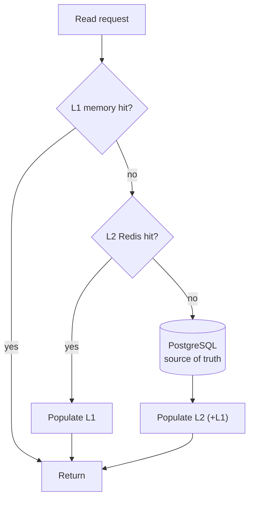

### 22.2 TTL policy
Every cached entry has an explicit **TTL** appropriate to its volatility: very
short for fast-moving snapshots, longer for slow-changing reference data.
Nothing is cached "forever" — an absent TTL is a bug, because stale data with no
expiry silently diverges from the source of truth.

### 22.3 Cache invalidation philosophy
- **Invalidate on write.** When the owning service changes an entity, it
  invalidates (or refreshes) the corresponding cache entries — the cache never
  outlives a known change.
- **TTL as a safety net.** Even without an explicit invalidation, TTL bounds how
  long stale data can live.
- **Prefer correctness over cleverness.** A simple invalidate-and-refill beats a
  subtle partial-update scheme that risks incoherence.

### 22.4 Cache ownership
A cache entry is **owned by the module that owns the underlying data** (mirrors
`02` §7). That owner is responsible for writing, refreshing, and invalidating it.
No module invalidates another module's cache directly — it goes through the
owner's service.

### 22.5 Read-through vs. write-through

| Pattern | When used | Behaviour |
|---------|-----------|-----------|
| **Read-through** | Hot reads (instrument master, snapshots) | On miss, load from source, populate cache, return (see §22.1 diagram). |
| **Write-through** | Data that must stay coherent for readers | Write to the source of truth *and* update/invalidate the cache in the same operation. |

### 22.6 Future distributed cache
Redis already provides a shared cache tier. Scaling to a Redis **cluster** (or a
managed distributed cache) is a capacity/topology change behind the same cache
accessors — application code that reads/writes the cache does not change.

> **⚠️ Warning — Never let the cache become the source of truth.**
> If losing Redis would lose data, that data was misplaced. Durable truth lives
> in PostgreSQL; caches must always be safely reconstructible from it.

---

## 23 Broker Integration Architecture

Every broker sits behind the **broker adapter contract** (Part 1 §3.9). The
integration layer manages the *lifecycle and health* of those adapters without
the core ever learning a broker's identity.

### 23.1 Adapter lifecycle & connection manager
A **Connection Manager** owns the lifecycle of each adapter: connect,
authenticate, monitor, reconnect, and disconnect. The market engine talks to the
manager/contract, never to a specific broker's connection.

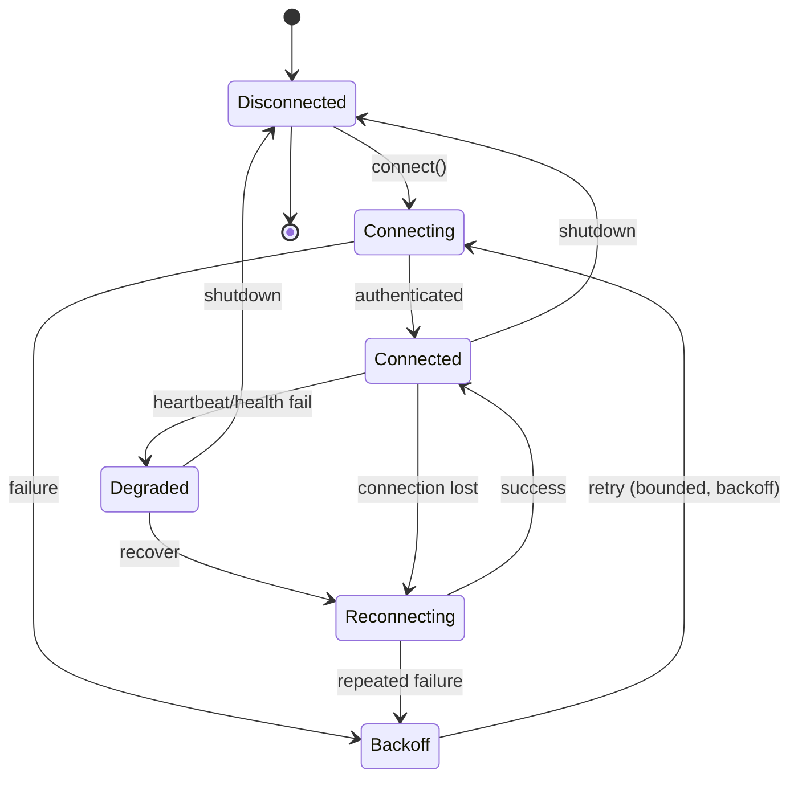

### 23.2 Reconnect strategy
Reconnection uses **bounded retries with exponential backoff and jitter** to
avoid hammering a recovering broker (or tripping its rate limits). After
reconnect, the engine's subscriptions are **re-established** so data resumes
without manual intervention.

### 23.3 Heartbeat & health monitoring
Each adapter exposes a **health signal** and is monitored via **heartbeats**. A
missed heartbeat moves the adapter to a *degraded* state (see the state diagram),
triggering recovery before a full outage. Health feeds the platform's readiness
model (§26).

### 23.4 Rate limiting
Broker-specific **rate limits** are respected inside the adapter — request
pacing, subscription batching, and throttling live there, so the core never has
to know a broker's quotas. Exceeding limits is treated as a retryable broker
error (§16.4).

### 23.5 Subscription management
The market engine declares *what instruments it needs*; the adapter/connection
manager translate that into broker subscriptions, **deduplicating** and reusing
where possible. Subscriptions are re-driven after reconnect.

### 23.6 Multiple brokers & isolation
Multiple adapters can run **concurrently and independently**. Each is isolated:

> **📌 Architecture callout — Adapters are bulkheaded.**
> One broker throttling, disconnecting, or misbehaving must not affect another
> adapter or the core. Adapters share no mutable state; a failure in one is
> contained to that one (a "bulkhead"), just as strategy failures are contained.

### 23.7 Broker failover (future)
With the contract and connection manager in place, **failover** — promoting a
healthy broker/data source when another degrades — is a future capability that
slots in at the manager level, again without touching the engine or strategies.

---

## 24 Market Engine Integration

This section defines how the backend's parts **communicate with the scanning
runtime**. Each interaction is through a defined boundary — never by reaching
into internals.

| Backend collaborator | Communicates with the engine by… | Responsibility boundary |
|----------------------|-----------------------------------|-------------------------|
| **Services** | Issuing commands/queries to engine & strategy-manager entry points (e.g. adjust subscriptions, enable a strategy). | Services orchestrate; they never run the scan loop or touch engine internals. |
| **Market Engine** | Consuming normalised data via the **adapter contract**; emitting pipeline events. | Owns subscriptions, aggregation, and the scan loop; knows no broker or strategy identity. |
| **Strategy Manager** | Receiving evaluation events from the engine; dispatching to strategies; publishing results. | Owns the strategy registry and result ranking; contains no strategy logic. |
| **Event Bus** | Carrying the forward event chain between stages (§14). | Decouples producers from consumers; owns routing, not domain logic. |
| **Repository Layer** | Persisting durable outputs (runs, results) via services/manager. | Sole gateway to stores; no business logic. |
| **WebSocket Layer** | Subscribing to Redis result channels and fanning out to clients. | Delivers state; computes nothing. |

### 24.1 The integration principle
The engine is the **hub of the runtime**, but every edge into it is a defined
seam: services command it, adapters feed it, the manager consumes from it, the
event bus connects its stages, repositories persist its outputs, and the
WebSocket layer delivers them. No collaborator bypasses these seams.

> **⚠️ Warning — Do not reach into the engine.**
> Reading the engine's in-memory market context directly, or calling the scan
> loop from a service, couples callers to internals and breaks isolation. All
> interaction is through the defined entry points, events, and the cached
> snapshot.

---

## 25 Performance Architecture

Performance is a **design property**, pursued through architecture rather than
after-the-fact tuning. The philosophy: *do only necessary work, do it without
blocking, and measure before optimising.*

| Concern | Approach |
|---------|----------|
| **Low latency** | Event-driven pipeline (work fires on data arrival); hot reads served from cache, not PostgreSQL. |
| **High throughput** | Async concurrency: one process interleaves thousands of I/O operations. |
| **Memory usage** | Bounded buffers/queues (back-pressure §21.4); transient data stays in memory only as long as needed; TTLs bound cache growth. |
| **Connection pooling** | Reused, bounded pools for PostgreSQL and Redis — never a connection per operation. |
| **Batch processing** | Batch broker subscriptions and bulk persistence where it reduces round-trips, without hurting latency. |
| **Concurrency** | Structured, owned concurrency (§21.3); fan-out to strategies is parallel. |
| **CPU utilisation** | CPU-bound work offloaded off the loop (§21.8); the loop stays responsive. |
| **Async optimisation** | Avoid redundant awaits; no blocking calls on the loop; timeouts on all I/O. |
| **Future horizontal scaling** | Redis-decoupled producers/consumers allow more instances without re-architecture (§29). |

> **📌 Architecture callout — Measure, then optimise.**
> Index choices, batch sizes, and pool sizes are set from **observed** behaviour
> (query plans, latency, throughput), not speculation. Premature optimisation adds
> complexity that the numbers may never justify — and often hides in exactly the
> hot path it claims to help.

---

## 26 Observability Architecture

The system is observable so operators can answer *what is happening and why*
without attaching a debugger to production.

| Pillar | Role in ApexScan |
|--------|------------------|
| **Logging** | Structured, contextual logs to stdout (Part 1 §9), categorised (app/access/error/strategy/broker/audit). |
| **Metrics** | Counters/latencies/throughput for the scan path, brokers, and API (future export to a metrics platform). |
| **Tracing** | Correlation-ID-based tracing today; distributed tracing across processes as a future step. |
| **Health checks** | A composite signal of the runtime's health (engine, brokers, stores). |
| **Readiness checks** | "Ready to serve traffic" — true only when the pipeline is up (boot step 10, Part 1 §6). |
| **Liveness checks** | "The process is alive" — independent of downstream health so a slow dependency does not cause needless restarts. |
| **Performance monitoring** | Track latency/throughput budgets (§25) to catch regressions. |
| **Correlation IDs** | Thread a request/scan cycle across modules and logs (Part 1 §9.3). |

### 26.1 Readiness vs. liveness

> **📝 Note — Keep liveness and readiness distinct.**
> **Liveness** failing means *restart me*. **Readiness** failing means *don't
> send me traffic yet*. Conflating them causes healthy processes to be killed
> during a transient dependency blip, or traffic to be routed before the pipeline
> is up. They are separate signals with separate consequences.

### 26.2 Future dashboards & alerting
Because signals are structured and exported at the infrastructure layer,
**dashboards** (latency, throughput, broker health) and **alerting** (on error
rates, broker disconnects, saturation) are added operationally without changing
application code.

---

## 27 Security Architecture

Security is layered and **secure-by-default**. Part 1's `core/security` package
is the home for these primitives; V1 lays the boundaries, later versions add
authentication mechanisms.

| Concern | Position |
|---------|----------|
| **Authentication** *(future)* | Establish caller identity at the edge (middleware §15); the domain trusts an established identity, not raw credentials. |
| **Authorization** *(future)* | Enforce per-route/per-action permissions after authentication; least authority by default. |
| **Input validation** | The boundary is the trust perimeter — all input validated before it reaches services (§17). |
| **Secrets management** | Secrets come from the environment via the typed settings surface (Part 1 §8.4); never in source, never in logs. |
| **Environment variables** | The configuration/secret channel; validated at startup; precedence is explicit (Part 1 §8.7). |
| **Least privilege** | Every component (DB user, broker credential, service) is granted the minimum access it needs. |
| **Dependency management** | Dependencies are justified, pinned, and kept current; each is attack surface (project standards). |
| **Secure defaults** | The safe option is the default (e.g. auth required once introduced, restrictive CORS in production). |
| **Future JWT / OAuth** | Token-based auth and third-party identity slot in behind the authentication boundary without touching services. |

### 27.1 Security boundaries
- The **API boundary** is the primary trust perimeter — untrusted input stops
  here until validated and (later) authenticated/authorized.
- **Broker credentials** live only in the adapter/security layers, never in the
  engine, strategies, or logs.
- The **domain assumes an authenticated context** rather than handling raw
  credentials itself.

> **⚠️ Warning — Never log or commit secrets.**
> Credentials, tokens, and personal data must never appear in logs, error
> responses, or version control. Redact at the boundary; store only in the
> environment/secret manager.

---

## 28 Testing Architecture

Testing follows the **test pyramid**: many fast unit tests, fewer integration
tests, and a thin top of end-to-end/performance checks. Tests verify
**behaviour, not implementation** (project standards).

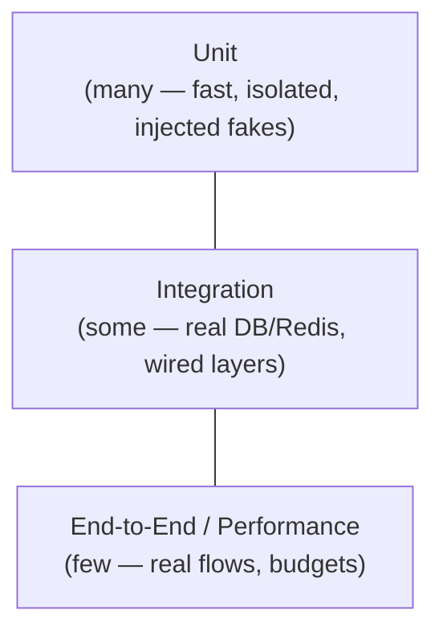

| Test type | Focus | Boundary handling |
|-----------|-------|-------------------|
| **Unit** | A single unit's behaviour (service, repository, strategy) in isolation. | Dependencies injected as fakes; no real I/O. |
| **Integration** | Wired layers against real PostgreSQL/Redis. | Real stores; external brokers stubbed. |
| **Repository** | Persistence operations map correctly to stores. | Real DB (test instance). |
| **Service** | Use-case orchestration and business validation. | Repositories/adapters faked. |
| **Broker (adapter)** | Adapter conforms to the broker contract; normalisation is correct. | **Contract tests**; broker API mocked/recorded. |
| **Strategy** | A strategy's evaluation is correct and explainable. | Fed fixed normalised data; pure, no I/O. |
| **API** | Endpoints validate, delegate, and shape responses correctly. | App wired; services or stores substituted as needed. |
| **Performance** | Latency/throughput budgets on the hot path. | Realistic load; measured, not asserted line-by-line. |
| **Regression** | Previously-fixed bugs stay fixed. | A failing test is written first, then the fix. |

### 28.1 CI philosophy
- **Guardrails first.** Lint, type-check, and tests run in CI; the build must be
  **warning-free** (project standards) before merge.
- **Fast feedback.** The unit layer runs on every change; heavier integration/
  performance suites run at appropriate gates.
- **Verify tests catch failures.** Break the code, confirm the test fails, then
  fix (mutation-style discipline).

> **📌 Architecture callout — Contracts are testable seams.**
> The broker adapter contract and the strategy contract are exactly where
> contract tests live. Every new adapter and strategy ships with tests proving it
> honours its contract — that is what lets us add them without fear.

---

## 29 Scalability & Future Architecture

The architecture's central promise: **growth is addition at a seam, not surgery
on the core.** This section makes that concrete.

| Change | How it scales in | Touches the core? |
|--------|-------------------|-------------------|
| **Add a strategy** | New plug-in implementing the strategy contract; register it. | **No** |
| **Add a broker** | New adapter implementing the broker contract. | **No** |
| **Add an exchange** | Via a broker adapter + instrument-master normalisation. | **No** |
| **Add workers** | New consumer subscribing to an event/queue. | **No** |
| **Scale Redis** | Cluster/managed cache behind the same accessors. | **No** |
| **Scale PostgreSQL** | Read replicas, pooling, partitioning of high-volume tables (`02` §8–9). | **No** (behind repositories) |
| **Scale WebSockets** | More instances; Redis pub/sub decouples producers from socket fan-out. | **No** |
| **Cloud migration** | Containers already the unit of deploy (Docker-first); orchestrate on any platform. | **No** |
| **Microservices (future)** | Split along existing seams (engine, workers) over the distributed event bus. | Structural, but along pre-existing seams |

### 29.1 What should NEVER require architectural changes
- Adding, removing, or reconfiguring a **strategy**.
- Adding or swapping a **broker** or **exchange**.
- Adding a **background worker** or a new **event subscriber**.
- Changing **which store** backs a piece of data (behind repositories).
- Scaling **out** (more instances) or **up** (bigger nodes).
- Swapping the **frontend** or adding new API **clients**.

> **📌 Architecture callout — If growth forces a core change, the seam is wrong.**
> Any of the above requiring edits to the market engine, the strategy manager, or
> cross-layer dependencies is a red flag: the abstraction has leaked. Fix the
> seam (adapter/strategy contract, repository interface, event definition) — do
> not bend the core to fit the new case.

---

## 30 Backend Architecture Summary

### 30.1 Core principles
Clean, layered architecture; modularity that mirrors the folders; event-driven
flow; async-first execution; dependency injection; repository and service
patterns; broker- and strategy-agnosticism; configuration-driven, observable
operation.

### 30.2 Non-negotiable rules
1. **Dependencies point inward** — the domain names no framework, store, or broker.
2. **Brokers and strategies stay behind their contracts** — no leakage upward.
3. **Only repositories touch stores; only services call repositories.**
4. **No global mutable state** — everything is injected.
5. **Async for all I/O; nothing blocking on the loop.**
6. **PostgreSQL is the source of truth; caches are reconstructible.**
7. **Fail fast, isolate failures, never swallow errors.**
8. **The UI/transport computes nothing** — logic lives in services and the domain.

### 30.3 Module responsibilities
Presentation exposes; Application orchestrates; Domain decides (engine +
strategies + events + contracts); Infrastructure integrates (adapters, cache,
core); Persistence stores (database, models, repositories). Each module has one
owner and one responsibility.

### 30.4 Dependency rules
The allowed graph (Part 1 §4) is acyclic and inward. Forbidden paths — strategy→
store, strategy→broker, API→store, service→concrete-broker, adapter→service — are
rejected in review regardless of convenience.

### 30.5 Future evolution
Every planned capability (multi-broker, paper trading, backtesting, live trading,
marketplace, AI) attaches at an existing seam. Distributed execution, distributed
cache, and microservices are transport/topology changes behind unchanged
contracts.

### 30.6 Long-term maintainability
Because volatility is isolated behind stable contracts, the code an engineer must
understand to make a change is bounded by an interface. New contributors are
productive quickly; changes are safe; the system stays comprehensible as it grows
to 100+ strategies across many brokers.

---

## Backend Architecture Checklist

Use this checklist to verify that any future implementation, module, or pull
request complies with this architecture. Items are grouped by topic. A change is
architecture-compliant only when every **applicable** item is satisfied.

### Module Boundaries
- [ ] Each new file lives in the folder that matches its architectural role (Part 1 §3).
- [ ] The module has a single, clearly stated responsibility.
- [ ] No module mixes transport, business logic, and persistence concerns.
- [ ] `utils/` contains only pure, domain-agnostic helpers.
- [ ] Domain code (strategies, engine logic, events) imports no framework, store client, or broker SDK.
- [ ] Each entity/aggregate has exactly one owning module (matches `02` §7).
- [ ] `workers/` and `events/` additions respect their planned boundaries.

### Dependency Rules
- [ ] All source dependencies point inward (toward the domain).
- [ ] No forbidden path is present: strategy→store, strategy→broker, API→store, adapter→service.
- [ ] Services depend on the **broker adapter contract**, never a concrete broker.
- [ ] The market engine depends on the adapter contract, never a named broker.
- [ ] Controllers call only services (never repositories, stores, or the engine directly).
- [ ] The dependency graph remains acyclic (no new cycle introduced).
- [ ] No inner layer imports the presentation layer.

### Async Usage
- [ ] All I/O (DB, cache, broker, sockets) is non-blocking / awaited.
- [ ] No synchronous or CPU-bound work runs inline on the event loop.
- [ ] CPU-bound/blocking work is offloaded to an executor/worker.
- [ ] Every outbound I/O operation has a bounded timeout.
- [ ] Concurrency is structured and owned (no detached, unawaited tasks).
- [ ] Long-running/awaited operations are cancellable.
- [ ] Back-pressure is applied via bounded queues/buffers (no unbounded growth).

### Repository Usage
- [ ] Only repositories access PostgreSQL/Redis for durable/hot data.
- [ ] Repositories expose intention-revealing operations, not raw store access.
- [ ] Repositories contain no business logic and no cross-aggregate orchestration.
- [ ] Repositories never call services, the engine, or strategies ("upward").
- [ ] Repositories never perform transport (HTTP) concerns.
- [ ] A repository manages exactly one aggregate.
- [ ] Store choice (PostgreSQL vs Redis) is hidden behind the repository interface.

### Service Layer
- [ ] Business/use-case logic lives in services, not controllers or repositories.
- [ ] Services are transport-agnostic (no HTTP/WebSocket awareness).
- [ ] Services own the transaction boundary for a use case.
- [ ] Services perform business validation (beyond input shape).
- [ ] Services coordinate the engine/manager only through defined entry points.
- [ ] Services are stateless between calls.
- [ ] The API delegates every non-trivial operation to a service.

### Event Bus
- [ ] Producers publish events without knowing their subscribers.
- [ ] Event definitions/payload intent are treated as versioned contracts.
- [ ] A subscriber failure is isolated and does not stall the chain.
- [ ] Retries apply only to transient, idempotent handling, and are bounded.
- [ ] Per-instrument/per-stream ordering is respected; no global-order assumption.
- [ ] New subscribers are added without modifying producers.
- [ ] No raw-tick persistence is assumed for replay in V1.

### Caching
- [ ] Every cache entry has an explicit, appropriate TTL.
- [ ] Caches are reconstructible from PostgreSQL (never the source of truth).
- [ ] Cache invalidation happens on write by the owning service.
- [ ] Cache entries are owned by the module owning the underlying data.
- [ ] Read-through/write-through patterns are applied intentionally (§22.5).
- [ ] No module invalidates another module's cache directly.
- [ ] Losing Redis would not lose any durable data.

### Configuration
- [ ] All configuration comes from the single typed settings surface.
- [ ] No module reads environment variables ad hoc.
- [ ] Configuration is validated at startup; invalid config fails fast.
- [ ] Configuration precedence is respected (env > env-file > defaults).
- [ ] Runtime-changeable behaviour is data (DB), not process config.

### Logging & Observability
- [ ] Logs are structured (key/value) and written to stdout.
- [ ] Each request produces one access log with method/path/status/latency.
- [ ] A correlation ID is attached to all logs for a request/scan cycle.
- [ ] Errors are logged with actionable context; none are swallowed silently.
- [ ] No secrets, tokens, or personal data appear in logs.
- [ ] Log level is configuration-driven.
- [ ] Liveness and readiness are distinct signals with distinct consequences.

### Security
- [ ] Input is validated at the boundary before reaching services.
- [ ] Secrets come only from the environment/secret surface; never in source or logs.
- [ ] Broker credentials are confined to the adapter/security layers.
- [ ] Least privilege is applied to DB users, credentials, and services.
- [ ] Secure defaults are used (restrictive CORS in production, auth-required once introduced).
- [ ] New dependencies are justified, pinned, and current.
- [ ] The domain assumes an authenticated context rather than handling raw credentials.

### Exception & Validation
- [ ] Errors are classified (validation/business/infrastructure/broker/database/unexpected).
- [ ] A central handler converts unhandled errors to a consistent, safe response.
- [ ] Error responses leak no internals (stack traces, SQL, credentials).
- [ ] Retryable vs non-retryable is explicit; deterministic failures are not retried.
- [ ] Failures in strategies/brokers are isolated and never crash the platform.
- [ ] Validation is layered: shape at the edge, meaning in services, integrity in the DB.

### Testing
- [ ] New code ships with tests that assert behaviour, not implementation.
- [ ] Unit tests use injected fakes and perform no real I/O.
- [ ] Every new broker adapter has contract tests.
- [ ] Every new strategy has evaluation tests fed fixed normalised data.
- [ ] Error and edge paths are tested, not just the happy path.
- [ ] Integration tests exercise real PostgreSQL/Redis with brokers stubbed.
- [ ] CI passes lint, type-check, and tests with **zero warnings** before merge.

### Performance
- [ ] Hot reads are served from cache, not PostgreSQL, on the per-tick path.
- [ ] Connection pools (DB, Redis) are reused and bounded — never per-operation.
- [ ] Batching is used where it reduces round-trips without harming latency.
- [ ] No redundant awaits or blocking calls on the hot path.
- [ ] Performance changes are justified by measurement, not speculation.
- [ ] Memory use is bounded (TTLs, back-pressure, transient-only market data).

### Scalability
- [ ] Adding a strategy/broker/exchange/worker required no core change.
- [ ] Changing a data class's backing store required no service change.
- [ ] The design scales out via more instances behind Redis decoupling.
- [ ] High-volume tables have a growth plan (partitioning/retention).
- [ ] Any core change forced by growth is flagged as a seam/abstraction defect.

### Startup / Shutdown
- [ ] Startup follows the deterministic ordered sequence (Part 1 §6).
- [ ] The process reports ready only when the pipeline is up.
- [ ] Shutdown is graceful and reverse-ordered (drain before disconnect).
- [ ] Drain steps are bounded by timeouts so shutdown always progresses.
- [ ] Resources (WebSockets, workers, engine, Redis, PostgreSQL) are released in order.

---

*End of Part 3 and of the ApexScan Backend Architecture document. Parts 1–3
together are the definitive backend architecture reference, maintained by
Backend / Platform Architecture. All backend implementation must conform to this
document and to `01_SYSTEM_ARCHITECTURE.md`.*
