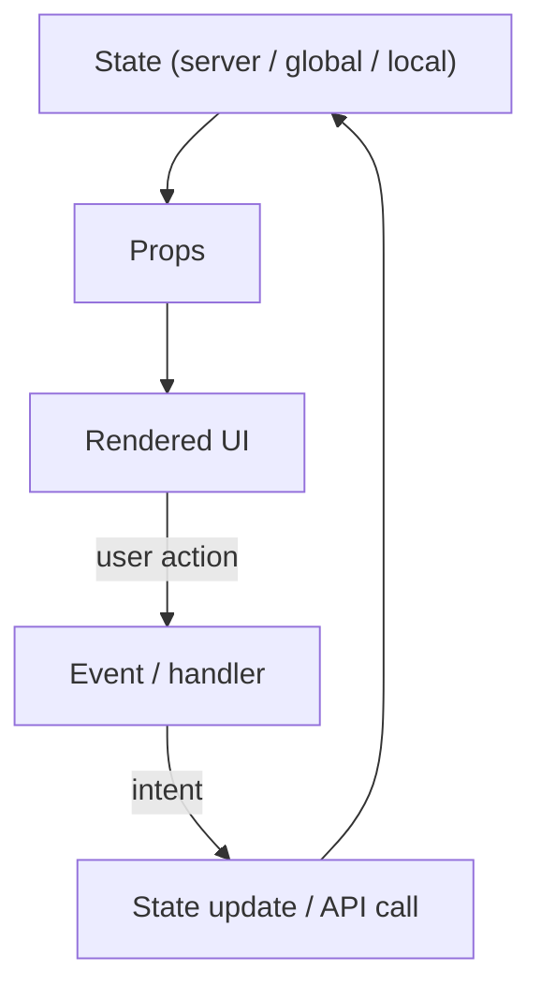
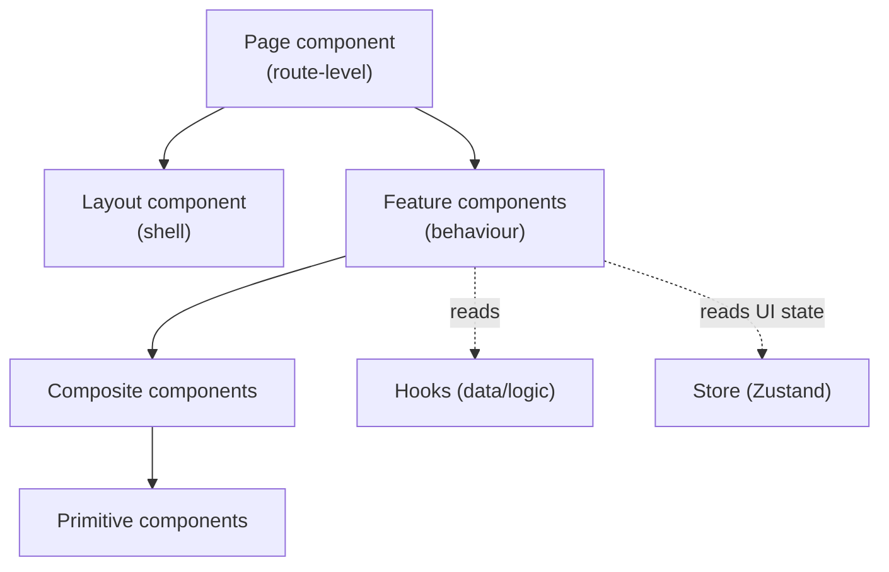
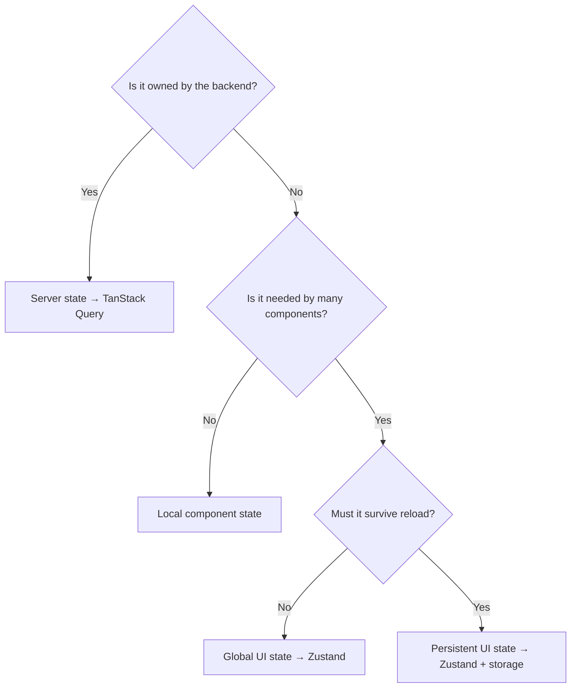
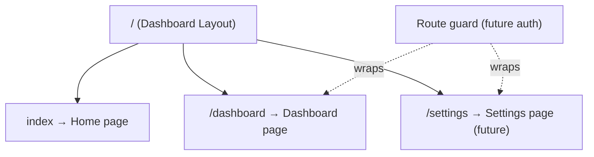
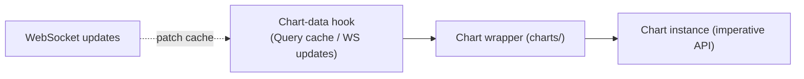
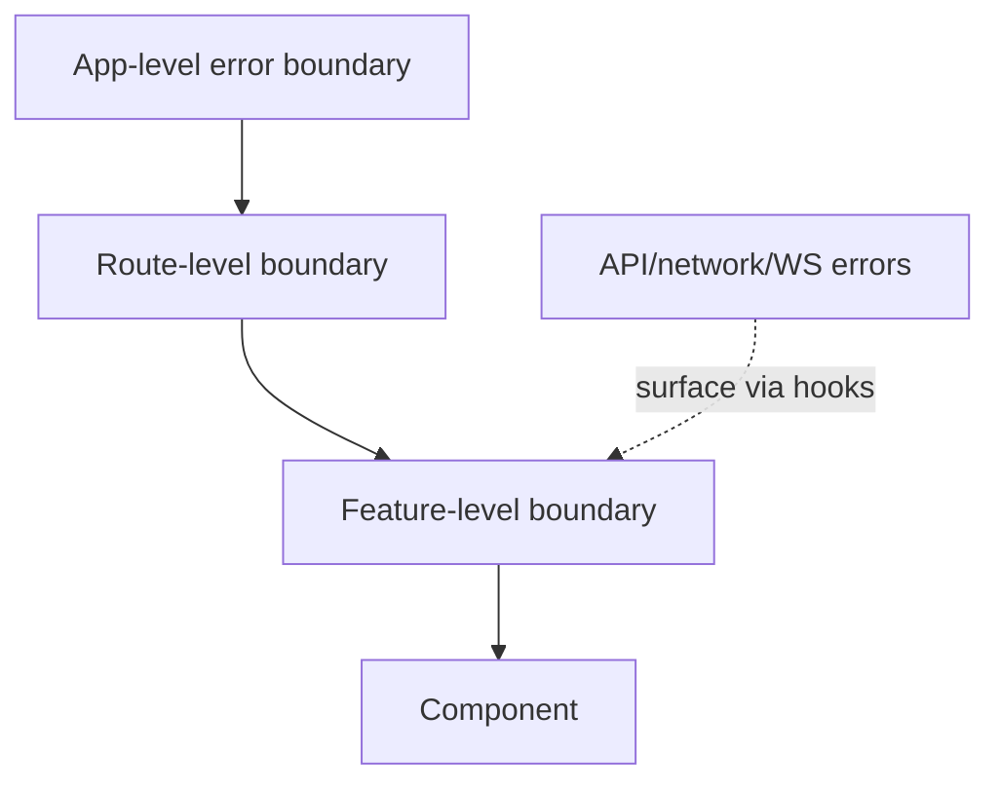

# ApexScan Frontend Architecture

> **Document status:** Official — **Frontend Architecture Specification**
> **Owner:** Frontend / Platform Architecture
> **Audience:** Frontend Engineering, UX, QA
> **Nature:** Architecture only. This document contains **no code, no React
> components, no TypeScript, no CSS, and no implementation**. It defines the
> shape every frontend implementation must take.
> **Precedence:** Every React implementation must conform to this document. It
> derives from and obeys `01_SYSTEM_ARCHITECTURE.md` — in particular the rule
> that **the UI computes nothing** (it renders state and expresses intent) and
> the strict separation of **server state** (TanStack Query) from **client
> state** (Zustand). Where a lower-level choice conflicts with the master
> architecture, the master architecture wins.
> **Related documents:** `01_SYSTEM_ARCHITECTURE.md` §7 (frontend component
> diagram) and §9 (event flow), `03_BACKEND_ARCHITECTURE.md` (the API/WebSocket
> surface this UI consumes).

---

## Table of Contents

1. [Executive Summary](#1-executive-summary)
2. [Frontend Design Principles](#2-frontend-design-principles)
3. [Folder Structure](#3-folder-structure)
4. [Component Architecture](#4-component-architecture)
5. [State Management Architecture](#5-state-management-architecture)
6. [API Communication](#6-api-communication)
7. [Routing Architecture](#7-routing-architecture)
8. [UI Architecture](#8-ui-architecture)
9. [Chart Architecture](#9-chart-architecture)
10. [Grid Architecture](#10-grid-architecture)
11. [Performance Architecture](#11-performance-architecture)
12. [Error Handling](#12-error-handling)
13. [Security](#13-security)
14. [Testing Philosophy](#14-testing-philosophy)
15. [Future Scalability](#15-future-scalability)
16. [Frontend Architecture Checklist](#16-frontend-architecture-checklist)

---

## 1 Executive Summary

### 1.1 Frontend philosophy
The ApexScan frontend is a **real-time presentation layer**, not a place where
business logic lives. Its single job is to **render server-owned state and
express user intent** back to the backend. Scanning, ranking, and market logic
happen on the server (`03_BACKEND_ARCHITECTURE.md`); the UI *displays* the
results and *sends* configuration changes. This boundary is the frontend's most
important architectural commitment.

The UI is **component-driven**, **type-safe end to end**, and **API-driven** —
it treats the backend contract as the source of truth and never invents or
persists domain truth of its own.

### 1.2 Why React
| Reason | Benefit |
|--------|---------|
| **Component model** | A dense trading dashboard decomposes naturally into composable, reusable components. |
| **Declarative rendering** | The UI is a function of state; real-time updates re-render only what changed. |
| **Mature ecosystem** | First-class integration with AG Grid, TradingView Lightweight Charts, routing, and data libraries. |
| **Concurrent rendering** | React 19 handles frequent, high-volume updates (live results) without freezing the UI. |

### 1.3 Why TypeScript
Static typing gives a **compile-time contract** across the whole app. API
responses, component props, store shapes, and hook return values are all typed,
so a mismatch is caught before runtime. Combined with the backend's typed
contract (`08_API_SPECIFICATION.md`), this produces a **typed pipe** from
database to pixel.

### 1.4 Why Vite
Vite provides a fast dev server with instant HMR and an optimised production
build (code splitting, tree shaking). Fast feedback keeps a large dashboard
codebase productive; the build strategy (Section 11) keeps the shipped bundle
lean.

### 1.5 Why Component Driven
Component-Driven Development lets the UI be built and reasoned about in
**isolation, from the bottom up**: small reusable pieces compose into features,
features into pages. This maximises reuse, testability, and consistency, and it
scales as new strategies and widgets are added (Section 15).

### 1.6 Why State Separation
The frontend keeps **three kinds of state in three mechanisms** (Section 5):
server state (TanStack Query), global client/UI state (Zustand), and local
component state. Conflating them — the most common frontend architecture failure
— reintroduces stale-data and re-render bugs. Separation is enforced, not
optional.

### 1.7 Why API-Driven UI
The UI derives everything it shows from the backend contract. It holds **no
authoritative domain state**: results, configuration, and instruments are
fetched or streamed and cached, never treated as owned truth. This keeps the UI a
faithful mirror of the server and lets the backend evolve as the single source of
truth.

> **📌 Architecture callout — The UI is a mirror, not a brain.**
> If you find yourself computing a scan result, ranking, or indicator value in
> the frontend, stop: that logic belongs on the server. The UI may *format*,
> *filter for display*, and *arrange* — it must never *decide* domain outcomes.

---

## 2 Frontend Design Principles

Binding principles, enforced in review. Each is stated with its intent.

### 2.1 Component-Driven Development
Build from small, isolated, composable components upward. Every UI concern is a
component with a clear contract (props in, events out).

### 2.2 Single Responsibility
Each component, hook, and module does **one** thing. A component that fetches,
transforms, and renders three unrelated things is split.

### 2.3 Reusable Components
Shared UI primitives are written once and reused. Duplication of a button, a
panel, or a field is a signal to extract a shared component (once reuse is real —
not prematurely).

### 2.4 Composition over Inheritance
Behaviour and layout are assembled by **composing** components and hooks, never
by class inheritance hierarchies. Composition keeps pieces small and swappable.

### 2.5 Predictable State
State transitions are explicit and traceable. Given the same state, the UI always
renders the same output. No hidden mutation, no surprise side effects during
render.

### 2.6 Unidirectional Data Flow
Data flows **down** (state → props → rendered UI); events flow **up** (user
action → handler → state change). There are no sideways or upward data mutations.



### 2.7 Separation of Presentation and Logic
Presentational components render; logic (data fetching, orchestration) lives in
hooks and services. A presentational component receives data and callbacks and
knows nothing about where they came from.

### 2.8 Responsive Design
The dashboard adapts to viewport size. Layouts use fluid, relative units and
breakpoints; wide content (grids, charts) scrolls within its own container rather
than breaking the page.

### 2.9 Accessibility
The UI is usable via keyboard and assistive technology: semantic structure,
focus management, sufficient contrast, and labelled controls are requirements,
not enhancements.

### 2.10 Performance First
Rendering performance is a design input, not a later fix. Given the high-volume
real-time updates a scanner produces, components are designed to re-render
minimally and to virtualise large data (Sections 10–11).

> **⚠️ Warning — Real-time UIs punish careless rendering.**
> A scanner can push many updates per second. A component that re-renders the
> whole grid on every message, or recomputes derived data each render, will
> stutter. Design for minimal, targeted re-renders from the start.

---

## 3 Folder Structure

The layout under `frontend/src/` organises the app by concern. Each folder is
defined by its **purpose**, **responsibilities**, **allowed dependencies**,
**forbidden dependencies**, and **future expansion**.

> **📝 Note — Present vs. target.**
> The Phase 1 skeleton contains `components/` (with `common/` and `dashboard/`),
> `pages/`, `layouts/`, `hooks/`, `services/`, `store/`, `routes/`, `types/`,
> `utils/`, `assets/`, and `styles/`. Dedicated `charts/` and `grid/` groupings
> are the **target** homes for the TradingView and AG Grid integrations
> (realised as feature-component areas). This section describes the target the
> implementation should grow into.

```
frontend/src/
├── components/   Reusable & feature UI components
├── pages/        Route-level views
├── layouts/      Persistent shells (sidebar + header)
├── hooks/        Data & behaviour hooks (server-state, logic)
├── services/     API client (REST + WebSocket), transport
├── store/        Global client/UI state (Zustand)
├── routes/       Route table & guards
├── types/        Shared TypeScript types (API & domain contracts)
├── utils/        Pure, framework-free helpers
├── assets/       Static assets (icons, images)
├── styles/       Global theme & Tailwind entry
├── charts/       (target) TradingView chart integration & wrappers
└── grid/         (target) AG Grid integration & column definitions
```

### 3.1 `components/`
- **Purpose:** Reusable UI primitives and feature components.
- **Responsibilities:** Render UI from props; emit events; compose smaller
  components.
- **Allowed dependencies:** `hooks` (for feature components), `types`, `utils`,
  `styles`, `store` (read via selectors), `charts`/`grid` wrappers.
- **Forbidden dependencies:** `services` directly (data comes via hooks); `pages`
  or `routes` (components must not know their route).
- **Future expansion:** A shared component library / design system.

### 3.2 `pages/`
- **Purpose:** Route-level views that compose features into a screen.
- **Responsibilities:** Assemble components + hooks for one route; own
  page-level layout composition.
- **Allowed dependencies:** `components`, `hooks`, `layouts`, `types`, `store`.
- **Forbidden dependencies:** `services` directly; another page.
- **Future expansion:** New pages per feature (Section 15).

### 3.3 `layouts/`
- **Purpose:** Persistent application shells (sidebar, header) wrapping routed
  content.
- **Responsibilities:** Provide navigation chrome and slots for page content.
- **Allowed dependencies:** `components`, `store` (UI state), `routes` (nav),
  `types`.
- **Forbidden dependencies:** `services`, `pages` internals.
- **Future expansion:** Alternate layouts (focus mode, multi-pane).

### 3.4 `hooks/`
- **Purpose:** Encapsulate data fetching and reusable behaviour.
- **Responsibilities:** Wrap TanStack Query for server state; expose typed,
  reusable logic; subscribe to live updates.
- **Allowed dependencies:** `services`, `types`, `store`, `utils`.
- **Forbidden dependencies:** Rendering JSX; presentational concerns.
- **Future expansion:** One hook family per feature/resource.

### 3.5 `services/`
- **Purpose:** The transport layer — the typed API client (REST + WebSocket).
- **Responsibilities:** Own the backend base URL, request execution, error
  normalisation, and the WebSocket connection.
- **Allowed dependencies:** `types`, `utils`.
- **Forbidden dependencies:** `components`, `hooks`, `store`, React. Services are
  framework-agnostic transport.
- **Future expansion:** Per-resource service modules; a future GraphQL client.

### 3.6 `store/`
- **Purpose:** Global **client/UI** state (Zustand).
- **Responsibilities:** Hold ephemeral UI state (sidebar, filters, preferences)
  and expose selectors.
- **Allowed dependencies:** `types`, `utils`.
- **Forbidden dependencies:** **Server data** (that belongs to TanStack Query);
  `services`; JSX.
- **Future expansion:** Feature slices as the UI grows.

### 3.7 `routes/`
- **Purpose:** The route table and route guards.
- **Responsibilities:** Map paths to pages/layouts; declare public vs protected
  routes.
- **Allowed dependencies:** `pages`, `layouts`, `store` (auth state, future).
- **Forbidden dependencies:** `services`, business logic.
- **Future expansion:** Nested/module routing (Section 7).

### 3.8 `types/`
- **Purpose:** Shared TypeScript types — API and domain contracts.
- **Responsibilities:** Define the shapes exchanged with the backend and used
  across the app.
- **Allowed dependencies:** None (pure type declarations).
- **Forbidden dependencies:** Runtime code.
- **Future expansion:** Generated types from the API contract (Section 6).

### 3.9 `utils/`
- **Purpose:** Pure, framework-free helpers (formatting, transforms).
- **Responsibilities:** Deterministic functions with no side effects.
- **Allowed dependencies:** `types`.
- **Forbidden dependencies:** React, `services`, `store`, DOM-coupled code.
- **Future expansion:** Grows slowly and deliberately.

### 3.10 `assets/`
- **Purpose:** Static assets (icons, images, fonts).
- **Responsibilities:** Hold non-code resources referenced by components.
- **Allowed dependencies:** None.
- **Forbidden dependencies:** Logic of any kind.
- **Future expansion:** Themed asset sets.

### 3.11 `styles/`
- **Purpose:** Global theme and the Tailwind entry point.
- **Responsibilities:** Base theme tokens, global resets, dark/light theming.
- **Allowed dependencies:** None.
- **Forbidden dependencies:** Component logic.
- **Future expansion:** A formal design-token system.

### 3.12 `charts/` (target)
- **Purpose:** TradingView Lightweight Charts integration and wrappers.
- **Responsibilities:** Encapsulate chart creation/teardown and the imperative
  charting API behind declarative React wrappers (Section 9).
- **Allowed dependencies:** `hooks` (chart data), `types`, `utils`.
- **Forbidden dependencies:** `services` directly; domain logic.
- **Future expansion:** Indicator overlays, multi-pane sync.

### 3.13 `grid/` (target)
- **Purpose:** AG Grid integration, column definitions, and grid wrappers.
- **Responsibilities:** Encapsulate grid configuration and data binding
  (Section 10).
- **Allowed dependencies:** `hooks` (grid data), `types`, `utils`.
- **Forbidden dependencies:** `services` directly; domain logic.
- **Future expansion:** Saved views, server-side row models for huge datasets.

> **📌 Architecture callout — Folders encode the data-flow rule.**
> Only `services/` talks to the network. Only `hooks/` talk to `services/`.
> Components and pages get data from hooks and global UI state from the store.
> This chain is the frontend's version of the backend Dependency Rule — do not
> let a component import `services/` directly.

---

## 4 Component Architecture

### 4.1 Atomic component philosophy
Components are organised by **granularity**, from smallest to largest:

| Tier | Nature | Examples (conceptual) |
|------|--------|-----------------------|
| **Primitives (atoms)** | Smallest reusable UI units. | Button, input, badge, spinner |
| **Composites (molecules)** | Small combinations of primitives. | Labelled field, filter chip, stat tile |
| **Feature components (organisms)** | Feature-specific compositions with behaviour. | Scanner result panel, chart panel, filter bar |
| **Layout components** | Structural shells. | Dashboard layout, sidebar, header |
| **Page components** | Route-level compositions. | Dashboard page, settings page |

### 4.2 Component categories



### 4.3 Shared vs. feature components
- **Shared components** are domain-agnostic and reused everywhere; they know
  nothing about scanners or strategies.
- **Feature components** are domain-aware compositions (e.g. a scanner panel)
  that wire shared components to data from hooks.

### 4.4 Container vs. presentational philosophy
| | Presentational | Container / feature |
|-|----------------|---------------------|
| **Knows about data source** | No | Yes (via hooks) |
| **Holds logic** | No (props + callbacks only) | Orchestration/wiring only |
| **Reusability** | High | Feature-specific |
| **Testability** | Trivial (pure render) | Via hook mocks |

A container/feature component fetches through a hook and passes plain data and
callbacks *down* to presentational children. Presentational components stay pure
and reusable.

### 4.5 Component ownership & boundaries
- Each component owns **its own rendering and local UI state only**.
- A component **never** reaches into another component's internals; interaction
  is via props and events.
- A component **never** calls `services/` directly, mutates global state outside
  defined store actions, or computes domain results.

> **⚠️ Warning — Feature logic creeping into presentational components.**
> The moment a "dumb" component starts fetching data or deciding domain outcomes,
> it becomes untestable and non-reusable. Keep the presentational/feature split
> sharp: data and decisions enter as props, never fetched inside.

---

## 5 State Management Architecture

The frontend recognises **distinct kinds of state**, each with a designated home.
Choosing the wrong home is the root of most frontend bugs; this section makes the
choice deterministic.

### 5.1 State kinds

| State kind | Definition | Home |
|------------|------------|------|
| **Server state** | Data owned by the backend (results, config, instruments). | **TanStack Query** (fetch + cache) |
| **Global (client) state** | App-wide UI state not owned by the server. | **Zustand store** |
| **Local state** | State scoped to a single component. | Component-local state |
| **Derived state** | Computed from other state. | Memoised selectors / computed values |
| **UI state** | Transient interface state (open/closed, hover, selection). | Local, or store if shared |
| **Persistent state** | UI state that survives reload (theme, saved views). | Store backed by browser storage |

### 5.2 Decision flow — where does this state belong?



### 5.3 Server state (the critical rule)
Server data is **never copied into the Zustand store**. TanStack Query owns it —
including caching, background refetching, staleness, and invalidation. Components
read it through hooks. Live updates (WebSocket) update the query cache so the UI
stays consistent with a single source.

> **⚠️ Warning — Do not mirror server data in the global store.**
> Copying fetched results into Zustand creates two sources of truth that drift
> apart, and reintroduces exactly the stale-data bugs Query exists to prevent.
> Server data lives in Query; the store holds only client/UI state.

### 5.4 Derived state
Derived values (filtered/sorted views, aggregates *for display*) are **computed,
not stored** — via memoised selectors. Storing derived state risks it going stale
relative to its inputs. (Note: display-only derivation is fine; domain
computation is not — §1.7.)

### 5.5 Cache strategy
The Query cache is configured with sensible staleness/refetch policies per
resource: fast-moving snapshots refetch/refresh aggressively; slow-moving
reference data (instrument master) is cached longer. WebSocket messages patch the
cache for real-time freshness.

### 5.6 Store ownership
Each store slice has a single owning concern and exposes **actions** for mutation
and **selectors** for reads. Components never mutate store state directly; they
call actions. This keeps state transitions predictable (§2.5).

> **📌 Architecture callout — Three mechanisms, one rule each.**
> **Server state → Query. Global UI state → Zustand. Component-scoped → local.**
> Every piece of state maps to exactly one. When unsure, run the §5.2 decision
> flow — do not default to the global store.

---

## 6 API Communication

### 6.1 REST philosophy
REST is used for **request/response** interactions: loading configuration and
snapshots, reading history, and changing settings. All REST access goes through
the single typed **API client** in `services/`; components and pages never call
the network directly (they go through hooks).

### 6.2 WebSocket philosophy
The WebSocket channel carries the **continuous stream of live results** pushed by
the backend (`01` §9, `03` §19.2). It is opened once, subscribed, and thereafter
receives pushes — the UI does not poll. Incoming messages update the Query cache
so live and fetched data share one source.

### 6.3 Request lifecycle

```mermaid
sequenceDiagram
    autonumber
    participant CMP as Component
    participant HOOK as Hook (TanStack Query)
    participant SVC as API Client (services)
    participant BE as Backend API

    CMP->>HOOK: use data (query key)
    HOOK->>SVC: request (on miss / stale)
    SVC->>BE: HTTPS REST call
    BE-->>SVC: response
    SVC-->>HOOK: typed data (or normalised error)
    HOOK-->>CMP: { data, isLoading, isError }
    Note over HOOK: cache populated; background refetch per policy
```

### 6.4 Error handling
The API client **normalises errors** into a consistent shape; hooks expose an
error state; components render a fallback/message (Section 12). Errors are never
swallowed silently, and raw backend internals are never shown to the user.

### 6.5 Retry strategy
Transient failures (network blips, timeouts) are retried with **bounded attempts
and backoff** for idempotent reads. Deterministic failures (validation, 4xx) are
**not** retried — they surface immediately. Mutations are retried only when
safe/idempotent.

### 6.6 Loading strategy
Every asynchronous read has explicit **loading, success, and error** states.
Skeletons/placeholders are shown during load; the UI never renders against
undefined data. Live regions update in place without full-page reloads.

### 6.7 Caching
TanStack Query is the cache (§5.5). Query keys are structured per resource so
invalidation is precise; a mutation invalidates exactly the affected keys.

### 6.8 Future GraphQL support
The `services/` layer is the seam for a possible future GraphQL client: because
components depend on **hooks**, not on the transport, the underlying protocol can
change behind the hooks without touching the UI.

> **📌 Architecture callout — Components depend on hooks, hooks depend on services.**
> This indirection is what makes retries, caching, error normalisation, and a
> future protocol swap possible without editing a single component.

---

## 7 Routing Architecture

### 7.1 Route categories

| Category | Meaning |
|----------|---------|
| **Public routes** | Reachable without authentication (e.g. home/landing). |
| **Protected routes** *(future)* | Require an authenticated session; guarded before render. |
| **Nested layouts** | Routes rendered inside a persistent shell (sidebar + header). |

### 7.2 Routing tree



### 7.3 Nested layouts & navigation
Feature pages render **inside** a shared layout via an outlet, so navigation
chrome persists across routes. Navigation is declarative (link-based); the active
route is reflected in the sidebar.

### 7.4 Protected routes (future)
When authentication is introduced, protected routes are wrapped by a **guard**
that checks auth state (from the store) and redirects unauthenticated users. The
guard is a routing concern, not a per-page concern.

### 7.5 Future module routing
As features grow, routing can be **modularised** — each feature contributing its
own route subtree — and code-split per route (Section 11), without changing the
root routing model.

> **📝 Note — Routes declare structure, not logic.**
> The route table maps paths to pages/layouts/guards. It never contains data
> fetching or business logic; those live in pages, hooks, and services.

---

## 8 UI Architecture

The interface is a **dense, real-time trading dashboard**. Its regions:

| Region | Role |
|--------|------|
| **Dashboard** | The composed workspace hosting scanner, charts, and controls. |
| **Scanner** | The live result view — instruments currently matching active strategies, with their explanation. |
| **Charts** | Price/series visualisation for a selected instrument (Section 9). |
| **Tables (Grid)** | Dense, sortable, filterable result grids (Section 10). |
| **Filters** | Controls to narrow the displayed results (client-side display filtering). |
| **Settings** | Strategy configuration and user preferences (intent sent to backend). |
| **Dialogs** | Modal interactions (confirm, configure) with focus management. |
| **Notifications** | Transient feedback (success, error, connection status). |
| **Forms** | Configuration input with boundary validation (Section 13). |
| **Theme** | Light/dark theming via design tokens (`styles/`). |

### 8.1 Composition
The dashboard composes feature components (scanner panel, chart panel, filter
bar) inside the layout shell. Regions communicate through **shared state**
(selected instrument, active filters) held in the store or query cache — never by
one region reaching into another.

> **💡 Tip — Selection is shared state, not prop-drilling.**
> "Which instrument is selected" is UI state many regions need (grid highlights
> it, chart displays it). Hold it in the store and let regions subscribe, rather
> than threading it through many component layers.

---

## 9 Chart Architecture

### 9.1 TradingView Lightweight Charts
Price and series data are rendered with TradingView Lightweight Charts, wrapped
in declarative React components under `charts/`. The imperative chart API
(create, update, dispose) is **encapsulated** so the rest of the app interacts
with charts declaratively.

### 9.2 Chart ownership
A chart wrapper **owns its chart instance lifecycle**: it creates the chart on
mount, updates series as data changes, and disposes cleanly on unmount to avoid
leaks. No other component touches the chart instance.

### 9.3 Data flow



Chart data arrives through a hook (server state), exactly like any other data.
Real-time updates patch the cache; the wrapper applies incremental updates to the
chart instance rather than rebuilding it.

### 9.4 Real-time updates & synchronization
Live ticks/candles update the chart **incrementally**. When multiple charts or a
chart and grid must stay in sync (same instrument, same timeframe),
synchronisation is coordinated through shared state (selection/timeframe), not by
charts talking to each other.

### 9.5 Future indicators
Indicator overlays (moving averages, bands, etc.) are **future** additive
features rendered as extra series on the chart wrapper. Their *values* are
supplied by the backend or computed in a dedicated, tested layer — never ad hoc
inside a component (§1.7).

> **⚠️ Warning — Charts are a classic memory-leak source.**
> An undisposed chart instance or an unremoved subscription leaks on every
> mount/unmount. The wrapper must tear down the instance and all listeners on
> unmount — verified in review.

---

## 10 Grid Architecture

### 10.1 AG Grid
Dense result tables use AG Grid Community, wrapped under `grid/`. Column
definitions, sorting, filtering, and grouping are **configuration**, kept
separate from presentational concerns.

### 10.2 Column configuration
Columns are declared as typed configuration (field, header, formatter, alignment)
so grids are consistent and reconfiguration does not require touching component
internals.

### 10.3 Sorting, filtering, grouping
| Capability | Approach |
|------------|----------|
| **Sorting** | Client-side for loaded datasets; server-driven for large sets (future). |
| **Filtering** | Column/quick filters for display narrowing (not domain scanning). |
| **Grouping** | Group rows by strategy/instrument attributes for readability. |

### 10.4 Virtualization & large datasets
The grid **virtualises rows** so only visible rows render, keeping a large,
frequently-updating result set smooth. For very large or continuously-growing
datasets, a **server-side row model** (paged/streamed) is the future path —
introduced behind the grid wrapper without changing consumers.

> **📌 Architecture callout — The grid displays; it does not scan.**
> Grid filters narrow *what the user sees*; they are not the scanner. Actual
> scanning, matching, and ranking happen on the backend. Keep display filtering
> and domain logic firmly separate.

---

## 11 Performance Architecture

| Technique | Purpose |
|-----------|---------|
| **Code splitting** | Split the bundle per route/feature so initial load ships only what's needed. |
| **Lazy loading** | Defer heavy modules (charts, grid, secondary pages) until required. |
| **Memoization** | Memoise expensive derived values and stable callbacks to avoid needless recompute/re-render. |
| **Rendering optimization** | Structure state so updates re-render the smallest possible subtree; isolate high-frequency regions. |
| **Virtualization** | Render only visible rows/items in large collections (§10.4). |
| **Bundle strategy** | Tree-shake, split vendor/app, and keep the critical path lean (Vite build). |

### 11.1 Memoization philosophy
Memoise **deliberately**, where profiling shows a real cost — not reflexively.
Over-memoisation adds complexity and its own overhead. The goal is minimal,
targeted re-renders, justified by measurement.

> **⚠️ Warning — The real-time hot path needs isolation.**
> The live-updating scanner/grid region should be isolated so its frequent
> updates do not re-render the whole page. A single poorly-scoped state update in
> a high-frequency region can tank overall UI performance.

---

## 12 Error Handling

Errors are handled at **layered boundaries** so a failure degrades gracefully
instead of blanking the app.



| Error type | Handling |
|------------|----------|
| **Component errors** | Caught by an error boundary; render a fallback UI for that subtree, not a white screen. |
| **API errors** | Normalised by the client, exposed via hook error state, rendered as a message/retry. |
| **Network errors** | Detected as transient; retried per policy (§6.5); a connectivity indicator informs the user. |
| **WebSocket errors** | Detected via connection state; the client reconnects with backoff; the UI shows live/degraded status. |

### 12.1 Recovery & fallback UI
- **Error boundaries** isolate failures to the smallest subtree and offer a
  retry.
- **Fallback UI** is meaningful (what failed, how to recover), never a raw error
  dump.
- **WebSocket reconnection** restores the live stream automatically; on
  reconnect, the UI refetches/patches to resynchronise with the backend.

> **⚠️ Warning — One failing widget must not blank the dashboard.**
> Without boundaries, an exception in a single panel unmounts the whole app.
> Feature-level error boundaries keep the rest of the dashboard alive while one
> region shows its fallback.

---

## 13 Security

Frontend security is about **not being the weak link**: the browser is untrusted
territory, and the backend remains the real security boundary (`03` §27).

| Concern | Position |
|---------|----------|
| **Input validation** | Validate form input at the boundary for UX; the backend re-validates authoritatively (never trust the client). |
| **XSS prevention** | Rely on React's escaping; never inject raw HTML; sanitise any unavoidable rich content. |
| **Token handling** *(future)* | Store auth tokens safely; never in insecure/persistent locations that scripts can trivially read; attach via the API client. |
| **Environment variables** | Only non-secret, build-time public config is exposed to the browser; **secrets never reach the frontend bundle**. |
| **Future authentication** | Login flow and session handling integrate at the API client and route guards, not scattered across components. |

> **⚠️ Warning — Nothing secret lives in the frontend.**
> Any value shipped in the bundle is public. API secrets, broker credentials, and
> private keys never appear in frontend env vars or code. Client-side validation
> is for UX only — the backend is the authority.

---

## 14 Testing Philosophy

Testing mirrors the backend's pyramid: many fast unit/component tests, fewer
integration tests, a thin end-to-end top. Tests verify **behaviour, not
implementation**.

| Test type | Focus |
|-----------|-------|
| **Component testing** | A component renders correctly for given props and emits the right events. |
| **Hook testing** | A hook returns correct states (loading/data/error) and reacts to inputs. |
| **Integration testing** | Wired components + hooks against a mocked API behave end to end within the app. |
| **E2E testing** | Real user flows through the running app (load dashboard, see live results). |
| **Visual regression** | Detect unintended UI changes in key screens/components. |

### 14.1 Boundaries in tests
The **API is mocked** at the `services/` boundary; the store and hooks are
exercised for real. Tests do not reach a live backend or broker. A failing test
is written first for every bug fix (regression discipline).

> **📌 Architecture callout — Testability is a design outcome.**
> The presentational/feature split, hook-based data access, and the `services/`
> seam exist partly *so that* the UI is testable without a backend. If something
> is hard to test, it usually signals a boundary violation — fix the design.

---

## 15 Future Scalability

The frontend scales the same way the backend does: **growth is addition at a
seam, not surgery on the core.**

| Change | How it slots in | Core impact |
|--------|-----------------|-------------|
| **Add a page** | New page component + a route entry. | None |
| **Add a strategy (display)** | New strategy config surface + result rendering driven by the backend contract; no new UI *logic*. | None |
| **Add a widget** | New feature component composed into the dashboard. | None |
| **Add a broker (display)** | Rendered from normalised backend data; the UI is broker-agnostic. | None |
| **Plugin architecture (future)** | A registry lets features/widgets self-register into the dashboard. | Structural, along a pre-planned seam |

### 15.1 What should never require architectural change
- Adding pages, widgets, or display surfaces for new strategies/brokers.
- Swapping the transport protocol (behind hooks/services).
- Rescaling data volumes in grids/charts (virtualisation/server models).
- Theming and layout variations.

> **📌 Architecture callout — The UI stays broker- and strategy-agnostic.**
> Because the UI renders normalised backend data and holds no domain logic,
> adding strategies or brokers is a *data* change, not a *code* change. If adding
> one forces UI logic changes, domain logic has leaked into the frontend — remove
> it.

---

## 16 Frontend Architecture Checklist

Use this checklist to verify that any frontend implementation or pull request
complies with this architecture. A change is compliant only when every
**applicable** item is satisfied.

### Philosophy & Boundaries
- [ ] The UI computes no domain results (no scanning/ranking/indicator logic in the frontend).
- [ ] All displayed domain data originates from the backend contract.
- [ ] The frontend holds no authoritative domain state.
- [ ] Display-only derivation (format/filter/sort for view) is clearly separated from domain logic.
- [ ] Business decisions are never made in components.

### Folder Structure
- [ ] Each file lives in the folder matching its role (§3).
- [ ] Only `services/` performs network access.
- [ ] Only `hooks/` depend on `services/`.
- [ ] Components/pages never import `services/` directly.
- [ ] `utils/` contains only pure, framework-free helpers.
- [ ] `charts/` and `grid/` encapsulate their library integrations.

### Component Architecture
- [ ] Each component has a single responsibility.
- [ ] Presentational components are pure (props in, events out; no fetching).
- [ ] Feature/container components fetch via hooks and pass data down.
- [ ] Components interact only via props/events, never by reaching into internals.
- [ ] Shared components are domain-agnostic and reusable.
- [ ] Composition is used instead of inheritance.
- [ ] No component mutates global state outside defined store actions.

### State Management
- [ ] Server data lives in TanStack Query, never copied into the store.
- [ ] Global UI state lives in Zustand; component-scoped state stays local.
- [ ] The §5.2 decision flow was applied to any new state.
- [ ] Derived state is computed (memoised), not stored.
- [ ] Store slices expose actions for writes and selectors for reads.
- [ ] Persistent UI state is explicitly backed by browser storage.
- [ ] No duplicate/second source of truth for any data.

### Data Flow
- [ ] Data flows down via props; events flow up via handlers.
- [ ] There is no sideways or upward data mutation.
- [ ] Shared selection/filters are held in shared state, not prop-drilled deeply.

### API Communication
- [ ] REST is used for request/response; WebSocket for the live stream.
- [ ] All requests go through the single typed API client.
- [ ] Errors are normalised and surfaced via hook error state.
- [ ] Transient reads retry with bounded backoff; deterministic failures do not retry.
- [ ] Every async read exposes loading/success/error states.
- [ ] The UI never renders against undefined data.
- [ ] WebSocket messages update the Query cache (single source of truth).
- [ ] Query keys are structured for precise invalidation.

### Routing
- [ ] Routes map paths to pages/layouts/guards only (no logic).
- [ ] Public vs protected routes are explicit.
- [ ] Protected routes (future) are wrapped by a guard, not per-page checks.
- [ ] Feature pages render inside the shared layout via an outlet.

### UI & Interaction
- [ ] Regions communicate through shared state, not by reaching into each other.
- [ ] Dialogs manage focus correctly.
- [ ] Notifications convey connection/live status.
- [ ] Forms validate at the boundary for UX (backend remains authoritative).
- [ ] Theming uses design tokens; light/dark both supported.

### Charts
- [ ] Chart wrappers own the full instance lifecycle (create → update → dispose).
- [ ] Chart data arrives via a hook (server state), not direct network calls.
- [ ] Real-time updates are applied incrementally, not by rebuilding.
- [ ] Chart instances and listeners are torn down on unmount (no leaks).
- [ ] Multi-view synchronisation is coordinated via shared state.

### Grid
- [ ] Column definitions are typed configuration, separate from presentation.
- [ ] Large datasets are virtualised (only visible rows render).
- [ ] Display filtering is not confused with backend scanning.
- [ ] A server-side row model is used for very large/growing datasets (when needed).

### Performance
- [ ] Bundle is code-split per route/feature.
- [ ] Heavy modules (charts, grid) are lazy-loaded.
- [ ] Memoisation is applied deliberately, justified by measurement.
- [ ] The high-frequency real-time region is isolated to limit re-render scope.
- [ ] State updates re-render the smallest possible subtree.

### Error Handling
- [ ] Error boundaries isolate failures to the smallest subtree.
- [ ] A failing widget does not blank the whole dashboard.
- [ ] Fallback UI is meaningful and offers recovery.
- [ ] API/network/WebSocket errors are handled distinctly and never swallowed.
- [ ] WebSocket reconnects with backoff and resynchronises on reconnect.

### Security
- [ ] No secrets exist in frontend code or env vars (only public build-time config).
- [ ] Client-side validation is treated as UX only; backend re-validates.
- [ ] No raw HTML injection; React escaping is relied upon; rich content sanitised.
- [ ] Auth tokens (future) are stored/attached safely via the API client.

### Testing
- [ ] Components tested for render + emitted events.
- [ ] Hooks tested for loading/data/error behaviour.
- [ ] The API is mocked at the `services/` boundary (no live backend).
- [ ] Key user flows have E2E coverage.
- [ ] A failing test precedes every bug fix (regression discipline).
- [ ] Tests assert behaviour, not implementation details.

### Scalability & Maintainability
- [ ] Adding a page/widget required no core change.
- [ ] The UI stayed broker- and strategy-agnostic (new ones are data, not code).
- [ ] Transport changes are absorbed behind hooks/services.
- [ ] TypeScript types cover API responses, props, store, and hook returns.
- [ ] The build passes lint, type-check, and tests with zero warnings before merge.

---

*End of document. This is the official frontend architecture specification for
ApexScan, maintained by Frontend / Platform Architecture. Every React
implementation must conform to it and to `01_SYSTEM_ARCHITECTURE.md`.*
