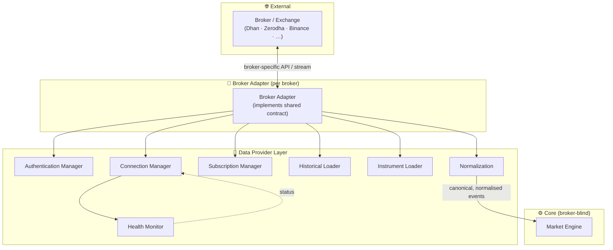
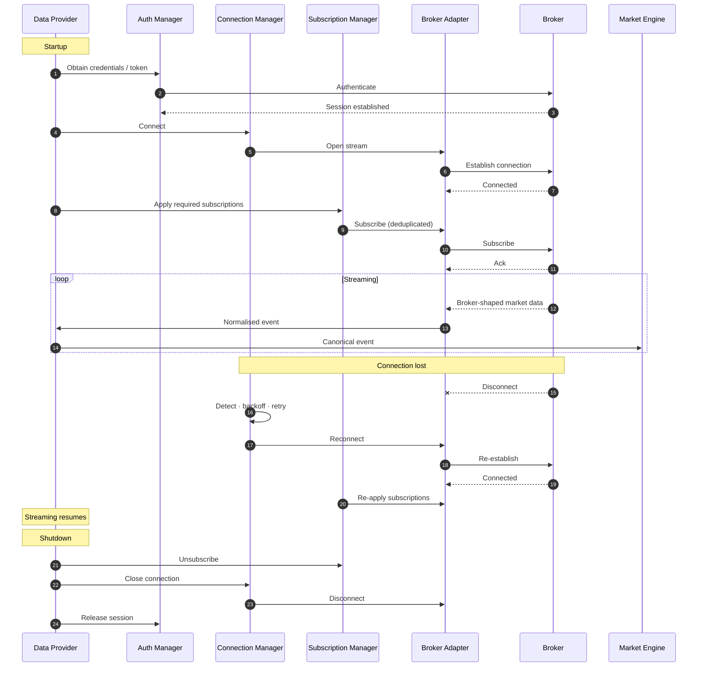
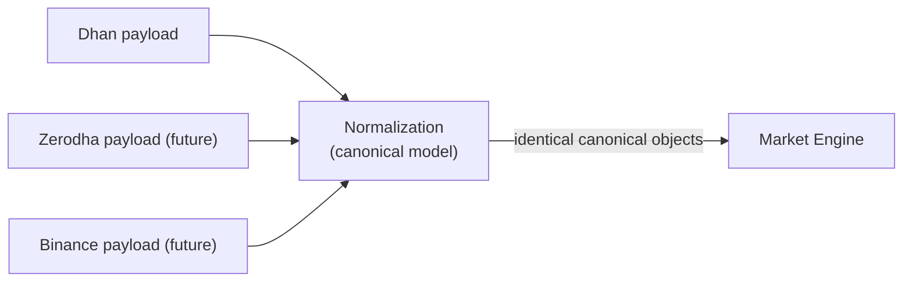
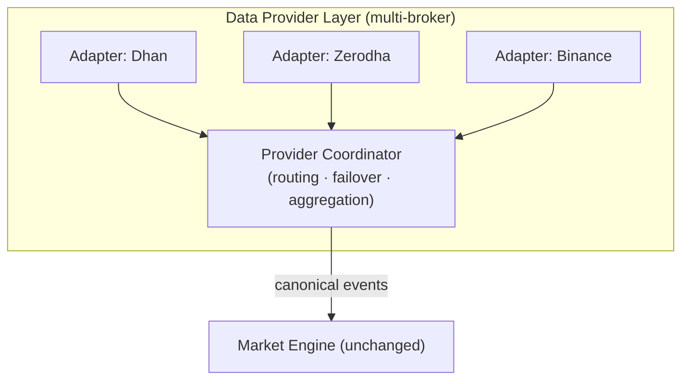

# ApexScan Data Provider Architecture

> **Document status:** Official — **Broker / Data Provider Architecture**
> **Owner:** Market Data Systems / Platform Architecture
> **Audience:** Backend Engineering, Market Data Engineering, QA
> **Nature:** Architecture only. **No code, no Python, no broker SDK usage, no
> REST/API implementation, no SQL, and no Market Engine implementation.**
> **Precedence:** Defines the Broker Abstraction Layer (the **Data Provider
> Layer**). Derives from and obeys `01_SYSTEM_ARCHITECTURE.md` (§2.9 Broker
> Agnostic, §4.7 Broker Adapter) and `03_BACKEND_ARCHITECTURE.md` (§23 Broker
> Integration). Where a lower-level choice conflicts with the master
> architecture, the master architecture wins.
> **Related documents:** `06_MARKET_ENGINE` (the consumer of this layer),
> `02_DATABASE_DESIGN.md` (instrument master persistence), `ADR-003` (Broker
> Adapter Pattern).

> **📝 Note — Document numbering.**
> The Data Provider layer is numbered `05`, *before* the Market Engine (`06`)
> and Strategy Engine (`07`) — the order in which data actually flows
> (Broker → Adapter → Provider → Engine → Strategies).

---

## Table of Contents

1. [Executive Summary](#1-executive-summary)
2. [Design Principles](#2-design-principles)
3. [High-Level Architecture](#3-high-level-architecture)
4. [Supported Providers](#4-supported-providers)
5. [Responsibilities](#5-responsibilities)
6. [Connection Lifecycle](#6-connection-lifecycle)
7. [Subscription Architecture](#7-subscription-architecture)
8. [Historical Data Architecture](#8-historical-data-architecture)
9. [Instrument Master](#9-instrument-master)
10. [Data Normalization](#10-data-normalization)
11. [Health Monitoring](#11-health-monitoring)
12. [Error Handling](#12-error-handling)
13. [Future Multi-Broker Architecture](#13-future-multi-broker-architecture)
14. [Non-Negotiable Rules](#14-non-negotiable-rules)
15. [Summary](#15-summary)
16. [Architecture Checklist](#16-architecture-checklist)

---

## 1 Executive Summary

The Data Provider Layer is the **single boundary** between ApexScan and the
outside world of brokers and exchanges. Its entire reason for existing is
**isolation**: nothing above it — not the Market Engine, not strategies, not
services — may ever know whether market data came from Dhan, Zerodha, Binance,
or a provider that does not exist yet.

### 1.1 Why Broker Abstraction
Brokers are the **most volatile external dependency** in a trading system: their
APIs change, their payloads differ, their auth flows diverge, they rate-limit
differently, and they fail in idiosyncratic ways. If that volatility leaks into
the core, every broker change becomes a core change. The abstraction confines
all of it to one replaceable layer.

### 1.2 Why the Adapter Pattern
Each broker is wrapped by an **adapter** that implements one shared conceptual
contract (`ADR-003`). The rest of the system depends on the *contract*, never on
a concrete adapter. Adding a broker is therefore an **addition** (a new adapter),
never a **modification** of the core (Dependency Inversion, `01` §2.3).

### 1.3 Why a Data Provider Layer
The adapter alone is not enough. Around the raw adapters sits the **Data Provider
Layer**, which owns the cross-cutting concerns every broker needs — connection
management, subscriptions, health, historical loading, instrument mastering,
authentication, and above all **normalization**. The provider layer turns a set
of broker-specific adapters into one uniform, reliable data source.

### 1.4 Long-term broker independence
The end state is total **broker independence**: multiple brokers running
simultaneously, failover between them, and comparison across them — with the
Market Engine unchanged throughout. Every capability in the roadmap
(multi-broker, multi-exchange, multi-asset-class) is reachable because this layer
absorbs the differences.

> **📌 Architecture callout — One seam to rule the volatility.**
> The Data Provider Layer is the physical embodiment of the "isolate volatility
> behind stable interfaces" philosophy (`01` §1). If it does its job, a new
> broker never ripples past it. Guard this boundary above almost all others.

---

## 2 Design Principles

Binding principles for everything in this layer.

| Principle | Purpose | Benefit |
|-----------|---------|---------|
| **Broker Agnostic** | No component above the provider layer references a broker. | New brokers are additive; broker outages are contained. |
| **Exchange Agnostic** | Exchange-specific rules (segments, timings, tick sizes) are normalised at the edge. | Multi-exchange support without core changes. |
| **Provider Agnostic** | The Market Engine consumes a provider, not a broker; even the provider identity is hidden. | The engine works identically regardless of source. |
| **Async First** | All I/O (connect, stream, fetch) is non-blocking. | High concurrency; a slow broker never blocks others. |
| **Event Driven** | Incoming data is emitted as normalised events into the pipeline (`01` §9). | Low latency; natural fan-out to the engine. |
| **Fault Isolation** | A failing adapter fails alone (bulkhead). | One broker's problems never spread to another or the core. |
| **Reconnect First** | Disconnection is expected, not exceptional; recovery is automatic. | Continuous operation across market hours. |
| **Single Responsibility** | Each component (connection, subscription, health, etc.) does one thing. | Comprehensible, testable, replaceable parts. |

> **⚠️ Warning — "Reconnect First" is a mindset, not a feature.**
> Market connections *will* drop — daily. Any component that assumes a stable
> connection and treats a disconnect as a fatal error is wrong by design.
> Disconnection is a normal state with a defined recovery path (§6, §11).

---

## 3 High-Level Architecture

Data flows in one direction: from the broker, through the adapter, into the
provider layer (where it is normalised and managed), and out to the Market
Engine as uniform events.

### 3.1 Layer responsibilities (summary)

| Layer | Responsibility | Knows about |
|-------|----------------|-------------|
| **Broker / Exchange** | The external source of truth for market data. | — |
| **Broker Adapter** | Translate one broker's API into the shared contract; hand raw responses to the provider. | Exactly one broker |
| **Data Provider Layer** | Own connection, subscriptions, health, historical, instruments, auth, and **normalization**. | The adapter contract only |
| **Market Engine** | Consume normalised events; run the scan loop. | The provider only — **no broker** |

> **📌 Architecture callout — The arrow into the Market Engine carries canonical objects only.**
> Everything to the left of that arrow may be broker-shaped; everything to the
> right is uniform. Normalization (§10) sits exactly on that boundary and is the
> layer's most important guarantee.

---

## 4 Supported Providers

### 4.1 Current and future providers

| Provider | Status | Notes |
|----------|--------|-------|
| **Dhan** | **Current (V1)** | The first adapter; validates the abstraction end to end. |
| **Zerodha** | Future | Indian equities/derivatives. |
| **Binance** | Future | Crypto; a different asset class exercising exchange-agnosticism. |
| **Interactive Brokers** | Future | Global multi-asset. |
| **Angel One** | Future | Indian markets. |
| **Upstox** | Future | Indian markets. |

### 4.2 One conceptual interface for all
Every provider — current or future — implements the **same conceptual contract**:
connect/authenticate, subscribe to market data, fetch historical data, load
instruments, report health, and emit **normalised** events. Their *internals*
differ wildly; their *contract* is identical. This is what lets the Market
Engine treat them interchangeably.

> **💡 Tip — The first adapter is the proof, not the exception.**
> Dhan is built to the shared contract from day one — not as a special case to be
> "generalised later." If the contract only fits Dhan, it is not an abstraction.
> Design the contract for *any* broker, then implement Dhan against it.

---

## 5 Responsibilities

The provider layer is composed of focused components, each with a single
responsibility.

### 5.1 Broker Adapter
Translates one broker's API/stream into the shared contract and hands
broker-shaped data to normalization. Owns all broker-specific quirks (endpoints,
message formats, auth specifics, rate-limit rules). **Knows nothing about
strategies, the engine, or persistence.**

### 5.2 Data Provider
The façade the Market Engine talks to. Presents a single, uniform market-data
source and orchestrates the components below. The engine depends on *this*, not
on any adapter.

### 5.3 Connection Manager
Owns the connection lifecycle for each adapter: connect, monitor, reconnect
(with backoff), and disconnect (`03` §23.1). Re-establishes subscriptions after
reconnect.

### 5.4 Subscription Manager
Tracks what instruments/data types are needed, deduplicates subscriptions,
issues them to the adapter, and reconciles them after reconnect or on dynamic
changes (§7).

### 5.5 Health Monitor
Watches heartbeats, latency, and connection state; classifies each adapter as
healthy / degraded / down; feeds the platform's readiness model and triggers
recovery (§11).

### 5.6 Historical Loader
Fetches historical/reference series on demand, with caching, retry, backfill,
validation, and rate-limit compliance (§8). Feeds derived data needs without
touching the live stream.

### 5.7 Instrument Loader
Loads and refreshes the instrument master, normalises symbols, and manages
expiries/versioning (§9). The source of the canonical instrument reference the
whole system uses.

### 5.8 Authentication Manager
Owns broker auth: obtaining, refreshing, and securely holding credentials/tokens
(secrets from the environment, never in source or logs — `03` §27). Re-auths
transparently on expiry.

| Component | Single responsibility | Must not |
|-----------|-----------------------|----------|
| Broker Adapter | Broker ↔ contract translation | Know strategies/engine/persistence |
| Data Provider | Uniform façade & orchestration | Leak broker identity upward |
| Connection Manager | Connection lifecycle & reconnect | Contain business logic |
| Subscription Manager | Subscription state & reconciliation | Assume a stable connection |
| Health Monitor | Health classification & signalling | Make trading decisions |
| Historical Loader | Historical fetch + cache/retry | Touch the live stream path |
| Instrument Loader | Instrument master & symbol normalization | Persist without going through repositories |
| Authentication Manager | Credentials & token lifecycle | Log or expose secrets |

---

## 6 Connection Lifecycle

The lifecycle is **ordered and self-healing**: authenticate, connect, subscribe,
stream — and on failure, reconnect and re-subscribe automatically.

### 6.1 Phases

| Phase | What happens |
|-------|--------------|
| **Startup** | The provider initialises components in order (auth → connect → subscribe). |
| **Authentication** | Credentials/tokens obtained and a session established (§5.8). |
| **Connection** | The stream is opened via the adapter. |
| **Subscription** | Required instruments/data types are subscribed (deduplicated). |
| **Streaming** | Broker data flows in, is normalised, and is emitted to the engine. |
| **Reconnect** | On disconnect, backoff-retry re-establishes the connection **and re-applies subscriptions**. |
| **Shutdown** | Graceful teardown: unsubscribe, disconnect, release the session (aligns with `03` §7). |

> **⚠️ Warning — Reconnect must restore subscriptions.**
> A reconnect that re-opens the socket but forgets to re-subscribe yields a
> *silent* failure: connected, but no data. Subscription reconciliation after
> reconnect is mandatory and must be tested explicitly.

---

## 7 Subscription Architecture

The Subscription Manager owns *what data is being watched*. The Market Engine
declares its needs; the manager translates them into broker subscriptions,
deduplicates, and keeps them consistent.

### 7.1 Subscription types

| Type | Description |
|------|-------------|
| **Market Data (ticks)** | Live price/volume updates per instrument. |
| **Quotes** | Best bid/ask and last-traded snapshots. |
| **Depth (order book)** | Multi-level bid/ask depth. |
| **OHLC** | Open/High/Low/Close candles at supported intervals. |
| **OI (Open Interest)** | Open-interest updates for derivatives. |
| **Option Chain** | Strikes/expiries and their live data for options. |
| **Future subscriptions** | New data types added additively behind the same contract. |

### 7.2 Dynamic subscription management
Subscriptions are **dynamic**: instruments can be added or removed at runtime as
the watched universe changes, without restarting the stream. The manager:

- **Deduplicates** — one underlying subscription serves many consumers.
- **Reference-counts** — an instrument is unsubscribed only when no consumer
  needs it.
- **Reconciles** — after reconnect or config change, actual subscriptions are
  driven back to the desired set.
- **Respects limits** — batches and paces subscription requests within broker
  limits (§12).

> **📌 Architecture callout — The engine asks for instruments, not for sockets.**
> Consumers express *what they need* ("watch these instruments' ticks and
> depth"); the manager decides *how* to subscribe efficiently. Consumers never
> manage raw subscriptions — that couples them to broker mechanics.

---

## 8 Historical Data Architecture

The Historical Loader serves on-demand historical/reference series (e.g. prior
candles) **off the live path**, so backfilling never disturbs streaming.

| Concern | Approach |
|---------|----------|
| **Historical loader** | A dedicated component that fetches historical series via the adapter, returning normalised data. |
| **Caching** | Fetched series are cached (per `02` storage strategy) to avoid repeated broker calls; TTL/versioning applied. |
| **Retry** | Transient failures retried with bounded backoff (§12); deterministic failures surfaced. |
| **Backfill** | Gaps (missed candles after a disconnect) are detected and backfilled to restore continuity. |
| **Validation** | Fetched data is validated (ordering, gaps, sane values) before use (§10). |
| **Rate limiting** | Requests are paced within broker limits; large requests are chunked. |
| **Future bulk loading** | Large-scale historical ingestion (for backtesting, Version 3) is a future capability layered on the same loader. |

> **💡 Tip — Historical and live are different paths, deliberately.**
> Backfilling history is bursty and rate-limited; streaming is continuous and
> latency-sensitive. Keeping them separate (as distinct components) stops a heavy
> historical pull from starving the live feed.

---

## 9 Instrument Master

The Instrument Loader owns the **canonical reference data** for tradeable
instruments — the anchor that results, subscriptions, and historical requests all
point to (`02_DATABASE_DESIGN.md` §5–§6).

| Concern | Approach |
|---------|----------|
| **Loading** | Instruments are loaded from the broker/reference source at startup and on schedule. |
| **Refreshing** | Periodic refresh keeps the master current (new listings, delistings, changes). |
| **Caching** | The master is cached hot (read constantly on the scan path — `02` §3). |
| **Versioning** | Refreshes are versioned so consumers see a consistent snapshot, not a half-updated set. |
| **Symbol normalization** | Broker-specific symbols are mapped to the canonical internal symbol (§10). |
| **Expiry management** | Derivative expiries are tracked; expired instruments are retired and rolls handled. |

> **⚠️ Warning — The instrument master is a coherence boundary.**
> Consumers must read a *consistent* version of the master, never a set that is
> mid-refresh. A partially-updated master causes mismatched symbols and orphaned
> subscriptions. Refresh atomically and switch versions, don't mutate in place.

---

## 10 Data Normalization

### 10.1 Why every broker returns different payloads
Each broker speaks its own dialect: different field names, units, timestamp
formats, symbol conventions, depth structures, and message envelopes. If those
differences reached the engine, every strategy and engine path would need
broker-specific branches — the exact coupling this architecture forbids.

### 10.2 The canonical internal data model
The provider layer defines a **canonical internal model** for every data type
(tick, quote, depth, candle, OI, option-chain entry, instrument). Adapters map
their broker's payloads *into* this model. The model is broker-neutral,
exchange-neutral, and stable.

### 10.3 Identical objects regardless of broker
The guarantee is absolute: **the Market Engine receives identical, canonical
objects no matter which broker produced them.** A tick from Dhan and a tick from
Binance are indistinguishable to the engine once normalised. This is what makes
the engine — and every strategy — broker-agnostic.

> **📌 Architecture callout — Normalization is owned by the provider layer, nowhere else.**
> Not the engine, not services, not strategies. If any of them contains a "if
> broker is X" branch or reshapes a broker payload, normalization has leaked out
> of its home and the abstraction is broken. Normalization lives on the boundary
> arrow into the engine — and only there.

---

## 11 Health Monitoring

The Health Monitor makes the provider layer **observably reliable**, turning
silent failures into detected, recoverable states.

| Signal | Role |
|--------|------|
| **Heartbeat** | Periodic liveness signal per adapter/connection; a missed heartbeat flags trouble early. |
| **Reconnect** | Detected loss triggers the Connection Manager's backoff-reconnect (§6). |
| **Latency** | Measured data latency detects a degrading feed before it fully fails. |
| **Connection health** | Per-connection state: connected / degraded / down. |
| **Broker health** | Aggregate per-broker health, feeding platform readiness (`03` §26). |
| **Future monitoring** | Metrics export, dashboards, and alerting on broker health/latency (operational, additive). |

### 11.1 Health states
A connection moves through **Connected → Degraded → Reconnecting → Connected**
(or → Down), mirroring the adapter state model in `03` §23.1. Health is a
first-class input to readiness: the platform reports "ready" only when its data
source is healthy.

> **📌 Architecture callout — A degraded feed is worse than a dead one.**
> A fully-down connection is obvious and triggers reconnect. A *silently
> degraded* feed (rising latency, stale ticks) looks alive but produces wrong,
> late signals. Health monitoring exists primarily to catch the degraded case.

---

## 12 Error Handling

Errors are **classified** and each class has a defined response. The philosophy
is `03` §16 applied to broker I/O: fail fast where deterministic, retry where
transient, isolate always.

| Error | Nature | Response |
|-------|--------|----------|
| **Authentication failure** | Deterministic (bad creds) or transient (expired token). | Re-auth transparently on expiry; deterministic failure fails fast and alerts. |
| **Network failure** | Transient. | Backoff-reconnect; re-subscribe on recovery (§6). |
| **Subscription failure** | Transient or limit-related. | Retry within limits; reconcile desired vs actual subscriptions. |
| **Rate limiting** | Transient (self-inflicted). | Back off, pace/batch requests, respect broker quotas. |
| **Malformed payload** | Data-quality. | Reject and log the bad message; **do not** propagate it; continue streaming. |

### 12.1 Retryable vs non-retryable

| Retryable (transient) | Non-retryable (deterministic) |
|-----------------------|-------------------------------|
| Network drop, timeout | Invalid credentials |
| Token expiry (→ re-auth) | Unsupported instrument/data type |
| Rate-limit throttle | Malformed message (drop, don't retry) |
| Momentary subscription reject | Contract/permission denied by broker |

### 12.2 Recovery philosophy
- **Isolate:** a failing adapter fails alone; other adapters and the core are
  unaffected (bulkhead, §2).
- **Self-heal:** transient failures recover automatically (reconnect, re-auth,
  re-subscribe) without human intervention.
- **Never propagate bad data:** a malformed payload is dropped and logged, never
  passed to the engine — a wrong tick is worse than a missing one.
- **Fail fast on deterministic errors:** bad credentials or unsupported requests
  surface immediately with actionable context, not endless retries.

> **⚠️ Warning — Never let a malformed payload reach the engine.**
> Propagating a corrupt or partial message produces false signals that look
> real. Validation (§8, §10) is a hard gate: reject at the boundary, log it, and
> keep the stream running.

---

## 13 Future Multi-Broker Architecture

The abstraction makes **multiple brokers at once** a natural extension, not a
rewrite. Each runs as an isolated adapter behind the shared contract; the
provider layer coordinates them.

| Capability | Description |
|------------|-------------|
| **Simultaneous brokers** | Multiple adapters stream concurrently, each isolated; the engine sees one uniform feed. |
| **Failover** | If a broker degrades, a healthy one is promoted as the source for affected instruments — no engine change. |
| **Load sharing** | Instruments/subscriptions are distributed across brokers to respect per-broker limits and balance load. |
| **Broker comparison** | The same instrument sourced from multiple brokers can be compared (latency, quality) for selection/diagnostics. |

> **📌 Architecture callout — Multi-broker changes the provider, never the engine.**
> Routing, failover, and aggregation are *provider-layer* responsibilities. The
> Market Engine keeps consuming canonical events from a single provider façade,
> oblivious to how many brokers sit behind it. If multi-broker forces an engine
> change, the abstraction has failed.

---

## 14 Non-Negotiable Rules

These rules are absolute and enforced in review. Violating any one breaks the
abstraction the entire layer exists to provide.

1. **The Market Engine never imports a broker SDK** — it depends only on the
   provider façade and canonical model.
2. **Strategies never import a broker SDK** — they receive normalised data via
   the engine (`01` §4.4).
3. **The Broker Adapter never knows about strategies** — adapters are leaves; they
   translate data, they do not orchestrate.
4. **The provider layer owns normalization** — no broker-shaped data crosses into
   the engine; no "if broker == X" branch exists above this layer.
5. **No broker identity leaks upward** — nothing above the provider façade can
   name or detect which broker is in use.
6. **Adapters are bulkheaded** — one adapter's failure never affects another or
   the core.
7. **Secrets stay in the layer** — broker credentials/tokens live only in the
   auth manager/adapter, never in the engine, strategies, logs, or source.
8. **The canonical model is the only contract upward** — consumers depend on the
   canonical objects, never on broker payloads.

> **⚠️ Warning — These are architecture invariants, not guidelines.**
> A pull request that imports a broker SDK into the engine, branches on broker
> identity above the provider, or lets a broker payload reach a strategy is
> rejected regardless of how well it works. Each such shortcut re-couples the
> core to a specific broker and forfeits broker independence.

---

## 15 Summary

The Data Provider Layer is ApexScan's **broker firewall**. It absorbs every
broker-specific concern — API dialects, auth, connection lifecycle,
subscriptions, rate limits, historical fetching, instrument mastering, and
failure modes — and presents the rest of the system with **one uniform, reliable,
normalised data source**.

Its guarantees:

- **Broker/exchange/provider agnostic** — the Market Engine and strategies never
  know or care where data comes from.
- **Normalised** — identical canonical objects regardless of source, owned solely
  by this layer.
- **Resilient** — reconnect-first, self-healing, fault-isolated (bulkheaded)
  adapters.
- **Extensible** — new brokers are additive; multi-broker, failover, and load
  sharing are provider-layer evolutions that never touch the core.

Because this layer does its job, ApexScan can grow from one broker to many, and
from one exchange/asset class to several, **without changing its architecture** —
exactly the independence promised in `00_PROJECT_OVERVIEW.md`.

---

## 16 Architecture Checklist

Use this checklist to verify that any Data Provider implementation or pull
request complies with this architecture. A change is compliant only when every
**applicable** item is satisfied.

### Abstraction & Boundaries
- [ ] The Market Engine imports no broker SDK.
- [ ] Strategies import no broker SDK.
- [ ] No component above the provider façade names or detects a specific broker.
- [ ] Broker identity never leaks upward in types, fields, or branches.
- [ ] The provider façade is the only thing the Market Engine depends on for data.
- [ ] Adapters know nothing about strategies, the engine, or persistence.
- [ ] Every broker implements the same conceptual contract.
- [ ] Adding a broker required no change to the engine, strategies, or services.

### Broker Adapter
- [ ] Each adapter wraps exactly one broker.
- [ ] All broker-specific quirks (endpoints, formats, auth, limits) live in the adapter.
- [ ] The adapter hands data to normalization, not to the engine directly.
- [ ] The adapter contains no business/orchestration logic.
- [ ] The adapter never persists data directly (goes through repositories via services).
- [ ] Adapters share no mutable state (bulkheaded).

### Data Provider Façade
- [ ] The provider presents a single, uniform data source.
- [ ] The provider orchestrates its components; it holds no strategy logic.
- [ ] The provider exposes only canonical objects upward.
- [ ] The provider hides how many brokers are behind it.

### Connection Management
- [ ] Connection lifecycle follows the ordered sequence (auth → connect → subscribe → stream).
- [ ] Disconnection is treated as a normal, recoverable state.
- [ ] Reconnect uses bounded backoff (with jitter).
- [ ] Subscriptions are re-applied after every reconnect.
- [ ] Shutdown is graceful (unsubscribe → disconnect → release session).
- [ ] A connection never blocks the event loop (async I/O throughout).

### Authentication
- [ ] Credentials/tokens come from the environment/secret surface, never source.
- [ ] Tokens are refreshed transparently on expiry.
- [ ] Auth failures are classified deterministic vs transient and handled accordingly.
- [ ] Credentials never appear in logs, errors, or events.

### Subscription
- [ ] Consumers request instruments/data types, not raw subscriptions.
- [ ] Subscriptions are deduplicated and reference-counted.
- [ ] Desired vs actual subscriptions are reconciled after change/reconnect.
- [ ] Subscription requests are batched/paced within broker limits.
- [ ] Dynamic add/remove works at runtime without restarting the stream.
- [ ] Supported data types (ticks, quotes, depth, OHLC, OI, option chain) map to the canonical model.

### Historical Data
- [ ] Historical loading runs off the live streaming path.
- [ ] Fetched series are cached with appropriate TTL/versioning.
- [ ] Transient fetch failures retry with bounded backoff.
- [ ] Gaps after disconnects are detected and backfilled.
- [ ] Historical data is validated (ordering, gaps, sanity) before use.
- [ ] Requests respect rate limits; large pulls are chunked.

### Instrument Master
- [ ] Instruments load at startup and refresh on schedule.
- [ ] Broker symbols are normalised to the canonical symbol.
- [ ] The master is cached hot for the scan path.
- [ ] Refreshes are versioned and switched atomically (no mid-refresh reads).
- [ ] Derivative expiries are tracked and expired instruments retired.
- [ ] The master is persisted via repositories (per `02`), not by the adapter directly.

### Normalization
- [ ] A canonical model exists for every data type.
- [ ] Adapters map broker payloads into the canonical model.
- [ ] The engine receives identical objects regardless of broker.
- [ ] No broker-shaped payload crosses into the engine.
- [ ] No "if broker == X" branch exists above the provider layer.
- [ ] Units, timestamps, and symbols are normalised at the edge.

### Health Monitoring
- [ ] Heartbeats are tracked per adapter/connection.
- [ ] Latency is measured to detect degradation.
- [ ] Connection/broker health is classified (healthy/degraded/down).
- [ ] Health feeds the platform readiness signal.
- [ ] Degraded (not just down) feeds are detected and acted on.

### Error Handling & Resilience
- [ ] Errors are classified (auth/network/subscription/rate-limit/malformed).
- [ ] Retryable vs non-retryable is explicit; deterministic errors are not retried.
- [ ] Malformed payloads are rejected and logged, never propagated.
- [ ] A failing adapter is isolated from others and the core.
- [ ] Transient failures self-heal (reconnect/re-auth/re-subscribe).
- [ ] Deterministic failures fail fast with actionable context.

### Multi-Broker & Future
- [ ] The design supports multiple adapters running simultaneously.
- [ ] Failover between brokers is a provider-layer concern (no engine change).
- [ ] Load sharing across brokers respects per-broker limits.
- [ ] Broker comparison is possible without affecting the engine.
- [ ] New data types/providers are additive behind the existing contract.

### Testing
- [ ] Each adapter has contract tests proving it honours the shared interface.
- [ ] Normalization is tested: broker payloads → identical canonical objects.
- [ ] Reconnect + re-subscribe is tested explicitly.
- [ ] Malformed-payload rejection is tested.
- [ ] Rate-limit/backoff behaviour is tested.
- [ ] Broker APIs are mocked/recorded in tests (no live broker in unit tests).
- [ ] Failover/promotion between brokers is tested (once multi-broker is implemented).

---

*End of document. This is the official Broker / Data Provider architecture for
ApexScan, maintained by Market Data Systems / Platform Architecture. Every
provider and adapter implementation must conform to it and to
`01_SYSTEM_ARCHITECTURE.md`.*
