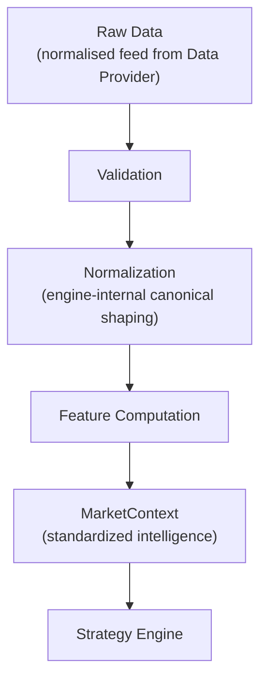
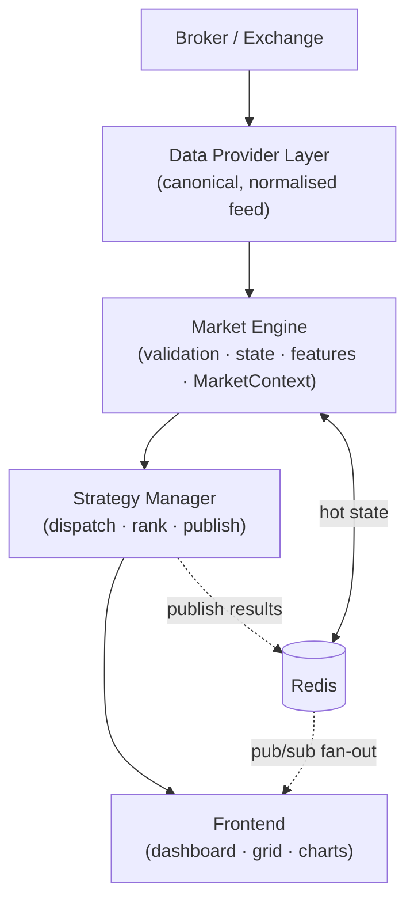
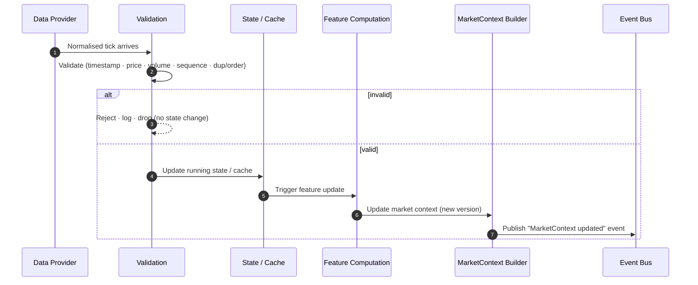
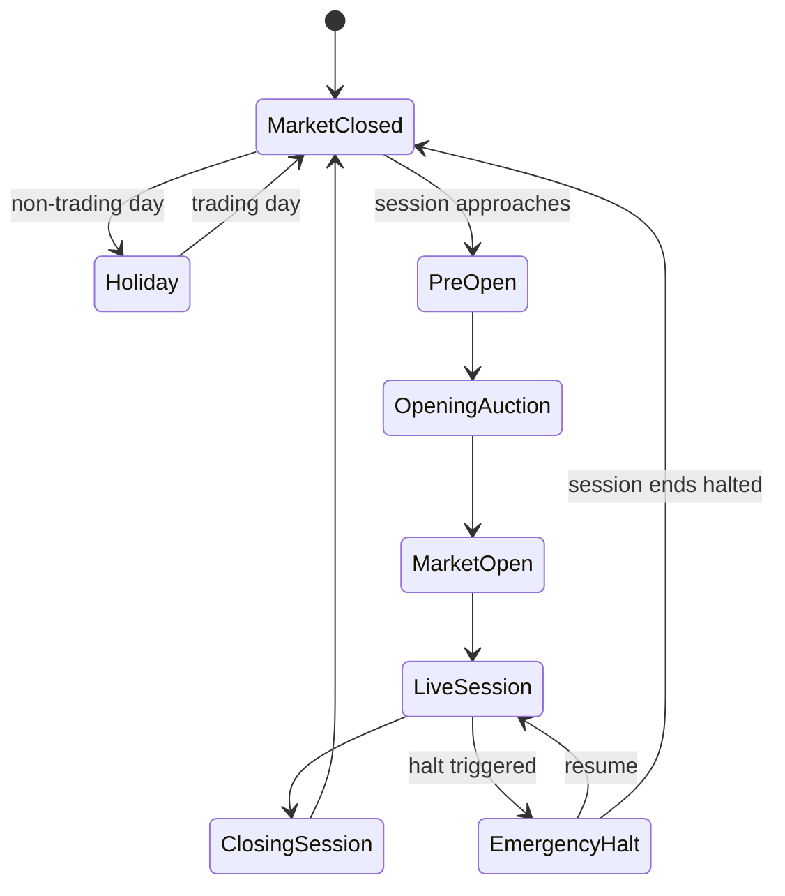
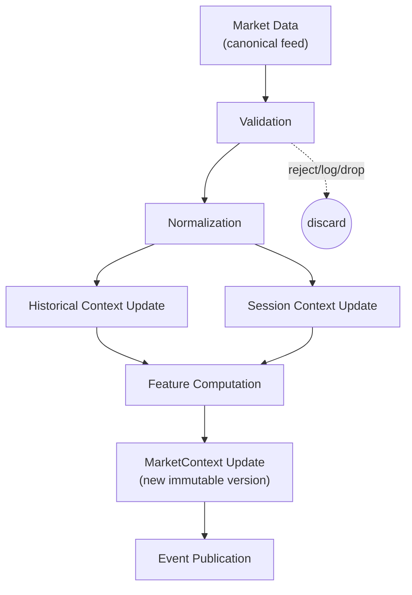
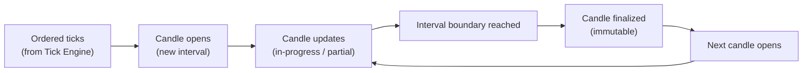
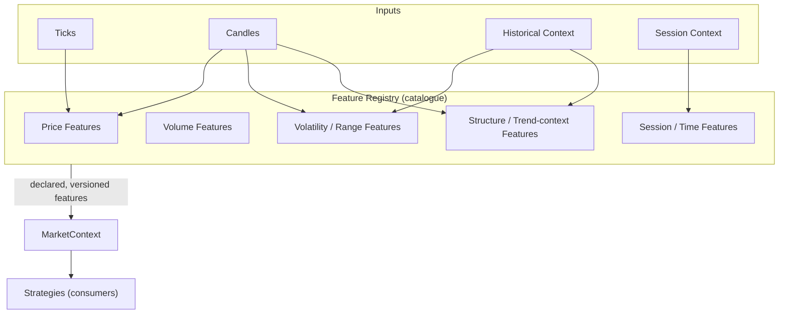
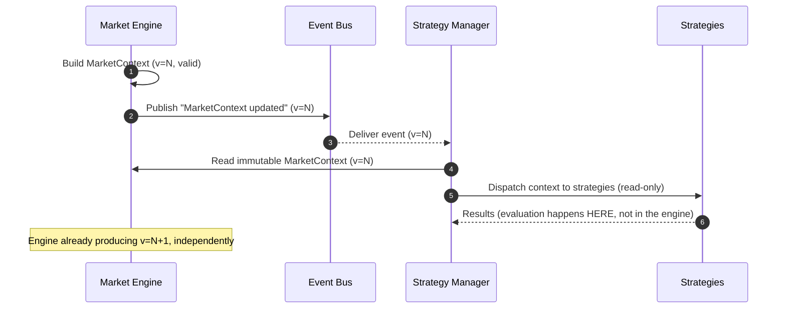
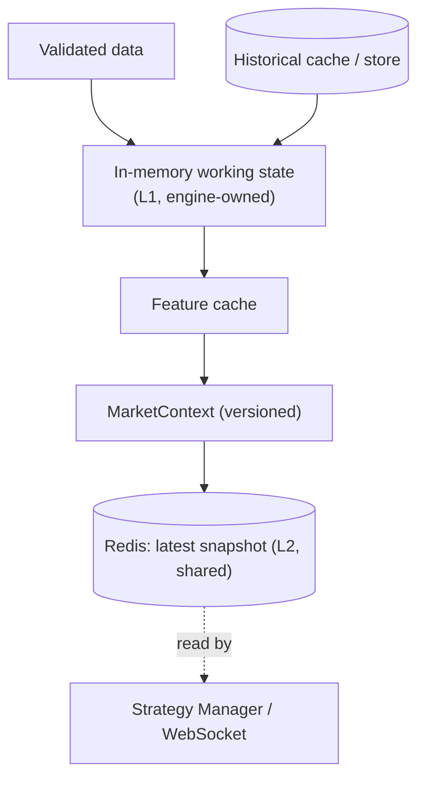

# ApexScan Market Engine — Part 1

> **Document status:** Official — **Market Engine Architecture (Part 1 of 2)**
> **Owner:** Quant Systems / Platform Architecture
> **Audience:** Backend Engineering, Quant Engineering, QA
> **Nature:** Architecture only. **No code, no Python, no SQL, no implementation,
> no trading-strategy logic, and no calculations/formulas.**
> **Precedence:** Defines what the Market Engine owns. Derives from and obeys
> `01_SYSTEM_ARCHITECTURE.md` (§8 Market Engine overview, §9 Event flow),
> `05_DATA_PROVIDER.md` (its upstream), and feeds `07_STRATEGY_ENGINE.md` (its
> downstream). Where a lower-level choice conflicts with the master
> architecture, the master architecture wins.
> **Scope of Part 1:** Sections 1–10 (purpose → validation). Part 2 will cover
> feature computation orchestration, candle aggregation, caching/state internals,
> the scan loop, performance, resilience, and the engine checklist.

---

## Table of Contents

1. [Executive Summary](#1-executive-summary)
2. [Market Engine Philosophy](#2-market-engine-philosophy)
3. [High-Level Architecture](#3-high-level-architecture)
4. [Core Responsibilities](#4-core-responsibilities)
5. [Market Data Lifecycle](#5-market-data-lifecycle)
6. [MarketContext Architecture](#6-marketcontext-architecture)
7. [Market State Management](#7-market-state-management)
8. [Session Context](#8-session-context)
9. [Validation Pipeline](#9-validation-pipeline)
10. [Part 1 Summary](#10-part-1-summary)

---

## 1 Executive Summary

### 1.1 Purpose of the Market Engine
The Market Engine is the **heart of ApexScan**. Its purpose is singular and
precise: **transform raw market data into standardized market intelligence.** It
takes the normalised feed from the Data Provider Layer and turns it into a
consistent, validated, feature-rich view of the market — the **MarketContext** —
that strategies consume.

The Market Engine does **not** produce BUY/SELL signals. It does not know what a
strategy is looking for. It produces *intelligence*; strategies produce
*decisions*. This separation is the engine's defining characteristic.

### 1.2 Why the Market Engine exists
Without a Market Engine, every strategy would have to independently validate
ticks, build candles, track session state, and compute features — duplicating
fragile logic 100+ times, inconsistently. The engine exists to do this work
**once, correctly, and identically for everyone**, so strategies receive a clean,
uniform, ready-to-evaluate view of the market.

### 1.3 Why it is separate from the Strategy Engine

| Market Engine | Strategy Engine |
|---------------|-----------------|
| Produces standardized market intelligence | Consumes intelligence to make decisions |
| Knows market microstructure, sessions, candles | Knows strategy rules |
| Identical output for all consumers | Different logic per strategy |
| Deterministic and reusable | Pluggable and diverse |
| **Never** knows a strategy rule | **Never** re-derives market data |

Keeping them separate means the engine can serve 3 strategies or 300 without
change, and strategies can be added/removed without touching the engine (`01`
§2.10).

### 1.4 Why deterministic
Given the same sequence of validated input, the engine must always produce the
**same** MarketContext. Determinism is what makes the platform testable,
debuggable, and (in a future version) replayable for backtesting. A
non-deterministic engine would make every downstream result unreproducible.

### 1.5 Why reusable
The engine's output is **strategy-agnostic**, so the same MarketContext feeds
every strategy, the dashboard, and (future) paper-trading and backtesting. Build
the intelligence once; reuse it everywhere.

### 1.6 Why broker independent
The engine consumes only the **canonical, normalised model** from the Data
Provider Layer (`05_DATA_PROVIDER.md` §10). It never sees a broker payload and
never names a broker. It works identically whether data originates from Dhan,
Binance, or a provider that does not yet exist.

> **📌 Architecture callout — Intelligence, not decisions.**
> The single most important thing to understand about the Market Engine: it
> answers *"what is the state of the market right now?"* — never *"should we
> act?"*. The moment strategy-specific logic appears in the engine, the
> architecture has failed.

---

## 2 Market Engine Philosophy

The engine is a **one-directional pipeline** that refines raw data into
intelligence in ordered stages. Each stage has one job and hands its output to
the next.

### 2.1 The stages

| Stage | Purpose | Output |
|-------|---------|--------|
| **Raw Data** | The normalised market events arriving from the Data Provider Layer (already broker-neutral). | Canonical ticks/candles/quotes |
| **Validation** | Reject bad, duplicate, or out-of-order data before it can corrupt state (§9). | Trusted input only |
| **Normalization** | Shape validated input into the engine's internal working representation and update running state. | Consistent internal state |
| **Feature Computation** | Derive standardized, strategy-agnostic features from state (mechanics in Part 2; **no formulas here**). | Computed features |
| **MarketContext** | Assemble the complete, versioned snapshot of market intelligence (§6). | An immutable MarketContext |
| **Strategy Engine** | Consumes the MarketContext to evaluate strategies (out of scope — `07`). | (downstream) |

> **📝 Note — "Normalization" appears twice, deliberately.**
> The **Data Provider** normalises *across brokers* (`05` §10) so the engine sees
> one shape regardless of source. The **Market Engine** then normalises *into its
> own internal working model* and running state. They are different steps at
> different layers; do not conflate them.

> **⚠️ Warning — The pipeline flows one way.**
> A later stage never feeds back into an earlier one, and nothing downstream
> reaches back to mutate engine state. Feature computation reads state; it does
> not rewrite the raw feed. This one-directional flow is what keeps the engine
> deterministic (§1.4).

---

## 3 High-Level Architecture

The Market Engine sits at the centre of the pull-then-push pipeline: fed by the
Data Provider, feeding the Strategy Manager, whose ranked results ultimately
reach the Frontend.

### 3.1 Responsibilities in the chain

| Component | Responsibility | Knows about |
|-----------|----------------|-------------|
| **Broker / Exchange** | External source of market data. | — |
| **Data Provider Layer** | Normalise across brokers; deliver canonical events; manage connection/subscriptions (`05`). | The broker adapter contract |
| **Market Engine** | Validate, maintain state, compute features, build MarketContext, publish events. | The canonical model only — **no broker, no strategy** |
| **Strategy Manager** | Dispatch MarketContext to strategies; collect and rank results; publish (`07`). | The strategy contract |
| **Frontend** | Render results and market context (`04`). | The API/WebSocket contract |

> **📌 Architecture callout — The engine is broker-blind and strategy-blind.**
> Look at what it *knows about*: only the canonical model upstream and the fact
> that "something" consumes its MarketContext downstream. It has no knowledge of
> brokers (that stops at the Data Provider) or strategy rules (those live in the
> Strategy Engine). It is the neutral middle.

---

## 4 Core Responsibilities

What the Market Engine **owns**, in detail.

### 4.1 Data validation
The engine is the **gatekeeper of trust**. Every incoming datum is validated
(§9) before it can affect state. Bad data is rejected and logged, never
propagated. Downstream, a MarketContext is always built from validated input.

### 4.2 Market state management
The engine owns the current **market state** (pre-open, open, closed, halted — §7)
and the running per-instrument state (latest tick, current candle, session
figures). It is the single authority on "what the market is doing right now."

### 4.3 Historical context
The engine holds the **historical context** strategies need for comparison
(previous-day figures, prior candles) — sourced from the Data Provider's
historical loader (`05` §8) and made available uniformly within the
MarketContext. (It stores, organises, and exposes history; it does not decide
what strategies do with it.)

### 4.4 Session context
The engine tracks **session context** (§8): trading day, session phase, elapsed
and remaining time, opening range, gaps, calendar, and timezone. Every
MarketContext is stamped with where in the session it belongs.

### 4.5 Price normalization
The engine applies its **internal normalization** — consistent representation of
prices/volumes/timestamps in its working model — so all downstream features and
context are built on uniform, coherent values. (This is engine-internal shaping,
distinct from cross-broker normalization in `05`.)

### 4.6 Feature computation
The engine **orchestrates the computation of standardized, strategy-agnostic
features** and attaches them to the MarketContext. *Which* features and *how*
they are organised is defined in Part 2 — and **no formulas, calculations, or
indicator logic appear in this document.** The key principle: features are
computed **once** and shared, never re-derived per strategy.

### 4.7 MarketContext generation
The engine assembles the **MarketContext** (§6) — the complete, versioned,
immutable snapshot of market intelligence for an instrument at a point in time.
This is the engine's primary product.

### 4.8 Event publishing
The engine **publishes events** into the pipeline (`01` §9): a MarketContext
update signals the Strategy Manager that fresh intelligence is ready. Publishing
is how the engine hands off — it does not call strategies directly.

### 4.9 Performance ownership
The engine owns the **performance of the hot path**: validating, updating, and
publishing must keep pace with the market. Latency and throughput of this path
are the engine's responsibility (detailed in Part 2).

### 4.10 What the Market Engine MUST NEVER do

> **⚠️ Warning — Engine prohibitions are absolute.**

- **Never generate BUY/SELL signals or trading decisions.**
- **Never contain strategy rules or strategy-specific logic** (no CPR, VWAP,
  momentum, order-book, or any indicator *decision* logic).
- **Never know which strategies exist** or what they compute.
- **Never import or reference a broker SDK** or name a broker.
- **Never place orders or interact with execution** (out of scope entirely).
- **Never mutate a MarketContext after it is published** (immutability, §6).
- **Never propagate invalid data** — bad input is rejected at validation.
- **Never persist through anything but repositories** (durable writes go via the
  defined persistence path, `03` §12).

> **📌 Architecture callout — The engine computes features, not conclusions.**
> A "feature" is a neutral, reusable measurement of market state (e.g. *a*
> session's opening range boundaries as data). A "conclusion" is a
> strategy-specific judgement (e.g. *"this is a breakout, go long"*). The engine
> owns features; it must never cross into conclusions. Where exactly that line
> sits for each feature is governed in Part 2 and `07_STRATEGY_ENGINE.md`.

---

## 5 Market Data Lifecycle

The lifecycle of a single datum, from arrival to event publication. This is the
engine's core loop.

### 5.1 Lifecycle stages

| # | Stage | What happens |
|---|-------|--------------|
| 1 | **Tick arrives** | A canonical, broker-neutral datum is received from the Data Provider. |
| 2 | **Validation** | The datum is checked against the validation pipeline (§9). Invalid → rejected, logged, dropped; **no state change**. |
| 3 | **Normalization** | Valid data is shaped into the engine's internal working model. |
| 4 | **Cache update** | Running state (latest tick, current candle, session figures) is updated. |
| 5 | **Feature update** | Standardized features affected by the new datum are recomputed (mechanics in Part 2). |
| 6 | **MarketContext update** | A new, versioned MarketContext snapshot is assembled (§6). |
| 7 | **Event publication** | A "MarketContext updated" event is published for the Strategy Manager. |

> **📝 Note — Not every tick must publish a full evaluation trigger.**
> Updating context and *triggering strategy evaluation* can be separated: many
> ticks may refine context, while evaluation is triggered on a meaningful
> boundary (e.g. candle close). This policy lives at the event boundary (`01`
> §9.1, Event 2 vs Event 3) — the lifecycle above shows the maximal path.

> **⚠️ Warning — Invalid data must exit at stage 2.**
> Rejected data never reaches state, features, or context. Letting a
> questionable tick "through, just this once" corrupts every downstream feature
> and every strategy that reads the resulting context. Validation is a hard gate.

---

## 6 MarketContext Architecture

> **This is the most important section of the document.**

### 6.1 What MarketContext is
**MarketContext is the engine's product** — a complete, self-contained,
versioned snapshot of *everything known about an instrument's market state at a
point in time*. It is the standardized "view of the world" that a strategy needs
in order to evaluate, delivered as a single coherent object.

If the Market Engine is the heart of ApexScan, **MarketContext is the blood it
pumps.** Every strategy, and much of the dashboard, is ultimately a consumer of
MarketContext.

### 6.2 Why every strategy receives the same MarketContext
A single, shared MarketContext guarantees:

- **Consistency:** every strategy evaluates against the *identical* view — no two
  strategies disagree because they built the market state differently.
- **Correctness:** validation and feature computation happen once, in one audited
  place — not re-implemented (and mis-implemented) per strategy.
- **Performance:** the expensive work (validation, aggregation, feature
  computation) is done once and shared across all strategies, not repeated 100+
  times.
- **Fairness/comparability:** because all strategies see the same inputs, their
  results are directly comparable and reproducible.

> **📌 Architecture callout — One context, many readers.**
> The engine builds **one** MarketContext per instrument-update and hands the
> *same* object to every strategy. Strategies are pure readers of it (`01` §4.4).
> This one-writer/many-readers shape is what makes the platform both consistent
> and scalable to hundreds of strategies.

### 6.3 Conceptual contents
The MarketContext conceptually contains the following (described as *what it
holds*, not *how it is computed* — no formulas):

| Element | Conceptual meaning |
|---------|--------------------|
| **Current Tick** | The latest validated tick for the instrument. |
| **Latest Candle** | The current in-progress candle. |
| **Intraday Candles** | The sequence of completed candles for the current session. |
| **Historical Candles** | Prior-period candles needed for context/comparison. |
| **Previous Day Data** | Key prior-day reference figures (e.g. prior close/high/low as data). |
| **Session Information** | Where in the trading session this snapshot sits (§8). |
| **Market State** | The current market phase (pre-open, open, closed, halted — §7). |
| **Computed Features** | Standardized, strategy-agnostic features derived by the engine (Part 2). |
| **Liquidity Information** | Standardized liquidity/market-depth view (as data, not judgement). |
| **Market Statistics** | Standardized running statistics for the instrument/session. |
| **Timestamp** | The point in time the snapshot represents. |
| **Version** | A monotonically advancing version identifying this snapshot. |
| **Validity** | An explicit indication that the context is complete and trustworthy. |

> **📝 Note — Contents are descriptive, not prescriptive of computation.**
> This list says *what a MarketContext carries*. It deliberately states **no
> formulas, thresholds, or indicator logic** — those (where they belong to the
> engine at all) are Part 2 material, and anything strategy-specific belongs to
> `07_STRATEGY_ENGINE.md`.

### 6.4 Ownership
The Market Engine is the **sole owner and sole writer** of MarketContext.
Nothing else creates or modifies it. Strategies, the Strategy Manager, and the
frontend are **readers only**. This single-writer rule is what makes the context
trustworthy.

### 6.5 Immutability philosophy
A published MarketContext is **immutable**. When new data arrives, the engine
produces a **new version** rather than mutating the existing one.

- **Why:** immutability makes a snapshot safe to share concurrently with many
  strategies without locking or race conditions — a reader always sees a
  complete, consistent view.
- **Versioning:** each snapshot carries a version so consumers can reason about
  ordering and freshness.
- **Validity:** a snapshot is only published once it is complete and marked
  valid; consumers never see a half-built context.

> **⚠️ Warning — Never hand out a mutable, half-built context.**
> If a strategy could observe a MarketContext mid-update, it might evaluate
> against a torn, inconsistent view — a subtle, unreproducible bug. The engine
> assembles a snapshot fully, marks it valid, versions it, and only then
> publishes it as an immutable object.

---

## 7 Market State Management

The engine tracks the **market phase** and transitions between phases as the
session progresses. Market State is a first-class part of every MarketContext
(§6.3), because the meaning of data depends on the phase it occurred in.

### 7.1 Market states

| State | Meaning |
|-------|---------|
| **Pre-Open** | Before the session; orders may be collected but continuous trading has not begun. |
| **Opening Auction** | The opening price-discovery phase. |
| **Market Open** | The moment continuous trading begins. |
| **Live Session** | Normal continuous trading. |
| **Closing Session** | The closing phase / closing auction. |
| **Market Closed** | Outside trading hours; no live trading. |
| **Holiday** | A non-trading calendar day. |
| **Emergency Halt** | An unexpected trading halt (circuit breaker, exchange halt). |

### 7.2 State transitions

### 7.3 How the Market Engine changes state
State transitions are driven by the **trading calendar, session schedule, and
signals from the feed** (e.g. a halt indication), not by guesswork:

- **Schedule-driven** transitions (pre-open → open → close) follow the session
  calendar and clock (§8).
- **Event-driven** transitions (emergency halt/resume) react to signals surfaced
  through the Data Provider.
- Every transition **stamps the MarketContext** so downstream consumers always
  know the phase a snapshot belongs to.

> **📌 Architecture callout — State gives data its meaning.**
> The same price move means different things in the opening auction versus mid
> live-session versus the close. By making Market State explicit in every
> context, the engine lets strategies interpret data correctly — without the
> engine itself making any strategic judgement.

> **⚠️ Warning — Never assume "open" by default.**
> Treating an unknown/unset phase as "market open" risks acting on data outside
> valid trading conditions. Market State is explicit and authoritative; when it
> is not confidently known, the engine reflects that rather than assuming.

---

## 8 Session Context

Session Context answers *"where are we in the trading day?"*. It is part of every
MarketContext and gives temporal meaning to market data.

| Element | Conceptual meaning |
|---------|--------------------|
| **Trading day** | The calendar trading date the data belongs to. |
| **Trading session** | The session window(s) for the instrument/exchange that day. |
| **Gap** | The relationship between this session's opening and the prior session's close (as data). |
| **Opening range** | The boundaries of the session's opening period (as data, not a signal). |
| **Elapsed session time** | How far into the session the current moment is. |
| **Remaining session** | How much session time remains. |
| **Trading calendar** | The schedule of trading/non-trading days and session hours. |
| **Timezone** | The authoritative timezone for the instrument/exchange (all times normalised to UTC internally — `02` §4). |

### 8.1 Why session context matters
Market behaviour is strongly session-dependent — the open, the close, and the
time-of-day all shape how data should be read. By computing session context
**once** and attaching it to the MarketContext, the engine spares every strategy
from re-deriving "what time is it in the session?" and guarantees they all agree.

> **📝 Note — Session context is data, not strategy.**
> The engine provides *facts* about the session (elapsed time, opening range
> boundaries, gap size). It draws **no conclusions** from them. Whether a gap or
> an opening range is "significant" is a strategy question (`07`), not an engine
> question.

> **⚠️ Warning — Timezone and calendar errors are silent and severe.**
> A miscalculated session boundary or wrong timezone corrupts every
> session-relative feature for every strategy, invisibly. The trading calendar
> and timezone handling are treated as high-assurance inputs, validated and
> tested with care.

---

## 9 Validation Pipeline

Validation is the engine's **trust boundary**. Only data that passes every
applicable check is allowed to affect state, features, or context. The
philosophy is `05_DATA_PROVIDER.md` §12 and `03_BACKEND_ARCHITECTURE.md` §16
applied at the engine's front door: *reject fast, log clearly, never propagate
bad data.*

### 9.1 Validation checks

| Check | What it ensures |
|-------|-----------------|
| **Tick validation** | The datum is structurally complete and well-formed. |
| **Timestamp validation** | The time is present, plausible, and within an acceptable window (not absurdly stale or future). |
| **Price validation** | Prices are present, positive, and within sane bounds (no impossible/zero/negative values). |
| **Volume validation** | Volumes are present and non-negative; sizes are plausible. |
| **Sequence validation** | The datum's ordering/sequence is consistent with what has already been seen. |
| **Duplicate detection** | A repeated/replayed datum is identified and not double-counted. |
| **Out-of-order detection** | A datum arriving later than a newer one is detected and handled, not blindly applied. |
| **Invalid instrument detection** | Data for an unknown/unsubscribed/expired instrument is rejected. |

### 9.2 Recovery philosophy

| Situation | Response |
|-----------|----------|
| **Malformed / invalid datum** | Reject, log with context, drop — **no state change**. |
| **Duplicate** | Ignore (idempotent); do not double-apply. |
| **Out-of-order** | Do not corrupt state; handle per a defined ordering policy (Part 2), never blindly overwrite newer data with older. |
| **Invalid instrument** | Reject and log; surface for investigation (possible instrument-master drift, `05` §9). |
| **Transient upstream gap** | Rely on the Data Provider's reconnect/backfill (`05` §6, §8) to restore continuity; the engine consumes corrected data. |

> **⚠️ Warning — A wrong tick is worse than a missing one.**
> Propagating a bad datum produces false features and false signals that *look*
> real, across every strategy. A dropped datum is visible and recoverable; a
> corrupt one silently poisons results. When in doubt, the engine rejects.

> **📌 Architecture callout — Validation protects determinism.**
> The engine's determinism (§1.4) only holds if its inputs are trustworthy and
> consistently ordered. The validation pipeline is what upholds that guarantee —
> it is not optional hygiene, it is a load-bearing part of the architecture.

---

## 10 Part 1 Summary

Part 1 established **what the Market Engine is and what it owns**:

- **Purpose.** Transform raw market data into **standardized market
  intelligence** — never into trading decisions. The engine produces *features
  and context*; strategies produce *conclusions*.
- **Separation.** The engine is deliberately separate from the Strategy Engine:
  deterministic, reusable, broker-independent, and strategy-blind. It serves 3 or
  300 strategies without change.
- **Responsibilities.** Data validation, market-state management, historical and
  session context, internal normalization, feature-computation orchestration,
  MarketContext generation, event publishing, and hot-path performance — bounded
  by a strict list of things it must **never** do (no signals, no strategy logic,
  no broker knowledge, no order execution).
- **MarketContext.** The engine's central product: a complete, versioned,
  **immutable** snapshot of market intelligence, owned solely by the engine and
  shared identically with every reader — the guarantee of consistency,
  correctness, and comparability.
- **Market State.** An explicit, authoritative market phase (pre-open → open →
  live → close → closed / halted / holiday) that gives data its meaning and is
  stamped into every context.
- **Validation.** The engine's trust boundary — reject fast, log clearly, never
  propagate bad data — which is what protects the engine's determinism.

> **📝 Note — This is Part 1.**
> Part 2 continues into the engine's internals: candle aggregation, the
> feature-computation framework (still no strategy formulas), caching and state
> management details, the scan/dispatch loop, performance and concurrency,
> resilience/recovery, and the Market Engine architecture checklist.

---

*End of Part 1. All Market Engine implementation must conform to it and to
`01_SYSTEM_ARCHITECTURE.md`. Part 2 continues below.*

---
---

# ApexScan Market Engine — Part 2

> **Continuation of the Market Engine Architecture.** Part 2 defines the
> **internal processing architecture** — the pipeline, the tick and candle
> engines, historical context, the derived-feature framework, the feature
> registry, and event publication. It defines *how the engine is organised
> internally*, still **without any trading-strategy logic, formulas, or
> calculations**. Sections and numbering continue from Part 1; all rules from
> Part 1 (especially §4.10 prohibitions and §6 MarketContext) remain in force.

### Part 2 contents

11. [Processing Pipeline](#11-processing-pipeline)
12. [Tick Processing Engine](#12-tick-processing-engine)
13. [Candle Engine](#13-candle-engine)
14. [Historical Context Engine](#14-historical-context-engine)
15. [Derived Feature Engine](#15-derived-feature-engine)
16. [Previous Day Landmark Engine](#16-previous-day-landmark-engine)
17. [Session Statistics Engine](#17-session-statistics-engine)
18. [Feature Registry](#18-feature-registry)
19. [Event Publication](#19-event-publication)
20. [Part 2 Summary](#20-part-2-summary)

---

## 11 Processing Pipeline

The engine's internal work is a **staged pipeline**. Each stage refines the data
and hands it to the next; the pipeline is one-directional and deterministic
(Part 1 §2). This expands the high-level lifecycle of Part 1 §5 into its full
internal form.

### 11.1 Stage-by-stage contract

| Stage | Purpose | Inputs | Outputs | Owner | Dependencies | Failure handling |
|-------|---------|--------|---------|-------|--------------|------------------|
| **Validation** | Trust gate — admit only good data (Part 1 §9). | Canonical datum | Trusted datum (or discard) | Validation pipeline | — | Reject, log, drop; **no state change** |
| **Normalization** | Shape into the engine's internal working model. | Trusted datum | Internal representation | Tick Engine (§12) | Validation | Treat as data error → reject/log |
| **Historical Context Update** | Ensure the relevant historical window is current for this instrument. | Internal datum, historical cache | Updated historical context | Historical Context Engine (§14) | Data Provider historical loader (`05` §8) | Use last-good context; flag staleness; never block live path |
| **Session Context Update** | Refresh where in the session this datum sits. | Internal datum, calendar/clock | Updated session context | Session/State manager (Part 1 §7–§8) | Trading calendar, timezone | Fall back to last known phase; flag if uncertain |
| **Feature Computation** | Derive standardized, strategy-agnostic features. | Internal state, historical + session context | Computed features | Derived Feature Engine (§15) | Ticks, candles, historical, session | Isolate per-feature failure; mark feature invalid, keep others |
| **MarketContext Update** | Assemble a new immutable, versioned snapshot (Part 1 §6). | All above | New MarketContext version | Market Engine (context builder) | All prior stages | Only publish a **complete, valid** snapshot; else withhold |
| **Event Publication** | Signal that fresh intelligence is ready (§19). | New MarketContext | Published event | Event publisher (§19) | Event bus (`03` §14) | Isolate subscriber failures; bounded retry for transient |

> **📝 Note — Historical and Session updates run before features, in parallel to each other.**
> Feature computation depends on *both* an up-to-date historical window and an
> up-to-date session context, so both are refreshed first. They are independent
> of each other, hence shown as parallel branches feeding the feature stage.

> **⚠️ Warning — A partial context is never published.**
> If any stage cannot complete cleanly, the engine withholds the new context
> version rather than publishing a half-built one (Part 1 §6.5). Consumers only
> ever see complete, valid, versioned snapshots.

---

## 12 Tick Processing Engine

The Tick Engine is the **front of the pipeline** — it turns the raw arrival of
individual datums into orderly, trustworthy updates to running state.

### 12.1 Tick lifecycle
A tick is **received → validated → sequenced → applied to state → made available
to downstream stages.** A tick that fails validation never reaches state (Part 1
§9).

### 12.2 Tick sequencing
Ticks are processed in a **well-defined order per instrument**. Sequencing
ensures that state reflects the true progression of the market and that
downstream features are computed against a coherent ordering — the basis of
determinism.

### 12.3 Tick buffering
The engine may **buffer** briefly to absorb bursts and to establish correct
ordering, applying back-pressure when downstream cannot keep up (`03` §21.4).
Buffers are **bounded** — never unbounded accumulation.

### 12.4 Duplicate detection
Repeated or replayed ticks are **identified and ignored** so nothing is
double-counted (Part 1 §9.1). Duplicate handling is idempotent.

### 12.5 Out-of-order handling
A tick arriving after a newer one is **detected and handled per a defined
ordering policy** — never blindly applied to overwrite fresher state. The policy
protects state integrity; it makes no strategic judgement.

### 12.6 Missing tick recovery
Gaps (e.g. after a disconnect) are **detected**; the engine relies on the Data
Provider's reconnect/backfill (`05` §6, §8) to restore continuity and consumes
the corrected data. The engine does not fabricate missing ticks.

### 12.7 Timestamp consistency
All timestamps are handled consistently (UTC internally — `02` §4) so ordering
and session placement are coherent across instruments and sources.

### 12.8 Multi-symbol processing
The engine processes **many instruments concurrently and independently**. Each
instrument's tick stream is isolated — one symbol's bad data or backlog does not
affect another (bulkhead, consistent with `05` §2).

### 12.9 Tick ownership

| The Tick Engine **owns** | The Tick Engine **must never own** |
|--------------------------|------------------------------------|
| Sequencing and ordering of ticks | Any strategy rule or signal |
| Duplicate/out-of-order handling | Knowledge of what strategies compute |
| Bounded buffering and back-pressure | Broker-specific logic (that stops at `05`) |
| Per-instrument isolation | Order execution / trading actions |
| Handing clean, ordered ticks downstream | Deciding whether a tick is "significant" |

> **📌 Architecture callout — The Tick Engine guarantees order, not meaning.**
> Its job is to make sure state reflects a correct, de-duplicated, in-order
> stream. Whether any tick *matters* is a downstream (feature/strategy) question.
> Order is mechanics; meaning is not the Tick Engine's concern.

---

## 13 Candle Engine

The Candle Engine aggregates ordered ticks into **candles** across one or more
timeframes. It produces candles as *data*; it computes no indicators and makes no
judgements. **No formulas or aggregation math appear here.**

### 13.1 Candle lifecycle

### 13.2 Candle concerns

| Concern | Architecture |
|---------|--------------|
| **Candle lifecycle** | A candle **opens** at an interval boundary, **updates** as ticks arrive (partial/in-progress), and is **finalized** (immutable) at the next boundary. |
| **Multiple timeframes** | Several timeframes are maintained in parallel from the same tick stream; each is independent. |
| **Candle finalization** | On finalization a candle becomes an immutable, completed record available to features/context. |
| **Partial candles** | The current in-progress candle is exposed as *partial* (Part 1 §6.3 "Latest Candle") and clearly distinguished from finalized ones. |
| **Session boundaries** | Candles respect session start/end (Part 1 §7–§8); a candle does not span across a session close into the next session. |
| **Gap handling** | Gaps between sessions are represented honestly (as data); the engine does not invent candles to fill non-trading time. |
| **Holiday handling** | Non-trading days produce no candles; the calendar governs which days/sessions exist (§8). |
| **Symbol isolation** | Each instrument's candles are built independently; no cross-symbol coupling. |

> **⚠️ Warning — Partial and finalized candles must never be confused.**
> A strategy reading the current partial candle as if it were finalized would act
> on incomplete data. The engine labels candle state explicitly (partial vs
> finalized) in the MarketContext so consumers cannot mistake one for the other.

> **📝 Note — Candles are produced, not interpreted.**
> The Candle Engine outputs OHLC-style records as *data*. Whether a candle
> pattern "means" anything is entirely a strategy concern (`07`). The engine
> never classifies or labels candles beyond their factual state.

---

## 14 Historical Context Engine

### 14.1 Purpose
The Historical Context Engine maintains the **backward-looking view** every
strategy may need for comparison — prior candles and prior-period figures —
sourced from the Data Provider's historical loader (`05` §8) and exposed
uniformly within the MarketContext (Part 1 §6.3).

### 14.2 Concerns

| Concern | Architecture |
|---------|--------------|
| **Historical window management** | Maintains the set of historical bars/periods currently relevant to each instrument. |
| **Rolling windows** | Windows roll forward as time advances — the oldest data ages out, the newest rolls in, keeping the window size bounded. |
| **Previous day information** | Prior trading-day reference figures are made available (detailed in §16). |
| **Previous week information** | Prior-week reference figures for wider context (future-leaning). |
| **Previous month information** | Prior-month reference figures for broadest context (future-leaning). |
| **Historical ownership** | The engine **owns the organisation and exposure** of historical context; the Data Provider owns *fetching* it. |
| **Context refresh** | Historical context is refreshed at defined points (e.g. session start, or on backfill after a gap). |
| **Retention philosophy** | Keep only what strategies plausibly need; bound memory; older raw history lives in the cache/store, not the hot context. |
| **Historical cache interaction** | Reads through the historical cache (`05` §8, `02` §3); never re-fetches what is already cached. |
| **Future extensibility** | Additional periods/resolutions are added additively without changing consumers. |

> **📌 Architecture callout — The engine organises history; the provider fetches it.**
> Ownership is split cleanly: **fetching, caching, backfill, and rate-limiting**
> of historical data are Data Provider responsibilities (`05`). **Organising it
> into rolling windows and exposing it in the MarketContext** is the Market
> Engine's. Neither reaches into the other's job.

---

## 15 Derived Feature Engine

> **This section is extremely important.**

### 15.1 Philosophy — features are not signals
The Derived Feature Engine computes **reusable, standardized market features**
that strategies consume. This is the sharpest line in the whole architecture:

> **A feature is a neutral measurement of market state. A signal is a
> strategy-specific decision. The Market Engine computes features. Strategies
> turn features into signals. The engine never crosses that line.**

Features are computed **once** and shared with every strategy (Part 1 §6.2), so
the expensive work happens in one audited place and every strategy sees identical
inputs. **This document describes what each feature *category* represents and who
uses it — never how it is calculated.**

> **⚠️ Warning — No calculations, thresholds, or interpretations live here.**
> Describing *how* a feature is computed, or what value of it is "good/bad,"
> would embed strategy logic into the engine. Feature categories are described
> only as *what kind of market fact they represent*. Formulas and thresholds are
> out of scope for the engine entirely.

### 15.2 Feature categories
Each category below is defined by its **purpose**, **consumers**, **lifetime**,
**dependencies**, and **future extensibility** — with no calculation detail.

| Category | Purpose (what kind of fact) | Consumers | Lifetime | Dependencies | Future extensibility |
|----------|-----------------------------|-----------|----------|--------------|----------------------|
| **Price Features** | Standardized facts about current/recent price position. | Strategies, dashboard | Per-tick / per-candle | Ticks, candles | New price references |
| **Volume Features** | Standardized facts about traded volume activity. | Strategies, dashboard | Per-tick / per-candle | Ticks, candles | Volume-profile facts |
| **Session Features** | Facts about the current session's shape/timing (§8). | Strategies | Per-session (updates within it) | Session context | New session descriptors |
| **Volatility Features** | Standardized facts describing variability of movement. | Strategies | Per-candle / rolling | Candles, historical | Additional variability measures |
| **Range Features** | Facts describing the extent/boundaries of movement over a window. | Strategies | Per-candle / per-session | Candles, session | New range windows |
| **Liquidity Features** | Standardized facts about market depth/liquidity (Part 1 §6.3). | Strategies, dashboard | Per-tick / per-update | Quotes, depth | Deeper microstructure facts |
| **Trend Context Features** | Neutral facts describing directional context over windows (context, **not** a call). | Strategies | Rolling | Candles, historical | More timeframes |
| **Market Structure Features** | Facts about structural landmarks/levels as data (not "support/resistance calls"). | Strategies | Per-session / rolling | Candles, historical | Richer structure facts |
| **Time Features** | Facts about time-of-day / elapsed-remaining session time. | Strategies | Continuous | Session context, clock | Event-time features |
| **Statistical Features** | Standardized running statistics of the instrument/session. | Strategies, dashboard | Rolling / per-session | Ticks, candles | New statistics |

> **📌 Architecture callout — "Trend context," not "trend signal."**
> Note the deliberate naming: the engine may expose *facts* about directional
> context (e.g. relationships across windows, as data), but it never emits "the
> trend is up, buy." Interpreting trend/structure into a decision is a strategy's
> job. If a feature name implies a *decision*, it is misplaced — rename it to
> describe the *fact*.

### 15.3 Feature lifetime & recomputation
Features have a **lifetime** matching their inputs: tick-driven features update
per tick; candle-driven features update on candle events; session features update
within the session. The engine recomputes only what changed (efficiency;
Part 2 performance in a later doc), and every feature is attached to the
MarketContext version it belongs to.

---

## 16 Previous Day Landmark Engine

The Previous Day Landmark Engine exposes the **prior trading day's key reference
figures** as data. **Architecture only — no formulas.**

### 16.1 Purpose
Provide a stable, validated set of previous-day landmarks that many strategies
compare against, computed once and shared via the MarketContext (Part 1 §6.3
"Previous Day Data").

| Landmark | Conceptual meaning (as data) |
|----------|------------------------------|
| **Previous High** | The prior day's highest traded price. |
| **Previous Low** | The prior day's lowest traded price. |
| **Previous Close** | The prior day's closing price. |
| **Previous Open** | The prior day's opening price. |
| **Gap Information** | The relationship between today's open and the prior close (as data). |
| **Previous Range** | The extent of the prior day's movement (as data). |
| **Previous Midpoint** | The prior day's mid-level reference (as data). |

### 16.2 Ownership, caching, validation, refresh

| Concern | Architecture |
|---------|--------------|
| **Ownership** | The engine owns exposing landmarks in the context; the Data Provider owns fetching the prior-day source data (`05`). |
| **Caching** | Landmarks are cached for the trading day (they do not change intraday) and read hot. |
| **Validation** | Source figures are validated (Part 1 §9) before becoming landmarks — a bad prior-day value would corrupt every comparison. |
| **Refresh lifecycle** | Landmarks are established at/before session start and remain stable for the day; refreshed each new trading day. |
| **Future landmarks** | Additional landmarks (e.g. prior-week/month references) are added additively (§14). |

> **⚠️ Warning — A wrong landmark silently corrupts many strategies.**
> Because landmarks are shared by many strategies as comparison anchors, a single
> bad previous-close poisons all of them at once. Landmarks are validated and
> treated as high-assurance data, established once per day and held immutable for
> that day.

---

## 17 Session Statistics Engine

The Session Statistics Engine maintains the **running facts of the current
session** — the "today so far" view — as part of every MarketContext.

| Statistic | Conceptual meaning (as data) |
|-----------|------------------------------|
| **Today's High** | Highest traded price so far this session. |
| **Today's Low** | Lowest traded price so far this session. |
| **Opening Price** | The session's opening price. |
| **Current Range** | The extent of today's movement so far (as data). |
| **Session Volume** | Traded volume accumulated this session. |
| **Elapsed Time** | Time elapsed since session start (§8). |
| **Remaining Time** | Time remaining in the session (§8). |
| **Session Extremes** | The high/low extremes and when they occurred (as data). |
| **Session Summary** | A consolidated snapshot of the above for convenience. |

### 17.1 Ownership & lifecycle

| Concern | Architecture |
|---------|--------------|
| **Ownership** | Owned solely by the Market Engine; readers (strategies, dashboard) consume, never write. |
| **Lifecycle** | Initialised at session start, updated continuously through the live session, finalised at session close, reset for the next trading day. |
| **State dependence** | Behaviour is gated by Market State (Part 1 §7) — e.g. statistics accumulate only during valid trading phases. |

> **📝 Note — Session statistics are facts, not verdicts.**
> "Today's high" is a datum. Whether price *approaching* today's high "means"
> anything is a strategy question. The engine reports the facts of the session;
> it never grades them.

---

## 18 Feature Registry

### 18.1 Why every computed feature is registered
As the platform grows toward many features consumed by 100+ strategies, an
**implicit** set of features becomes unmanageable: no one knows what exists, what
depends on what, or what breaks if a feature changes. The **Feature Registry** is
the authoritative catalogue that makes the feature set **explicit, versioned, and
governable**.

### 18.2 What the registry records

| Attribute | Purpose |
|-----------|---------|
| **Feature identity** | A stable, unique name/identity for each feature. |
| **Version** | The feature's version, so consumers can reason about changes. |
| **Dependencies** | What inputs (ticks, candles, historical, session) and other features it depends on. |
| **Owner** | The engine component responsible for producing it. |
| **Consumers** | Which strategies/surfaces consume it (for impact analysis). |
| **Deprecation** | A defined lifecycle for retiring a feature without breaking consumers. |
| **Future additions** | New features register here before use — nothing is consumed "off-catalogue." |

### 18.3 Registry dependency view

> **📌 Architecture callout — The registry is how features scale safely.**
> With a registry, changing or deprecating a feature is a governed action:
> dependencies and consumers are known, impact is analysable, and versions let
> consumers migrate deliberately. Without it, a feature change is a blind edit
> that can silently break dozens of strategies. Registration is mandatory.

> **⚠️ Warning — No off-catalogue features.**
> A feature computed and consumed without being registered is invisible to impact
> analysis and versioning — exactly the drift the registry exists to prevent.
> Every feature the engine exposes is declared in the registry first.

---

## 19 Event Publication

The engine's hand-off to the rest of the system is **event publication**, into
the backend event bus (`03` §14; `01` §9). The engine publishes; it never calls
strategies directly.

### 19.1 What events are published
Primarily the **"MarketContext updated"** event — signalling that a new, valid,
versioned MarketContext is available for an instrument — plus **system events**
for engine lifecycle (e.g. engine started/stopped, state transitions from Part 1
§7). The engine publishes *intelligence-ready* facts, never *decisions*.

### 19.2 When events are published
An event is published **only after** a complete, valid MarketContext version has
been assembled (Part 1 §6.5; §11 failure handling). The policy of *whether every
context update also triggers strategy evaluation* lives at the event boundary
(`01` §9.1, Event 2 vs Event 3) — the engine can update context frequently while
evaluation is triggered on meaningful boundaries.

### 19.3 Event ownership
The engine **owns the events it produces** — their identity and payload intent
are its contract with downstream consumers. It does **not** own what subscribers
do with them.

### 19.4 Ordering guarantees
Ordering is guaranteed **per instrument** (consistent with tick sequencing §12
and `03` §14.5): context versions for one instrument are published in order.
There is **no** global cross-instrument ordering guarantee — different
instruments advance concurrently.

### 19.5 Versioning
Every published event carries the **MarketContext version** it refers to (Part 1
§6.5), so consumers can reason about freshness and ordering and ignore a stale
event if a newer one has superseded it.

### 19.6 Failure isolation
A subscriber that fails handling a published event fails **alone** — its error is
contained and logged; other subscribers and the engine are unaffected (`03`
§14.6). A broken strategy can never stall the engine's publishing.

### 19.7 Retry philosophy
Retries apply only to **transient, idempotent** delivery concerns, bounded with
backoff. The engine does not indefinitely retry into a failing subscriber; it
publishes, isolates failures, and moves on (`03` §16.4).

### 19.8 Relationship with the backend event bus
The engine is a **publisher on the shared event bus** defined in
`03_BACKEND_ARCHITECTURE.md` §14 — it does not implement its own private
messaging. This keeps the engine consistent with the platform's decoupling model
and lets a future **distributed** bus carry engine events across processes with
no change to the engine.

> **📌 Architecture callout — Publish and forget (safely).**
> The engine publishes a versioned event and moves on; it neither knows nor cares
> how many strategies consume it. That decoupling — via the shared bus and Redis
> fan-out — is what lets the engine scale to hundreds of downstream consumers
> without change.

---

## 20 Part 2 Summary

Part 2 defined the **internal processing architecture** of the Market Engine:

| Concern | Essence |
|---------|---------|
| **Processing Pipeline** | A one-directional, deterministic sequence — validate → normalize → (historical + session) → features → MarketContext → publish — where each stage has a defined contract and a partial context is never published. |
| **Tick Engine** | Guarantees *order and trust* of the datum stream (sequencing, dedup, out-of-order handling, bounded buffering, per-symbol isolation) — order, never meaning. |
| **Candle Engine** | Aggregates ordered ticks into candles across timeframes as *data* — partial vs finalized always explicit, session/gap/holiday honoured — never interpreting them. |
| **Historical Context** | Organises and exposes rolling historical windows and prior-period figures; the engine organises, the Data Provider fetches. |
| **Derived Features** | Computes reusable, standardized **features (not signals)** in neutral categories, once and shared — with **no formulas or interpretations** in the engine. |
| **Feature Registry** | Makes the feature set explicit, versioned, and governable — mandatory registration, known dependencies and consumers, safe deprecation. |
| **Event Publication** | Publishes versioned "MarketContext updated" (and system) events onto the shared bus, ordered per instrument, with isolated failures and bounded retries — publish and forget, safely. |

Together, Parts 1 and 2 fully define **what the Market Engine owns and how it is
internally organised** — a deterministic, broker-blind, strategy-blind producer
of standardized market intelligence. It computes *facts*; it never computes
*decisions*.

> **📝 Note — Still no strategy logic, by design.**
> Everything above describes producing *intelligence*. How a strategy turns that
> intelligence into a scan result or signal is defined entirely in
> `07_STRATEGY_ENGINE.md`. Remaining engine concerns — caching/state internals in
> depth, the scan/dispatch loop, performance and concurrency, and resilience —
> together with the Market Engine checklist, belong to the engine's operational
> detail and `07`.

---

*End of Part 2. All Market Engine implementation must conform to this document
and to `01_SYSTEM_ARCHITECTURE.md`. Part 3 (final) continues below.*

---
---

# ApexScan Market Engine — Part 3 (Final)

> **Final part of the Market Engine Architecture.** Part 3 covers integration and
> operability: how the engine hands off to the Strategy Manager, cache
> integration, performance, observability, fault tolerance, testing, and
> scalability — and closes with the **non-negotiable rules**, a **compliance
> checklist**, and an **Architecture Readiness Assessment**. Sections and
> numbering continue from Part 2; all rules from Parts 1–2 remain in force. Still
> **no code, SQL, formulas, or strategy logic**.

### Part 3 contents

21. [Strategy Manager Integration](#21-strategy-manager-integration)
22. [Cache Integration](#22-cache-integration)
23. [Performance Architecture](#23-performance-architecture)
24. [Observability Architecture](#24-observability-architecture)
25. [Fault Tolerance](#25-fault-tolerance)
26. [Testing Philosophy](#26-testing-philosophy)
27. [Scalability & Future Evolution](#27-scalability--future-evolution)
28. [Non-Negotiable Architecture Rules](#28-non-negotiable-architecture-rules)
29. [Market Engine Architecture Checklist](#29-market-engine-architecture-checklist)
30. [Final Summary](#30-final-summary)

---

## 21 Strategy Manager Integration

The boundary between the Market Engine and the Strategy Manager is the boundary
between **information and decision**. The engine produces MarketContext; the
Strategy Manager consumes it to evaluate strategies. **The Market Engine never
evaluates a strategy.**

### 21.1 Responsibilities at the boundary

| Concern | Market Engine | Strategy Manager |
|---------|---------------|------------------|
| **Produces / consumes** | Produces MarketContext + events | Consumes MarketContext |
| **Knowledge** | Market microstructure, features | Strategy rules |
| **Evaluation** | **Never** evaluates strategies | Dispatches to and collects from strategies |
| **Mutation of context** | Sole writer of MarketContext | **Read-only** consumer |

### 21.2 MarketContext handoff
The engine hands off by **publishing a versioned "MarketContext updated" event**
(Part 2 §19). The Strategy Manager receives the event and reads the immutable
MarketContext (Part 1 §6). The context is passed as a complete, valid, versioned
snapshot — never a live or partial view.

### 21.3 Event-driven interaction
Interaction is **event-driven, not call-based**: the engine does not call the
Strategy Manager, and the Strategy Manager does not poll the engine. They are
decoupled through the shared event bus (`03` §14; `01` §9).

### 21.4 Synchronization philosophy
The engine and Strategy Manager run **asynchronously and independently**. The
engine keeps producing new context versions regardless of how fast the Strategy
Manager consumes them. Synchronisation is achieved through **versioning**, not
locking — a consumer always reads a complete snapshot at a known version.

### 21.5 Version compatibility
Every MarketContext and event carries a **version** (Part 1 §6.5, Part 2 §19.5).
Consumers use it to reason about freshness and ordering, and to **ignore a stale
event** if a newer version has superseded it.

### 21.6 Backward compatibility
The MarketContext is a **contract**. It evolves additively — new features/fields
are added (registered first, Part 2 §18) without removing or repurposing existing
ones — so existing strategies keep working. Breaking changes are versioned and
migrated deliberately, never silently.

### 21.7 Failure isolation
A strategy (or the Strategy Manager) failing to handle a context has **no effect
on the engine** — the engine already published and moved on (Part 2 §19.6). A
broken strategy cannot stall context production.

### 21.8 Ownership boundaries

> **📌 Architecture callout — Information vs decision, one more time.**
> The engine **computes information**; the Strategy Manager **consumes
> information**; strategies **make decisions**. The engine never evaluates
> strategies, and the Strategy Manager never mutates a MarketContext. This single
> boundary is what lets the engine serve 100+ strategies deterministically.

> **⚠️ Warning — No back-channel from strategies into the engine.**
> A strategy must never call back into the engine to request a re-computation or
> to influence context building. That would make context non-deterministic and
> strategy-dependent — the opposite of everything Part 1 established. The flow is
> strictly engine → event → context → strategy.

---

## 22 Cache Integration

The engine uses caching to keep the hot path fast, following the tiered model of
`03_BACKEND_ARCHITECTURE.md` §22 and the storage strategy of `02` §3. **Caches
accelerate; PostgreSQL remains the source of truth (`ADR-001`).**

### 22.1 Cache tiers & roles

| Cache | Role in the engine |
|-------|--------------------|
| **In-memory cache** | The hottest, engine-owned working state (current tick, in-progress candle, live features) — process-local. |
| **Redis integration** | Shared hot state across processes: the latest MarketContext snapshot and cross-process coordination. |
| **Historical cache** | Cached historical windows/landmarks read through the Data Provider (`05` §8). |
| **Feature cache** | Recently computed features reused across a context build to avoid recomputation. |

### 22.2 Cache ownership
Each cache entry is **owned by the engine component that produces it** (Part 1
§4, `03` §22.4). Consumers read; only the owner writes and invalidates. No
external component writes into the engine's caches.

### 22.3 Cache lifecycle & invalidation
- **Lifecycle:** working state is created as data arrives, updated on the hot
  path, and finalised/rolled at candle and session boundaries.
- **Invalidation:** driven by events (a new context version supersedes the
  previous snapshot) and by boundaries (session close resets session-scoped
  state); every cached entry has a TTL as a safety net (`03` §22.2).

### 22.4 Session cleanup
At session close, session-scoped state (session statistics §17, intraday candles)
is **finalised and cleared** for the new trading day, so nothing carries over
incorrectly. Previous-day landmarks are refreshed (Part 2 §16).

### 22.5 Performance considerations
- Hot reads (latest context, instrument reference) are served from cache, never
  re-derived per read.
- Feature caching avoids recomputing unchanged features within a context build.
- Caches are **bounded** (TTL + explicit eviction at boundaries) so memory does
  not grow without limit.

> **⚠️ Warning — Cache is never the source of truth for the engine.**
> If losing Redis or the in-memory cache would lose data that must survive, that
> data was misplaced. The engine's caches are always reconstructible from the
> feed and the durable store; nothing authoritative lives only in a cache.

---

## 23 Performance Architecture

Performance is a **design property** of the engine — it sits on the hot path
between the market and every strategy, so its latency is the platform's latency.

| Concern | Approach |
|---------|----------|
| **Latency goals** | The validate → update → publish path is kept minimal; work per datum is bounded and predictable. Concrete budgets are set from measurement (below). |
| **Throughput philosophy** | Event-driven and async (`03` §21): the engine processes many instruments' data concurrently without blocking. |
| **Memory efficiency** | Bounded buffers, rolling historical windows (Part 2 §14), TTL/eviction on caches (§22) — memory is bounded by design. |
| **Concurrency** | Structured, owned concurrency; no blocking calls on the event loop (`03` §21.8). |
| **Symbol isolation** | Each instrument is processed independently; one symbol's load/failure never affects another (bulkhead). |
| **Parallel processing** | Independent instruments and independent feature computations proceed in parallel. |
| **Batch optimization** | Where it reduces overhead without hurting latency, work (e.g. persistence of finalized candles) is batched. |
| **Resource ownership** | The engine owns its hot-path resources (working state, buffers) and their limits. |
| **Future horizontal scaling** | Because instruments are isolated and events are bus-decoupled, instrument sets can be **sharded across engine instances** without re-architecture (§27). |
| **Performance budgeting** | Each stage has a latency/throughput budget; regressions against budget are caught in performance tests (§26). |

> **📌 Architecture callout — Isolation is what makes the engine scalable.**
> Because per-instrument processing shares no mutable state, scaling out is a
> matter of *partitioning instruments* across instances — not redesigning the
> engine. Guard symbol isolation as a scalability primitive, not just a
> correctness one.

> **📝 Note — Budgets come from measurement, not guesswork.**
> Specific latency/throughput numbers are established from observed behaviour on
> representative load (§26), not asserted up front. The architecture guarantees
> the *shape* (bounded, async, isolated); the numbers are tuned empirically.

---

## 24 Observability Architecture

The engine is **observable** so operators can see the health of the hot path in
real time (extends `03` §26).

| Pillar | Role in the Market Engine |
|--------|---------------------------|
| **Structured logging** | Structured, contextual logs (Part 1 heritage, `03` §9) for lifecycle, state transitions, and rejections. |
| **Metrics** | Counts/latencies for ticks processed, candles finalized, features computed, contexts published, rejections. |
| **Tracing** | Correlation-ID tracing of a datum through the pipeline; distributed tracing across processes as a future step. |
| **Engine health** | A composite signal (feed connected, pipeline flowing, no runaway rejections) feeding platform readiness. |
| **Feature computation monitoring** | Per-feature success/failure and timing (ties to the Feature Registry, Part 2 §18). |
| **Pipeline monitoring** | Visibility into each stage (§11): where time is spent, where data is dropped. |
| **Latency monitoring** | Track the datum-to-context and context-to-publish latencies against budget (§23). |
| **Queue monitoring** | Watch buffer/queue depths to detect back-pressure and impending saturation early. |
| **Correlation IDs** | Thread a datum/scan cycle across pipeline stages and downstream events (`03` §9.3). |
| **Future dashboards** | Engine-health and latency dashboards, added operationally. |
| **Future alerting** | Alerts on rejection spikes, latency budget breaches, stalled pipeline, or queue saturation. |

> **⚠️ Warning — A silently degraded engine is the dangerous case.**
> A fully-stalled engine is obvious. A *slowly degrading* one (rising latency,
> creeping rejections, growing queues) produces late, thin intelligence that
> still looks alive. Observability exists primarily to catch degradation before
> it becomes an outage — watch trends, not just up/down.

---

## 25 Fault Tolerance

The engine is built for a hostile reality: bad data, gaps, disconnects, and
dependency failures are expected. Its stance is **isolate, degrade gracefully,
recover automatically** (extends `03` §16, `05` §12).

| Fault | Response |
|-------|----------|
| **Invalid market data** | Rejected at validation (Part 1 §9); logged; dropped; **no state change**. |
| **Missing market data** | Detected as a gap; rely on Data Provider reconnect/backfill (`05` §6, §8); mark affected context as needing refresh rather than fabricating data. |
| **Delayed market data** | Handled via ordering/timestamp policy (Part 2 §12); latency surfaced via observability; stale context flagged. |
| **Broker disconnect** | Owned by the Data Provider (`05` §23-equivalent); the engine sees a feed pause, holds last-good state, and resumes on recovery. |
| **Cache failure** | Degrade to reconstructing from the feed/store; caches are non-authoritative (§22). |
| **Database unavailable** | Durable writes (e.g. finalized candles) buffer/retry; the live path continues; the engine does not crash because persistence is briefly down. |
| **Restart philosophy** | On restart, the engine rebuilds working state from durable/historical sources and resumes; determinism (Part 1 §1.4) makes rebuild predictable. |
| **Graceful degradation** | Prefer producing *valid but reduced* context (e.g. a feature marked unavailable) over producing wrong context or crashing. |
| **Recovery strategy** | Transient failures self-heal (reconnect, backfill, retry); deterministic failures fail fast with actionable context. |
| **Failure isolation** | Per-instrument and per-feature isolation: one instrument's or one feature's failure never takes down the engine. |

> **📌 Architecture callout — Mark unavailable, never fabricate.**
> When a feature or datum cannot be produced correctly, the engine marks it
> **unavailable/invalid** in the context — it never invents a value to fill the
> gap. A strategy can decide what to do with a missing feature; it cannot recover
> from a fabricated one. Honesty over completeness.

> **⚠️ Warning — Persistence outages must not stop the market path.**
> The live validate→context→publish path must keep running even if PostgreSQL is
> momentarily unavailable; durable writes buffer and retry. Coupling the hot path
> to synchronous persistence would let a database hiccup blind the whole scanner.

---

## 26 Testing Philosophy

The engine's testing mirrors `03` §28, with **determinism and replay** as
first-class concerns unique to a market-data engine.

| Test type | Focus |
|-----------|-------|
| **Unit testing** | Individual components (tick sequencing, candle lifecycle, a feature's contract) in isolation. |
| **Pipeline testing** | The full stage sequence (§11): validated data in → correct MarketContext out. |
| **Feature validation** | Each registered feature (Part 2 §18) produces the expected *shape* and validity for known inputs (behaviour, not formula). |
| **Historical replay testing** | Replaying recorded data yields the **same** context as live processing — proves determinism (Part 1 §1.4). |
| **Market session testing** | Correct behaviour across state transitions (pre-open → open → close → closed, halts, holidays — Part 1 §7). |
| **Load testing** | Behaviour under high tick volume across many instruments (back-pressure, isolation). |
| **Performance testing** | Latency/throughput against budgets (§23); catch regressions. |
| **Regression testing** | A failing test precedes every fix; fixed behaviours stay fixed. |
| **Deterministic testing** | Same input sequence ⇒ identical output, asserted explicitly. |
| **Simulation testing** | Synthetic market scenarios (gaps, bursts, out-of-order, halts) exercise edge behaviour safely. |

> **📌 Architecture callout — Determinism is the testable superpower.**
> Because the engine is deterministic, a recorded data set is a *reproducible
> fixture*: replay it and assert the exact context. This is the foundation of
> both regression testing and (future) backtesting — and it only holds if
> determinism (Part 1 §1.4) is never compromised.

---

## 27 Scalability & Future Evolution

The engine's promise, like the rest of ApexScan: **growth is addition at a seam,
not surgery on the core.**

| Change | How it slots in | Core impact |
|--------|-----------------|-------------|
| **Add a computed feature** | Register it (Part 2 §18) and add its producer; consumers opt in. | None to existing features/strategies |
| **Add a timeframe** | The Candle Engine maintains another timeframe in parallel (Part 2 §13). | None |
| **Add an exchange** | Handled via the Data Provider + calendar/session config; engine consumes canonical data. | None |
| **Add a broker** | Entirely a Data Provider concern (`05`); the engine never knows. | None |
| **Add an asset class** | Canonical model + session/calendar rules extend; features are asset-agnostic where possible. | Minimal, at the edges |
| **Multi-region support** | Region-specific calendars/sessions/timezones as configuration; engine logic unchanged. | None to logic |
| **Distributed processing (future)** | Shard instruments across engine instances; events over a distributed bus. | Structural, along the symbol-isolation seam |
| **Cloud-native evolution** | Containers are already the unit of deploy; scale out per instance. | None |
| **Backward compatibility** | MarketContext evolves additively and versioned (§21.6). | None to existing consumers |

### 27.1 What should NEVER require architectural change
- Adding features, timeframes, exchanges, brokers, or asset classes.
- Scaling out to more instruments or more engine instances.
- Changing which cache/store backs a piece of state (behind ownership).
- Swapping the data source (a Data Provider concern).

> **📌 Architecture callout — If growth forces a core change, a seam is wrong.**
> New features register; new timeframes parallelise; new brokers/exchanges are
> Data Provider concerns; scale-out follows symbol isolation. If any of these
> requires editing the pipeline, the MarketContext contract, or introducing
> strategy awareness, the abstraction has leaked — fix the seam, not the core.

---

## 28 Non-Negotiable Architecture Rules

These rules are mandatory and enforced in review. A change violating any one is
rejected regardless of how well it works.

| # | Rule |
|---|------|
| 1 | The Market Engine never imports strategy code or references a strategy. |
| 2 | The Market Engine never generates BUY/SELL signals or trading decisions. |
| 3 | The Strategy Engine/Manager never modifies a MarketContext (read-only). |
| 4 | Features and MarketContext are immutable after publication (new version instead). |
| 5 | All market data is validated before it affects any state. |
| 6 | All market data is normalized (into the internal model) before processing. |
| 7 | Invalid data is rejected and logged — never propagated. |
| 8 | Processing is deterministic: same input sequence ⇒ identical output. |
| 9 | No broker-specific logic exists inside the Market Engine. |
| 10 | The engine never imports or references a broker SDK. |
| 11 | The engine never places orders or interacts with execution. |
| 12 | The engine is the sole writer of MarketContext. |
| 13 | Every MarketContext and event carries a version. |
| 14 | Only complete, valid contexts are published; never partial ones. |
| 15 | Interaction with the Strategy Manager is event-driven, never call/poll-based. |
| 16 | Strategies never call back into the engine to influence context building. |
| 17 | Every computed feature is registered before it is consumed (no off-catalogue features). |
| 18 | Features are facts, never signals or interpretations. |
| 19 | Each instrument is processed independently (symbol isolation). |
| 20 | Per-feature and per-instrument failures are isolated; one never crashes the engine. |
| 21 | The engine never blocks the event loop; all I/O is async. |
| 22 | Caches are non-authoritative; nothing durable lives only in a cache. |
| 23 | Durable writes go only through repositories (never direct store access). |
| 24 | PostgreSQL is the source of truth; caches are reconstructible. |
| 25 | All timestamps are handled in UTC internally. |
| 26 | Market State is explicit and authoritative; never assumed "open" by default. |
| 27 | The trading calendar/timezone are high-assurance, validated inputs. |
| 28 | The engine marks data/features unavailable rather than fabricating values. |
| 29 | The MarketContext contract evolves additively; breaking changes are versioned and migrated. |
| 30 | Duplicate and out-of-order data are handled without corrupting state. |
| 31 | The live market path keeps running even if persistence is momentarily unavailable. |
| 32 | The engine publishes onto the shared backend event bus, not a private messaging system. |

> **⚠️ Warning — These are invariants, not preferences.**
> Any one of these being violated re-couples the engine to a broker or a strategy,
> breaks determinism, or corrupts the shared MarketContext — undermining every
> downstream consumer at once. They are checked in every review.

---

## 29 Market Engine Architecture Checklist

Use this checklist to verify that any Market Engine implementation or pull
request complies with this architecture. A change is compliant only when every
**applicable** item is satisfied.

### Boundaries
- [ ] The engine imports no strategy code and references no strategy.
- [ ] The engine imports no broker SDK and names no broker.
- [ ] The engine produces no BUY/SELL signals or trading decisions.
- [ ] The engine performs no order execution.
- [ ] The engine is the sole writer of MarketContext.
- [ ] The Strategy Manager treats MarketContext as read-only.
- [ ] No strategy back-channel into context building exists.

### Validation
- [ ] Every datum passes validation before affecting state.
- [ ] Timestamp, price, volume, and sequence checks are applied.
- [ ] Duplicates are detected and ignored idempotently.
- [ ] Out-of-order data is detected and handled per policy (no corruption).
- [ ] Data for unknown/expired instruments is rejected.
- [ ] Invalid data is rejected, logged with context, and dropped.
- [ ] Validation failures cause no state change.

### Tick Processing
- [ ] Ticks are processed in a defined per-instrument order.
- [ ] Buffering is bounded and applies back-pressure.
- [ ] Missing ticks are detected (not fabricated); recovery via provider backfill.
- [ ] Timestamps are consistent (UTC internally).
- [ ] Instruments are processed independently (no cross-symbol coupling).
- [ ] The Tick Engine contains no strategy or broker logic.

### Candle Engine
- [ ] Candles open/update/finalize at correct interval boundaries.
- [ ] Multiple timeframes are maintained independently.
- [ ] Partial and finalized candles are explicitly distinguished.
- [ ] Candles respect session boundaries (no spanning across sessions).
- [ ] Gaps and holidays are represented honestly (no invented candles).
- [ ] Candles are produced as data, never interpreted/labelled.

### Historical Context
- [ ] Rolling historical windows are bounded and roll forward.
- [ ] Historical data is read through the cache/provider (no redundant fetch).
- [ ] The engine organises history; the provider fetches it.
- [ ] Context refresh happens at defined points (session start / post-gap).
- [ ] Retention keeps only what strategies plausibly need.

### Derived Features
- [ ] Features are computed once and shared with all strategies.
- [ ] Features are facts, never signals or interpretations.
- [ ] No formulas/thresholds/interpretations are embedded in the engine spec.
- [ ] Each feature declares its inputs and lifetime.
- [ ] Feature failures are isolated (one bad feature ≠ bad context).
- [ ] Feature naming describes a fact, not a decision.

### Feature Registry
- [ ] Every feature is registered before use.
- [ ] Each registry entry has identity, version, dependencies, owner, consumers.
- [ ] No off-catalogue features are computed or consumed.
- [ ] Deprecation follows a defined, non-breaking lifecycle.
- [ ] Impact of a feature change is analysable from the registry.

### MarketContext
- [ ] MarketContext is complete and valid before publication.
- [ ] MarketContext is immutable after publication.
- [ ] A new version is produced instead of mutating an existing one.
- [ ] Every MarketContext carries a version and validity indicator.
- [ ] The same MarketContext is shared identically with all consumers.
- [ ] Partial/half-built contexts are never exposed.

### Session Management
- [ ] Market State is explicit and authoritative (never assumed open).
- [ ] State transitions follow the calendar/schedule and feed signals.
- [ ] Session context (elapsed/remaining/opening range/gap) is provided as data.
- [ ] Timezone handling is correct and UTC-normalised internally.
- [ ] Session-scoped state is reset cleanly each trading day.

### Events
- [ ] The engine publishes versioned "MarketContext updated" events.
- [ ] Events are published only after a valid context exists.
- [ ] Ordering is guaranteed per instrument.
- [ ] No global cross-instrument ordering is assumed.
- [ ] Subscriber failures are isolated from the engine.
- [ ] Retries are bounded and apply only to transient delivery.
- [ ] The engine publishes on the shared backend event bus.

### Caching
- [ ] In-memory working state is engine-owned and process-local.
- [ ] Redis holds shared hot state (latest snapshot), non-authoritatively.
- [ ] Each cache entry is owned by its producing component.
- [ ] Cache invalidation is event/boundary-driven; TTLs act as a safety net.
- [ ] Session cleanup finalises/clears session-scoped caches.
- [ ] Nothing authoritative lives only in a cache.

### Performance
- [ ] The validate→context→publish path is bounded and async.
- [ ] No blocking calls run on the event loop.
- [ ] Memory is bounded (buffers, rolling windows, TTL/eviction).
- [ ] Independent instruments/features process in parallel.
- [ ] Symbol isolation is preserved (a scalability primitive).
- [ ] Latency/throughput are measured against budgets.

### Fault Tolerance
- [ ] Invalid/missing/delayed data is handled without corrupting state.
- [ ] The live path keeps running if persistence is briefly unavailable.
- [ ] Cache failure degrades to reconstruction from feed/store.
- [ ] The engine marks data/features unavailable rather than fabricating.
- [ ] Restart rebuilds state deterministically from durable sources.
- [ ] Per-instrument and per-feature failures are isolated.

### Testing
- [ ] Unit tests cover tick, candle, and feature components.
- [ ] Pipeline tests assert correct MarketContext from validated input.
- [ ] Historical replay proves deterministic output.
- [ ] Session/state-transition behaviour is tested.
- [ ] Load and performance tests exercise budgets and isolation.
- [ ] Simulation tests cover gaps, bursts, out-of-order, and halts.
- [ ] A failing test precedes every bug fix.

### Scalability
- [ ] Adding a feature/timeframe/exchange/broker/asset class needs no core change.
- [ ] Scale-out follows symbol isolation (instrument sharding).
- [ ] MarketContext evolves additively and versioned (backward compatible).
- [ ] Multi-region differences are configuration, not logic changes.

### Determinism & Ordering
- [ ] Same input sequence produces an identical MarketContext (asserted in tests).
- [ ] No wall-clock/random/non-deterministic input affects context building.
- [ ] Per-instrument event and context ordering is preserved end to end.
- [ ] No global cross-instrument ordering is relied upon.
- [ ] Replay of recorded data reproduces live output exactly.
- [ ] State rebuilt on restart matches state built incrementally.
- [ ] Feature computation depends only on validated, ordered inputs.
- [ ] Version numbers advance monotonically per instrument.

### Documentation
- [ ] New features are documented and registered before use.
- [ ] MarketContext contract changes are recorded and versioned.
- [ ] This document is updated when engine ownership/behaviour changes.
- [ ] Cross-references to `01`, `02`, `03`, `05`, `07` remain accurate.

---

## 30 Final Summary

### 30.1 Why the Market Engine exists
To transform raw market data into **standardized market intelligence** —
**once**, correctly, and identically for every consumer — so that strategies,
the dashboard, and future capabilities never re-implement (and mis-implement)
market-data handling. It is the heart of ApexScan.

### 30.2 What it owns
Data validation; internal normalization; market-state and session context;
tick sequencing; candle aggregation; historical context; derived **features**;
the **feature registry**; the **MarketContext** (its central, immutable, versioned
product); event publication; and the performance of the hot path.

### 30.3 What it never owns
Strategy rules or evaluation; BUY/SELL signals or trading decisions; broker
knowledge or SDKs; order execution; mutation of a published context; and any
fabricated or unvalidated data.

### 30.4 Relationship with the Data Provider
The Data Provider (`05`) is the engine's **upstream**: it delivers a canonical,
broker-neutral feed and owns connection, subscriptions, and historical fetching.
The engine consumes only that canonical model — it is **broker-blind**.

### 30.5 Relationship with the Strategy Manager
The Strategy Manager (`07`) is the engine's **downstream**: it consumes published
MarketContext to evaluate strategies. The engine hands off via **versioned
events** and never evaluates a strategy — the boundary between **information and
decision**.

### 30.6 Relationship with the Backend
The engine lives inside the backend architecture (`03`): it publishes on the
**shared event bus**, persists only through **repositories**, uses the **tiered
cache**, is **async-first**, and is **observable** — inheriting all the backend's
non-negotiables.

### 30.7 Long-term extensibility
New features, timeframes, exchanges, brokers, and asset classes are **additions
at seams**; scale-out follows **symbol isolation**; the MarketContext evolves
**additively and versioned**. None of these require architectural change.

### 30.8 Architecture Readiness Assessment

This specification is **sufficient to implement the Market Engine without
changing its architecture**, because it fixes — before any code — every decision
that would otherwise force a later redesign:

| Dimension | Why it is implementation-ready |
|-----------|-------------------------------|
| **Boundaries** | The engine's inputs (canonical feed from `05`), output (MarketContext), and prohibitions (§4.10, §28) are unambiguous. An engineer knows exactly what is in and out of scope. |
| **Central contract** | The MarketContext — its contents (§6.3), immutability, versioning, and ownership — is fully specified, so every producer and consumer builds to one stable contract. |
| **Processing model** | The pipeline (§11), tick (§12) and candle (§13) engines, and validation (§9) define the internal flow and failure handling end to end. |
| **Feature model** | The feature framework (§15) and registry (§18) define how features are organised, versioned, and governed — without prescribing any formula, so implementation and quant work can proceed independently. |
| **Integration** | Data Provider (§30.4), Strategy Manager (§21), event bus, cache (§22), and persistence relationships are all pinned to existing, documented contracts. |
| **Operability** | Performance (§23), observability (§24), and fault tolerance (§25) define how the engine behaves under real conditions, not just the happy path. |
| **Evolution** | Scalability (§27) and the non-negotiable rules (§28) ensure that anticipated growth is additive and that the invariants protecting determinism and decoupling cannot be eroded. |
| **Verification** | The testing philosophy (§26) and the checklist (§29) give concrete, checkable criteria for conformance. |

> **📌 Architecture callout — Ready to build, safe to grow.**
> A backend engineer can implement the Market Engine directly from this
> specification, and a reviewer can verify conformance against §28 and §29. The
> architecture is designed so that the engine can grow to hundreds of features
> and strategies, across many brokers and exchanges, **without changing its
> shape** — which is precisely the definition of an implementation-ready
> architecture.

---

*End of Part 3 and of the ApexScan Market Engine architecture document. Parts 1–3
together are the definitive Market Engine architecture specification, maintained
by Quant Systems / Platform Architecture. All Market Engine implementation must
conform to this document and to `01_SYSTEM_ARCHITECTURE.md`. Strategy evaluation
is defined separately in `07_STRATEGY_ENGINE.md`.*
