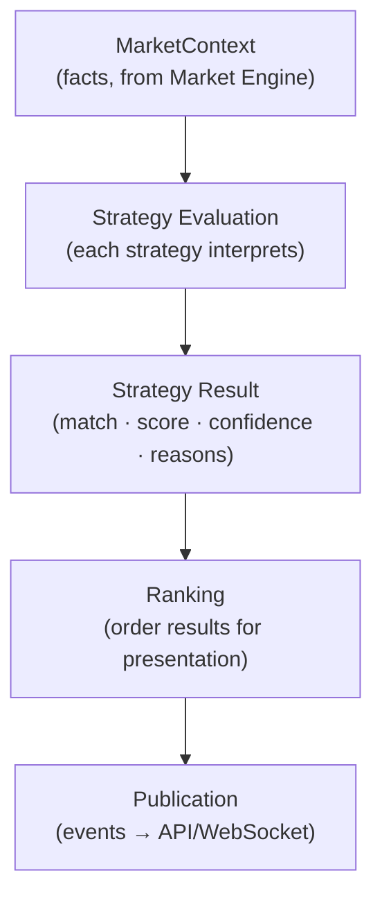
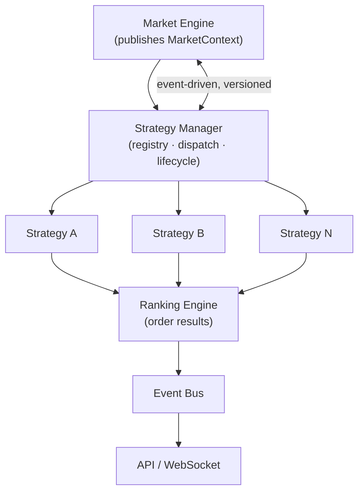
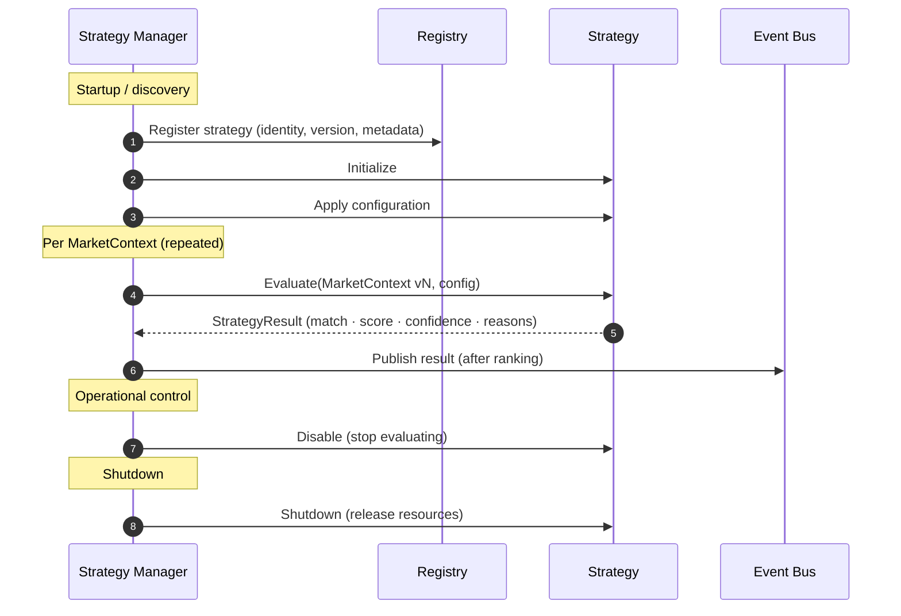
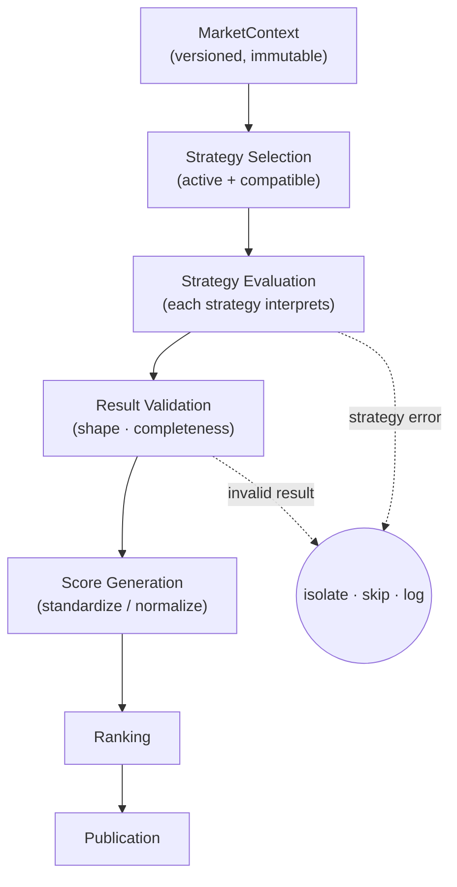
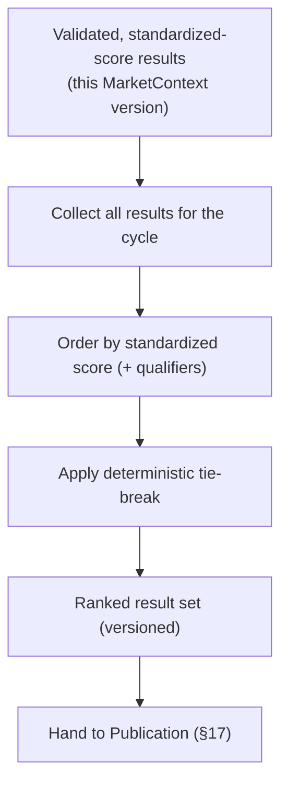
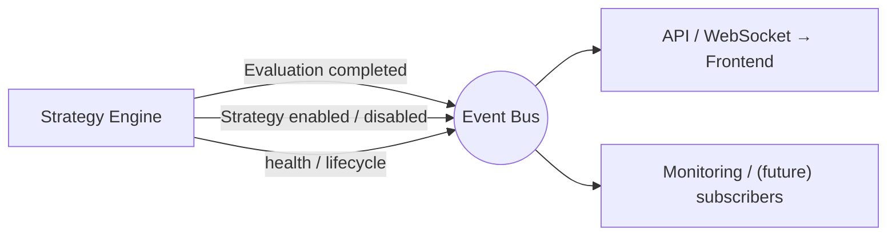
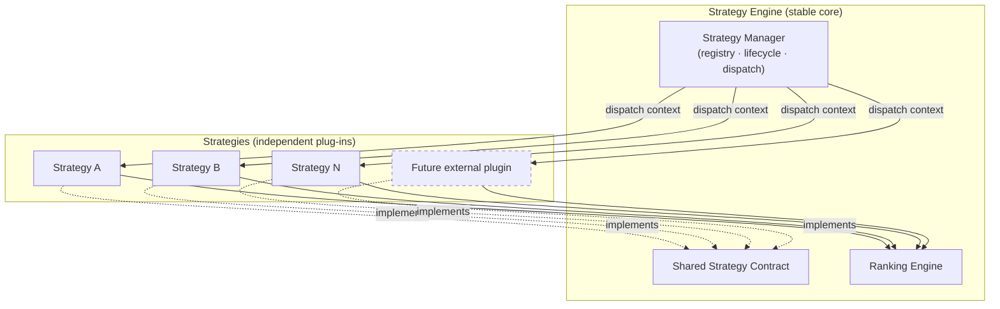

# ApexScan Strategy Engine — Part 1

> **Document status:** Official — **Strategy Engine Architecture (Part 1 of 2)**
> **Owner:** Quant Systems / Platform Architecture
> **Audience:** Backend Engineering, Quant Engineering, QA
> **Nature:** Architecture only. **No code, no Python, no SQL, no formulas, no
> trading rules, and no individual strategy logic** (no Open=High, no Narrow CPR,
> no indicator math). This document defines the *engine that runs strategies*,
> never how any strategy works.
> **Precedence:** Defines what the Strategy Engine owns. Derives from and obeys
> `01_SYSTEM_ARCHITECTURE.md` (§4.3–§4.4, §9 events) and consumes the
> **MarketContext** produced by `06_MARKET_ENGINE.md`. Where a lower-level choice
> conflicts with the master architecture, the master architecture wins.
> **Scope of Part 1:** Sections 1–10 (purpose → registration). Part 2 will cover
> the evaluation/dispatch loop, scoring & ranking in depth, result schema and
> events, isolation/fault tolerance, performance, testing, and the checklist.

---

## Table of Contents

1. [Executive Summary](#1-executive-summary)
2. [Strategy Engine Philosophy](#2-strategy-engine-philosophy)
3. [High-Level Architecture](#3-high-level-architecture)
4. [Core Responsibilities](#4-core-responsibilities)
5. [Strategy Lifecycle](#5-strategy-lifecycle)
6. [Strategy Manager](#6-strategy-manager)
7. [Strategy Interface](#7-strategy-interface)
8. [Strategy Categories](#8-strategy-categories)
9. [Strategy Registration](#9-strategy-registration)
10. [Part 1 Summary](#10-part-1-summary)

---

## 1 Executive Summary

### 1.1 Purpose
The Strategy Engine **consumes the MarketContext produced by the Market Engine
and evaluates independent strategies against it.** It turns *market intelligence*
(facts) into *strategy results* (interpretations) — the matches, scores, and
rankings that the dashboard ultimately displays.

It owns **strategy execution, scoring, ranking, and lifecycle** — and nothing
else. It never computes market features, never talks to brokers, and never owns
market data.

### 1.2 Why the Strategy Engine exists
The Market Engine deliberately stops at *facts* (`06` §1.1, §15). Something must
**interpret** those facts into actionable results — and do so for many
independent strategies, consistently, safely, and at scale. That is the Strategy
Engine's job: a dedicated home for the *interpretation* half of the platform,
cleanly separated from the *measurement* half.

### 1.3 Why it is separated from the Market Engine

| Market Engine | Strategy Engine |
|---------------|-----------------|
| Computes **facts** (features, context) | Interprets facts into **results** |
| One shared output for everyone | Many independent strategy verdicts |
| Deterministic, reusable, strategy-blind | Deterministic, pluggable, feature-blind (never re-derives data) |
| Never interprets | Never measures |
| Owns MarketContext | Owns strategy execution / scoring / ranking |

Separation means the two halves evolve independently: the engine can add
features without touching strategies, and strategies can be added/removed without
touching the engine (`01` §2.10, `06` §1.3).

### 1.4 Why a plugin architecture
Strategies are **plug-ins**. The platform is designed for 100+ of them, authored
and maintained independently, added by *addition* rather than by modifying the
core (`01` §2.8). A plugin model gives isolation, independent versioning, and a
path toward a future strategy marketplace (`00` §12).

### 1.5 Why deterministic
Given the **same MarketContext and the same configuration**, a strategy must
always produce the **same result.** Determinism makes results reproducible,
testable, and (in a future version) backtestable. It also depends on — and
inherits from — the Market Engine's determinism (`06` §1.4): identical facts in,
identical interpretations out.

### 1.6 Why broker independent
The Strategy Engine consumes **only** the MarketContext. It never sees a broker,
a broker SDK, or a raw feed — those stop two layers upstream at the Data Provider
(`05`). A strategy is therefore automatically broker-agnostic: it works
identically no matter where the underlying data originated.

> **📌 Architecture callout — Interpretation, not measurement.**
> The defining line: the Market Engine answers *"what is true about the market?"*;
> the Strategy Engine answers *"given those truths, what is interesting, and how
> much?"*. A strategy that computes its own features has crossed back into the
> engine's territory — and broken the separation this whole document protects.

---

## 2 Strategy Engine Philosophy

The engine is a **one-directional interpretation pipeline**: a MarketContext
enters, strategies evaluate it, results are scored and ranked, and the outcome is
published.

### 2.1 The stages

| Stage | Purpose | Output |
|-------|---------|--------|
| **MarketContext** | The complete, versioned, immutable set of market facts (`06` §6), received read-only. | (input) |
| **Strategy Evaluation** | Each active strategy independently interprets the same context. | Per-strategy raw outcomes |
| **Strategy Result** | A standardized result: whether it matched, a score, a confidence, and the **reasons** (explainability). | Structured results |
| **Ranking** | Order/prioritise results for presentation (ordering only — not a trade recommendation). | Ranked result set |
| **Publication** | Emit results as events for the API/WebSocket layer to deliver. | Published events |

### 2.2 Facts vs. interpretation

> **📌 Architecture callout — The Market Engine computes facts; the Strategy Engine interprets facts.**
> This is the single most important idea in both `06` and this document. Facts
> (features, candles, session context) are neutral and shared. Interpretation
> (is this a match? how strong?) is strategy-specific and lives *only* here. The
> engine measures; strategies judge.

> **⚠️ Warning — Strategies read facts; they never rebuild them.**
> If a strategy recomputes a feature the Market Engine already provides, three
> things break: consistency (its version of the fact may differ from everyone
> else's), performance (work done 100× instead of once), and the architectural
> boundary. Strategies consume the MarketContext; they never re-derive market
> data.

---

## 3 High-Level Architecture

The Strategy Engine sits between the Market Engine and the API. The **Strategy
Manager** orchestrates a set of independent strategies, a **Ranking Engine**
orders their results, and results are published onto the event bus for delivery.

### 3.1 Responsibilities in the chain

| Component | Responsibility | Knows about |
|-----------|----------------|-------------|
| **Market Engine** | Produces and publishes the versioned MarketContext (`06`). | Facts only — not strategies |
| **Strategy Manager** | Owns the registry; dispatches context to active strategies; manages lifecycle; collects results. | The **strategy contract** — not any strategy's internals |
| **Individual Strategies** | Interpret the context; emit standardized results. | Only the context + their own config |
| **Ranking Engine** | Order/prioritise the collected results for presentation. | Result shape — not strategy internals |
| **Event Bus** | Carry published results to consumers (`03` §14). | Event contracts |
| **API / WebSocket** | Deliver results to the frontend (`03` §19, `04`). | Transport contracts |

> **📌 Architecture callout — The Manager knows the contract, not the code.**
> The Strategy Manager dispatches to strategies through a single shared
> **contract** (§7). It never knows what any strategy computes internally — only
> how to give it a context and receive a result. This is what lets the strategy
> count grow without the manager changing (`01` §4.3).

---

## 4 Core Responsibilities

What the Strategy Engine **owns**, in detail.

### 4.1 Strategy execution
The engine drives the **evaluation** of each active strategy against the current
MarketContext — dispatching the context, invoking the strategy through the shared
contract, and collecting its result. (The dispatch/evaluation loop internals are
Part 2.)

### 4.2 Strategy isolation
Each strategy runs **isolated** from every other. One strategy's behaviour,
state, or failure never affects another (`01` §4.4). Isolation is the guarantee
that makes running 100+ third-party-style plug-ins safe.

### 4.3 Strategy lifecycle
The engine owns each strategy's **lifecycle** — registration, initialization,
configuration, enable/disable, and shutdown (§5). Strategies do not manage their
own lifecycle; the manager does.

### 4.4 Strategy registration
The engine owns the **registry** of available strategies and how they are
discovered and registered (§9). Nothing runs that is not registered.

### 4.5 Strategy configuration
The engine owns **loading and supplying configuration** to strategies (per user,
per strategy — `02` §5–§6). A strategy receives its configuration; it does not
fetch it.

### 4.6 Result publication
The engine owns **publishing results** as events onto the shared bus (`03` §14),
for the API/WebSocket layer to deliver. Strategies produce results; the engine
publishes them.

### 4.7 Scoring ownership
The engine owns the **standardized scoring contract** — the common, comparable
shape every strategy's score takes — so results from different strategies can be
compared and ranked fairly. (The scoring model detail is Part 2; **no formulas
here**.)

### 4.8 Ranking ownership
The engine owns **ranking** — ordering results into the shape the dashboard
presents. Ranking is *presentation ordering*, not a trade recommendation
(consistent with `01` §9 Event 5).

### 4.9 Version compatibility
The engine owns **version compatibility** between strategies and the MarketContext
contract (`06` §21.5–§21.6): it ensures a strategy is evaluated only against a
context version it understands, and manages additive evolution.

### 4.10 Performance ownership
The engine owns the **performance of evaluation** — dispatching to many
strategies concurrently within the platform's latency budget (detail in Part 2).

### 4.11 What the Strategy Engine MUST NEVER own

> **⚠️ Warning — Strategy Engine prohibitions are absolute.**

- **Never compute market features** or re-derive market data (that is the Market
  Engine's, `06`).
- **Never own or mutate market data / MarketContext** — it is a read-only
  consumer.
- **Never communicate with brokers** or import a broker SDK (that stops at `05`).
- **Never place orders or interact with execution** (out of scope entirely).
- **Never contain shared market-data logic inside a strategy** — facts come from
  the context.
- **Never let one strategy affect another** (isolation).
- **Never persist except through repositories** (`03` §12).

> **📌 Architecture callout — Owns interpretation and orchestration, nothing upstream.**
> The engine's ownership starts at "here is a MarketContext" and ends at "here
> are ranked, published results." Everything before (data, features) belongs to
> `05`/`06`; everything after (delivery, rendering) belongs to `03`/`04`. Stay
> inside that band.

---

## 5 Strategy Lifecycle

A strategy moves through a defined lifecycle owned by the Strategy Manager. It is
**registered and initialised once**, **configured and evaluated many times**, and
eventually **disabled/shut down**.

### 5.1 Lifecycle stages

| Stage | What happens |
|-------|--------------|
| **Registration** | The strategy is added to the registry with its identity, version, and metadata (§9). |
| **Initialization** | The strategy is prepared for use (one-time setup, no market I/O). |
| **Configuration** | Its configuration is applied/updated (per user/strategy — §6, `02`). |
| **Evaluation** | The strategy interprets a MarketContext version and returns a result (repeated per context). |
| **Result creation** | The strategy emits a standardized StrategyResult (§7). |
| **Publication** | The manager ranks and publishes results as events (owned by the engine, not the strategy). |
| **Disable** | The strategy is deactivated — it stops being evaluated but remains registered. |
| **Shutdown** | The strategy releases resources during engine shutdown (aligns with `03` §7). |

> **📝 Note — Enable/disable is operational, not destructive.**
> Disabling a strategy stops its evaluation without unregistering it, so it can be
> re-enabled instantly. This is how a misbehaving or unwanted strategy is taken
> out of rotation safely (see fault isolation, Part 2).

> **⚠️ Warning — Initialization performs no market I/O.**
> A strategy must not fetch data, call a broker, or read the database during
> initialization (or ever). Everything it needs arrives via the MarketContext and
> its configuration. Initialization is pure setup only.

---

## 6 Strategy Manager

### 6.1 Purpose
The Strategy Manager is the **orchestrator** of the Strategy Engine. It owns the
registry and the lifecycle, dispatches MarketContext to active strategies, and
collects their results — all through the shared strategy contract, never through
strategy internals.

### 6.2 Responsibilities

| Responsibility | Description |
|----------------|-------------|
| **Registration** | Add strategies to the registry with identity/version/metadata (§9). |
| **Discovery** | Find available strategies to register (today: known plug-ins; future: dynamic discovery). |
| **Configuration loading** | Load and supply each strategy's configuration (per user/strategy). |
| **Enable / Disable** | Activate/deactivate strategies operationally without unregistering. |
| **Version compatibility** | Ensure a strategy is only evaluated against a MarketContext version it supports (§4.9). |
| **Dependency validation** | Verify a strategy's declared dependencies (e.g. required features/capabilities) are available before enabling it. |
| **Health monitoring** | Track per-strategy health (errors, timing) and act on misbehaviour (detail in Part 2). |
| **Result collection** | Gather results from all active strategies for a context (feeds ranking). |

### 6.3 Future plugin loading
Today strategies are known, registered plug-ins. The manager is the seam for
**future dynamic plugin loading** — discovering and registering strategies at
runtime (toward the marketplace vision, `00` §12) — added behind the same
registry/contract without changing strategies or the engine.

> **📌 Architecture callout — The Manager is the only thing that knows "all strategies."**
> Individual strategies know nothing about each other; the frontend and Market
> Engine know nothing about specific strategies. The Strategy Manager is the
> single place that holds the registry and orchestrates the set — the one-to-many
> hub that keeps everything else decoupled.

> **⚠️ Warning — Dependency validation gates enablement.**
> A strategy that declares it needs a feature/capability the MarketContext does
> not provide must not be enabled — enabling it would guarantee failures at
> evaluation. The manager validates dependencies *before* a strategy goes live,
> not after it starts erroring.

---

## 7 Strategy Interface

> Architecture only — the **conceptual contract**, not an interface definition or
> code. It describes *what a strategy receives and produces*, not *how*.

### 7.1 The contract, conceptually
Every strategy conforms to one shared contract: it is **given** a set of inputs
and is expected to **produce** a standardized result. The engine depends on this
contract; it never depends on a strategy's internals.

### 7.2 What every strategy receives (inputs)

| Input | Conceptual meaning |
|-------|--------------------|
| **MarketContext** | The complete, immutable, versioned set of market facts (`06` §6) — read-only. |
| **Configuration** | The strategy's current tunable parameters (per user/strategy). |
| **Metadata** | Contextual metadata about the evaluation (e.g. the instrument, the context version, timing). |

### 7.3 What every strategy produces (outputs)

| Output | Conceptual meaning |
|--------|--------------------|
| **StrategyResult** | The standardized outcome object — whether the strategy matched, plus the fields below. |
| **Score** | A standardized, comparable measure of how strongly the strategy matched (contract only; **no formula**). |
| **Confidence** | A standardized indication of how confident the strategy is in its result. |
| **Reasons** | The **explainability** payload — *why* it matched, expressed in terms of the facts it used (`00` objective O3). |
| **Metadata** | Result metadata (e.g. which context version it evaluated, which config). |
| **Execution statistics** | Standardized runtime stats (e.g. evaluation timing) for monitoring/health. |

### 7.4 Contract principles
- **Inputs are read-only.** A strategy never mutates the MarketContext or its
  configuration.
- **Outputs are standardized.** Every strategy's result takes the same shape, so
  results are comparable and rankable regardless of what the strategy computes.
- **Explainability is mandatory.** A result without *reasons* is incomplete —
  every match must carry why it matched (in terms of facts).
- **No I/O.** A strategy performs no market/broker/database I/O; it receives
  everything it needs.

> **📌 Architecture callout — The contract is the whole relationship.**
> The engine's entire knowledge of a strategy is: *give it (context, config,
> metadata); receive a (result, score, confidence, reasons, metadata, stats).*
> Because the contract is fixed and standardized, any strategy — today's three or
> a future hundredth — plugs in identically. Guard this contract like the broker
> adapter contract in `05`.

> **⚠️ Warning — A strategy that needs anything outside the contract is misdesigned.**
> If a strategy "needs" to call a broker, read the database, or recompute a
> feature, it is reaching outside its contract. The fix is to provide the needed
> *fact* in the MarketContext (a Market Engine concern), not to let the strategy
> break isolation.

---

## 8 Strategy Categories

Strategies are grouped into **conceptual categories** for organisation,
discovery, and (future) filtering. Categories describe *what family of market
behaviour a strategy is concerned with* — **not any trading rule.**

| Category | What it broadly concerns (conceptual only) |
|----------|--------------------------------------------|
| **Momentum** | Strategies concerned with the strength/persistence of movement. |
| **Breakout** | Strategies concerned with movement beyond established boundaries. |
| **Reversal** | Strategies concerned with potential changes in direction. |
| **Trend** | Strategies concerned with directional context over time. |
| **Range** | Strategies concerned with bounded, non-directional behaviour. |
| **Volatility** | Strategies concerned with variability of movement. |
| **Liquidity** | Strategies concerned with market depth/liquidity conditions. |
| **Opening Session** | Strategies concerned with opening-period behaviour. |
| **Volume** | Strategies concerned with traded-volume behaviour. |
| **Market Structure** | Strategies concerned with structural landmarks/levels. |

### 8.1 Why categories exist
- **Organisation:** with 100+ strategies, categories make the library navigable.
- **Discovery & filtering:** users and the dashboard can browse/filter by family.
- **Governance:** categories help reason about coverage and overlap across the
  library.
- **Configuration grouping:** related strategies can share configuration
  conventions.

> **📝 Note — Categories are labels, not logic.**
> A category is metadata describing a strategy's *family*. It defines **no rule,
> formula, or behaviour** — two strategies in the same category may work entirely
> differently. This document deliberately says nothing about how any category's
> strategies actually decide anything.

> **⚠️ Warning — This document defines no trading logic.**
> Per the document scope, no category above (nor any specific strategy such as
> Open=High or Narrow CPR) is described in terms of rules, thresholds, or
> formulas. Those belong to individual strategy specifications, authored
> separately, and are explicitly out of scope here.

---

## 9 Strategy Registration

Registration is how a strategy becomes **known and runnable**. Nothing is
evaluated that is not registered.

### 9.1 Registration process
A strategy is registered with the Strategy Manager's **registry** — declaring its
identity, version, dependencies, capabilities, and metadata — after which the
manager can configure, enable, and dispatch to it. Registration is a
**declaration**, not execution; registering a strategy does not run it.

### 9.2 What registration records

| Attribute | Purpose |
|-----------|---------|
| **Unique identifier** | A stable, unique identity for the strategy (used everywhere it is referenced). |
| **Version** | The strategy's version, for compatibility and evolution (§4.9). |
| **Dependencies** | What the strategy requires to run (e.g. specific features/capabilities in the MarketContext). |
| **Capabilities** | What the strategy provides / the category(ies) it belongs to (§8). |
| **Metadata** | Descriptive information (name, category, description) for discovery/display. |
| **Configuration ownership** | The definition of the strategy's configurable parameters and their defaults (owned per `02` §5–§6). |

### 9.3 Registration and configuration
Registration declares *what a strategy is and what it can be tuned by*;
**configuration** (values) is loaded and supplied separately by the manager (§6).
A strategy's *config schema/ownership* is part of registration; its *config
values* are runtime data (`02`).

### 9.4 Future plugin discovery
Registration is the seam for **future dynamic discovery**: strategies discovered
at runtime (e.g. from a plugin directory or marketplace) register through the
same path, with the same declared attributes — no change to the engine or to
existing strategies.

> **📌 Architecture callout — Register first, run later.**
> Registration and execution are distinct. A strategy is declared into the
> registry (identity, version, dependencies, capabilities) *before* it is ever
> configured or evaluated. This ordering is what lets the manager validate
> dependencies and version compatibility *before* a strategy goes live (§6).

> **⚠️ Warning — No off-registry strategies.**
> A strategy that is evaluated without being registered is invisible to
> dependency validation, version checks, and health monitoring — exactly the
> governance the registry provides. Every runnable strategy is registered first,
> with a unique identifier.

---

## 10 Part 1 Summary

Part 1 established **what the Strategy Engine is and what it owns**:

- **Purpose.** Consume the Market Engine's MarketContext and **interpret** those
  facts into strategy results — matches, scores, confidences, and reasons. It
  owns **execution, scoring, ranking, and lifecycle**, and nothing upstream.
- **Separation.** Cleanly split from the Market Engine: the engine *measures
  facts*; strategies *interpret facts*. Strategies never re-derive market data,
  never touch brokers, and never own market data.
- **Plugin architecture.** Strategies are isolated, independently versioned
  plug-ins, designed to scale to 100+ and toward a future marketplace — added by
  addition, never by modifying the core.
- **Deterministic & broker-independent.** Same context + same config ⇒ same
  result; strategies see only the MarketContext, so they are automatically
  broker-agnostic.
- **Strategy Manager.** The orchestrator — registry, discovery, configuration
  loading, enable/disable, version compatibility, dependency validation, health
  monitoring, and result collection — the one-to-many hub that keeps everything
  decoupled.
- **Contract, categories, registration.** A single standardized contract (context
  + config + metadata in; result + score + confidence + reasons + metadata +
  stats out); conceptual categories as organising labels (no logic); and a
  register-first-run-later model that gates enablement on dependency and version
  validation.

Throughout, **no trading rule, formula, or individual strategy's logic was
described** — by design. This document defines the *engine that runs strategies*,
not the strategies themselves.

> **📝 Note — This is Part 1.**
> Part 2 continues into the engine's runtime: the evaluation/dispatch loop, the
> scoring and ranking models in depth (still no formulas), the StrategyResult and
> event schema, strategy isolation and fault tolerance, performance and
> concurrency, testing/determinism, scalability, the non-negotiable rules, and
> the Strategy Engine architecture checklist.

---

*End of Part 1. All Strategy Engine implementation must conform to it and to
`01_SYSTEM_ARCHITECTURE.md`. Individual strategy specifications are authored
separately and are out of scope here. Part 2 continues below.*

---
---

# ApexScan Strategy Engine — Part 2

> **Continuation of the Strategy Engine Architecture.** Part 2 defines the
> **execution and result architecture** — the execution pipeline, the
> StrategyResult structure, scoring, ranking, configuration, dependencies, and
> event publication. It defines *how strategies are run and their results
> handled*, still **without any trading rule, formula, or individual strategy
> logic** (no Open=High, Open=Low, or Narrow CPR). Sections and numbering
> continue from Part 1; all rules from Part 1 (especially §4.11 prohibitions and
> §7 the contract) remain in force.

### Part 2 contents

11. [Strategy Execution Pipeline](#11-strategy-execution-pipeline)
12. [Strategy Result Architecture](#12-strategy-result-architecture)
13. [Scoring Architecture](#13-scoring-architecture)
14. [Ranking Engine](#14-ranking-engine)
15. [Strategy Configuration](#15-strategy-configuration)
16. [Strategy Dependencies](#16-strategy-dependencies)
17. [Strategy Event Publication](#17-strategy-event-publication)
18. [Part 2 Summary](#18-part-2-summary)

---

## 11 Strategy Execution Pipeline

The engine runs a **staged execution pipeline** each time a new MarketContext is
available. Like the Market Engine's pipeline, it is one-directional and
deterministic (Part 1 §1.5).

### 11.1 Stage-by-stage contract

| Stage | Purpose | Inputs | Outputs | Owner | Dependencies | Failure handling |
|-------|---------|--------|---------|-------|--------------|------------------|
| **Strategy Selection** | Choose which strategies evaluate this context (enabled **and** version/dependency-compatible). | MarketContext (version), registry | The active, compatible strategy set | Strategy Manager | Registry, version/dependency checks (§16) | Incompatible/disabled strategies are excluded, not errored |
| **Strategy Evaluation** | Each selected strategy interprets the context via the contract (§7). | MarketContext, config, metadata | Per-strategy raw results | Strategy Manager (drives); Strategy (computes) | Selection | A strategy error is **isolated**: skip it, log, continue others |
| **Result Validation** | Confirm each result is well-formed and complete (has required fields, reasons). | Raw results | Validated results | Strategy Engine | Evaluation | Malformed result rejected + logged; that strategy contributes nothing this cycle |
| **Score Generation** | Ensure each result's score/confidence is present and in the **standardized, comparable** form for ranking. | Validated results | Standardized-score results | Strategy Engine (standardizes); Strategy (owns the raw score, §13) | Validation | Missing/invalid score ⇒ result excluded from ranking, logged |
| **Ranking** | Order/prioritise results for presentation (§14). | Standardized results | Ranked result set | Ranking Engine | Score generation | Empty set ⇒ publish an empty/no-match result set (not an error) |
| **Publication** | Emit results as events for delivery (§17). | Ranked result set | Published events | Strategy Engine (publisher) | Ranking | Subscriber failures isolated; bounded retry for transient (`03` §16) |

> **📝 Note — Strategies own scores; the engine standardizes them.**
> A strategy computes its own score *inside* evaluation (§13). "Score Generation"
> as a pipeline stage does **not** re-score anything — it ensures the score is
> present, valid, and in the common normalized form so results from different
> strategies are comparable at ranking. Ownership stays with the strategy; the
> engine only standardizes representation.

> **⚠️ Warning — One strategy's failure never fails the pipeline.**
> If a strategy errors or returns an invalid result, it is isolated (skipped,
> logged) and the pipeline continues for every other strategy (Part 1 §4.2). The
> cycle still produces a valid, ranked, published result set from the strategies
> that succeeded. A single plug-in can never blank the scanner.

---

## 12 Strategy Result Architecture

> **This section is extremely important.**

The **StrategyResult** is the standardized product of a strategy evaluation — the
unit that ranking orders and that is ultimately delivered to the dashboard. It is
described here **conceptually**: what it holds and how it behaves, with **no
schema, interface, or implementation.**

### 12.1 Conceptual fields

| Field | Conceptual meaning |
|-------|--------------------|
| **Strategy Identity** | Which strategy produced this result (its unique identifier, Part 1 §9). |
| **Strategy Version** | The version of the strategy that evaluated (for reproducibility/compatibility). |
| **Evaluation Timestamp** | When the evaluation occurred (UTC internally — `02` §4). |
| **MarketContext Version** | The exact context version interpreted (ties the result to the facts it was based on, `06` §6.5). |
| **Score** | The standardized, comparable measure of match strength (contract only — **no formula**, §13). |
| **Confidence** | How confident the strategy is in the result (distinct from score, §13.4). |
| **Status** | The outcome state (e.g. matched / no-match / skipped / error) as a defined set of values. |
| **Reasons** | The **explainability** payload — *why* it matched, expressed in terms of the facts used (`00` O3). |
| **Metadata** | Descriptive context (instrument, category, config reference). |
| **Diagnostics** | Optional detail aiding debugging/analysis of the evaluation. |
| **Execution Statistics** | Standardized runtime stats (e.g. evaluation timing) for monitoring/health. |

### 12.2 Ownership
A StrategyResult is **produced by a strategy and owned by the Strategy Engine
once emitted.** The engine validates, standardizes, ranks, and publishes it. The
strategy does not publish, rank, or persist its own result — it returns it, and
the engine takes over.

### 12.3 Immutability philosophy
A StrategyResult is **immutable once produced.** It is a snapshot of one
strategy's interpretation of one context version at one moment. Downstream stages
(ranking, publication) and consumers **read** it; they never mutate it. A
correction is a **new** result for a **new** context version, never an edit to an
existing one — mirroring the MarketContext immutability it derives from (`06`
§6.5).

### 12.4 Version compatibility
Because a result records **both** its Strategy Version **and** the MarketContext
Version, it is fully self-describing: a consumer (or a future backtest) can always
tell *which strategy, at which version, interpreted which facts.* This is what
makes results reproducible and comparable across time and versions (Part 1 §4.9,
`06` §21.5).

> **📌 Architecture callout — Every result is traceable to its facts.**
> The pairing of Strategy Version + MarketContext Version + Reasons means no
> result is a black box: you can always answer *"which strategy produced this,
> from which version of the facts, and why?"*. Explainability and reproducibility
> are structural properties of the result, not optional extras.

> **⚠️ Warning — Never publish a result without reasons.**
> A match with a score but no *reasons* is unexplainable — it tells a trader
> *that* something matched but not *why*. Reasons are mandatory (Part 1 §7.4);
> Result Validation (§11) rejects a result that lacks them.

---

## 13 Scoring Architecture

> Architecture only. **No scoring formulas, thresholds, or calculations** appear
> here — those live inside individual strategy specifications, out of scope.

### 13.1 Purpose
Scoring lets results be **compared and ranked**. A score is a standardized,
comparable measure of *how strongly a strategy matched* — the input the Ranking
Engine (§14) orders by.

### 13.2 Why every strategy owns its own scoring model
Different strategies measure fundamentally different things; a single global
scoring formula could not be meaningful across all of them. Therefore **each
strategy owns its own scoring model** — it alone knows how to express the strength
of its own match. The engine does **not** impose a formula; it imposes a
**standardized representation** so scores are comparable.

### 13.3 Score normalization philosophy
Because strategies score in their own terms, the engine defines a **normalized,
common scale/representation** into which every strategy's score maps. Normalization
is about *comparability of representation*, not about dictating *how* a strategy
arrives at its score. (The normalization model detail is intentionally left to
implementation/Part 3 — **no formula here**.)

### 13.4 Confidence vs. Score

| | Score | Confidence |
|-|-------|------------|
| **Answers** | *How strongly* did this strategy match? | *How sure* is the strategy about it? |
| **Purpose** | Primary ranking input | Qualifies the score; may inform tie-breaks/filtering |
| **Owner** | The strategy (model), engine (representation) | The strategy |

Score and confidence are **distinct**: a strong match reported with low
confidence is different from a moderate match with high confidence. Keeping them
separate lets consumers reason about both.

### 13.5 Score versioning
A strategy's scoring model can evolve; because the StrategyResult records the
**Strategy Version** (§12), a score is always interpretable relative to the model
that produced it. Score-model changes are versioned, never silent.

### 13.6 Score ownership & future extensibility
- **Ownership:** the strategy owns its scoring model; the engine owns the
  standardized representation and the ranking that consumes it.
- **Future extensibility:** additional standardized qualifiers (beyond
  score/confidence) can be added to the result contract additively (§12) without
  changing existing strategies.

### 13.7 What scoring MUST NEVER depend on

> **⚠️ Warning — Scoring depends only on the MarketContext and configuration.**

- **Never** on another strategy's result (no cross-strategy coupling — Part 1
  §4.2).
- **Never** on ranking position (ranking consumes scores, not the reverse).
- **Never** on broker identity, raw feeds, or data the engine did not provide.
- **Never** on wall-clock/random/non-deterministic inputs (determinism, Part 1
  §1.5).
- **Never** on external I/O of any kind (a strategy performs no I/O, Part 1 §7.4).

> **📌 Architecture callout — Standardized shape, strategy-owned meaning.**
> The engine guarantees that all scores *look the same* (comparable); each
> strategy guarantees that its score *means something* for its own logic. This
> split is what lets 100+ heterogeneous strategies be ranked on one list without
> the engine ever knowing what any of them computes.

---

## 14 Ranking Engine

### 14.1 Purpose
The Ranking Engine **orders the collected results into the sequence the dashboard
presents.** Ranking is *presentation ordering* — it is **not** a trade
recommendation or a judgement of merit beyond the standardized score (Part 1
§4.8, `01` §9 Event 5).

### 14.2 Ranking lifecycle

### 14.3 Tie handling philosophy
When results share the same score, ties are broken by a **defined, deterministic
rule** (e.g. a stable secondary ordering) so the outcome is reproducible. Ties are
never broken randomly or by arrival order — that would make the ranked list
non-deterministic.

### 14.4 Deterministic ordering
Given the same set of results, ranking always produces the **same order.** This
inherits and preserves the determinism of the whole pipeline (Part 1 §1.5): same
context ⇒ same results ⇒ same ranking.

### 14.5 Ranking ownership & publication
- **Ownership:** the Ranking Engine owns ordering; it does **not** own scoring
  (strategies do, §13) and does **not** re-interpret results.
- **Publication:** the ranked, versioned set is handed to Publication (§17) to be
  emitted as events — ranking does not publish directly.

### 14.6 Future ranking policies
Alternative ordering **policies** (e.g. per-category ranking, user-weighted
ordering, multi-factor ordering that also considers confidence) can be introduced
as **pluggable policies** behind the same ranking stage — additively, without
changing strategies or scores.

> **📌 Architecture callout — Ranking orders; it never re-judges.**
> The Ranking Engine consumes standardized scores and orders them. It must not
> recompute or override a strategy's score, and it must not attach meaning beyond
> ordering. Ordering is mechanics; the *meaning* of a score is the strategy's.

> **⚠️ Warning — Ranking is not a buy list.**
> "Ranked #1" means *ordered first for display by standardized score* — not
> *"trade this."* Framing ranking as a recommendation would smuggle trading
> semantics into an engine that, by charter, makes no trading decisions (Part 1
> §4.11).

---

## 15 Strategy Configuration

Configuration is the **tuning surface** of a strategy — supplied to it, never
fetched by it (Part 1 §7). Configuration is *data* (`02` §5–§6), distinct from the
strategy's *code*.

| Concern | Architecture |
|---------|--------------|
| **Configuration ownership** | The engine owns loading and supplying config; the strategy owns *declaring* its configurable parameters/defaults at registration (Part 1 §9.3). |
| **Versioning** | Configuration is versioned alongside the strategy so a result can be tied to the exact config used. |
| **Validation** | Config is validated against the strategy's declared schema before use; invalid config is rejected (fail fast, `03` §16). |
| **Default configuration** | Every configurable parameter has a safe default, so a strategy is runnable without explicit tuning. |
| **Environment-specific configuration** | Config may differ per environment/user (dev vs prod, per-user tuning) via the standard configuration precedence (`03` §8.7). |
| **Strategy enable/disable** | Enablement state is part of operational configuration (Part 1 §5); toggling it is non-destructive. |
| **Runtime reload philosophy** | Configuration changes take effect through a defined reload path — applied to *subsequent* evaluations, never mutating an in-flight one (determinism preserved). |
| **Future remote configuration** | The config surface is the seam for a future central/remote configuration source, behind the same loading path (`03` §8.6). |

> **⚠️ Warning — A config change never mutates an in-flight evaluation.**
> Changing configuration mid-evaluation would make that evaluation
> non-reproducible. New configuration applies to the *next* evaluation cycle; the
> current one completes against the config it started with. Determinism is
> non-negotiable (Part 1 §1.5).

> **📌 Architecture callout — Config is supplied, declared, and validated — never self-fetched.**
> A strategy *declares* what it can be tuned by (registration), the engine
> *validates and supplies* the values, and the strategy simply *receives* them. A
> strategy that reaches out to load its own configuration has broken the contract
> and its isolation.

---

## 16 Strategy Dependencies

A strategy declares what it **needs** in order to run; the manager validates those
needs **before** enabling it (Part 1 §6.2). Dependencies make the "will this
strategy work?" question answerable up front, not at failure time.

| Dependency type | Meaning |
|-----------------|---------|
| **MarketContext dependencies** | The parts of the MarketContext the strategy requires (e.g. that a given context element is present). |
| **Feature dependencies** | The specific registered features (`06` §18) the strategy consumes. |
| **Configuration dependencies** | The configuration parameters the strategy requires to be set/valid. |
| **Version dependencies** | The MarketContext contract version (and feature versions) the strategy is compatible with (§12, `06` §21). |

### 16.1 Dependency validation
Before a strategy is enabled, the manager **validates its declared dependencies**
against what the platform actually provides (available features, context version,
config). A strategy whose dependencies are unmet is **not enabled** — enabling it
would guarantee evaluation-time failures (Part 1 §6, warning).

### 16.2 Optional vs. mandatory dependencies

| | Mandatory | Optional |
|-|-----------|----------|
| **If unmet** | The strategy cannot be enabled. | The strategy still runs, adapting to the absence. |
| **Purpose** | Guarantees the strategy has what it fundamentally needs. | Lets a strategy use extra facts when present without failing when absent. |

### 16.3 Failure handling
If a dependency becomes unavailable at runtime (e.g. a feature is temporarily
missing/marked unavailable — `06` §25), the strategy's evaluation for that cycle
is handled per its dependency policy: a missing **mandatory** dependency ⇒ the
strategy is skipped for that cycle (isolated, logged); a missing **optional**
dependency ⇒ the strategy proceeds without it.

### 16.4 Future dependency evolution
As features and the context contract evolve additively (`06` §27, §21.6), a
strategy's dependencies can be updated with new versions declared. Because
dependencies are explicit and validated, evolution is safe — incompatibilities are
caught at validation, not in production.

> **📌 Architecture callout — Declare dependencies; let the manager gate.**
> A strategy's honesty about what it needs is what lets the manager keep the
> running set healthy. Undeclared dependencies (a strategy that *assumes* a
> feature exists without declaring it) defeat validation and cause silent
> runtime failures. Declare everything you depend on.

---

## 17 Strategy Event Publication

The Strategy Engine hands off and signals state changes by **publishing events**
onto the shared backend event bus (`03` §14; `01` §9). It publishes; it does not
call consumers directly.

### 17.1 Published events

| Event | Meaning |
|-------|---------|
| **Evaluation completed** | A cycle's ranked, versioned result set is ready for delivery (the primary output event — feeds the WebSocket/API path). |
| **Strategy enabled** | A strategy has been activated and will now be evaluated. |
| **Strategy disabled** | A strategy has been deactivated and will no longer be evaluated. |
| *(system events)* | Lifecycle/health signals (e.g. strategy registered, strategy error/health change) for monitoring. |

### 17.2 Ownership
The engine **owns the events it produces** — their identity and payload intent are
its contract with consumers. It does **not** own what subscribers do with them.

### 17.3 Ordering guarantees
Result ordering is guaranteed **per instrument** (consistent with the MarketContext
per-instrument ordering, `06` §19.4): results for one instrument are published in
context-version order. There is **no** global cross-instrument ordering guarantee.

### 17.4 Versioning
Every published result event carries the **Strategy Version** and **MarketContext
Version** it relates to (§12), so consumers can reason about freshness/ordering and
ignore a superseded result.

### 17.5 Failure isolation
A subscriber that fails handling a published event fails **alone** — its error is
contained and logged; other subscribers and the engine are unaffected (`03`
§14.6). A failing consumer can never stall the engine's publishing.

### 17.6 Retry philosophy
Retries apply only to **transient, idempotent** delivery concerns, bounded with
backoff (`03` §16.4). The engine publishes, isolates failures, and moves on — it
does not retry indefinitely into a failing subscriber.

### 17.7 Relationship with the backend event bus
The engine is a **publisher on the shared event bus** (`03` §14) — it implements no
private messaging. This keeps it consistent with the platform's decoupling model
and lets a future **distributed** bus carry its events across processes with no
change to the engine (`01` §9, `06` §19.8).

> **📌 Architecture callout — Publish results, not commands.**
> The engine publishes *what happened* (an evaluation completed, a strategy was
> enabled) as facts for consumers to react to. It never publishes *commands*
> telling another component what to do — decoupling means consumers decide how to
> react, keeping the engine ignorant of, and independent from, its subscribers.

---

## 18 Part 2 Summary

Part 2 defined the **execution and result architecture** of the Strategy Engine:

| Concern | Essence |
|---------|---------|
| **Execution Pipeline** | A one-directional, deterministic sequence — select → evaluate → validate → standardize score → rank → publish — where a single strategy's failure is isolated and never fails the cycle. |
| **StrategyResult** | The standardized, **immutable**, self-describing product of an evaluation (identity, versions, score, confidence, status, **reasons**, metadata, diagnostics, stats) — traceable to the exact strategy and facts that produced it. |
| **Scoring** | Standardized *representation*, strategy-owned *meaning* — the engine imposes comparability, never a formula; scoring depends only on the MarketContext and config. |
| **Ranking** | Deterministic presentation ordering of standardized scores, with defined tie-breaking — it orders, it never re-judges, and it is never a buy list. |
| **Configuration** | Supplied, declared, validated, versioned tuning data — applied to the next cycle, never mutating an in-flight evaluation. |
| **Dependencies** | Explicitly declared and validated *before* enablement; mandatory vs optional; incompatibilities caught at validation, not in production. |
| **Event Publication** | Versioned result/lifecycle events on the shared bus, ordered per instrument, with isolated failures and bounded retries — publishing facts, never commands. |

Throughout, **no trading rule, formula, or individual strategy's logic was
described** — by design. Part 2 defines how strategies are *run and their results
handled*, never how any strategy *decides*.

> **📝 Note — This is Part 2.**
> Part 3 (final) will cover the remaining operational architecture: strategy
> isolation and fault tolerance in depth, performance and concurrency,
> observability, testing/determinism, scalability and the plugin/marketplace path,
> the non-negotiable rules, the Strategy Engine architecture checklist, and the
> Architecture Readiness Assessment.

---

*End of Part 2. All Strategy Engine implementation must conform to this document
and to `01_SYSTEM_ARCHITECTURE.md`. Part 3 (final) continues below.*

---
---

# ApexScan Strategy Engine — Part 3 (Final)

> **Final part of the Strategy Engine Architecture.** Part 3 covers the plugin
> model, fault tolerance, testing, observability, and scalability — and closes
> with the **non-negotiable rules**, a **compliance checklist**, and an
> **Architecture Readiness Assessment**. Sections and numbering continue from
> Part 2; all rules from Parts 1–2 remain in force. Still **no code, SQL,
> formulas, trading rules, or strategy implementations**.

### Part 3 contents

19. [Plugin Architecture](#19-plugin-architecture)
20. [Fault Tolerance](#20-fault-tolerance)
21. [Testing Philosophy](#21-testing-philosophy)
22. [Observability](#22-observability)
23. [Scalability & Future Evolution](#23-scalability--future-evolution)
24. [Non-Negotiable Architecture Rules](#24-non-negotiable-architecture-rules)
25. [Strategy Engine Architecture Checklist](#25-strategy-engine-architecture-checklist)
26. [Final Summary](#26-final-summary)

---

## 19 Plugin Architecture

### 19.1 Why a plugin architecture
Strategies are **plug-ins** so the library can grow to 100+ (and toward a
marketplace, `00` §12) by **addition**, never by editing the engine. Each
strategy is an independent unit conforming to the shared contract (Part 1 §7);
the engine orchestrates them without knowing their internals.

### 19.2 The plugin model

### 19.3 Plugin concerns

| Concern | Architecture |
|---------|--------------|
| **Strategy isolation** | Each plug-in runs isolated; no shared mutable state; one plug-in cannot affect another (Part 1 §4.2, §20). |
| **Independent deployment** | A strategy can be added/updated/removed independently of the engine and of other strategies. |
| **Version compatibility** | Each plug-in declares the contract/context versions it supports; the manager gates on it (Part 1 §4.9, §16). |
| **Strategy discovery** | Plug-ins are discovered and registered (today: known set; future: dynamic — §19.4). |
| **Registration lifecycle** | Register → validate → enable → evaluate → disable (Part 1 §5, §9). |
| **Dependency validation** | Declared dependencies are validated before enablement (§16). |
| **Capability declaration** | Each plug-in declares its category/capabilities (Part 1 §8, §9). |
| **Future external plugins** | Third-party/marketplace plug-ins load through the same contract and registry, sandboxed by the same isolation. |

### 19.4 Adding a new strategy

> **📌 Architecture callout — Adding a strategy must NOT require changes to the Strategy Engine.**
> A new strategy implements the shared contract, declares its identity, version,
> dependencies, and capabilities, and registers. The engine — its manager,
> dispatch, scoring standardization, and ranking — is **untouched**. If adding a
> strategy forces an engine change, the contract is too narrow or a boundary has
> leaked; fix the contract, not by special-casing the engine.

> **⚠️ Warning — External plug-ins are still sandboxed plug-ins.**
> A future marketplace does not relax any rule: an external strategy performs no
> I/O, mutates no context, cannot affect another strategy, and is subject to the
> same registration, dependency validation, isolation, and fault-tolerance
> guarantees. Untrusted code makes those guarantees *more* important, not less.

---

## 20 Fault Tolerance

The engine assumes strategies **will** misbehave — especially as the library
grows and (eventually) includes external plug-ins. Its stance: **isolate,
degrade gracefully, disable if necessary — never let one strategy affect
another** (extends Part 1 §4.2, `03` §16).

| Fault | Response |
|-------|----------|
| **Strategy failure (error during evaluation)** | Isolated: the strategy is skipped for that cycle, the error logged; all other strategies proceed (Part 2 §11). |
| **Configuration failure (invalid config)** | Rejected at validation (Part 2 §15); the strategy is not enabled / not evaluated with bad config. |
| **Dependency failure (unmet at runtime)** | Mandatory unmet ⇒ skip that cycle; optional unmet ⇒ proceed without it (§16.3). |
| **Evaluation timeout** | A strategy exceeding its time budget is cut off; its result is discarded for that cycle; repeated timeouts trigger disablement. |
| **Unexpected exception** | Caught at the engine boundary around each strategy; contained, logged, never propagated to the pipeline. |
| **Version mismatch** | A strategy incompatible with the current context/contract version is not selected for evaluation (Part 2 §11 selection). |
| **Partial engine degradation** | If some strategies fail, the engine still produces a valid, ranked, published result set from those that succeeded. |

### 20.1 Recovery, retry & graceful disablement
- **Failure isolation:** each strategy is evaluated inside a boundary that
  contains its failure — the blast radius is exactly one strategy, one cycle.
- **Recovery:** transient issues (e.g. a momentarily unavailable optional
  feature) resolve on the next cycle automatically.
- **Retry philosophy:** a *failed evaluation is not retried within the same
  cycle* — the next MarketContext brings a fresh evaluation. Retries apply only to
  transient **delivery/publication** (Part 2 §17.6), not to strategy logic.
- **Graceful disablement:** a strategy that fails repeatedly (errors/timeouts
  past a threshold) is **automatically disabled** — taken out of rotation without
  unregistering (Part 1 §5) — protecting the platform and surfacing the problem
  for investigation.

> **📌 Architecture callout — One failed strategy never affects another.**
> This is the guarantee that makes 100+ (eventually external) plug-ins safe. Each
> strategy runs behind a fault boundary; a crash, hang, or garbage result is
> contained to that strategy and that cycle. The result set is always produced
> from the survivors. If a failure in one strategy can perturb another, isolation
> is broken — treat it as a critical defect.

> **⚠️ Warning — A hanging strategy is as dangerous as a crashing one.**
> A strategy stuck in a long/infinite evaluation would stall the cycle if left
> unbounded. Evaluation timeouts are mandatory: a strategy that overruns its
> budget is cut off so the cycle completes for everyone else.

---

## 21 Testing Philosophy

Testing mirrors `03` §28 and `06` §26, with **contract, isolation, and
determinism** as first-class concerns for a plugin engine.

| Test type | Focus |
|-----------|-------|
| **Unit testing** | Individual engine components (selection, validation, standardization, ranking) in isolation. |
| **Strategy contract testing** | Every strategy honours the shared contract (Part 1 §7): correct inputs consumed, standardized result produced (behaviour, not formula). |
| **Strategy isolation testing** | A failing/misbehaving strategy provably does not affect others or the engine (§20). |
| **Configuration testing** | Valid config is accepted, invalid config rejected; defaults apply; reload affects only subsequent cycles (Part 2 §15). |
| **Dependency validation testing** | Strategies with unmet mandatory dependencies are not enabled; optional-missing strategies still run (§16). |
| **Historical replay testing** | Replaying recorded MarketContexts reproduces identical results — proves determinism (Part 1 §1.5). |
| **Regression testing** | A failing test precedes every fix; fixed behaviours stay fixed. |
| **Deterministic testing** | Same context + same config ⇒ identical result and identical ranking, asserted explicitly. |
| **Performance testing** | Evaluation latency/throughput across many strategies against budgets (§23, `06` §23). |
| **Stress testing** | Behaviour with a large strategy count and/or misbehaving plug-ins (timeouts, errors, garbage results). |
| **Compatibility testing** | Strategies remain compatible across additive context/contract version changes (Part 2 §12.4, §16.4). |

### 21.1 CI philosophy
- **Guardrails first:** lint, type-check, and tests run in CI; the build is
  **warning-free** before merge (project standards).
- **Contract tests per strategy:** every strategy ships with contract + isolation
  tests — the safeguard that lets new plug-ins be added confidently (§19).
- **Determinism asserted:** replay/determinism tests run in CI so a change that
  breaks reproducibility is caught immediately.

> **📌 Architecture callout — Determinism is the testable superpower (again).**
> As with the Market Engine, determinism makes a recorded MarketContext a
> reproducible fixture: replay it and assert the exact results and ranking. This
> underpins regression testing and (future) backtesting — and only holds while
> strategies stay pure and deterministic (Part 1 §1.5, §7.4).

---

## 22 Observability

The engine is **observable** so operators can see the health of strategy
execution and the quality of its output (extends `03` §26, `06` §24).

| Signal | Role |
|--------|------|
| **Structured logging** | Structured, contextual logs for lifecycle, evaluations, isolated failures, and disablements (`03` §9). |
| **Strategy metrics** | Per-strategy counts (evaluations, matches, skips, errors). |
| **Evaluation latency** | Per-strategy and per-cycle evaluation timing against budget. |
| **Failure metrics** | Per-strategy error/timeout rates; feeds auto-disablement (§20). |
| **Health metrics** | Per-strategy health state (healthy / degraded / disabled). |
| **Score distribution monitoring** | The distribution of standardized scores over time — detects a strategy drifting or misbehaving. |
| **Ranking monitoring** | Characteristics of the ranked set (size, churn) to spot anomalies. |
| **Correlation IDs** | Thread an evaluation cycle across engine stages and downstream events (`03` §9.3, `06` §24). |
| **Tracing** | Trace a context version through selection → evaluation → ranking → publication; distributed tracing as a future step. |
| **Future dashboards** | Strategy-health, latency, and score-distribution dashboards, added operationally. |
| **Future alerting** | Alerts on error/timeout spikes, auto-disablements, latency budget breaches, or anomalous score/ranking behaviour. |

> **⚠️ Warning — Watch score distributions, not just errors.**
> A strategy that never errors but silently starts matching everything (or
> nothing) is broken in a way error counts won't reveal. Monitoring the
> *distribution* of scores/matches catches semantic drift that liveness checks
> miss.

---

## 23 Scalability & Future Evolution

The engine's promise, consistent with the rest of ApexScan: **growth is addition
at a seam, not surgery on the core.**

| Change | How it slots in | Core impact |
|--------|-----------------|-------------|
| **Add a strategy** | Implement the contract, register it (§19). | None |
| **Add a strategy category** | A new category label (Part 1 §8) in metadata. | None |
| **Add a scoring model** | A strategy adopts a new internal model; standardized representation unchanged (Part 2 §13). | None |
| **Add a ranking policy** | A new pluggable ranking policy behind the ranking stage (Part 2 §14.6). | None to strategies/scores |
| **Add a feature dependency** | A strategy declares a new (registered) feature dependency (§16, `06` §18). | None |
| **Distributed evaluation** | Shard strategies/instruments across engine instances over the shared bus. | Structural, along the isolation seam |
| **Cloud-native evolution** | Containers are the unit of deploy; scale out per instance. | None |
| **Plugin marketplace (future)** | External plug-ins load via the same contract/registry, sandboxed (§19). | None to the engine |
| **Backward compatibility** | Contract/result/context evolve additively and versioned (Part 2 §12.4). | None to existing strategies |

### 23.1 What should NEVER require architectural change
- Adding strategies, categories, scoring models, ranking policies, or feature
  dependencies.
- Scaling out to more strategies or more engine instances.
- Loading external/marketplace plug-ins.
- Additive evolution of the context/contract.

> **📌 Architecture callout — If growth forces a core change, a seam is wrong.**
> New strategies register; new scoring is strategy-internal; new ranking is a
> pluggable policy; new dependencies are declared. If any of these requires
> editing the manager, the contract, or the pipeline, the abstraction has leaked
> — fix the seam, not the core.

---

## 24 Non-Negotiable Architecture Rules

Mandatory and enforced in review. A change violating any one is rejected
regardless of how well it works.

| # | Rule |
|---|------|
| 1 | The Strategy Engine never computes market features or re-derives market data. |
| 2 | Strategies never communicate directly with brokers or import a broker SDK. |
| 3 | Strategies never mutate the MarketContext (read-only consumers). |
| 4 | The Strategy Engine never owns or writes market data. |
| 5 | The Strategy Engine never places orders or interacts with execution. |
| 6 | StrategyResult is immutable after it is produced/published. |
| 7 | All strategy events are versioned. |
| 8 | Ranking never changes or overrides a strategy's score. |
| 9 | One strategy's failure never blocks or affects another strategy. |
| 10 | Configuration changes never affect an in-flight evaluation. |
| 11 | Strategy logic is deterministic: same context + config ⇒ same result. |
| 12 | Every strategy performs no I/O (no market/broker/database/network calls). |
| 13 | Every strategy is registered before it can be evaluated. |
| 14 | Every strategy has a unique, stable identifier. |
| 15 | A strategy's declared dependencies are validated before it is enabled. |
| 16 | A strategy is evaluated only against a context version it supports. |
| 17 | Every StrategyResult records its Strategy Version and MarketContext Version. |
| 18 | Every match carries explainable **reasons**; a result without reasons is invalid. |
| 19 | Each strategy owns its own scoring model; the engine owns only representation. |
| 20 | Scoring depends only on the MarketContext and configuration. |
| 21 | Scoring never depends on another strategy's result or on ranking position. |
| 22 | Ranking is deterministic, with defined tie-breaking. |
| 23 | Ranking is presentation ordering, never a trade recommendation. |
| 24 | The engine consumes MarketContext only via published, versioned events. |
| 25 | The engine publishes on the shared backend event bus, not a private one. |
| 26 | Evaluation is time-bounded; an overrunning strategy is cut off. |
| 27 | A repeatedly-failing strategy is gracefully disabled, not left to misbehave. |
| 28 | Enable/disable is non-destructive (the strategy remains registered). |
| 29 | The Strategy Manager knows the contract, never a strategy's internals. |
| 30 | Adding a strategy requires no change to the Strategy Engine. |
| 31 | External/marketplace plug-ins are subject to the same rules and isolation. |
| 32 | Durable writes go only through repositories (never direct store access). |
| 33 | All timestamps are handled in UTC internally. |
| 34 | The contract/result/context evolves additively; breaking changes are versioned and migrated. |
| 35 | No strategy back-channels into the engine to influence context or ranking. |

> **⚠️ Warning — These are invariants, not preferences.**
> Any one being violated re-couples a strategy to a broker, breaks isolation or
> determinism, corrupts explainability, or lets the engine drift into trading
> decisions — undermining the platform. They are checked in every review.

---

## 25 Strategy Engine Architecture Checklist

Use this checklist to verify that any Strategy Engine implementation or pull
request complies with this architecture. A change is compliant only when every
**applicable** item is satisfied.

### Boundaries
- [ ] The engine computes no market features and re-derives no market data.
- [ ] Strategies import no broker SDK and name no broker.
- [ ] Strategies treat the MarketContext as read-only.
- [ ] The engine performs no order execution.
- [ ] The engine owns only execution, scoring, ranking, and lifecycle.
- [ ] No strategy back-channel into the engine exists.
- [ ] The engine consumes MarketContext only via versioned events.

### Strategy Manager
- [ ] The manager knows the contract, never a strategy's internals.
- [ ] The manager owns the registry and lifecycle.
- [ ] The manager selects only enabled, compatible strategies per cycle.
- [ ] The manager collects results from all active strategies.
- [ ] The manager validates dependencies before enabling a strategy.
- [ ] The manager monitors per-strategy health.

### Registration
- [ ] No strategy runs without being registered.
- [ ] Each strategy has a unique, stable identifier.
- [ ] Registration records identity, version, dependencies, capabilities, metadata.
- [ ] Registration is distinct from evaluation (register first, run later).
- [ ] Config schema/ownership is declared at registration.
- [ ] Future/dynamic discovery uses the same registration path.

### Lifecycle
- [ ] Lifecycle follows register → init → configure → evaluate → disable → shutdown.
- [ ] Initialization performs no market/broker/database I/O.
- [ ] Enable/disable is non-destructive (registration retained).
- [ ] Shutdown releases resources cleanly.
- [ ] Strategies do not manage their own lifecycle.

### Configuration
- [ ] Configuration is supplied to strategies, never self-fetched.
- [ ] Config is validated against the declared schema before use.
- [ ] Every parameter has a safe default.
- [ ] Config changes apply to the next cycle, never in-flight.
- [ ] Config is versioned and tied to results.
- [ ] Environment/user-specific config follows the standard precedence.

### Dependencies
- [ ] A strategy declares all dependencies it relies on.
- [ ] Dependencies are validated before enablement.
- [ ] Mandatory-unmet ⇒ strategy skipped/not enabled; optional-unmet ⇒ proceeds.
- [ ] Version dependencies gate evaluation against context/contract versions.
- [ ] Undeclared (assumed) dependencies are treated as a defect.

### StrategyResult
- [ ] Results are standardized in shape across all strategies.
- [ ] Results are immutable once produced.
- [ ] Each result records Strategy Version and MarketContext Version.
- [ ] Each match includes explainable reasons.
- [ ] Result validation rejects malformed/incomplete results.
- [ ] A corrected result is a new result, never an edit.

### Scoring
- [ ] Each strategy owns its own scoring model.
- [ ] The engine standardizes score representation for comparability.
- [ ] Score and confidence are distinct.
- [ ] Scoring depends only on MarketContext and configuration.
- [ ] Scoring never depends on other strategies or ranking position.
- [ ] Score-model changes are versioned (via Strategy Version).
- [ ] No scoring formula/threshold leaks into the engine spec.

### Ranking
- [ ] Ranking orders by standardized score, never re-scores.
- [ ] Ranking is deterministic with defined tie-breaking.
- [ ] Ranking is presentation ordering, not a trade recommendation.
- [ ] An empty result set publishes as no-match, not an error.
- [ ] New ranking policies are pluggable behind the ranking stage.

### Events
- [ ] The engine publishes "evaluation completed" and lifecycle events.
- [ ] Events are versioned (Strategy + MarketContext version).
- [ ] Result ordering is guaranteed per instrument.
- [ ] No global cross-instrument ordering is assumed.
- [ ] Subscriber failures are isolated from the engine.
- [ ] Publication retries are bounded and transient-only.
- [ ] The engine publishes on the shared backend event bus.

### Fault Tolerance
- [ ] A strategy error/exception is isolated to that strategy and cycle.
- [ ] One strategy's failure never affects another.
- [ ] Evaluation is time-bounded; overruns are cut off.
- [ ] Repeatedly-failing strategies are auto-disabled.
- [ ] Partial degradation still produces a valid ranked result set.
- [ ] Failed evaluations are not retried within the same cycle.

### Performance
- [ ] Strategies are evaluated concurrently within budget.
- [ ] No blocking calls run on the event loop.
- [ ] Evaluation latency is measured against budgets.
- [ ] The engine scales out via strategy/instrument sharding.
- [ ] Isolation is preserved under concurrency.

### Testing
- [ ] Every strategy has contract tests.
- [ ] Isolation is tested (a bad strategy can't affect others).
- [ ] Determinism is asserted via historical replay.
- [ ] Configuration and dependency validation are tested.
- [ ] Stress tests cover large strategy counts and misbehaving plug-ins.
- [ ] A failing test precedes every bug fix.

### Observability
- [ ] Structured logs cover lifecycle, evaluations, failures, disablements.
- [ ] Per-strategy metrics (evaluations, matches, errors, latency) are emitted.
- [ ] Score-distribution and ranking characteristics are monitored.
- [ ] Correlation IDs thread a cycle across stages and events.
- [ ] Failure/health metrics feed auto-disablement.

### Scalability
- [ ] Adding a strategy/category/scoring-model/ranking-policy needs no core change.
- [ ] Scale-out follows the isolation seam (sharding).
- [ ] External plug-ins load via the same contract/registry, sandboxed.
- [ ] Contract/result/context evolve additively and versioned.

### Determinism & Reproducibility
- [ ] Same MarketContext + same config produces an identical result (asserted).
- [ ] Same result set produces an identical ranking (deterministic ordering).
- [ ] No wall-clock/random/non-deterministic input affects a strategy's result.
- [ ] Replay of recorded contexts reproduces results and rankings exactly.
- [ ] Tie-breaking is deterministic and stable.
- [ ] Results are reproducible from their recorded Strategy + MarketContext versions.
- [ ] Determinism holds across engine restarts.

### Plugin Model
- [ ] A new strategy is added without any change to the engine.
- [ ] Every strategy implements the shared contract and nothing more.
- [ ] Strategies share no mutable state.
- [ ] External/marketplace plug-ins are sandboxed by the same isolation rules.
- [ ] Independent deployment of a strategy does not disturb others.
- [ ] Capability/category declarations are present for every plug-in.

### Documentation
- [ ] New strategies are documented and registered before use.
- [ ] Contract/result/scoring changes are recorded and versioned.
- [ ] This document is updated when engine ownership/behaviour changes.
- [ ] Cross-references to `01`, `02`, `03`, `06` remain accurate.

---

## 26 Final Summary

### 26.1 Why the Strategy Engine exists
To **interpret** the Market Engine's facts into strategy results — matches,
scores, confidences, and reasons — for many independent strategies,
consistently, safely, and at scale. It is the *decision-forming* half of the
platform, cleanly separated from the *measurement* half.

### 26.2 What it owns
Strategy execution; strategy isolation; the strategy registry and lifecycle;
configuration loading/supply; the standardized StrategyResult; the standardized
**scoring representation**; **ranking**; result/lifecycle **event publication**;
version compatibility; and the performance of evaluation.

### 26.3 What it never owns
Market features or market-data computation; the MarketContext (read-only);
broker communication; order execution; any strategy's internal scoring *formula*
(strategy-owned); and any trading rule or decision-to-act.

### 26.4 Relationship with the Market Engine
The Market Engine (`06`) is the **upstream** producer of MarketContext; the
Strategy Engine is its **read-only consumer**. The engine measures facts;
strategies interpret them. The handoff is via **versioned events**, and
strategies never call back into the Market Engine.

### 26.5 Relationship with the Backend
The engine lives inside the backend architecture (`03`): it publishes on the
**shared event bus**, persists only via **repositories**, runs **async-first**,
follows the **DI** and **configuration** models, and is **observable** —
inheriting all backend non-negotiables.

### 26.6 Relationship with the API layer
Published result events flow to the **API/WebSocket** layer (`03` §19), which
delivers ranked results to the frontend (`04`). The engine produces and
publishes; the API/transport delivers — the engine knows nothing about clients.

### 26.7 Long-term extensibility
New strategies, categories, scoring models, ranking policies, and feature
dependencies are **additions at seams**; scale-out follows **strategy
isolation**; external/marketplace plug-ins load via the same contract; the
contract/result/context evolve **additively and versioned**. None require
architectural change.

## Architecture Readiness Assessment

This specification is **sufficient to implement the Strategy Engine without
changing its architecture**, because it fixes — before any code — every decision
that would otherwise force a later redesign:

| Dimension | Why it is implementation-ready |
|-----------|-------------------------------|
| **Boundaries** | Inputs (read-only MarketContext + config), outputs (StrategyResult), and prohibitions (Part 1 §4.11, §24) are unambiguous — scope is closed. |
| **Contract** | The strategy contract (Part 1 §7) fully specifies what a strategy receives and produces, so strategies and the engine can be built independently against it. |
| **Result & scoring** | The StrategyResult (Part 2 §12) and the scoring split — standardized representation, strategy-owned meaning (Part 2 §13) — are defined without any formula, so quant and engine work proceed in parallel. |
| **Execution & ranking** | The pipeline (Part 2 §11), ranking (Part 2 §14), and fault model (§20) define how strategies are run, ordered, and contained end to end. |
| **Lifecycle & plugin model** | Registration, lifecycle, dependencies, and the plugin architecture (Part 1 §5–§9, §19) make "add a strategy without touching the engine" concrete and checkable. |
| **Integration** | Market Engine (§26.4), backend/event-bus (§26.5), and API (§26.6) relationships are pinned to existing, documented contracts. |
| **Operability** | Fault tolerance (§20), observability (§22), and performance (§23) define behaviour under real, adversarial conditions — not just the happy path. |
| **Evolution & governance** | Scalability (§23), the non-negotiable rules (§24), and the checklist (§25) ensure anticipated growth is additive and the invariants protecting isolation and determinism cannot erode. |
| **Verification** | Testing (§21) and the checklist (§25) give concrete, checkable conformance criteria. |

> **📌 Architecture callout — Ready to build, safe to grow.**
> A backend/quant engineer can implement the Strategy Engine directly from this
> specification, and a reviewer can verify conformance against §24 and §25. The
> architecture is designed so the engine can grow to hundreds of strategies —
> including future external plug-ins — **without changing its shape**, which is
> precisely the definition of an implementation-ready architecture.

---

*End of Part 3 and of the ApexScan Strategy Engine architecture document. Parts
1–3 together are the definitive Strategy Engine architecture specification,
maintained by Quant Systems / Platform Architecture. All Strategy Engine
implementation must conform to this document and to `01_SYSTEM_ARCHITECTURE.md`.
Individual strategy specifications — the actual trading logic — are authored
separately and remain entirely out of scope here.*
