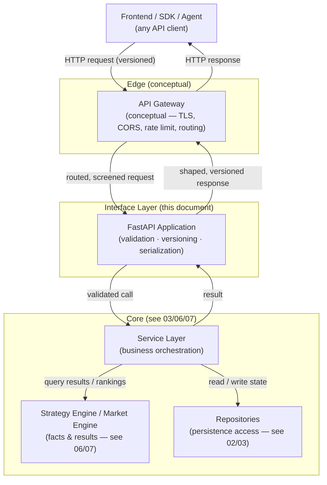
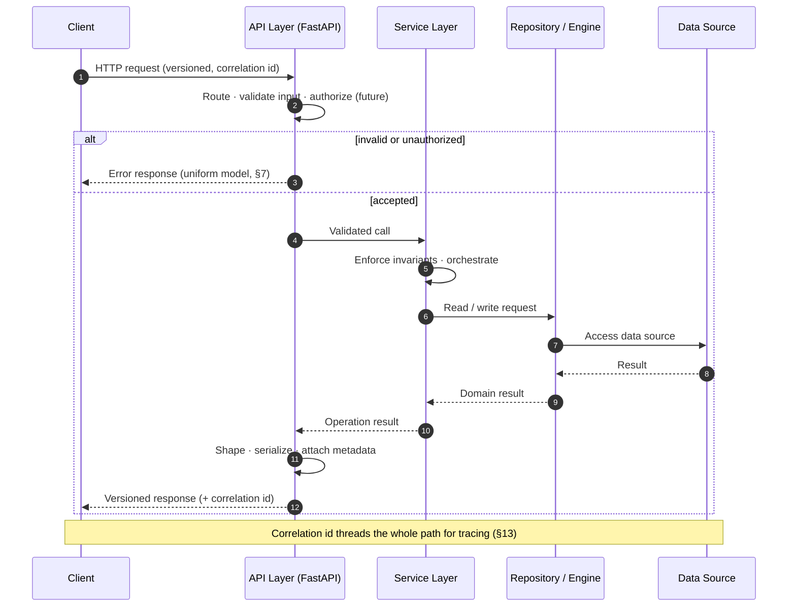

# 08 · API Specification

> **Official External API Architecture Specification**
> This document defines **what** ApexScan exposes over its HTTP API — the contract, its shape, its
> guarantees, and its evolution. It is an **architecture specification only**: no code, no FastAPI, no
> Python, no JSON schemas, no endpoint definitions, and no request/response examples. It describes the
> *contract and its principles*, never the implementation.

---

## Document Banner

| Field | Value |
|-------|-------|
| Document | `08_API_SPECIFICATION.md` |
| Title | External API Architecture Specification |
| Status | **Authoritative** — Phase 1 architecture baseline |
| Layer | API Contract (Interface Layer) |
| Owner | Platform / API |
| Upstream (implements) | `03_BACKEND_ARCHITECTURE.md` |
| Companion | `09_WEBSOCKET_FLOW.md` (real-time delivery) |
| Related | `01_SYSTEM_ARCHITECTURE.md`, `02_DATABASE_DESIGN.md`, `07_STRATEGY_ENGINE.md`, `04_FRONTEND_ARCHITECTURE.md` |

> **Division of responsibility — read this first.**
> - **This document (`08`)** describes **WHAT** is exposed: the contract, categories, principles, guarantees.
> - **`03_BACKEND_ARCHITECTURE.md`** describes **HOW** it is implemented: layers, services, repositories.
> - **`09_WEBSOCKET_FLOW.md`** describes **HOW real-time messaging works**: the push stream.
>
> This document must **never** duplicate implementation detail from `03`, nor the streaming model from
> `09`. Where the two meet, this document points to them.

---

## Mini Table of Contents

1. [Executive Summary](#1-executive-summary)
2. [API Architecture](#2-api-architecture)
3. [API Design Principles](#3-api-design-principles)
4. [Authentication Architecture](#4-authentication-architecture)
5. [API Categories](#5-api-categories)
6. [Request Lifecycle](#6-request-lifecycle)
7. [Error Handling](#7-error-handling)
8. [Versioning Strategy](#8-versioning-strategy)
9. [Pagination & Filtering](#9-pagination--filtering)
10. [Rate Limiting](#10-rate-limiting)
11. [Performance](#11-performance)
12. [Security](#12-security)
13. [Observability](#13-observability)
14. [Future Evolution](#14-future-evolution)
15. [Non-Negotiable Rules](#15-non-negotiable-rules)
16. [API Checklist](#16-api-checklist)
17. [Summary](#17-summary)

---

## 1. Executive Summary

The ApexScan HTTP API is the **stable, versioned, synchronous contract** through which clients read the
platform's state and change its configuration. It is the counterpart to the real-time stream: where the
WebSocket layer (`09`) delivers *live change*, the API delivers the *authoritative snapshot* and accepts
*intent to change*. Together they form a complete interface — **REST for the snapshot and commands,
WebSocket for the stream.**

### 1.1 Purpose

- Provide a **single, coherent contract** for every non-streaming interaction with the platform.
- Serve as the **seam of stability** between a fast-moving backend and any number of clients (the
  first-party frontend now; SDKs, integrations, and public consumers later).
- Guarantee that clients depend on **what is promised**, never on how it happens to be built today.

### 1.2 API Philosophy

The API is a **contract, not a window into the implementation**. Its shape is designed for the consumer,
not mirrored from the database or the service layer. Internal refactors, new engines, new brokers, and
new storage decisions must all be possible **without breaking the contract**. The API is the promise;
everything behind it is free to change.

### 1.3 REST Philosophy

ApexScan uses **resource-oriented, HTTP-native REST** for its synchronous surface:

- **Resources, not procedures** — the contract is organized around nouns (the things the system has),
  not verbs (the operations it performs).
- **HTTP as the protocol, not a tunnel** — HTTP methods, status codes, and headers carry their standard
  meanings; the API does not reinvent them inside payloads.
- **Uniform and predictable** — once a client learns the conventions, every resource behaves the same
  way (§3).
- **Snapshot-oriented** — REST returns the current authoritative state; continuous change is the
  WebSocket's job (`09`).

### 1.4 Versioning Philosophy

The contract is **explicitly versioned from day one** (§8). A version is a promise of stability:
within a major version, changes are **only additive and backward-compatible**. Breaking changes require
a new major version, an announced deprecation, and a sunset window. Clients are never surprised.

### 1.5 Why API-First

The API is designed **before** and **independently of** its implementation, for three reasons:

1. **Agent-native & multi-client by default.** Anything the UI can do, an agent or SDK must be able to
   do too — which is only true if the capability lives in the API, not in the frontend.
2. **Parallel development.** A stable contract lets frontend, integrations, and backend evolve
   independently against the same promise.
3. **Longevity.** The implementation will be rewritten many times over the platform's life; the
   contract should outlive each rewrite.

> **Architecture Callout.** API-first is the mechanism that makes the whole platform *agent-native*: if
> every outcome is reachable through the contract, then humans and agents have identical power. A
> capability that exists only in the UI is an architecture bug.

---

## 2. API Architecture

The API is a thin, well-guarded **interface layer** in front of the platform's services. It validates,
authorizes (future), routes, and shapes — it does not contain business logic.

### 2.1 Layer Responsibilities

| Layer | Responsibility | Explicitly **Not** Responsible For |
|-------|----------------|-------------------------------------|
| **Frontend / SDK / Agent** | Compose requests, render/consume responses | Business truth; it asks, it does not decide |
| **API Gateway (conceptual)** | TLS termination, CORS, rate limiting, routing, edge concerns | Business logic; it is a screen, not a brain |
| **FastAPI application** | Input validation, versioning, authorization enforcement (future), (de)serialization, contract shaping | Computing facts or results; owning persistence |
| **Service layer** | Orchestrate business operations; enforce invariants | HTTP concerns; transport shape |
| **Strategy/Market engines** | Produce facts, results, rankings (docs 06/07) | Being called directly by clients |
| **Repositories** | Encapsulated persistence access (docs 02/03) | Being exposed in the contract |

> **Note — the API Gateway is conceptual in Phase 1.** Its responsibilities (TLS, CORS, routing, rate
> limiting) exist and are assigned, but they may be realized inside the application and/or a reverse
> proxy (see `10_DEPLOYMENT.md`) rather than a dedicated gateway product. Naming it as a concept keeps a
> clean seam for a real gateway later (§14).

> ⚠️ **The API layer holds no business logic.** It validates and shapes; the service layer decides. A
> rule computed in a request handler is a boundary violation. This mirrors the delivery layer's rule in
> `09`: *the interface transports intent and results, it does not author them.*

---

## 3. API Design Principles

Every resource in the contract obeys the same principles, so that learning one resource means
understanding all of them.

### 3.1 Consistency

- **Uniform naming, shapes, and conventions** across all resources.
- **Uniform errors** — one error model everywhere (§7), never per-resource variations.
- **Uniform metadata** — pagination, versioning, and correlation are expressed the same way everywhere.
- **Predictable semantics** — the same method means the same thing on every resource.

### 3.2 Idempotency

| Operation kind | Guarantee |
|----------------|-----------|
| Reads | Always idempotent and side-effect free. |
| Full replacement / deletion | Idempotent by definition — repeating yields the same end state. |
| State-changing creates/commands | Designed to be **safely retryable** so a client that retries after an uncertain failure does not cause duplication. |

> **Note.** Idempotency is what makes the retry philosophy (§7.5) safe. A client must be able to retry a
> timed-out request without fear.

### 3.3 Statelessness

Each request carries everything needed to serve it; the server keeps **no per-client session state**
between requests (Phase 1). This is what lets the API scale horizontally (any instance can serve any
request) and mirrors the stateless-Manager principle in `09`. Authentication state, when it arrives
(§4), will travel **in the request** (a token), not in server memory.

### 3.4 Pagination Philosophy

Large collections are **always** paginated; the API never returns an unbounded set. Pagination is a
first-class, uniform part of the contract, not an afterthought bolted onto some resources (§9).

### 3.5 Filtering Philosophy

Filtering **narrows** a well-defined collection along **declared, server-understood dimensions**. It is
not an arbitrary query language and never lets a client push executable logic to the server (the same
boundary the subscription model enforces in `09`).

### 3.6 Sorting Philosophy

Sorting orders a collection along **declared sortable dimensions** with an explicit, stable direction.
Where the platform has an authoritative order (e.g., a scanner's ranking owned by the Strategy Engine),
the API **preserves that order** and never silently re-sorts it — a direct parallel to the transport
rule in `09`.

### 3.7 Versioning

Versioning is a top-level design principle, not merely a mechanism: the contract is explicitly
versioned, and the version governs the compatibility promise (§8).

### 3.8 Backward Compatibility

Within a major version, the contract only grows. New optional fields, new resources, and new optional
parameters are additive and non-breaking. Existing fields never change meaning, type, or disappear
within a major version.

### 3.9 Error Consistency

There is exactly **one** error model (§7). Every failure — validation, business, system, rate limit —
is expressed through it, with a stable, machine-readable classification and a human-readable message.
Clients write their error handling once.

> **Architecture Callout — principles are cross-cutting law.** Consistency, idempotency, statelessness,
> and error uniformity are not per-endpoint choices. They are contract-wide invariants; a resource that
> breaks one breaks the contract.

---

## 4. Authentication Architecture

Authentication governs **who** is calling; authorization governs **what** they may do. Phase 1
establishes the boundaries and reserves the seams; the full model is a defined future.

### 4.1 Current State (Phase 1)

- **No authentication for local development.** The API is used by the trusted first-party frontend on a
  trusted origin/network. Access control relies on **origin/CORS** (§12) and network placement, not on
  user identity.
- This is a **deliberate, documented Phase 1 decision**, not an omission. Every part of the contract
  that will later be identity-scoped is designed so identity can be added **without reshaping it**.

> ⚠️ **The unauthenticated state is local-development only.** Any deployment beyond a trusted local
> environment MUST enable authentication before exposure. This is a release gate, not a preference.

### 4.2 Future Authentication

The target model layers three complementary mechanisms:

| Mechanism | Role in the target model |
|-----------|---------------------------|
| **JWT** | Primary mechanism for interactive/session clients: a signed, expiring token presented per request; stateless (§3.3); the same identity re-validated on the WebSocket handshake (`09` §12). |
| **OAuth** | Delegated authorization for third-party and future public clients — issuing scoped tokens without sharing credentials. |
| **API Keys** | Machine-to-machine access for SDKs, integrations, and automation where an interactive login is inappropriate. |

### 4.3 Authorization — Role-Based Access & Permission Model

- **Role-based access control (RBAC)** assigns each identity one or more roles (e.g., viewer, operator,
  administrator — illustrative, not exhaustive).
- The **permission model** maps roles to allowed operations on resource categories (§5). Read-only
  consumers, configuration operators, and administrators are separated.
- **Enforced at the interface layer, before the service is called** — an unauthorized request never
  reaches business logic. This mirrors `09`'s rule that authorization is enforced at subscription time,
  not delivery time.
- **Least privilege** is the default: a role receives the minimum permissions its function requires
  (§12.5).

> **Note.** Authentication and authorization are **reserved seams** in Phase 1: the contract carries a
> defined place for credentials and a defined mapping of categories to permissions, so enabling them is
> configuration and enforcement, not a redesign.

---

## 5. API Categories

The contract is organized into **conceptual categories** — coherent areas of capability. This section
names the categories and their intent. It **does not define endpoints, paths, methods, or payloads**;
those live in the generated, versioned reference produced from the running contract, not in this
architecture document.

| Category | Intent | Nature | Status |
|----------|--------|--------|--------|
| **Health** | Liveness/readiness of the service and its dependencies | Read | ✅ Phase 1 |
| **System** | Platform metadata, version, capabilities, operational status | Read | ✅ Phase 1 |
| **Scanner** | Retrieve scanner result sets and their authoritative rankings | Read | ✅ Phase 1 |
| **Strategy** | Discover available strategies, their metadata and categories (see `07`) | Read | ✅ Phase 1 |
| **Configuration** | Read and change scanner/strategy configuration | Read + Write | ✅ Phase 1 |
| **Historical Data** | Retrieve historical/derived data snapshots | Read | ✅ Phase 1 |
| **Settings** | User/workspace preferences and view state | Read + Write | ✅ Phase 1 |
| **Administration** | Operational control and management actions | Read + Write (privileged) | 🟡 Guarded by future RBAC |
| **Paper Trading** | Simulated order/position management | Read + Write | 🔵 **Future** |
| **Live Trading** | Real order/position management against a broker | Read + Write (highly privileged) | 🔵 **Future** |

### 5.1 Category Principles

- **Categories are conceptual groupings, not URL prefixes.** They organize capability and permissions;
  they do not dictate the wire layout.
- **Reads dominate Phase 1.** Most categories are read-only; the WebSocket keeps reads live (`09`).
- **Write categories are permission-gated** and, for trading (future), the most strongly guarded surface
  in the entire platform.
- **Trading categories are explicitly future.** They are named here so the contract and permission model
  reserve room for them, but no trading capability exists in Phase 1.

> ⚠️ **Future trading categories carry the highest risk in the platform.** When introduced, Live Trading
> requires the strongest authentication, the tightest RBAC, mandatory audit (§13), and explicit
> confirmation semantics. It is named now only to reserve its place — it is out of scope for Phase 1.

> **Note.** The concrete, per-version list of resources and operations belongs to the **living API
> reference generated from the contract**, kept in sync with each version. This document governs the
> *architecture* of that reference; it deliberately does not restate it.

---

## 6. Request Lifecycle

Every synchronous request flows through the same stages. The lifecycle is uniform regardless of
category; only the business step in the middle differs.

### 6.1 Stage Responsibilities

| Stage | What Happens | Owner |
|-------|--------------|-------|
| **Client** | Composes a versioned request; carries auth (future) and a correlation id | Caller |
| **API — route & screen** | Match route, validate input, enforce authorization, reject early on failure | API layer |
| **Service** | Orchestrate the business operation; enforce invariants | Service layer |
| **Repository / Engine** | Read/write persistent state or obtain facts/results | Persistence / engines |
| **Data source** | Return the underlying data | Storage |
| **API — shape & respond** | Serialize to the versioned contract shape, attach metadata, set status | API layer |

> **Architecture Callout — the API validates and shapes; the service decides.** The lifecycle makes the
> boundary visible: business truth is produced only in the service/engine stages; the API stages guard
> the door and format the answer.

---

## 7. Error Handling

Errors are part of the contract. A well-defined failure is as much a promise as a well-defined success.
All errors share **one uniform model** (§3.9) with a stable, machine-readable classification and a
human-readable message; the categories below are that classification's top level.

### 7.1 Validation Errors

- Raised when a request is **structurally or semantically malformed** — missing required inputs, wrong
  types, out-of-range values, unknown parameters.
- Detected **at the interface layer, before any business logic runs** (fail fast).
- The response identifies *what* was wrong and *where*, so the client can correct and retry.

### 7.2 Business Errors

- Raised when a request is well-formed but **violates a business rule or invariant** (e.g., referencing
  something that does not exist, or an operation not valid in the current state).
- Produced by the **service layer**, surfaced through the uniform model.
- Distinguished from validation errors because the fix is *different data or state*, not *a better-formed
  request*.

### 7.3 System Errors

- Raised on **internal or dependency failure** (storage unavailable, upstream engine fault).
- Surface a **safe, generic** message plus a correlation id (§13) — never internal details, stack
  traces, or secrets.
- Always **logged and counted** on the server for diagnosis.

### 7.4 Rate-Limiting Errors

- Raised when a client exceeds its allowance (§10).
- Communicate that the request was **throttled** and, conceptually, when the client may retry — so
  backoff is informed, not guesswork.

### 7.5 Retry Philosophy

| Error class | Client guidance |
|-------------|-----------------|
| Validation / business | **Do not retry unchanged** — fix the request or the state first. |
| Rate limiting | **Retry after backoff** per the throttle signal. |
| Transient system | **Retry with exponential backoff + jitter** — safe because state-changing operations are idempotent (§3.2). |
| Persistent system | **Stop and surface** — repeated failure is an incident, not a retry loop. |

> ⚠️ **Never leak internals in an error.** A system error returns a correlation id and a safe message,
> never a stack trace, query, secret, or internal identifier. Diagnosis happens through the correlated
> server log (§13), not through the client.

### 7.6 Versioning of Errors

The error model itself is **versioned with the API** (§8). Its classification is stable within a major
version so that client error handling written once keeps working — new error classes may be *added*, but
existing ones never change meaning within a major version.

---

## 8. Versioning Strategy

Versioning is the mechanism that lets the backend evolve without breaking clients.

### 8.1 URI Versioning

The API uses **explicit major-version-in-the-path** versioning (e.g., a `v1` segment). It is chosen for
being **visible, unambiguous, and cache/routing friendly**: the version is obvious in every request and
log line, and multiple major versions can be served side by side during a migration.

### 8.2 Backward Compatibility

Within a major version the contract is **additive only** (§3.8):

- New resources, optional fields, and optional parameters may be added.
- Existing fields never change type, meaning, or nullability, and are never removed.
- Default behaviour never changes in a way that would surprise an existing client.

### 8.3 Deprecation

- A capability slated for removal is **marked deprecated** while still functioning.
- Deprecation is **communicated in-band** (a deprecation signal on responses) and out-of-band (changelog
  / reference), so clients learn about it through normal operation.
- Deprecation **never** breaks anything on its own — it is a warning, not a removal.

### 8.4 Sunset Policy

| Stage | Meaning |
|-------|---------|
| **Active** | Fully supported. |
| **Deprecated** | Still works; a replacement exists; a removal date is announced. |
| **Sunset (announced)** | A firm end-of-life date is published with a migration path. |
| **Retired** | Removed; requests receive a clear, versioned error pointing to the successor. |

> ⚠️ **No silent breaking changes — ever.** A breaking change requires a **new major version**, an
> announced deprecation of the old one, and a sunset window. Changing behaviour inside an existing major
> version because it is "more correct" is forbidden.

---

## 9. Pagination & Filtering

Collections are shaped so that clients can retrieve exactly the slice they need, predictably, without
ever forcing the server to materialize an unbounded result.

### 9.1 Filtering

- Narrows a collection along **declared, documented dimensions** only.
- Filters are **combinable** with predictable, uniform semantics across resources.
- Filtering is **not** an arbitrary query language and never accepts client-supplied executable logic.

### 9.2 Sorting

- Orders results along **declared sortable dimensions** with an explicit, stable direction.
- Where an **authoritative order exists** (e.g., a scanner ranking from the Strategy Engine), it is the
  default and is **preserved, not recomputed** (§3.6).
- Sorting is **deterministic** — equal keys resolve by a stable tiebreaker so pages don't shuffle.

### 9.3 Searching

- Search is a **declared capability on searchable resources**, distinct from filtering: filtering selects
  by exact declared dimensions; search matches by text/relevance where the resource supports it.
- Search results are paginated like any other collection.

### 9.4 Cursor vs Offset

| Strategy | When it is the right tool |
|----------|---------------------------|
| **Cursor-based** | **Preferred** for large, changing, or ranked collections — stable under concurrent change, no page drift, efficient at depth. |
| **Offset-based** | Acceptable for **small, stable** collections where simple page numbers are convenient. |

> **Note.** Cursor pagination pairs naturally with the live model: REST returns a stable, cursored
> snapshot (`08`) and the WebSocket (`09`) keeps it current — the client never deep-pages a moving target.

### 9.5 Large-Result Philosophy

- **No endpoint ever returns an unbounded collection.** A maximum page size is always enforced.
- Clients express *how much* and *from where* explicitly; the server never guesses by dumping everything.
- Very large exports, if ever needed, are a **separate, deliberate capability** (async/streaming — §11,
  §14), never an accidental consequence of an unpaginated read.

---

## 10. Rate Limiting

Rate limiting protects the platform's availability and enforces fair use across clients.

### 10.1 Why

- **Protect availability** — no single client may exhaust shared capacity.
- **Contain abuse** — malicious or buggy clients are bounded before they cause harm.
- **Enforce fairness** — capacity is shared predictably among clients.
- **Signal, don't surprise** — throttled clients get a clear, actionable response (§7.4).

### 10.2 Future Implementation

Rate limiting is a **conceptual, reserved capability in Phase 1** (trusted local frontend), enforced at
the edge/gateway (§2) when the platform is exposed. The contract already defines the *throttled* error
class (§7.4) so enabling limits is enforcement, not a contract change.

### 10.3 Burst Handling

Limits are designed to **absorb legitimate bursts** while capping sustained abuse — a client making a
normal flurry of requests is not punished, but a client hammering continuously is. (A token-bucket-style
allowance is the intended shape — described conceptually, not implemented here.)

### 10.4 Fair Usage

- Limits are applied **per identity/client** (per API key or token in the future; per origin/peer in the
  interim), so one client cannot consume another's share.
- **Read and write** operations may carry different allowances, and **privileged/administrative**
  operations the tightest.
- Fair-usage policy is **observable** (§13): throttling is measured, so limits can be tuned against real
  behaviour rather than guesses.

---

## 11. Performance

Performance targets the **synchronous** surface; continuous low-latency change is the WebSocket's domain
(`09`).

### 11.1 Latency Targets

- Interactive reads have a **budgeted, tail-focused latency target** (p95/p99 matter more than the mean —
  a predictable ceiling beats a fast average with spikes).
- Writes acknowledge promptly; any heavy downstream effect propagates through the event stream (`09`)
  rather than blocking the response.

### 11.2 Caching Philosophy

| Layer | Role |
|-------|------|
| **HTTP caching** | Cacheable reads carry correct cache/validator semantics so clients and intermediaries avoid needless round-trips. |
| **Server-side cache (Redis)** | Hot, expensive-to-derive reads are cached server-side (see `03`), with correctness owned by the service layer. |
| **Never cache stale truth** | Caching never overrides the freshness guarantees clients rely on; the live stream (`09`) remains the source of *change*. |

### 11.3 Compression

Responses are **compressible** using standard HTTP negotiation, reducing payload size for large
collections without any change to the contract's shape.

### 11.4 Streaming

- The API's synchronous surface returns **bounded, paginated** results.
- **Continuous streaming of change is the WebSocket's job** (`09`), not the REST API's.
- Large one-off transfers (future bulk export — §14) would use a **deliberate streaming/async capability**,
  kept separate from ordinary reads.

### 11.5 Scalability

- **Statelessness (§3.3)** allows any instance to serve any request, so the API scales horizontally.
- **Pagination (§9)** bounds per-request work.
- **Caching (§11.2)** absorbs repeated hot reads.
- Together these make throughput a function of instance count, not of a single hot node.

> **Architecture Callout.** REST and WebSocket have **complementary performance roles**: REST is
> optimized for *bounded, cacheable snapshots and commands*; WebSocket for *continuous, low-latency
> change*. Neither should be pressed into the other's job.

---

## 12. Security

Security spans the transport, the request, and the platform's secrets. Phase 1 sets the baseline;
authentication/authorization (§4) is the primary reserved future control.

### 12.1 HTTPS / TLS

All exposed traffic is served over **TLS**; plaintext transport is not permitted outside a trusted local
loopback. TLS termination is an edge/gateway concern (§2, `10_DEPLOYMENT.md`).

### 12.2 CORS

Cross-origin access is restricted to an **explicit allow-list** of trusted frontend origins — the same
origin discipline the WebSocket handshake uses (`09` §12). Unknown origins are refused.

### 12.3 Input Validation

- **Every input is validated at the boundary**, before business logic (§6, §7.1).
- Validation **fails closed**: unknown fields, malformed values, and out-of-range inputs are rejected,
  never silently accepted or coerced by guesswork.

### 12.4 Secrets

- Secrets (broker credentials, tokens, keys) live in **environment/secret configuration**, never in the
  contract, never in a URL, never in a response, never in a log.
- Errors and logs are scrubbed so a secret can never leak through them (§7.3, §13).

### 12.5 Least Privilege

- Every actor (client, service, future role) receives the **minimum access** its function requires.
- Write and administrative capabilities are separated from read access and gated by the permission model
  (§4.3); trading capabilities (future) are the most tightly gated of all (§5.1).

### 12.6 Future Authentication

Full authentication and RBAC (§4.2, §4.3) are the primary security additions on the roadmap. Until then,
the API is confined to trusted local development (§4.1).

> ⚠️ **Security controls fail closed, everywhere.** Unknown origin, invalid input, missing authorization
> (once enabled), or an unrecognized version → **reject**. "Allow through just in case" is never the
> default. This is the same principle enforced in `09`.

---

## 13. Observability

Every request must be explainable after the fact. Observability is a contract-level commitment, not an
operational nicety.

### 13.1 Logging

- Every request is logged with method, route, version, status, latency, and correlation id — in
  **structured** form (see `03`).
- Logs are **scrubbed of secrets and PII** (§12.4).
- Errors log enough context to diagnose without exposing anything sensitive to the client.

### 13.2 Metrics

- **Request rate, error rate, and latency percentiles** (p50/p95/p99) per category/version — the classic
  RED signals.
- **Throttling, cache hit ratio, and payload sizes** to tune performance and fair use (§10, §11).

### 13.3 Tracing

Requests are **traceable across layers** (API → service → repository/engine → data source), so a slow or
failing request can be followed end to end. Tracing integrates with the backend's tracing model (`03`).

### 13.4 Correlation IDs

- A **correlation id** is attached to every request (accepted from the client or generated) and returned
  on the response (§6).
- The same id threads through logs, traces, and — where a request triggers downstream change — into the
  event/stream layer (`09`), so one identifier connects a synchronous call to its real-time consequences.

### 13.5 Health Endpoints

- The **Health** category (§5) exposes liveness and readiness so orchestrators and monitors can act on
  real status.
- Health checks reflect the **true** state of the service and its critical dependencies — never a static
  "OK" that lies about a degraded backend.

> **Architecture Callout — every guarantee is observable.** Each promise in this document (latency,
> error consistency, rate limiting, versioning) has a corresponding signal in §13. A guarantee with no
> metric is a guarantee that cannot be trusted.

---

## 14. Future Evolution

The contract is shaped so the following are **additions**, not rewrites. Each is out of scope for Phase 1
and marked **(future)**.

| Direction | What it adds | Why the current design accommodates it |
|-----------|--------------|------------------------------------------|
| **GraphQL (future)** | Flexible, client-shaped queries over the same domain | Domain lives in the service layer, not in REST; a GraphQL surface is an additional interface over the same core (§2). |
| **gRPC (future)** | Low-latency, strongly-typed service-to-service calls | The service layer is transport-agnostic; gRPC is another façade over it. |
| **Public APIs (future)** | External developer access | API-first + versioning + RBAC + rate limiting are already the prerequisites (§3, §4, §8, §10). |
| **SDKs (future)** | First-party client libraries | A stable, versioned contract is exactly what an SDK is generated against. |
| **Plugin APIs (future)** | Third-party extension surface | Mirrors the strategy plug-in model (`07`); a plugin API is a governed, versioned, permissioned contract. |
| **Bulk export / async jobs (future)** | Very large transfers | Kept separate from bounded reads (§9.5, §11.4) so ordinary reads stay predictable. |

> **Architecture Callout — one core, many façades.** Because business truth lives in the service and
> engine layers and the API is a thin interface (§2), new protocols (GraphQL, gRPC) and new audiences
> (public, SDK, plugin) are **new façades over the same core**, not new cores. This is the payoff of
> API-first (§1.5).

---

## 15. Non-Negotiable Rules

These rules are **binding**. A change that violates any of them is an architecture change requiring an
ADR, not an implementation detail.

| # | Rule |
|---|------|
| 1 | The API is a **contract**, designed for consumers — never a mirror of the database or service internals. |
| 2 | The API layer holds **no business logic**; it validates, authorizes, shapes — the service layer decides. |
| 3 | The API is **explicitly versioned** from day one via a major version in the path. |
| 4 | Within a major version the contract is **additive only**; no field ever changes meaning, type, or disappears. |
| 5 | Breaking changes require a **new major version**, an announced deprecation, and a sunset window. |
| 6 | There are **no silent breaking changes** — behaviour never changes inside an existing major version. |
| 7 | Every response conforms to **one uniform error model** with a stable, machine-readable classification. |
| 8 | Errors **never leak internals** — no stack traces, queries, secrets, or internal identifiers. |
| 9 | Reads are **always idempotent and side-effect free**. |
| 10 | State-changing operations are designed to be **safely retryable** (idempotent). |
| 11 | The API is **stateless**; no per-client session state is held between requests (Phase 1). |
| 12 | **Every collection is paginated**; no endpoint returns an unbounded result. |
| 13 | A **maximum page size** is always enforced. |
| 14 | Filtering/sorting/search operate on **declared dimensions only** — never client-supplied executable logic. |
| 15 | An **authoritative order** (e.g., a scanner ranking) is preserved, never silently re-sorted. |
| 16 | Pagination is **deterministic**; equal keys resolve by a stable tiebreaker. |
| 17 | **All inputs are validated at the boundary**, before business logic, and validation fails closed. |
| 18 | **Security controls fail closed** everywhere (origin, version, input, authorization). |
| 19 | All exposed traffic is served over **TLS**; plaintext is confined to trusted loopback. |
| 20 | **CORS** is restricted to an explicit allow-list of trusted origins. |
| 21 | **Secrets** never appear in the contract, URLs, responses, or logs. |
| 22 | **Least privilege** is the default for every actor and role. |
| 23 | Authentication (JWT/OAuth/API keys) and RBAC are **reserved seams** requiring no contract redesign. |
| 24 | The **unauthenticated state is local-development only** and is a release gate before any exposure. |
| 25 | Authorization (future) is enforced **at the interface layer, before the service is called**. |
| 26 | **Rate limiting** is a reserved edge capability; its throttled error class exists in the contract now. |
| 27 | Rate limits are applied **per identity/client** to guarantee fair usage. |
| 28 | Every request carries a **correlation id**, returned on the response and threaded through logs/traces. |
| 29 | Every guarantee in this document has a **corresponding observability signal**. |
| 30 | **Health checks reflect true state** — never a static "OK" that hides a degraded backend. |
| 31 | REST returns the **snapshot and accepts commands**; continuous change is the WebSocket's job (`09`). |
| 32 | The API **never streams continuous change**; bounded, paginated results only (bulk export is a separate future capability). |
| 33 | The concrete endpoint reference lives in the **generated, versioned reference**, not in this architecture document. |
| 34 | New protocols and audiences are **new façades over the same core**, never new cores. |
| 35 | **Trading categories are future** and, when added, are the most strongly authenticated, authorized, and audited surface in the platform. |
| 36 | This document defines **WHAT** is exposed; it never duplicates the **HOW** owned by `03` and `09`. |

---

## 16. API Checklist

Grouped by topic. Every box is an architectural commitment for the API contract.

### Contract & Design
- [ ] The API is designed as a consumer-facing contract, not a mirror of internals.
- [ ] Resource-oriented, HTTP-native REST conventions are used.
- [ ] HTTP methods, status codes, and headers carry standard meanings.
- [ ] Naming, shapes, and conventions are uniform across all resources.
- [ ] The API layer contains no business logic.
- [ ] The API is designed API-first, independent of implementation.
- [ ] Every UI-reachable outcome is reachable through the API (agent-native).

### Principles
- [ ] Reads are idempotent and side-effect free.
- [ ] State-changing operations are safely retryable.
- [ ] The API is stateless between requests (Phase 1).
- [ ] Pagination is a first-class, uniform concern.
- [ ] Filtering uses declared dimensions only.
- [ ] Sorting uses declared dimensions with stable direction.
- [ ] Backward compatibility is additive-only within a major version.
- [ ] There is exactly one error model across the whole contract.

### Architecture & Layering
- [ ] The frontend/SDK/agent composes requests only.
- [ ] The conceptual gateway owns TLS, CORS, routing, rate limiting.
- [ ] The API layer owns validation, versioning, serialization, authorization enforcement (future).
- [ ] The service layer owns orchestration and invariants.
- [ ] Repositories/engines own persistence and fact/result production.
- [ ] Clients never call the service, engine, or repository layers directly.

### Authentication & Authorization
- [ ] The Phase 1 unauthenticated state is documented and local-only.
- [ ] Authentication is a release gate before any exposure.
- [ ] JWT is the planned interactive mechanism.
- [ ] OAuth is the planned delegated mechanism.
- [ ] API keys are the planned machine-to-machine mechanism.
- [ ] RBAC maps roles to permitted operations by category.
- [ ] Authorization is enforced before the service is called.
- [ ] Least privilege is the default for every role.
- [ ] Auth/authz are reserved seams requiring no contract redesign.

### API Categories
- [ ] Categories are conceptual groupings, not URL prefixes.
- [ ] Health and System categories exist in Phase 1.
- [ ] Scanner and Strategy read categories exist in Phase 1.
- [ ] Configuration and Settings write categories exist in Phase 1.
- [ ] Historical Data read category exists in Phase 1.
- [ ] Administration is permission-gated.
- [ ] Paper Trading and Live Trading are explicitly future.
- [ ] Trading categories reserve the strongest guards.
- [ ] No endpoints/paths/payloads are defined in this document.

### Request Lifecycle
- [ ] Every request is routed, validated, and authorized (future) before business logic.
- [ ] Invalid/unauthorized requests are rejected early with the uniform error model.
- [ ] The service layer enforces invariants.
- [ ] Responses are shaped, serialized, and versioned uniformly.
- [ ] A correlation id threads the whole path.

### Error Handling
- [ ] Validation errors are detected at the boundary.
- [ ] Business errors are produced by the service layer.
- [ ] System errors return safe messages plus a correlation id.
- [ ] Rate-limiting errors communicate a throttle signal.
- [ ] Retry guidance differs by error class.
- [ ] Errors never leak internals.
- [ ] The error model is versioned and stable within a major version.

### Versioning
- [ ] The major version is explicit in the URI.
- [ ] Multiple major versions can be served side by side.
- [ ] Within a version, changes are additive and non-breaking.
- [ ] Deprecation is signalled in-band and out-of-band.
- [ ] A sunset policy with lifecycle stages is defined.
- [ ] Retired versions return a clear error pointing to the successor.

### Pagination, Filtering & Sorting
- [ ] No endpoint returns an unbounded collection.
- [ ] A maximum page size is always enforced.
- [ ] Filtering combines declared dimensions predictably.
- [ ] Sorting is deterministic with a stable tiebreaker.
- [ ] Authoritative orders are preserved, not recomputed.
- [ ] Search is a distinct, declared capability where supported.
- [ ] Cursor pagination is preferred for large/ranked/changing collections.
- [ ] Offset pagination is limited to small, stable collections.
- [ ] Large exports are a separate, deliberate future capability.

### Rate Limiting
- [ ] The rationale (availability, abuse, fairness) is defined.
- [ ] Rate limiting is a reserved edge capability for Phase 1.
- [ ] The throttled error class exists in the contract now.
- [ ] Bursts are absorbed while sustained abuse is capped.
- [ ] Limits are applied per identity/client.
- [ ] Read/write/privileged operations may carry different limits.
- [ ] Throttling is observable and tunable.

### Performance
- [ ] Latency targets are budgeted and tail-focused.
- [ ] Writes acknowledge promptly; heavy effects propagate via the stream.
- [ ] HTTP caching semantics are correct for cacheable reads.
- [ ] Server-side caching is owned by the service layer.
- [ ] Caching never serves stale truth.
- [ ] Responses are compressible via standard negotiation.
- [ ] The API returns bounded results; continuous change is the WebSocket's job.
- [ ] Statelessness enables horizontal scaling.

### Security
- [ ] All exposed traffic uses TLS.
- [ ] CORS is restricted to an allow-list.
- [ ] All inputs are validated and validation fails closed.
- [ ] Secrets never appear in contract, URLs, responses, or logs.
- [ ] Least privilege is enforced across actors.
- [ ] Security controls fail closed everywhere.
- [ ] Future authentication/RBAC is the primary planned control.

### Observability
- [ ] Every request is logged in structured, scrubbed form.
- [ ] RED metrics (rate, errors, duration) are captured per category/version.
- [ ] Throttling, cache-hit ratio, and payload sizes are measured.
- [ ] Requests are traceable across all layers.
- [ ] Correlation ids are attached and returned.
- [ ] Correlation ids thread into the event/stream layer.
- [ ] Health endpoints reflect true liveness/readiness.
- [ ] Every guarantee has a corresponding signal.

### Future Evolution
- [ ] GraphQL is accommodated as an additional façade.
- [ ] gRPC is accommodated over the same service layer.
- [ ] Public APIs are enabled by versioning + RBAC + rate limiting.
- [ ] SDKs are generated against the stable contract.
- [ ] Plugin APIs mirror the strategy plug-in model.
- [ ] Bulk/async export is kept separate from bounded reads.
- [ ] New protocols/audiences are façades, never new cores.

### Governance
- [ ] Every non-negotiable rule maps to a checklist item and/or signal.
- [ ] Changes violating a rule require an ADR.
- [ ] This document defines WHAT, never the HOW owned by 03 and 09.
- [ ] The concrete endpoint reference lives in the generated, versioned reference.
- [ ] This document is the authoritative source for API-contract architecture.

---

## 17. Summary

### 17.1 What This Document Is

`08_API_SPECIFICATION.md` defines the **external API contract** of ApexScan: a versioned,
resource-oriented, HTTP-native REST surface that returns authoritative snapshots and accepts intent to
change. It is the synchronous half of the platform's interface; the WebSocket layer (`09`) is the
real-time half. Together — **REST for the snapshot and commands, WebSocket for the stream** — they form
the complete client interface.

### 17.2 What It Owns and What It Never Owns

| Owns | Never Owns |
|------|------------|
| The contract's shape, categories, and conventions | Business logic (owned by the service layer, `03`) |
| Versioning, compatibility, deprecation, sunset | Fact/result production (owned by engines, `06`/`07`) |
| The uniform error model | Persistence detail (owned by repositories, `02`/`03`) |
| Pagination, filtering, sorting semantics | Continuous change delivery (owned by the WebSocket, `09`) |
| Auth/authz **seams** and the permission model | The concrete endpoint reference (generated per version) |
| Rate-limiting, security, and observability commitments | Implementation of any of the above |

### 17.3 Relationship to Adjacent Documents

- **Implemented by:** `03_BACKEND_ARCHITECTURE.md` (the HOW behind this contract).
- **Companion interface:** `09_WEBSOCKET_FLOW.md` (real-time delivery; the snapshot/stream split).
- **Feeds from:** `06_MARKET_ENGINE.md` and `07_STRATEGY_ENGINE.md` (the facts, results, and rankings
  the API exposes).
- **Persists via:** `02_DATABASE_DESIGN.md` (the state the API reads and writes).
- **Consumed by:** `04_FRONTEND_ARCHITECTURE.md` and future SDKs/agents.
- **Master:** `01_SYSTEM_ARCHITECTURE.md`.

### 17.4 Architecture Readiness Assessment

| Dimension | Status | Notes |
|-----------|--------|-------|
| Contract-first design & boundary clarity | ✅ Ready | §1–§2; API validates & shapes, service decides. |
| Design principles (consistency, idempotency, statelessness) | ✅ Ready | §3; contract-wide invariants. |
| Versioning & compatibility | ✅ Ready | §8; URI versioning, additive-only, sunset policy. |
| Error model | ✅ Ready | §7; one uniform model, no leakage. |
| Pagination / filtering / sorting | ✅ Ready | §9; bounded, deterministic, cursor-preferred. |
| API categories | ✅ Ready | §5; conceptual, trading reserved as future. |
| Performance strategy | ✅ Ready | §11; bounded/cacheable, REST/WS roles distinct. |
| Observability | ✅ Ready | §13; every guarantee has a signal. |
| Authentication & authorization | 🟡 Phase 1 baseline | §4, §12; local-only now, JWT/OAuth/keys + RBAC reserved (future). |
| Rate limiting | 🟡 Reserved | §10; throttled error class defined, enforcement at exposure. |
| Future evolution (GraphQL/gRPC/public/SDK/plugin) | ✅ Ready (path defined) | §14; one core, many façades. |

**Overall:** The API architecture is **ready to implement** as the Phase 1 baseline. The contract is
consumer-first, explicitly versioned, uniformly error-handled, bounded, observable, and secure by
default — with authentication, authorization, and rate limiting as **reserved seams** that turn on
through enforcement and configuration rather than redesign. Its growth path (GraphQL, gRPC, public APIs,
SDKs, plugin APIs, trading) is reachable by **extension**, provided every implementation upholds the
non-negotiable rules in §15.

---

*End of `08_API_SPECIFICATION.md` — Official External API Architecture Specification.*
