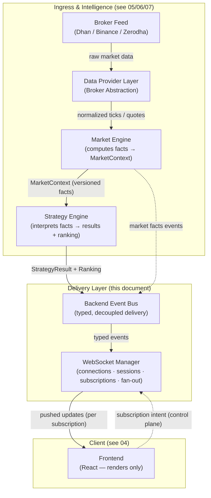
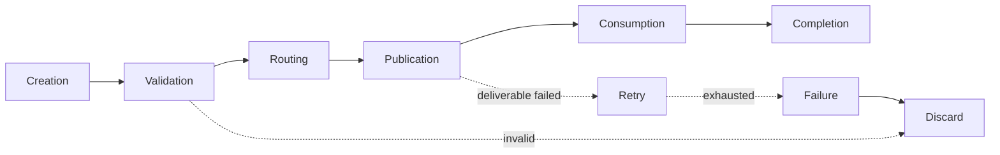
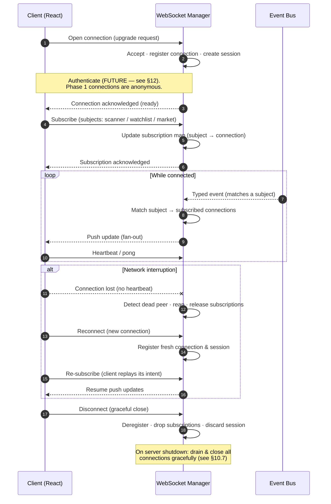
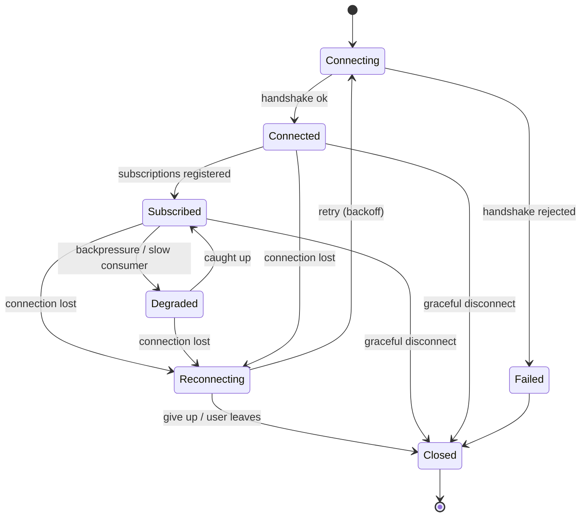

# 09 · WebSocket Flow

> **Official Real-Time Communication Architecture Specification**
> This document defines how information moves from the broker to the browser across ApexScan's
> event-driven pipeline. It is an **architecture specification only** — it contains no code, no
> message payloads, no endpoint definitions, and no implementation. It describes *responsibilities,
> guarantees, boundaries, and evolution*, not wire formats.

---

## Document Banner

| Field | Value |
|-------|-------|
| Document | `09_WEBSOCKET_FLOW.md` |
| Title | Real-Time Communication / WebSocket Flow Architecture |
| Status | **Authoritative** — Phase 1 architecture baseline |
| Layer | Transport & Fan-Out (Delivery Layer) |
| Owner | Platform / Real-Time Systems |
| Upstream | `05_DATA_PROVIDER.md`, `06_MARKET_ENGINE.md`, `07_STRATEGY_ENGINE.md`, `03_BACKEND_ARCHITECTURE.md` |
| Downstream | `04_FRONTEND_ARCHITECTURE.md` |
| Related | `01_SYSTEM_ARCHITECTURE.md` (§ Event Architecture) |

> **Architecture Principle — the one-line summary of this entire document:**
> **The real-time layer transports and fans out events. It never computes facts, never interprets
> them, never scores, and never re-ranks.** Every value that reaches the browser was already decided
> upstream. This layer is a *courier*, not an *author*.

---

## Mini Table of Contents

1. [Executive Summary](#1-executive-summary)
2. [Real-Time Philosophy](#2-real-time-philosophy)
3. [High-Level Architecture](#3-high-level-architecture)
4. [Event Lifecycle](#4-event-lifecycle)
5. [WebSocket Manager](#5-websocket-manager)
6. [Client Connection Lifecycle](#6-client-connection-lifecycle)
7. [Event Routing](#7-event-routing)
8. [Subscription Model](#8-subscription-model)
9. [Ordering Guarantees](#9-ordering-guarantees)
10. [Fault Tolerance](#10-fault-tolerance)
11. [Performance](#11-performance)
12. [Security](#12-security)
13. [Monitoring](#13-monitoring)
14. [Future Evolution](#14-future-evolution)
15. [Non-Negotiable Rules](#15-non-negotiable-rules)
16. [Architecture Checklist](#16-architecture-checklist)
17. [Summary](#17-summary)

---

## 1. Executive Summary

ApexScan is a real-time trading scanner. Its value is derived not merely from *what* it computes but
from *how quickly* a change in the market becomes a change on the operator's screen. A scanner that
tells the truth one minute late tells a lie. This document defines the delivery architecture that
carries market intelligence from the edge of the system (the broker feed) to the edge of the user
(the browser) with the lowest practical latency and the strongest practical guarantees.

### 1.1 Why WebSocket

The scanner's core interaction is **continuous observation**: the user opens a scanner view and
watches it update as the market moves. There is no request that maps to this interaction — the user
does not *ask* for each update; the system *volunteers* them. A request/response protocol (HTTP
polling) models this poorly:

| Concern | HTTP Polling | WebSocket (chosen) |
|---------|--------------|--------------------|
| Update model | Client asks repeatedly | Server pushes when data changes |
| Latency floor | Bounded by poll interval | Bounded by network + processing only |
| Wasted work | Every poll re-runs even when nothing changed | Zero traffic when nothing changes |
| Connection cost | New handshake per poll (or keep-alive churn) | One long-lived, upgraded connection |
| Fan-out | N clients × poll rate independent load | One event fanned to N subscribers |
| Ordering | No inherent session ordering | Ordered stream per connection |

WebSocket provides a **persistent, bidirectional, full-duplex** channel over a single upgraded
connection. It is the natural transport for a system whose defining characteristic is *pushed change*.

### 1.2 Why Event-Driven

Every meaningful thing that happens in ApexScan is a **discrete event**: a tick arrived, a market
context was recomputed, a strategy produced a result, a ranking changed, a component's health flipped.
An event-driven architecture lets each stage of the pipeline do exactly one job and then *announce*
that it is done, without knowing or caring who listens. The WebSocket layer is simply the **last
subscriber** in a chain of subscribers — the one whose audience happens to be human.

> **Note.** Event-driven design is defined in depth in `01_SYSTEM_ARCHITECTURE.md` (Event
> Architecture) and `03_BACKEND_ARCHITECTURE.md`. This document assumes that model and describes only
> the *delivery* end of it.

### 1.3 Why Push Architecture

Push is not an optimization here; it is the semantic model. The truth of the market lives upstream and
changes on its own schedule. A pull model forces the client to *guess* when to look. A push model
lets the system speak the moment it has something true to say, and stay silent otherwise. This yields
both **lower latency** (no poll interval to wait through) and **lower load** (no traffic when idle).

### 1.4 Why Low Latency

Latency is a first-class product requirement, not a tuning detail. The delivery layer is measured
end-to-end — from the instant an upstream event is published to the instant the browser renders it —
and every design choice in this document (single fan-out, no per-client recomputation, ordered
in-memory broadcast, bounded queues) exists to keep that number small and *predictable*. Predictability
matters as much as raw speed: a scanner with stable 40 ms delivery is more trustworthy than one that
averages 20 ms but spikes to 2 s under load.

> ⚠️ **Latency is a guarantee, not an average.** This layer is designed so that tail latency
> degrades *gracefully and observably* under load rather than silently. See §10 (Fault Tolerance)
> and §11 (Performance).

---

## 2. Real-Time Philosophy

The real-time system is a **one-directional river of facts** with a single tributary of control
(subscriptions) flowing back upstream. Data moves down; intent moves up; the two never mix
responsibilities.

```
Market Event
     │
     ▼
Market Engine        → transforms raw data into standardized market facts (MarketContext)
     │
     ▼
Strategy Engine      → interprets facts into strategy results + rankings
     │
     ▼
Event Bus            → decouples producers from consumers; carries typed events
     │
     ▼
WebSocket Manager    → owns connections, subscriptions, and fan-out
     │
     ▼
React Frontend       → renders; never computes; never re-orders
```

### 2.1 Stage Responsibilities

| Stage | Owns | Explicitly Does **Not** Own |
|-------|------|-----------------------------|
| **Market Event** | The raw, external truth: a tick, a quote, a bar boundary | Meaning, normalization, or decisions |
| **Market Engine** | Producing versioned market **facts** (MarketContext) | Signals, buy/sell decisions, ranking |
| **Strategy Engine** | Interpreting facts into **results** and **rankings** | Measuring the market; owning the transport |
| **Event Bus** | Decoupled, typed delivery between backend components | Business meaning of what it carries |
| **WebSocket Manager** | Connections, sessions, subscriptions, **fan-out** | Computing, scoring, filtering by opinion, re-ordering |
| **React Frontend** | Presentation, local view state, subscription intent | Truth; it renders what it is told |

### 2.2 The Two Golden Boundaries

Two boundaries are inherited from the engine documents and are **absolute** in this layer:

1. **The WebSocket layer transports facts; it does not create them.** If a value reaches the browser,
   some upstream authority already decided it. The delivery layer may *drop*, *coalesce*, or *batch*
   events for performance, but it may never *change their meaning*.
2. **Rank and version are decided upstream and preserved verbatim.** The Strategy Engine owns ranking;
   the Market Engine owns versioning. The transport carries these through untouched. Re-sorting on the
   way out is forbidden (see §9).

> **Note.** "The Market Engine computes facts, never decisions" and "the Strategy Engine interprets
> facts, never measures them" have a delivery-layer corollary: **"the transport moves results, never
> authors them."**

### 2.3 Direction of Flow

- **Downstream (server → client):** facts, results, rankings, health, system notices. High volume.
- **Upstream (client → server):** subscription intent only — "show me this scanner," "add this symbol
  to my watchlist," "stop sending me that." Low volume, control-plane only.

The upstream channel is deliberately **narrow**. Clients express *what they want to see*, never *what
the system should compute*. There is no client-supplied logic, no client-supplied query language that
runs on the server, and no client ability to trigger computation on demand in Phase 1.

---

## 3. High-Level Architecture

The end-to-end path from broker to browser. Each arrow is an event boundary; each box does one job.



> **Architecture Callout.** The Data Provider, Market Engine, and Strategy Engine are fully specified
> in documents 05, 06, and 07. They appear here only to establish where events *originate*. This
> document owns the **Delivery Layer**: the Event Bus contract as seen by the transport, and the
> WebSocket Manager in full.

### 3.1 Why the Event Bus Sits Between Engines and Transport

The Event Bus is a **decoupling seam**. Without it, the WebSocket Manager would have to know about the
Strategy Engine's internals, and the engines would have to know about connected clients. With it:

- Producers (engines) publish typed events and forget about them.
- The WebSocket Manager subscribes to the event *types* it cares about.
- New consumers (audit log, metrics sink, future persistence) can subscribe without touching producers.

In Phase 1 the Event Bus is realized in-process (and via Redis pub/sub for cross-worker fan-out — see
`03_BACKEND_ARCHITECTURE.md`). Its *contract* — typed, ordered-per-source, fire-and-forget — is stable
regardless of that realization, which is what allows §14's future migration to an external broker
without redesigning the transport.

---

## 4. Event Lifecycle

Every event that reaches a browser travels through a defined lifecycle. The lifecycle is the same
regardless of event type; only the payload's meaning differs.



### 4.1 Lifecycle Stages

| Stage | What Happens | Owner |
|-------|--------------|-------|
| **Creation** | An upstream authority (engine) produces a typed, self-describing event as the *output* of its own completed work. Events are created only from facts/results that already exist. | Producing engine |
| **Validation** | The event is checked for structural well-formedness and required identity/version fields **before** it enters the bus. Malformed events never propagate. | Producer / bus ingress |
| **Routing** | The event's type and subject determine which channels/topics it belongs to. Routing is a *classification*, not a computation of new data. | Event Bus |
| **Publication** | The event is placed on its channel(s). Publication is fire-and-forget from the producer's perspective. | Event Bus |
| **Consumption** | The WebSocket Manager (a subscriber) receives the event and matches it against active client subscriptions. | WebSocket Manager |
| **Completion** | The event is fanned out to all matching client connections and the delivery is considered done. | WebSocket Manager |
| **Retry** | For *deliverable transport* failures (e.g., a transient send hiccup), a bounded retry may apply within the connection's send path. | WebSocket Manager |
| **Discard** | Invalid, superseded, or undeliverable events are dropped deliberately and observably (counted, logged). | Any stage |
| **Failure** | A terminal state after retries are exhausted or a fault makes delivery impossible; recorded as a metric, never silently swallowed. | WebSocket Manager |

### 4.2 Discard Is a First-Class Outcome

In a real-time system, **dropping the right events is as important as delivering them.** Three legitimate
discard reasons:

1. **Superseded** — a newer version of the same subject exists; the stale one is worthless (see §9).
2. **Unsubscribed** — no connected client cares about this subject; there is nothing to deliver.
3. **Backpressure** — a slow client cannot keep up and coalescing/dropping is the correct degradation
   (see §10).

> ⚠️ **Discard must never be silent.** Every dropped event is a counted, categorized metric. A rising
> discard rate is a signal (slow clients, overload, or a stuck consumer), not noise to be hidden.

### 4.3 Retry Philosophy

Retry in this layer is **narrow and transport-local**. It applies to the act of *sending bytes to an
already-connected client*, not to re-deriving data. The delivery layer never retries by asking an
engine to recompute — if data is lost, the correct recovery is the **next fresh event**, not a replay
of the old one (see §9.5, Replay Philosophy). This keeps retry cheap and prevents stale data from being
resurrected.

---

## 5. WebSocket Manager

The WebSocket Manager is the single component that owns everything about live client connections. It is
the beating heart of the delivery layer.

### 5.1 Responsibilities

| Responsibility | Description |
|----------------|-------------|
| **Connection ownership** | Accept upgraded connections, track each one, and own its full lifecycle from handshake to teardown. |
| **Session ownership** | Associate each connection with a session (its identity, its subscription set, its health). |
| **Subscription management** | Maintain the mapping of *which connection wants which subjects* and update it as clients subscribe/unsubscribe. |
| **Consumption** | Subscribe to the Event Bus for the event types the frontend needs. |
| **Fan-out / broadcast** | For each consumed event, deliver it to exactly the connections whose subscriptions match — no more, no fewer. |
| **Health** | Track liveness of each connection (heartbeats), detect dead peers, reap them. |
| **Backpressure handling** | Detect slow consumers and apply the degradation policy (§10). |
| **Scaling coordination** | Cooperate with peer instances so a multi-worker/multi-node deployment fans out consistently (see §5.6, §11, §14). |

### 5.2 Connection Ownership

A connection is owned exclusively by the Manager instance that accepted it. That instance is
responsible for the connection's entire lifecycle: registering it, tracking its subscriptions, sending
to it, heartbeating it, and tearing it down. **No other component sends to a connection directly** —
all delivery goes through the Manager, which is the only place that knows a connection is alive.

### 5.3 Session Ownership

A **session** is the logical envelope around a connection: it holds identity (anonymous in Phase 1,
authenticated in the future — see §12), the connection's active subscription set, per-connection health
and backpressure state, and correlation identifiers used for tracing and monitoring. Sessions are
**ephemeral** in Phase 1: when the connection closes, the session is gone. There is no server-side
session persistence and no cross-reconnect session resumption in Phase 1 (a client re-establishes its
subscriptions on reconnect — see §6, §10).

### 5.4 Broadcast

Broadcast is the Manager's core operation: take one consumed event and deliver it to the set of
connections subscribed to its subject. The critical property is **single-derivation, many-delivery** —
the event's content is prepared once and the *same* content is delivered to every matching connection.
The Manager does **not** produce a different value per client; personalization is expressed purely
through *which* events a client is subscribed to, never through *recomputing* an event's content.

> **Architecture Callout — fan-out, not fan-compute.** The Manager multiplies *delivery*, not *work*.
> One event → N sends. It must never become one event → N computations.

### 5.5 Subscriptions

The Manager maintains a bidirectional view: for each connection, the subjects it wants; and for each
subject, the connections that want it. The second view (subject → connections) is what makes fan-out
efficient: on receiving an event the Manager looks up its subject and delivers to that set directly,
without scanning every connection. The subscription model itself is defined in §8.

### 5.6 Health & Scaling

- **Health.** Each connection is heartbeated. A connection that fails to respond within its liveness
  window is declared dead and reaped, freeing its resources and removing it from all subject sets.
- **Scaling.** In Phase 1 the backend may run multiple workers. Cross-worker fan-out is achieved by
  having every Manager instance subscribe to the shared Event Bus (Redis pub/sub), so an event
  published by any worker reaches the Manager instances holding the relevant connections. Horizontal
  scaling to multiple nodes and clustering are addressed in §11 and §14.

> ⚠️ **The Manager must remain stateless with respect to business data.** It holds *connection* state
> (who is connected, what they subscribed to) but never *market* state. It must be safe to lose a
> Manager instance: the connections it held simply reconnect elsewhere and re-subscribe. If losing a
> Manager loses truth, the boundary has been violated.

---

## 6. Client Connection Lifecycle

The full lifecycle of a single client connection, from handshake to shutdown, including reconnection.



### 6.1 Stage Notes

| Stage | Behaviour |
|-------|-----------|
| **Connect** | Client opens the upgraded connection; Manager accepts, registers, and creates an ephemeral session. |
| **Authenticate** | **Future.** Phase 1 connections are anonymous/trusted-origin only. The handshake has a reserved place for authentication (§12) so it can be added without redesign. |
| **Subscribe** | Client declares subscription intent (which scanner, which watchlist, which market subjects). Nothing is pushed until a subscription exists. |
| **Receive** | Manager pushes matching events as they occur. This is the steady state. |
| **Reconnect** | On connection loss the client establishes a new connection and **replays its subscription intent**. The server does not restore old subscriptions automatically in Phase 1. |
| **Disconnect** | Graceful close: the client tells the server it is leaving; the Manager deregisters and drops all its subscriptions. |
| **Shutdown** | On server shutdown, the Manager drains in-flight sends and closes all connections cleanly, signalling clients to reconnect (to another instance, in a scaled deployment). |

> **Note — the client owns its intent.** Because sessions are ephemeral (§5.3), the *client* is the
> durable record of what it wants to see. On any reconnect, the client re-declares its subscriptions.
> This keeps the server free of per-user persistent state in Phase 1 and makes reconnection trivial and
> correct.

---

## 7. Event Routing

Routing classifies each event by **type** and **subject**, then delivers it to the matching
subscriptions. The delivery layer recognizes a fixed taxonomy of event categories. Routing decides
*where an event goes*, never *what an event means*.

### 7.1 Event Categories

| Category | Origin | Subject (what a client subscribes to) | Purpose |
|----------|--------|----------------------------------------|---------|
| **Market events** | Market Engine | A market/instrument subject | Deliver standardized market **facts** (context updated). |
| **Strategy events** | Strategy Engine | A scanner / strategy subject | Deliver strategy **results** (a strategy produced an output). |
| **Ranking events** | Strategy Engine | A scanner subject | Deliver an **updated ranking** — the ordered result set for a scanner. |
| **Health events** | Backend components | A system/health subject | Deliver liveness/health changes of pipeline components. |
| **System events** | Platform | A broadcast/system subject | Deliver operational notices (maintenance, degraded mode, shutdown). |
| **Future events** | TBD | Reserved subjects | Personalized alerts, order/execution updates, and other Phase 2+ categories (see §14). |

### 7.2 Routing Rules

- **Type-first classification.** An event's category is intrinsic to it (set by its producer), not
  inferred by the transport.
- **Subject-based delivery.** Within a category, the event's subject determines which subscriptions
  match. A market event for one instrument is delivered only to connections subscribed to that
  instrument's subject.
- **No opinion in routing.** Routing never filters events by *quality*, *score*, or *importance* — that
  is upstream's job. It filters only by *subscription match*.
- **Unknown/unsubscribed subjects are dropped.** If no connection subscribes to an event's subject, the
  event is discarded at the Manager (counted, per §4.2). This is normal and expected.

> **Architecture Callout — routing is a switchboard, not an editor.** The router connects a caller to
> the right line. It does not decide whether the message is worth sending; upstream already decided
> that by producing the event.

### 7.3 Health & System Events Are Special

Health and system events are typically **broadcast** to all connected clients (or to an operational
subset) rather than routed by a market subject, because they describe the *platform*, not a market.
They allow the frontend to reflect degraded modes (e.g., "market data delayed," "reconnecting") truthfully
rather than pretending all is well. See §10 (graceful degradation) and §13 (monitoring).

---

## 8. Subscription Model

Subscriptions are the *only* control-plane input clients have. They express **what a client wants to
see**, and nothing else. A subscription never carries logic, a query to execute, or a request to compute.

### 8.1 Subscription Types

| Type | What the client is asking for | Notes |
|------|-------------------------------|-------|
| **Scanner subscription** | The live result set + ranking for a specific scanner | The primary interaction. Delivers strategy + ranking events for that scanner. |
| **Watchlist subscription** | Updates for a specific, user-curated set of instruments | Delivers market/strategy events scoped to those instruments. |
| **Market subscription** | Facts for a specific market/instrument subject | Delivers market-context events for that subject. |
| **Personalized subscription** | **Future.** Per-user tailored streams (alerts, saved views) | Requires identity (§12); reserved in the model now. |

### 8.2 Dynamic Subscription Changes

Subscriptions are **mutable during the life of a connection**. A client can add or remove subjects at
any time without reconnecting:

- **Add** — the Manager inserts the connection into the subject's delivery set; the client begins
  receiving matching events on the next event, not retroactively.
- **Remove** — the Manager removes the connection from the subject's set; delivery stops immediately.
- **Replace** — a view change (e.g., switching scanners) is an add of the new subjects and a remove of
  the old ones.

> **Note — subscriptions are forward-looking.** Subscribing to a subject means "send me changes from now
> on." It does not deliver history. The initial state of a view is obtained via the REST API (see
> `08_API_SPECIFICATION.md`); the WebSocket then keeps it live. This clean split — **REST for the
> snapshot, WebSocket for the stream** — is a deliberate architectural boundary.

### 8.3 Subscription Discipline

- A client receives **only** what it is subscribed to. There is no ambient "firehose" of all events.
- Subscriptions are **scoped to a connection**; they do not leak across connections or survive a
  reconnect (Phase 1).
- The server **validates** subscription requests against the known subject taxonomy and rejects
  unknown or malformed subjects rather than silently ignoring them.
- Subscription changes are **acknowledged**, so the client knows its intent was registered.

> ⚠️ **No client-defined computation.** A subscription selects among *existing* subjects. It can never
> instruct the server to compute a new metric, run a new strategy, or evaluate a custom expression.
> That would violate the boundary in §2.2 and move authorship into the transport.

---

## 9. Ordering Guarantees

Correctness in a streaming scanner depends on the client seeing a **consistent, monotonic** view of
each subject. This section defines what the delivery layer guarantees and — just as importantly — what
it does not.

### 9.1 Ordering

- **Per-connection ordering is preserved.** Bytes sent to a single connection are delivered in the
  order the Manager sent them. WebSocket provides this over a single connection.
- **Per-subject ordering is preserved along the pipeline.** Events about the same subject are produced
  in a well-defined order upstream (the Market Engine's determinism, the Strategy Engine's ordering —
  see docs 06/07) and the transport does not reorder them.
- **Cross-subject ordering is NOT guaranteed.** Events about *different* subjects may interleave in any
  order. Clients must never assume that an event for subject A that arrives before an event for subject
  B implies anything about their relative timing upstream.

### 9.2 Versioning

Every fact-bearing event carries the **version stamped by its upstream authority** (e.g., the
MarketContext version). The delivery layer **preserves the version verbatim** and never mints its own.
Versioning is what makes idempotency and duplicate-prevention possible on the client.

### 9.3 Idempotency

Events are designed to be **idempotently applied**: applying the same versioned event twice yields the
same client state as applying it once. This means a duplicate delivery is *safe*, not corrupting — a
critical property for a system that tolerates reconnection and at-least-once realities.

### 9.4 Duplicate Prevention & Supersession

- The client uses the **version** to reject stale or duplicate events: an event whose version is not
  newer than what the client already holds for that subject is discarded by the client.
- The Manager may **coalesce/supersede** on the server side: if a newer event for a subject is ready
  before an older one has been sent to a slow client, the older one may be dropped (§10 backpressure).
  Because the client applies the newest version anyway, this is correct, not lossy.

### 9.5 Replay Philosophy

> ⚠️ **The delivery layer does not replay history.** WebSocket carries the *live* stream only.

- There is **no event-replay buffer** in the transport in Phase 1. Recovery from a gap is achieved by
  the **next fresh event** plus, if needed, a REST snapshot to re-baseline (§8.2) — not by replaying old
  events.
- This is deliberate: replaying stale market data into a live scanner is worse than a brief gap. The
  freshest truth always wins.
- Durable event history, if ever needed, belongs to a persistence/broker layer (§14), not to the live
  transport.

### 9.6 Event Consistency

The guarantee the client can rely on is **eventual per-subject convergence to the latest version**:
however events interleave, drop, or duplicate across subjects, each subject on the client converges to
the newest version the server has for it. This is the strongest guarantee compatible with low latency
and graceful degradation, and it is sufficient for a scanner because the scanner's job is to reflect
*the current state of the market*, not to reconstruct its full history.

| Guarantee | Status |
|-----------|--------|
| Per-connection delivery order | **Guaranteed** |
| Per-subject upstream order preserved | **Guaranteed** (transport does not reorder) |
| Cross-subject ordering | **Not guaranteed** |
| Version preserved verbatim | **Guaranteed** |
| Idempotent application | **Guaranteed** (by event design) |
| Exactly-once delivery | **Not guaranteed** — at-least-once with idempotency instead |
| Historical replay | **Not provided** (Phase 1) |
| Per-subject convergence to latest | **Guaranteed** |

---

## 10. Fault Tolerance

The delivery layer is designed to fail **partially, observably, and recoverably**. No single client, no
single upstream hiccup, and no single Manager instance may take down the stream for everyone.

### 10.1 Connection State Model



### 10.2 Disconnects & Reconnects

- **Detection.** Missed heartbeats declare a connection dead; the Manager reaps it and releases its
  subscriptions.
- **Client reconnect.** The client reconnects with **exponential backoff and jitter** to avoid
  thundering-herd reconnection after a broad outage, then **re-subscribes** (§6).
- **No silent zombie connections.** A half-open connection that appears alive but cannot receive is
  detected by heartbeat failure and reaped like any dead peer.

### 10.3 Network Failures

Transient network failures are treated as ordinary disconnects: the connection is lost, the client
backs off and reconnects, and the next fresh events plus a REST re-baseline restore correctness. The
transport never tries to paper over a network gap by replaying stale data (§9.5).

### 10.4 Broker Failures

A broker/upstream feed failure is an **upstream** condition (owned by the Data Provider and Market
Engine — docs 05/06). Its effect on the delivery layer is that fact-events stop arriving. The correct
delivery-layer behaviour is:

- **Do not fabricate.** The transport never invents ticks or extrapolates to fill the silence.
- **Signal degraded mode.** A health/system event (§7.3) informs clients that market data is stale or
  paused so the UI can display the truth rather than a frozen-but-innocent-looking screen.
- **Resume cleanly.** When upstream recovers, fresh events flow again and clients re-baseline.

> ⚠️ **Silence must be visible.** The most dangerous failure in a scanner is one where the screen looks
> live but the data has stopped. Health/system events exist so that a stalled feed is *shown*, never
> hidden.

### 10.5 Client Failures

A misbehaving or slow client must never harm others. It is isolated at its own connection: its send
queue is bounded, its backpressure is handled locally (§10.6), and if it cannot be served it is
degraded or disconnected — always as a **single-connection** event, never a system-wide one.

### 10.6 Backpressure

Backpressure is the defining hard problem of fan-out: a fast producer and a slow consumer. The policy:

| Mechanism | Behaviour |
|-----------|-----------|
| **Bounded per-connection queue** | Each connection has a finite outbound buffer. It cannot grow without limit and cannot consume shared memory unbounded. |
| **Coalescing** | When a slow client's queue holds a superseded event, the stale one is dropped in favour of the newest version for that subject (safe by §9). |
| **Shedding** | If a client remains unable to keep up, its events are dropped (counted) rather than buffered indefinitely. |
| **Disconnect as last resort** | A client that is hopelessly behind is disconnected and asked to reconnect + re-baseline, which is cheaper and more correct than serving it stale data forever. |

> **Note.** Backpressure decisions are always **local to one connection** and always **observable**
> (every drop is a metric — §13). The system prefers *fresh-or-nothing* over *complete-but-late*.

### 10.7 Graceful Degradation

The layer degrades in defined steps rather than collapsing:

1. **Full service** — all events delivered promptly.
2. **Coalesced service** — under load, per-subject coalescing reduces volume while preserving latest
   truth.
3. **Degraded mode** — health/system events tell clients data is delayed; non-essential streams may be
   throttled.
4. **Drain & shed** — the slowest clients are shed to protect the majority.
5. **Graceful shutdown** — on server stop, connections are drained and closed cleanly with a reconnect
   signal.

---

## 11. Performance

Performance here means **low and predictable end-to-end latency under realistic fan-out**, not peak
throughput in a benchmark.

### 11.1 Latency

- **Measured end-to-end** — from upstream event publication to client render-ready delivery (§13).
- **Budgeted per stage** — each stage (bus consumption, subject match, send) has an implicit budget;
  the sum is the delivery latency the product commits to.
- **Tail-focused** — p95/p99 matter more than the mean; a predictable ceiling is the goal (§1.4).

### 11.2 Broadcast Optimization

- **Prepare once, send many.** An event's deliverable form is derived a single time and reused for every
  subscriber (§5.4). Per-client work is limited to the send itself.
- **Subject-index delivery.** The subject → connections index means fan-out touches only interested
  connections, never a full scan of all connections.

### 11.3 Batching Philosophy

Batching is a **latency/efficiency trade** applied deliberately, never by default:

- **Coalesce, don't accumulate.** The preferred "batch" is coalescing superseded events per subject
  (fewer, fresher messages), not accumulating a backlog to flush later.
- **Bounded batching windows only.** Any batching window is small and bounded so it cannot become a
  latency source larger than the value it saves.
- **Never batch at the cost of freshness.** If batching would delay the newest truth past its budget,
  it is not applied.

### 11.4 Fan-Out

Fan-out cost scales with the number of *interested* connections per event, not with total connections.
The architecture keeps fan-out cheap by (a) indexing by subject, (b) single-derivation content, and (c)
bounded per-connection queues so one slow consumer cannot inflate fan-out cost for the rest.

### 11.5 Scaling

- **Vertical first (Phase 1).** A single node with multiple workers, coordinated through the shared
  Event Bus (Redis pub/sub), handles the initial target load.
- **Horizontal next.** Multiple nodes each own a share of connections; the shared bus ensures an event
  produced anywhere reaches the node(s) holding relevant connections (§5.6).

### 11.6 Future Clustering

Clustering — a coordinated fleet of Manager instances behind a connection-aware load balancer, with the
Event Bus (or its successor broker, §14) as the fan-out backbone — is the target for large scale. The
Phase 1 boundaries (stateless-Manager, subject-indexed fan-out, bus-mediated cross-instance delivery)
are chosen specifically so clustering is an *extension*, not a rewrite.

> **Architecture Callout.** The performance strategy is structural, not incidental: single-derivation
> content, subject-indexed delivery, bounded queues, and fresh-or-nothing degradation are *design
> decisions* that make the numbers achievable and keep them achievable as scale grows.

---

## 12. Security

Security for the real-time channel spans the handshake, the connection's lifetime, and abuse
resistance. Phase 1 establishes the boundaries; several controls are **reserved for a near-future
iteration** and called out as such.

### 12.1 Authentication

- **Phase 1.** Connections are **anonymous** and rely on trusted-origin and network controls (§12.3).
  The handshake reserves an explicit place for credentials so authentication can be added without
  redesigning the protocol (§6).
- **Future — JWT.** Token-based authentication at the handshake (and re-validation on reconnect) is the
  planned model. A connection would present a token; the Manager would establish an authenticated
  session identity.

### 12.2 Authorization

- **Phase 1.** All subscribable subjects are available to any connected client; there is no per-user
  entitlement yet.
- **Future.** Once identity exists, subscriptions are authorized per session: a client may subscribe
  only to subjects it is entitled to (e.g., its own personalized streams — §8.1). Authorization is
  enforced at subscription time, not at delivery time, so unauthorized data is never even routed to a
  connection.

### 12.3 Origin Validation

The upgrade handshake validates the request **origin** against an allow-list so that only the trusted
frontend origin(s) may establish connections. This is the primary Phase 1 defence against cross-site
connection abuse.

### 12.4 Rate Limiting

The **control plane** (subscription changes, reconnect attempts) is rate-limited per connection/peer to
prevent a client from overwhelming the Manager with subscription churn or reconnection storms. The data
plane is server-push, so clients cannot force server work by "asking faster."

### 12.5 Abuse Prevention

| Vector | Control |
|--------|---------|
| Connection flooding | Per-peer connection caps + reconnect rate limiting + backoff expectations. |
| Subscription churn | Rate-limited, validated, and bounded subscription sets per connection. |
| Slow-loris / stuck peers | Heartbeat liveness + backpressure shedding (§10). |
| Oversized/malformed control messages | Validated and rejected at ingress; malformed input never reaches routing. |
| Cross-origin abuse | Origin allow-list (§12.3); future authenticated identity (§12.1). |

> ⚠️ **Security controls must fail closed.** An unvalidated origin, an unknown subject, or a malformed
> control message is **rejected**, never "allowed through just in case." The default answer to an
> unrecognized input is *no*.

---

## 13. Monitoring

The delivery layer is only trustworthy if it is **observable**. Every guarantee in this document has a
corresponding metric that proves it is being met.

### 13.1 Connection Metrics

| Metric | Why it matters |
|--------|----------------|
| Active connections | Current live load. |
| Connection open/close rate | Churn; spikes indicate instability or deploys. |
| Connections per node/worker | Balance across a scaled fleet. |
| Session duration distribution | Health of long-lived streams. |

### 13.2 Latency Metrics

| Metric | Why it matters |
|--------|----------------|
| End-to-end delivery latency (p50/p95/p99) | The core product guarantee (§1.4, §11.1). |
| Per-stage latency (consume → match → send) | Locates where a budget is blown. |
| Time-in-queue per connection | Early warning of backpressure. |

### 13.3 Dropped-Event Metrics

| Metric | Why it matters |
|--------|----------------|
| Drops by reason (superseded / unsubscribed / backpressure / failure) | Distinguishes healthy discards from problems (§4.2). |
| Coalesce rate | How much load is being shed safely. |
| Delivery failures (post-retry) | Terminal transport failures (§4.1). |

### 13.4 Reconnect Metrics

| Metric | Why it matters |
|--------|----------------|
| Reconnect rate | Network/instability signal. |
| Reconnect success ratio | Whether clients recover cleanly. |
| Backoff distribution | Whether clients are behaving (avoiding storms). |

### 13.5 Health Dashboards

A real-time operational dashboard aggregates the above into a single view: connection counts, latency
percentiles, drop reasons, reconnect trends, and per-node balance. Degraded-mode and broker-silence
signals (§10.4) surface prominently so operators see a stalled feed immediately.

> **Note.** Correlation identifiers established at connect time (§5.3) thread through the event
> lifecycle so a single delivery can be traced from bus consumption to client send — essential for
> diagnosing tail-latency and drop incidents.

---

## 14. Future Evolution

The Phase 1 architecture is deliberately shaped so the following are **extensions, not rewrites**. Each
is out of scope for Phase 1 and marked **(future)**.

| Direction | What it adds | Why the current design already accommodates it |
|-----------|--------------|--------------------------------------------------|
| **Multi-node (future)** | Connections spread across many backend nodes | Managers are stateless w.r.t. business data (§5.6); the shared bus already fans out cross-instance. |
| **Multi-region (future)** | Regional edges close to users, lower RTT | Region-local Managers subscribe to a replicated/bridged bus; clients connect to the nearest edge. |
| **Cloud / elastic scale (future)** | Autoscaling the Manager fleet | Stateless Managers + client re-subscribe-on-reconnect make instances disposable. |
| **Kafka (future)** | Durable, partitioned, replayable event backbone | The Event Bus contract (typed, ordered-per-source, fire-and-forget) is broker-agnostic; Kafka can back it without changing the transport. |
| **Message broker (future)** | General managed broker for durability & cross-service fan-out | Same seam as Kafka — the bus is an interface, not a specific technology. |
| **Historical replay (future)** | Reconstruct a subject's past | Belongs to the durable broker/persistence layer, never the live transport (§9.5). |
| **Personalized & authenticated streams (future)** | Per-user alerts, entitlements | Reserved in the subscription model (§8.1) and security model (§12). |

> **Architecture Callout — evolution without redesign.** The single most important future-proofing
> decision is treating the **Event Bus as a contract, not a technology.** As long as producers publish
> typed events and the Manager consumes them, the backbone underneath can grow from in-process → Redis
> pub/sub → Kafka/managed broker with the transport untouched.

---

## 15. Non-Negotiable Rules

These rules are **binding**. A change that violates any of them is an architecture change requiring an
ADR, not an implementation detail.

| # | Rule |
|---|------|
| 1 | The WebSocket layer **transports** events; it never computes, derives, or authors facts. |
| 2 | Every value delivered to a client was decided by an upstream authority (Market or Strategy Engine). |
| 3 | The transport **never** re-ranks results; ranking is owned by the Strategy Engine and preserved verbatim. |
| 4 | The transport **never** re-versions events; versions are stamped upstream and passed through unchanged. |
| 5 | Fan-out multiplies **delivery**, never **computation** — one event is derived once and sent to many. |
| 6 | A client receives **only** the subjects it is subscribed to; there is no ambient firehose. |
| 7 | Subscriptions carry **intent only** — never server-executed logic, queries, or computation requests. |
| 8 | The initial snapshot comes from **REST**; the WebSocket carries the **live stream** — the two never blur. |
| 9 | WebSocket subscriptions are **forward-looking**; they deliver changes from now on, never history. |
| 10 | The live transport provides **no event replay**; recovery is via the next fresh event + REST re-baseline. |
| 11 | Per-connection delivery order is **always** preserved. |
| 12 | Per-subject upstream ordering is **never** reordered by the transport. |
| 13 | Cross-subject ordering is **not** guaranteed and clients must not assume it. |
| 14 | Delivery is **at-least-once with idempotent application**; exactly-once is not claimed. |
| 15 | Duplicate or stale events are **safe** — clients reject them by version. |
| 16 | Every dropped event is **counted and categorized** — discards are never silent. |
| 17 | Backpressure is handled **per connection**; one slow client never degrades others. |
| 18 | Per-connection outbound queues are **bounded**; unbounded buffering is forbidden. |
| 19 | Under load the system prefers **fresh-or-nothing** over **complete-but-late**. |
| 20 | The transport **never fabricates** market data to fill an upstream silence. |
| 21 | Upstream silence (broker/feed failure) is made **visible** via health/system events. |
| 22 | The WebSocket Manager holds **connection state only**, never market/business state. |
| 23 | It must be **safe to lose a Manager instance**: clients reconnect elsewhere and re-subscribe. |
| 24 | All delivery to a connection goes **through the Manager**; no component sends to a connection directly. |
| 25 | Connection liveness is enforced by **heartbeats**; dead/zombie peers are reaped. |
| 26 | Sessions are **ephemeral** in Phase 1; no server-side session resumption across reconnects. |
| 27 | The **client owns its subscription intent** and replays it on reconnect. |
| 28 | Reconnection uses **exponential backoff with jitter** to prevent reconnect storms. |
| 29 | The **Event Bus is a contract, not a technology**; the backbone may change without changing the transport. |
| 30 | Malformed events and control messages are **rejected at ingress** and never propagate. |
| 31 | Security controls **fail closed**: unknown origin/subject/message is rejected by default. |
| 32 | The upgrade **origin is validated** against an allow-list. |
| 33 | The **control plane is rate-limited**; clients cannot force server work by asking faster. |
| 34 | Authentication and authorization are **reserved seams** (future) that require no protocol redesign. |
| 35 | Every guarantee in this document has a **corresponding metric** proving it is met. |
| 36 | Routing filters by **subscription match only**, never by an opinion on an event's quality or importance. |

---

## 16. Architecture Checklist

Grouped by topic. Every box is an architectural commitment for the delivery layer.

### Transport & Boundary
- [ ] The WebSocket layer only transports events; it computes nothing.
- [ ] No fact or result is authored in the delivery layer.
- [ ] Ranking is never recomputed or re-sorted in transit.
- [ ] Versions are passed through verbatim.
- [ ] Fan-out multiplies delivery, not computation.
- [ ] Event content is derived once and reused for all subscribers.
- [ ] The REST-snapshot / WebSocket-stream split is explicit and enforced.

### Event Model
- [ ] Every event is typed and self-describing.
- [ ] Every fact-bearing event carries an upstream version.
- [ ] Events are designed for idempotent client application.
- [ ] The event category taxonomy (market/strategy/ranking/health/system) is defined.
- [ ] Reserved space exists for future event categories.
- [ ] Producers create events only from already-completed work.

### Event Lifecycle
- [ ] Creation, validation, routing, publication, consumption, completion are defined stages.
- [ ] Retry is transport-local and bounded.
- [ ] Discard is a first-class, counted outcome.
- [ ] Failure is terminal, recorded, and never silently swallowed.
- [ ] Superseded events are dropped deliberately.
- [ ] Invalid events are discarded before propagation.

### WebSocket Manager
- [ ] The Manager owns connection lifecycle end to end.
- [ ] The Manager owns sessions (identity, subscriptions, health).
- [ ] The Manager holds no business/market state.
- [ ] All connection delivery routes through the Manager.
- [ ] Losing a Manager instance is safe by design.
- [ ] The Manager consumes the Event Bus for the types it needs.
- [ ] A subject → connections index backs efficient fan-out.

### Connection Lifecycle
- [ ] Connect / subscribe / receive / reconnect / disconnect / shutdown are all specified.
- [ ] Nothing is pushed before a subscription exists.
- [ ] The authentication step is reserved in the handshake (future).
- [ ] Graceful disconnect deregisters and drops subscriptions.
- [ ] Server shutdown drains and closes connections cleanly.
- [ ] Clients re-subscribe on reconnect.

### Subscription Model
- [ ] Scanner, watchlist, and market subscription types are defined.
- [ ] Personalized subscriptions are reserved (future).
- [ ] Subscriptions are dynamic (add/remove/replace mid-connection).
- [ ] Subscriptions carry intent only — no executable logic.
- [ ] Subscription requests are validated against the subject taxonomy.
- [ ] Subscription changes are acknowledged.
- [ ] Subscriptions are forward-looking (no history).
- [ ] A client receives only its subscribed subjects.

### Event Routing
- [ ] Routing classifies by type and subject.
- [ ] Routing never filters by quality/score/importance.
- [ ] Unsubscribed subjects are dropped (counted).
- [ ] Health and system events broadcast appropriately.
- [ ] Category is intrinsic to the event, not inferred by the transport.

### Ordering & Consistency
- [ ] Per-connection delivery order is preserved.
- [ ] Per-subject upstream order is not reordered.
- [ ] Cross-subject ordering is documented as not guaranteed.
- [ ] Versioning enables client-side duplicate rejection.
- [ ] Idempotent application is guaranteed by event design.
- [ ] Exactly-once is explicitly not claimed.
- [ ] Per-subject convergence to latest version is guaranteed.
- [ ] Replay is explicitly out of scope for the live transport.

### Fault Tolerance
- [ ] Dead connections are detected via heartbeat and reaped.
- [ ] Reconnection uses exponential backoff with jitter.
- [ ] Network failures degrade to reconnect + re-baseline.
- [ ] Broker/upstream silence is signalled, never fabricated over.
- [ ] A single client failure never affects others.
- [ ] Per-connection queues are bounded.
- [ ] Coalescing drops superseded events safely.
- [ ] Shedding and last-resort disconnect are defined.
- [ ] Graceful degradation follows defined steps.

### Performance
- [ ] End-to-end latency is measured and budgeted.
- [ ] Tail latency (p95/p99) is the primary target.
- [ ] Broadcast prepares content once, sends many.
- [ ] Fan-out cost scales with interested connections, not total.
- [ ] Batching is coalescing-first and never harms freshness.
- [ ] Batching windows are bounded.
- [ ] Vertical (multi-worker) scaling works in Phase 1.
- [ ] Horizontal scaling path is defined.
- [ ] Clustering is an extension, not a rewrite.

### Security
- [ ] Origin is validated against an allow-list.
- [ ] The control plane is rate-limited.
- [ ] Connection flooding is capped.
- [ ] Subscription churn is bounded and rate-limited.
- [ ] Malformed control/upgrade messages are rejected.
- [ ] Security controls fail closed.
- [ ] Authentication (JWT) is a reserved future seam.
- [ ] Authorization is enforced at subscription time (future).
- [ ] Anonymous Phase 1 access relies on trusted origin/network.

### Monitoring
- [ ] Connection count and churn are measured.
- [ ] End-to-end and per-stage latency are measured.
- [ ] Drops are measured by reason.
- [ ] Coalesce rate is measured.
- [ ] Reconnect rate and success ratio are measured.
- [ ] Per-node connection balance is visible.
- [ ] Correlation IDs thread through the lifecycle.
- [ ] A real-time health dashboard aggregates the above.
- [ ] Degraded-mode and feed-silence signals surface prominently.

### Future Evolution
- [ ] Multi-node is accommodated by stateless Managers + shared bus.
- [ ] Multi-region is a documented direction.
- [ ] Cloud/elastic scaling is enabled by disposable instances.
- [ ] Kafka can back the bus without transport changes.
- [ ] A general message broker is an alternative backbone.
- [ ] Historical replay is assigned to a durable layer, not the transport.
- [ ] Personalized/authenticated streams are reserved in the model.

### Governance
- [ ] Every non-negotiable rule maps to a checklist item and/or metric.
- [ ] Changes violating a rule require an ADR.
- [ ] The Event Bus is treated as a contract, not a technology.
- [ ] This document is the authoritative source for delivery-layer behaviour.

---

## 17. Summary

### 17.1 What This Layer Is

ApexScan's real-time layer is the **courier** of an event-driven trading platform. It takes the facts
produced by the Market Engine and the results and rankings produced by the Strategy Engine, receives
them from a decoupled Event Bus, and delivers them — over persistent WebSocket connections, fanned out
by subscription — to React clients that render them. It is engineered for **low, predictable end-to-end
latency**, **graceful partial failure**, and **evolution without redesign**.

### 17.2 What It Owns and What It Never Owns

| Owns | Never Owns |
|------|------------|
| Connection & session lifecycle | Market facts (owned by the Market Engine) |
| Subscription state & matching | Strategy results & rankings (owned by the Strategy Engine) |
| Fan-out / broadcast | Any computation, scoring, or re-ranking |
| Delivery ordering per connection | Versioning (stamped upstream) |
| Backpressure & degradation | Historical persistence / replay |
| Connection health & liveness | Business/market state |

### 17.3 Relationship to Adjacent Documents

- **Upstream:** `05_DATA_PROVIDER.md`, `06_MARKET_ENGINE.md`, `07_STRATEGY_ENGINE.md` produce the events
  this layer delivers.
- **Backbone:** `03_BACKEND_ARCHITECTURE.md` defines the Event Bus and worker model this layer consumes.
- **Downstream:** `04_FRONTEND_ARCHITECTURE.md` defines the client that renders what this layer pushes.
- **Companion:** `08_API_SPECIFICATION.md` defines the REST snapshot that seeds every live stream.
- **Master:** `01_SYSTEM_ARCHITECTURE.md` (Event Architecture) is the overarching event model.

### 17.4 Architecture Readiness Assessment

| Dimension | Status | Notes |
|-----------|--------|-------|
| Boundary clarity (transport vs authorship) | ✅ Ready | Codified in §2, §15. |
| Event lifecycle definition | ✅ Ready | §4, including discard/retry/failure. |
| WebSocket Manager responsibilities | ✅ Ready | §5, stateless-w.r.t.-business by design. |
| Connection & subscription model | ✅ Ready | §6, §8; forward-looking, client-owned intent. |
| Ordering & consistency guarantees | ✅ Ready | §9; at-least-once + idempotency + convergence. |
| Fault tolerance & backpressure | ✅ Ready | §10; fresh-or-nothing, per-connection isolation. |
| Performance strategy | ✅ Ready | §11; single-derivation fan-out, tail-focused. |
| Security | 🟡 Phase 1 baseline | §12; origin + rate limiting now, auth/authz reserved (future). |
| Observability | ✅ Ready | §13; every guarantee has a metric. |
| Scalability & evolution | ✅ Ready (path defined) | §11, §14; bus-as-contract enables Kafka/multi-node without rewrite. |

**Overall:** The real-time communication architecture is **ready to implement** as the Phase 1
baseline. Its boundaries are absolute, its guarantees are explicit and measurable, and its growth path
(multi-node, clustering, durable broker, authenticated/personalized streams) is reachable by
*extension* rather than redesign — provided every implementation upholds the non-negotiable rules in
§15.

---

*End of `09_WEBSOCKET_FLOW.md` — Official Real-Time Communication Architecture Specification.*
