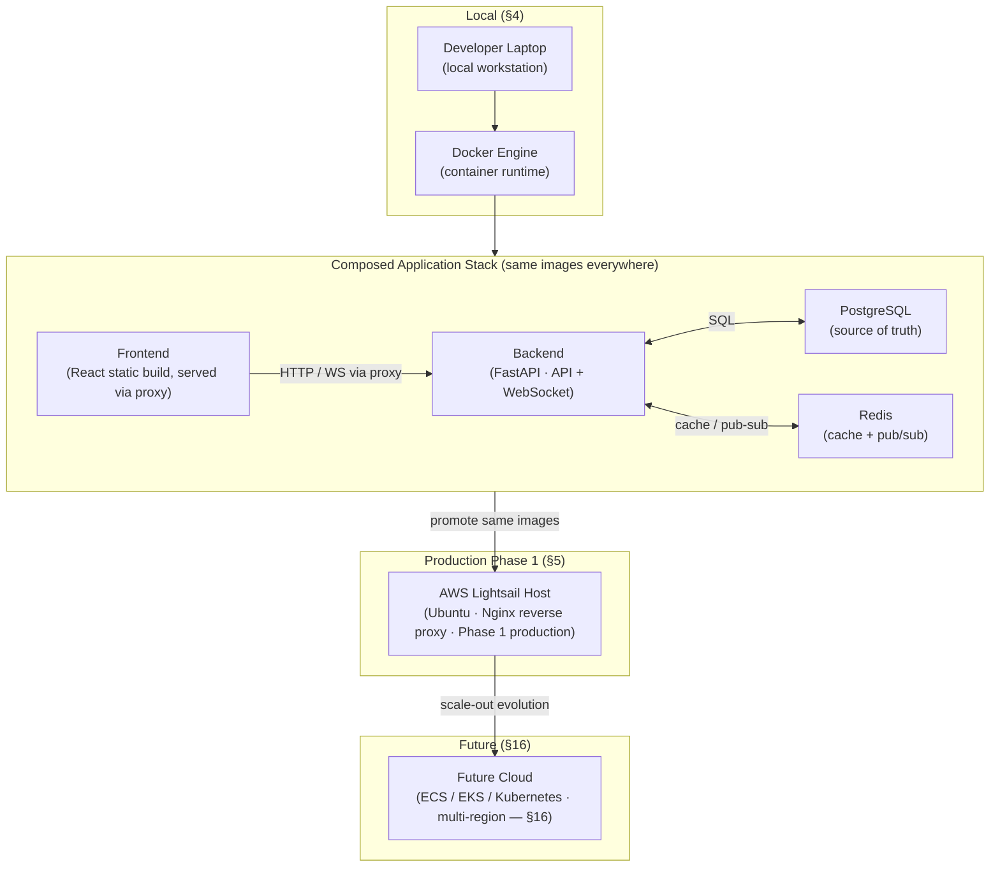
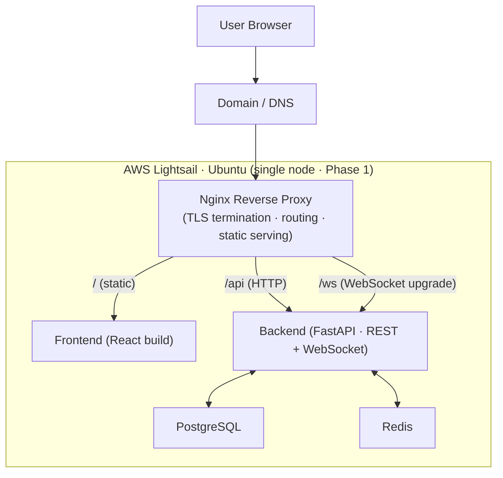
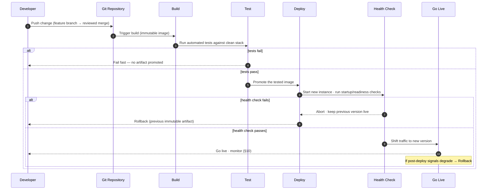

# 10 · Deployment

> **Official Deployment & Operations Architecture Specification**
> This document defines **where** ApexScan runs and **how** it is deployed across development, testing,
> and production. It is an **architecture specification only**: no code, no Dockerfiles, no
> docker-compose files, no shell scripts, no CI/CD YAML, no Kubernetes manifests. It describes
> *topology, environments, operational guarantees, and evolution* — not the artifacts that implement them.

---

## Document Banner

| Field | Value |
|-------|-------|
| Document | `10_DEPLOYMENT.md` |
| Title | Deployment & Operations Architecture Specification |
| Status | **Authoritative** — Phase 1 architecture baseline |
| Layer | Infrastructure & Operations |
| Owner | Platform / DevOps / SRE |
| Consumes | `03_BACKEND_ARCHITECTURE.md`, `08_API_SPECIFICATION.md`, `09_WEBSOCKET_FLOW.md`, `02_DATABASE_DESIGN.md` |
| Related | `01_SYSTEM_ARCHITECTURE.md`, `12_ROADMAP.md` |

> **Division of responsibility — read this first.**
> - **This document (`10`)** describes **WHERE and HOW** the system runs: environments, topology, config, health, ops.
> - **`03_BACKEND_ARCHITECTURE.md`** describes **HOW the backend is built** — its layers and internals.
>
> This document must **never** duplicate backend architecture. Where they meet (health endpoints,
> logging, config), this document describes the *operational contract* and points to `03` for the internals.

---

## Mini Table of Contents

1. [Executive Summary](#1-executive-summary)
2. [Deployment Architecture](#2-deployment-architecture)
3. [Environment Strategy](#3-environment-strategy)
4. [Local Development](#4-local-development)
5. [Production Architecture](#5-production-architecture)
6. [Configuration Management](#6-configuration-management)
7. [Networking](#7-networking)
8. [Health Checks](#8-health-checks)
9. [Logging Architecture](#9-logging-architecture)
10. [Monitoring](#10-monitoring)
11. [Backup & Recovery](#11-backup--recovery)
12. [Security](#12-security)
13. [Scalability](#13-scalability)
14. [Deployment Lifecycle](#14-deployment-lifecycle)
15. [Disaster Recovery](#15-disaster-recovery)
16. [Future Cloud Evolution](#16-future-cloud-evolution)
17. [Non-Negotiable Rules](#17-non-negotiable-rules)
18. [Deployment Checklist](#18-deployment-checklist)

---

## 1. Executive Summary

ApexScan is a real-time trading scanner whose correctness depends on a **predictable, reproducible
runtime**. Deployment is therefore treated as an architectural concern, not an afterthought: the way the
system is packaged and run is part of how it stays trustworthy. This document defines the deployment
model from a developer's laptop to a production host, and the path from there to the cloud.

### 1.1 Deployment Philosophy

- **Reproducibility over convenience.** The same artifact runs the same way everywhere; "works on my
  machine" is designed out, not debugged away.
- **Boring and observable.** Deployments should be uneventful, verifiable, and reversible. Excitement in
  a deployment is a defect.
- **Operations is a first-class consumer of the architecture.** Health, logging, monitoring, and backup
  are designed in from Phase 1, not bolted on.

### 1.2 Container-First

Every runnable component ships as a **container image**. Containers are the unit of packaging, the unit
of deployment, and the boundary of reproducibility:

- The same image built once is promoted **unchanged** through environments.
- Dependencies travel *inside* the image, so the host stays minimal and interchangeable.
- Local development and production run the **same component images**, differing only by configuration.

### 1.3 Environment Consistency

Development, testing, staging, and production are **the same system with different configuration**, not
different systems. Parity is a design goal: the smaller the gap between environments, the fewer surprises
reach production. Differences are confined to configuration (§6), scale (§13), and data — never to the
component images themselves.

### 1.4 Immutable Deployments

A deployed artifact is **never edited in place**. To change what is running, you deploy a **new**
immutable artifact and switch to it; to undo, you switch back. This yields:

- **Deterministic state** — what is running is exactly what was built and tested.
- **Trivial rollback** — the previous artifact still exists and can be re-activated (§14.8).
- **No drift** — hand-edits on a live host, the classic source of un-reproducible incidents, are
  forbidden (§17).

### 1.5 Infrastructure-as-Code Philosophy

Infrastructure and configuration are **described declaratively and version-controlled**, not created by
ad-hoc manual steps. The description is the source of truth; the running system is derived from it. In
Phase 1 this is realized with declarative container composition and versioned configuration; the cloud
evolution (§16) extends the same philosophy to provisioned infrastructure.

> **Architecture Callout — the four philosophies reinforce each other.** Container-first makes
> reproducibility possible; environment consistency makes it meaningful; immutability makes it durable;
> infrastructure-as-code makes it *repeatable*. Remove any one and the guarantees weaken.

---

## 2. Deployment Architecture

The topology from a developer's laptop to production, and onward to the cloud. Each tier runs the **same
component images**, differing only in configuration and scale.

### 2.1 Tier Responsibilities

| Tier | Responsibility | Notes |
|------|----------------|-------|
| **Developer laptop** | Author, run, and test the full stack locally | Uses the *same* component images as production (§4). |
| **Docker engine** | Provide the container runtime and network/volume primitives | The reproducibility boundary (§1.2). |
| **Backend container** | Serve the REST API (`08`) and the WebSocket stream (`09`) | Stateless w.r.t. business data (§13.3). |
| **Frontend container** | Serve the built React application | Static build; behaviour is client-side (see `04`). |
| **PostgreSQL** | Authoritative persistent state (see `02`, ADR-001) | Stateful; the crown jewels; backed up (§11). |
| **Redis** | Cache and pub/sub backbone for cross-worker fan-out | Ephemeral by design; loss is recoverable, never authoritative. |
| **AWS Lightsail host (Phase 1 prod)** | Run the composed stack behind Nginx on Ubuntu with TLS | Single-node production (§5). |
| **Future cloud** | Orchestrated, multi-node, multi-region scale-out | ECS/EKS/Kubernetes (§16); an *extension*, not a rewrite. |

> ⚠️ **PostgreSQL is the only tier whose loss is catastrophic.** Every other tier is disposable and
> reconstructable from images and configuration. This asymmetry drives the backup and DR priorities in
> §11 and §15 — protect the data first.

---

## 3. Environment Strategy

Environments are the **same system under different configuration and scale**. Each exists for a distinct
purpose and is isolated from the others.

| Environment | Purpose | Isolation | Configuration | Status |
|-------------|---------|-----------|---------------|--------|
| **Development** | Author and iterate; fastest feedback | Per-developer, local | Local config; hot reload; synthetic/sample data | ✅ Phase 1 |
| **Testing** | Automated verification against a clean, disposable stack | Ephemeral, created and destroyed per run | Test config; deterministic, seeded data | ✅ Phase 1 |
| **Staging** | Production-like rehearsal before release | Isolated, mirrors production topology | Production-like config; non-production data | 🟡 Planned |
| **Production** | Serve real users | Fully isolated; strictest access | Production secrets; real data; real scale | ✅ Phase 1 (single-node) |

### 3.1 Purpose Separation

Each environment answers one question and no other:

- **Development** — *does it work as I build it?*
- **Testing** — *does it still satisfy its contract?* (see `08`)
- **Staging** — *does it behave like production will?*
- **Production** — *is it serving users correctly, right now?*

### 3.2 Isolation

- Environments **never share** databases, Redis instances, secrets, or credentials.
- A change in one environment can never affect another; there is no shared mutable state across the
  boundary.
- **Production data never flows downstream** into lower environments unless irreversibly anonymized.

### 3.3 Configuration

Environments differ **only by configuration** (§6), never by component image. The image promoted to
production is the exact image that passed testing and staging.

### 3.4 Future Environments

Additional environments (e.g., a dedicated performance/load environment, a demo/sandbox tenant) are
accommodated by the same model: same images, new configuration, isolated resources. They are **future**
and out of scope for the Phase 1 baseline.

> **Note — parity is the point.** The closer staging is to production and development is to staging, the
> earlier a problem is caught. Every intentional difference between environments is a place a bug can hide.

---

## 4. Local Development

Local development runs the **entire stack on the developer's machine** with the same component images as
production, composed declaratively. The goal is a single, reproducible "bring up the whole system"
experience with fast feedback.

### 4.1 Docker Compose (Declarative Local Composition)

The full stack — backend, frontend, PostgreSQL, Redis — is defined as a **declarative local
composition**. A developer brings the whole system up as one unit, with all inter-service wiring already
described. (The composition file itself lives in the repo; this document describes its *architecture*, not
its contents.)

### 4.2 Hot Reload

- **Backend** — source changes are reflected without a full image rebuild during development, for tight
  iteration loops.
- **Frontend** — the React toolchain provides live reload / fast refresh (see `04`).
- Hot reload is a **development-only** convenience; it is never present in production images (§17).

### 4.3 Persistent Volumes

- PostgreSQL and Redis use **named volumes** so data survives container restarts during development.
- Volumes are **local and disposable** — a developer can reset to a clean state deliberately, but does
  not lose data on an ordinary restart.

### 4.4 Database (Local)

A local PostgreSQL container provides an authoritative store for development, seeded with sample or
synthetic data. It mirrors the production engine and version so schema behaviour matches (see `02`).

### 4.5 Redis (Local)

A local Redis container provides caching and pub/sub, exercising the same cross-worker fan-out path the
WebSocket layer relies on (`09`), so real-time behaviour can be validated locally.

### 4.6 Networking (Local)

Services communicate over a **private container network** by service name; only the ports a developer
actually needs (frontend, and optionally the API) are exposed to the host. Internal services (database,
Redis) are **not** exposed beyond the container network by default (§7).

### 4.7 Developer Workflow

The intended loop: bring the stack up → edit code with hot reload → run tests against the disposable
stack → tear down cleanly. The workflow is **self-contained** — no dependency on shared remote
infrastructure to develop or test.

> **Note.** No commands appear in this document by design. The developer workflow's *architecture* is
> specified here; the concrete steps live in the repository's contributor guide and `11_CODING_GUIDELINES.md`.

---

## 5. Production Architecture

Phase 1 production is a **single Ubuntu host on AWS Lightsail** running the composed stack behind an
Nginx reverse proxy with TLS. It is deliberately simple, fully containerized, and designed so the move to
orchestrated cloud (§16) is an extension of the same model.

### 5.1 Component Roles in Production

| Component | Role |
|-----------|------|
| **AWS Lightsail** | The Phase 1 production host — a predictable, fixed-cost VPS. |
| **Ubuntu** | The host OS; kept minimal since all runtime lives in containers. |
| **Nginx (reverse proxy)** | TLS termination, request routing (static / API / WebSocket), compression, and the single public entry point. |
| **FastAPI backend** | Serves the versioned REST API (`08`) and the WebSocket stream (`09`). |
| **React frontend** | Static production build served through the proxy (`04`). |
| **PostgreSQL** | Authoritative persistent state (`02`, ADR-001). |
| **Redis** | Cache and pub/sub backbone (`03`, `09`). |
| **SSL / TLS** | Encrypts all external traffic; certificates managed and auto-renewed. |
| **Domain** | Stable public name mapped via DNS to the host. |

### 5.2 Reverse Proxy Responsibilities

Nginx is the **single public entry point**. It terminates TLS, routes static/API/WebSocket traffic to the
right component, handles the WebSocket upgrade, and applies compression and edge concerns. Nothing behind
the proxy is directly reachable from the internet (§7).

### 5.3 Future Load Balancer

When production grows beyond one node (§13, §16), a **load balancer** replaces the single-node proxy as
the public entry point, distributing connections across backend instances. Because the backend is
stateless w.r.t. business data and the WebSocket layer already fans out via Redis (`09`), this is an
**extension** of the current topology, not a redesign.

> ⚠️ **Single-node production is a deliberate Phase 1 choice with a known limit: it is a single point of
> failure.** The DR posture (§15) and the cloud evolution (§16) exist precisely because of this. Do not
> mistake Phase 1 simplicity for a highly-available design — it is not, yet, and that is documented.

---

## 6. Configuration Management

Configuration is what makes one set of images behave correctly in every environment. It is
**externalized, layered, and never baked into images** (except safe defaults).

### 6.1 Environment Variables

- Runtime configuration is supplied primarily through **environment variables**, per the twelve-factor
  principle of strict config/code separation.
- Images contain **no environment-specific values** — only safe, non-secret defaults where a default is
  meaningful.

### 6.2 Secrets

- Secrets (database credentials, broker keys, tokens) are provided at runtime through **secret-bearing
  environment configuration**, never committed to source control, never baked into an image, never
  logged (see `08` §12.4).
- A local `.env` file (git-ignored) serves development; production secrets are injected by the host's
  secret configuration.

### 6.3 Configuration Precedence

A clear, documented precedence resolves where a value comes from when multiple sources define it:

| Priority | Source | Typical use |
|----------|--------|-------------|
| Highest | Runtime environment / injected secrets | Production, per-host overrides |
| Middle | Environment-specific configuration | Per-environment settings |
| Lowest | Safe in-image defaults | Sensible fallbacks, non-secret |

Higher-priority sources override lower ones; the effective configuration is deterministic and inspectable.

### 6.4 Runtime Configuration

- Configuration is read at **startup** and validated (fail-fast: a missing required secret stops the
  service with a clear error rather than starting in a broken state).
- Configuration that can safely change at runtime is minimized; the immutable-deployment model (§1.4)
  favours redeploying with new configuration over live mutation.

### 6.5 Future Secrets Manager

A dedicated **secrets manager** (e.g., a cloud secrets service) is the planned evolution for centralized,
rotated, audited secret storage. The Phase 1 injected-environment model is designed so adopting one is a
**source change** for secrets, not a change to how services consume configuration.

> ⚠️ **Secrets never enter source control or an image.** A secret in a commit, a Dockerfile, a log line,
> or a URL is a security incident, not a style issue. This is enforced by policy and review (§12, §17).

---

## 7. Networking

The network is designed on a **least-exposure** principle: only what must be public is public; everything
else is private.

### 7.1 Ports

- Only the **reverse proxy's** public ports (HTTPS, and HTTP for redirect-to-HTTPS) are exposed to the
  internet in production.
- Internal component ports (backend, database, Redis) are reachable **only within the private network**.

### 7.2 Internal Communication

Backend ↔ PostgreSQL and backend ↔ Redis communication happens over the **private container/host
network**, addressed by service name, never traversing the public internet.

### 7.3 External Communication

- **Inbound:** users reach only the reverse proxy over TLS (§5.2).
- **Outbound:** the backend connects to **broker APIs** (via the Data Provider layer, `05`) over TLS.
  Outbound broker connectivity is the one external dependency of the running system.

### 7.4 Reverse Proxy & TLS Termination

TLS is terminated at the reverse proxy (§5.2). Traffic behind the proxy is on a trusted private network.
The proxy is the **only** component with a public listener.

### 7.5 Firewall Philosophy

| Principle | Statement |
|-----------|-----------|
| **Deny by default** | Nothing is reachable unless explicitly allowed. |
| **Least exposure** | Expose the minimum surface required (HTTPS in; broker out). |
| **Internal is private** | Databases and caches are never internet-reachable. |
| **Explicit egress** | Outbound is limited to known, required destinations (brokers, updates). |

> **Architecture Callout — the proxy is the moat.** A single, well-configured public entry point that
> terminates TLS and routes internally is far easier to secure and observe than many exposed services.
> Everything valuable sits behind it on a private network.

---

## 8. Health Checks

Health checks make the system's true state **machine-readable**, so orchestration, monitoring, and
deployment automation can act on reality rather than assumption. They are the operational face of the
Health category in `08` §5.

### 8.1 Check Types

| Check | Question it answers | Consumer |
|-------|--------------------|----------|
| **Application health** | Is the backend process serving? | Proxy, monitors, deploy automation |
| **Database health** | Is PostgreSQL reachable and responsive? | Backend readiness, monitoring |
| **Redis health** | Is the cache/pub-sub backbone reachable? | Backend readiness, monitoring |
| **Broker connectivity** | Is the upstream feed reachable/authenticated? | Degraded-mode signalling (`09` §10.4) |
| **Readiness** | Can this instance accept traffic *now*? | Proxy/load balancer routing |
| **Liveness** | Is this instance healthy, or should it be restarted? | Runtime/orchestrator |
| **Startup** | Has the instance finished initializing? | Deploy gate before traffic |
| **Shutdown** | Is the instance draining cleanly? | Graceful termination (§14, `09` §10.7) |

### 8.2 Readiness vs Liveness

- **Liveness** failing → the instance is broken and should be **restarted**.
- **Readiness** failing → the instance is alive but **not able to serve** (e.g., a dependency is down); it
  should be **removed from traffic** until ready, not killed.
- Conflating the two causes restart loops or black-holed traffic; they are kept distinct.

### 8.3 Startup & Shutdown Checks

- **Startup:** an instance receives no traffic until its startup check passes (configuration validated,
  dependencies reachable). This prevents serving from a half-initialized process.
- **Shutdown:** on termination, an instance **drains** in-flight HTTP requests and WebSocket connections
  gracefully (`09` §10.7) before exiting, so a deploy or restart does not drop live work abruptly.

> ⚠️ **Health checks are mandatory, not optional.** A component without a health check is invisible to
> automation and cannot participate safely in deployment or failover. Every runnable component exposes
> liveness and readiness (§17).

---

## 9. Logging Architecture

Logs are the primary record of what the system did. They are **structured, scrubbed, retained, and
rotated**, with a clear path to centralization.

### 9.1 Log Streams

| Stream | Source | Content |
|--------|--------|---------|
| **Application logs** | Backend | Structured events with correlation ids (see `03`, `08` §13). |
| **Access logs** | Reverse proxy | Request line, status, latency, bytes — the traffic record. |
| **Infrastructure logs** | Host / OS | System-level events (resource, service lifecycle). |
| **Container logs** | Container runtime | Per-container stdout/stderr capture. |

### 9.2 Retention & Rotation

- Logs are **rotated** by size/age so no log can fill a disk (a classic outage cause).
- **Retention** windows are defined per stream — long enough to investigate incidents, bounded enough to
  respect storage and privacy.
- Rotation and retention are **automatic**, never a manual chore.

### 9.3 Discipline

- Logs are **structured** (machine-parseable) and carry **correlation ids** so a request can be traced
  across API, service, and stream layers (`08` §13.4, `09` §13).
- Logs are **scrubbed** of secrets and PII (§6.2, `08` §12.4).
- Log **levels** are used consistently so noise can be filtered without losing signal.

### 9.4 Centralized Logging (Future)

Phase 1 keeps logs **local to the host** with rotation/retention. The planned evolution is a
**centralized logging pipeline** (aggregation + search + alerting) so multi-node deployments (§16) have a
single place to investigate. The structured-log discipline now is precisely what makes centralization
later a drop-in.

> **Note.** Structured, correlated, scrubbed logs are worth far more than voluminous unstructured ones.
> The value of a log is measured by how fast it answers "what happened to this request?", not by its size.

---

## 10. Monitoring

Monitoring turns raw signals into **awareness and alerts**. Every guarantee elsewhere in the platform
(latency in `08`/`09`, feed health in `05`/`09`, data integrity in `02`) has a monitored signal here.

### 10.1 Metrics

| Domain | Signals |
|--------|---------|
| **Host resources** | CPU, memory, disk usage/space, network throughput. |
| **Application latency** | API latency percentiles (`08` §11); end-to-end delivery latency (`09` §11). |
| **WebSocket connections** | Active connections, churn, reconnect rate, dropped events (`09` §13). |
| **Broker health** | Feed connectivity/staleness (`05`, `09` §10.4). |
| **Database health** | Connections, query latency, replication/backup status. |
| **Redis health** | Availability, memory pressure, hit ratio. |

### 10.2 Alerts

- Alerts fire on **symptoms that matter to users or data safety** (feed stalled, disk nearly full,
  database unreachable, latency past budget), not on every fluctuation.
- Each alert is **actionable** — it names what is wrong and points toward a response (§15).
- Alert thresholds are tuned against real behaviour (using the metrics above) to avoid fatigue.

### 10.3 Priority Signals

The signals that most directly protect the product:

1. **Disk space** — the most common single-node outage cause; watched closely (§9.2).
2. **Database health** — the only irreplaceable tier (§2.1).
3. **Feed/broker health** — silence must be visible, never hidden (`09` §10.4).
4. **Latency budgets** — the scanner's core promise (`08`/`09`).

### 10.4 Future Prometheus / Grafana

A **metrics stack (Prometheus + Grafana, or equivalent)** with dashboards and alert routing is the
planned evolution. Phase 1 establishes *what* is measured and *why it matters*; the stack that stores and
visualizes it at scale is a future addition that consumes the same signals.

> **Architecture Callout — measure the promise.** Every SLA-like statement in the docs (latency ceilings,
> fresh-or-nothing delivery, data durability) is only credible if a metric proves it. Monitoring is where
> the platform's promises become checkable facts.

---

## 11. Backup & Recovery

The database is the platform's only irreplaceable asset (§2.1). Backup and recovery are engineered around
protecting and restoring it, with defined objectives and **validated** restores.

### 11.1 Database Backups

- PostgreSQL is backed up on a **defined schedule**, with backups stored **off the production host** so a
  host loss does not take the backups with it.
- Backups are **encrypted at rest** and access-controlled (§12).

### 11.2 Configuration Backups

Environment configuration and infrastructure descriptions are **version-controlled** (§1.5) — that *is*
their backup. Secrets are backed up through the secret store, not source control (§6.2).

### 11.3 Retention

A tiered retention policy keeps **recent backups densely and older backups sparsely**, balancing
recovery flexibility against storage cost. Retention windows are defined and enforced automatically.

### 11.4 Recovery Objectives

| Objective | Meaning | Phase 1 posture |
|-----------|---------|-----------------|
| **RPO (Recovery Point Objective)** | Maximum acceptable data loss (how far back a restore may fall) | Bounded by backup frequency; defined and monitored. |
| **RTO (Recovery Time Objective)** | Maximum acceptable time to restore service | Bounded by restore + redeploy time on a fresh host. |

Both objectives are **explicitly defined targets**, tuned as the platform matures.

### 11.5 Restore Validation

> ⚠️ **A backup that has never been restored is not a backup — it is a hope.**

Restores are **tested regularly** against a disposable environment to prove that backups are complete,
uncorrupted, and restorable within the RTO. Backup success is measured by *successful restore*, never by
*successful backup job*.

### 11.6 Disaster Recovery Linkage

Backup/recovery is the data half of disaster recovery; the operational half (node/dependency failure and
rollback) is §15.

---

## 12. Security

Deployment security hardens the *runtime and the host*, complementing the API/contract security in `08`
§12 and the transport security in `09` §12.

### 12.1 HTTPS / SSL

All external traffic is served over **TLS** (§5, §7.4). Certificates are managed and **auto-renewed**;
plaintext HTTP exists only to redirect to HTTPS. Expired certificates are treated as an incident.

### 12.2 Firewall

A **deny-by-default** firewall exposes only the public HTTPS surface; internal services are unreachable
from the internet (§7.5).

### 12.3 Least Privilege

- Containers run with the **minimum privileges** they need (non-root where possible, minimal
  capabilities).
- Service accounts, database users, and broker credentials are scoped to the **least access** their
  function requires (mirrors `08` §12.5).

### 12.4 SSH

- Host SSH access is **key-based only** (no passwords), restricted to known operators, and audited.
- SSH is an **administrative** channel, never part of the deployment path (deployments are automated and
  immutable — §14, §17). Manual SSH edits to running systems are forbidden.

### 12.5 Secrets

Secrets are injected at runtime and never committed, imaged, or logged (§6.2). They are rotated, and
rotation is easier once the future secrets manager (§6.5) is adopted.

### 12.6 Dependency Updates

- Base images and dependencies are **updated regularly** for security patches; updates flow through the
  normal immutable build → test → deploy pipeline (§14), never as live host edits.
- Known-vulnerability scanning is part of the build path.

### 12.7 Future WAF

A **Web Application Firewall** in front of the reverse proxy is a planned addition for filtering hostile
traffic (injection, abusive patterns) at the edge, complementing the API's input validation (`08` §12.3).

> ⚠️ **Security controls fail closed** at the infrastructure layer too: an expired certificate, an
> unknown inbound port, or a failed dependency scan **blocks**, it does not "warn and proceed." This is
> the same principle as `08`/`09`.

---

## 13. Scalability

Scalability is designed as a **path**, not a Phase 1 feature: the current single node is deliberately
simple, but every choice keeps the scale-out route open.

### 13.1 Vertical Scaling

The first and simplest lever: give the single Lightsail host **more resources** (CPU/memory/disk). This
handles early growth with zero architectural change and is the Phase 1 default.

### 13.2 Horizontal Scaling

Beyond a single node, the backend scales to **multiple instances** behind a load balancer (§5.3). This is
possible because:

### 13.3 Stateless Backend

The backend holds **no business state** between requests (`08` §3.3) and no authoritative connection
state that cannot be reconstructed (`09` §5.6). Any instance can serve any request; instances are
disposable. This is the single most important scalability property.

### 13.4 Redis Scaling

Redis scales via **replication and, later, clustering**; as the pub/sub backbone it already enables
cross-instance WebSocket fan-out (`09`), which is what makes multi-instance backends coherent.

### 13.5 PostgreSQL Scaling

PostgreSQL scales first **vertically**, then via **read replicas** for read-heavy load, with connection
pooling throughout. Because it is the source of truth (ADR-001), its scaling is the most carefully
staged (and most tied to backups/DR, §11/§15).

### 13.6 Future Kubernetes & Autoscaling

Orchestration (Kubernetes) and **autoscaling** — adding/removing backend instances automatically with
load — are the target for elastic scale (§16). The stateless backend, externalized config, health checks,
and Redis-backed fan-out are the prerequisites, all present from Phase 1.

> **Architecture Callout — scale-out is unlocked, not built.** Phase 1 runs one node, but statelessness,
> externalized configuration, health checks, and a pub/sub backbone mean horizontal scale is a matter of
> *turning it on with more infrastructure*, not re-architecting.

---

## 14. Deployment Lifecycle

Every change reaches production through the same automated, gated pipeline. No stage is skippable; the
path is the only way in (§17).

### 14.1 Developer

A change begins on a **feature branch**, is **reviewed**, and is merged — never pushed directly to a
production branch (mirrors the global git discipline; §17).

### 14.2 Git

Git is the **single source of truth** for code and configuration. A merge to the release branch is what
triggers the pipeline; nothing deploys that is not in Git.

### 14.3 Build

The build produces a **single immutable image** per component, tagged to its commit. This is the artifact
that will be promoted unchanged through every subsequent stage (§1.2, §1.4).

### 14.4 Test

Automated tests run against a **clean, disposable stack** (§3, §4). A failure **stops the pipeline** — no
untested artifact is ever promoted (fail-fast).

### 14.5 Deploy

The tested image is **promoted** (not rebuilt) and a new instance is started **alongside** the current
one. The old version keeps serving until the new one is proven healthy.

### 14.6 Health Check

The new instance must pass **startup and readiness checks** (§8) before receiving traffic. A failing
health check **aborts the deploy** and leaves the previous version untouched.

### 14.7 Go Live

Traffic shifts to the healthy new version; connections drain gracefully from the old one (§8.3, `09`
§10.7). Post-deploy, monitoring (§10) watches for regressions.

### 14.8 Rollback

> ⚠️ **Rollback must always be available.** Because deployments are immutable (§1.4), the previous
> artifact still exists and rollback is *re-activating it*, not rebuilding or hand-fixing. A deploy that
> cannot be rolled back must not be shipped.

Rollback is triggered by a failed health check (automatically) or by degraded post-deploy signals
(operator decision), and returns the system to the last known-good version quickly and deterministically.

---

## 15. Disaster Recovery

Disaster recovery defines how the platform responds to failure of a component or dependency, and how
service and data are restored. It pairs with the backup/recovery data guarantees in §11.

### 15.1 Failure Scenarios & Responses

| Scenario | Immediate behaviour | Recovery |
|----------|--------------------|----------|
| **Node failure** (host down) | Full outage in Phase 1 (single node — §5.3) | Provision a fresh host from images + config (§1.5), restore the database from off-host backup (§11), redeploy; bounded by RTO (§11.4). |
| **Broker outage** | Feed stops; backend stays up; degraded mode signalled to clients (`09` §10.4) | Auto-resume when the broker recovers; no data fabricated (`05`, `09`). |
| **Database outage** | Reads/writes fail; the API returns system errors (`08` §7.3); nothing is silently lost | Restore/failover the database; validated restore (§11.5); the most serious operational event. |
| **Redis outage** | Cache misses fall through to source; cross-instance fan-out degrades | Redis restarts/reconnects; state rebuilds from source — Redis is never authoritative (§2.1). |
| **Bad deployment** | Detected by health check or post-deploy monitoring | Immediate rollback to the previous immutable artifact (§14.8). |

### 15.2 Recovery Procedures

- Recovery steps are **documented runbooks** kept with the operational docs — deterministic, tested, and
  not improvised during an incident.
- Recovery **prioritizes data integrity over availability**: it is better to be briefly down than to
  serve or persist wrong data.
- Every recovery ends with **verification** (health checks §8, restore validation §11.5) before the
  incident is declared closed.

### 15.3 Business Continuity

- **The data is the business.** Off-host, encrypted, validated backups (§11) are the continuity
  foundation — a lost host is recoverable; lost data may not be.
- Phase 1 accepts a **defined outage window** (single-node RTO) as a conscious trade-off against
  complexity; the HA/multi-region path (§16) is how that window shrinks over time.
- Continuity objectives (RPO/RTO, §11.4) are **explicit and revisited** as the platform and its user
  expectations grow.

> ⚠️ **Fabrication is never a recovery strategy.** Under any failure, the system degrades honestly
> (errors, degraded-mode signals) and never invents market data or masks a stalled feed. A truthful
> outage is safer than a convincing lie (`09` §10.4).

---

## 16. Future Cloud Evolution

The Phase 1 single-node, container-first design is the **on-ramp** to orchestrated cloud. Each direction
below is an **extension** of the current model, out of scope for Phase 1, and marked **(future)**.

| Direction | What it adds | Why the current design accommodates it |
|-----------|--------------|------------------------------------------|
| **AWS ECS (future)** | Managed container orchestration | Components are already containerized and stateless (§1.2, §13.3). |
| **AWS EKS / Kubernetes (future)** | Full orchestration, self-healing, autoscaling | Health checks, externalized config, and Redis fan-out are the prerequisites — all present. |
| **Terraform / IaC (future)** | Provisioned infrastructure as version-controlled code | Extends the Phase 1 infrastructure-as-code philosophy (§1.5) from composition to cloud provisioning. |
| **Multi-region (future)** | Regional redundancy and lower latency | Stateless backends + replicated data + regional edges (mirrors `09` §14). |
| **CDN (future)** | Edge caching of static frontend assets | Frontend is a static build (§2.1); fronting it with a CDN is additive. |
| **Enterprise deployment (future)** | Isolated/tenant or on-prem installs | Same images + configuration + IaC model; a new environment, not a new system (§3). |

> **Architecture Callout — the cloud is a bigger version of today.** Because Phase 1 is already
> container-first, stateless, health-checked, config-externalized, and IaC-described, the cloud evolution
> changes *where and how many* things run — not *what* they are. This is the deliberate payoff of the
> §1 philosophies.

---

## 17. Non-Negotiable Rules

These rules are **binding**. A change that violates any of them is an architecture change requiring an
ADR, not an operational shortcut.

| # | Rule |
|---|------|
| 1 | **No direct production edits.** Running systems are never hand-modified; changes ship as new artifacts. |
| 2 | **Everything is containerized.** Every runnable component ships as a container image. |
| 3 | **The same image is promoted unchanged** through testing, staging, and production. |
| 4 | **Deployments are immutable.** To change what runs, deploy anew; never edit in place. |
| 5 | **Environments differ only by configuration**, never by component image. |
| 6 | **Configuration is externalized** from images (only safe non-secret defaults may be baked in). |
| 7 | **Secrets are never committed** to source control. |
| 8 | **Secrets are never baked into an image** or written to a log or URL. |
| 9 | **Infrastructure and configuration are described as version-controlled code.** |
| 10 | **Git is the single source of truth**; nothing deploys that is not in Git. |
| 11 | **No direct pushes to the production/release branch**; changes are reviewed and merged. |
| 12 | **The deployment pipeline is the only path to production.** |
| 13 | **Automated tests must pass** before any artifact is promoted (fail-fast). |
| 14 | **Health checks are mandatory** on every runnable component. |
| 15 | **Liveness and readiness are distinct** and used correctly. |
| 16 | **No instance receives traffic** until its startup/readiness checks pass. |
| 17 | **Instances drain gracefully** on shutdown; live work is not dropped. |
| 18 | **Rollback is always available**; a deploy that cannot be rolled back is not shipped. |
| 19 | **A failed health check aborts the deploy** and keeps the previous version live. |
| 20 | **All external traffic is served over TLS**; plaintext only redirects to HTTPS. |
| 21 | **Certificates are auto-renewed**; an expired certificate is an incident. |
| 22 | **The firewall denies by default**; only the public HTTPS surface is exposed. |
| 23 | **Internal services (database, Redis) are never internet-reachable.** |
| 24 | **The reverse proxy is the single public entry point.** |
| 25 | **Least privilege** applies to containers, hosts, and every credential. |
| 26 | **SSH is key-based, audited, and never part of the deployment path.** |
| 27 | **PostgreSQL is the only authoritative store**; Redis is never treated as authoritative. |
| 28 | **The database is backed up on schedule, off-host, and encrypted.** |
| 29 | **Backups are validated by test restore**; an untested backup does not count. |
| 30 | **RPO and RTO are explicitly defined** and monitored. |
| 31 | **The backend stays stateless** w.r.t. business data so it can scale horizontally. |
| 32 | **Logs are structured, correlated, scrubbed, rotated, and retained.** |
| 33 | **No log may fill a disk**; rotation and retention are automatic. |
| 34 | **Every guarantee has a monitored signal and, where it matters, an actionable alert.** |
| 35 | **The system degrades honestly** under failure — it never fabricates data or masks a stalled feed. |
| 36 | **Recovery prioritizes data integrity over availability.** |
| 37 | **Dependency and base-image updates flow through the pipeline**, never as live host edits. |
| 38 | **This document defines WHERE and HOW the system runs**; it never duplicates backend internals (`03`). |

---

## 18. Deployment Checklist

Grouped by topic. Every box is an operational commitment for deploying and running ApexScan.

### Development
- [ ] The full stack runs locally via declarative composition.
- [ ] Local images match the production component images.
- [ ] Hot reload is available for backend and frontend in development.
- [ ] Development is self-contained (no dependency on shared remote infra).
- [ ] Sample/synthetic data seeds the local database.
- [ ] The stack can be reset to a clean state deliberately.
- [ ] Development-only conveniences never appear in production images.

### Docker
- [ ] Every runnable component ships as a container image.
- [ ] Images contain no environment-specific values.
- [ ] Images contain no secrets.
- [ ] A single immutable image per component is built per commit.
- [ ] The same image is promoted unchanged across environments.
- [ ] Base images are pinned and regularly patched.
- [ ] Containers run with least privilege (non-root where possible).

### Database
- [ ] PostgreSQL is the single authoritative store.
- [ ] The local database mirrors the production engine and version.
- [ ] Backups run on a defined schedule.
- [ ] Backups are stored off the production host.
- [ ] Backups are encrypted at rest.
- [ ] Restores are validated regularly against a disposable environment.
- [ ] RPO and RTO are defined and monitored.
- [ ] Database health is monitored (connections, latency, backup status).
- [ ] The database is never internet-reachable.

### Redis
- [ ] Redis provides cache and pub/sub only — never authoritative state.
- [ ] Redis loss degrades gracefully (fall through to source).
- [ ] Redis powers cross-instance WebSocket fan-out.
- [ ] Redis health is monitored (availability, memory, hit ratio).
- [ ] Redis is never internet-reachable.
- [ ] A Redis scaling path (replication/clustering) is defined.

### Backend
- [ ] The backend is stateless w.r.t. business data.
- [ ] The backend serves REST (`08`) and WebSocket (`09`) from the same image.
- [ ] Configuration is read and validated at startup (fail-fast).
- [ ] The backend exposes liveness and readiness checks.
- [ ] The backend drains connections gracefully on shutdown.
- [ ] Multiple backend instances can run behind a load balancer.

### Frontend
- [ ] The frontend ships as a static production build.
- [ ] The frontend is served through the reverse proxy.
- [ ] The frontend build is a container image like every other component.
- [ ] Static assets are CDN-ready for future edge caching.

### Security
- [ ] All external traffic uses TLS.
- [ ] Certificates are managed and auto-renewed.
- [ ] Plaintext HTTP only redirects to HTTPS.
- [ ] A deny-by-default firewall is in place.
- [ ] Only the public HTTPS surface is exposed.
- [ ] SSH is key-based, restricted, and audited.
- [ ] SSH is never part of the deployment path.
- [ ] Secrets are injected at runtime, never committed or imaged.
- [ ] Secrets never appear in logs or URLs.
- [ ] Least privilege applies to every credential and account.
- [ ] Dependency/vulnerability scanning is part of the build.
- [ ] Security controls fail closed at the infrastructure layer.

### Networking
- [ ] Only the reverse proxy's public ports are exposed.
- [ ] Internal communication stays on the private network.
- [ ] TLS is terminated at the reverse proxy.
- [ ] The reverse proxy is the single public entry point.
- [ ] Outbound egress is limited to known destinations (brokers, updates).
- [ ] The WebSocket upgrade path is routed correctly through the proxy.

### Monitoring
- [ ] Host resources (CPU, memory, disk, network) are monitored.
- [ ] API and end-to-end delivery latency are monitored.
- [ ] WebSocket connection/reconnect/drop metrics are monitored.
- [ ] Broker/feed health is monitored and staleness is visible.
- [ ] Database and Redis health are monitored.
- [ ] Disk space has a priority alert.
- [ ] Alerts are actionable and tuned against real behaviour.
- [ ] Every platform guarantee maps to a monitored signal.

### Backups
- [ ] Database backups are scheduled, off-host, and encrypted.
- [ ] A tiered retention policy is defined and enforced.
- [ ] Restore validation is performed regularly.
- [ ] Configuration/infrastructure is version-controlled as its backup.
- [ ] Backup success is measured by successful restore.
- [ ] Backup/restore status is monitored.

### Deployment
- [ ] The pipeline is the only path to production.
- [ ] Git is the single source of truth for code and config.
- [ ] No direct pushes to the release branch; changes are reviewed.
- [ ] Builds produce immutable, commit-tagged artifacts.
- [ ] Automated tests must pass before promotion.
- [ ] Tested images are promoted, not rebuilt.
- [ ] New instances start alongside the current version.
- [ ] Startup/readiness checks gate traffic.
- [ ] Traffic shifts only to a healthy new version.
- [ ] Old instances drain gracefully during cutover.

### Rollback
- [ ] The previous immutable artifact is always retained.
- [ ] Rollback re-activates the prior artifact (no rebuild/hand-fix).
- [ ] A failed health check triggers automatic rollback.
- [ ] Degraded post-deploy signals allow operator-triggered rollback.
- [ ] A change that cannot be rolled back is not shipped.
- [ ] Rollback returns the system to a known-good state deterministically.

### Cloud
- [ ] The design is container-first and orchestration-ready.
- [ ] Statelessness enables horizontal and future autoscaling.
- [ ] Health checks and externalized config satisfy orchestrator prerequisites.
- [ ] An ECS/EKS/Kubernetes path is defined (future).
- [ ] Infrastructure-as-code extends to cloud provisioning (future).
- [ ] Multi-region and CDN are documented directions (future).
- [ ] Cloud evolution is an extension, not a rewrite.

### Documentation
- [ ] Environments, topology, and config precedence are documented.
- [ ] Recovery runbooks are written, kept current, and tested.
- [ ] RPO/RTO and continuity objectives are documented.
- [ ] Every non-negotiable rule maps to a checklist item and/or signal.
- [ ] Changes violating a rule require an ADR.
- [ ] This document defines WHERE/HOW the system runs, never backend internals.

---

## 19. Summary

### 19.1 What This Document Is

`10_DEPLOYMENT.md` defines **where and how ApexScan runs** — from a developer's laptop through a
single-node AWS Lightsail production host to an orchestrated cloud future. It is **container-first,
environment-consistent, immutable, and infrastructure-as-code**, with operations (health, logging,
monitoring, backup, DR) treated as first-class architecture from Phase 1.

### 19.2 What It Owns and What It Never Owns

| Owns | Never Owns |
|------|------------|
| Environment strategy and topology | Backend internals (owned by `03`) |
| Container packaging & promotion | The API contract (owned by `08`) |
| Configuration & secrets management | The real-time model (owned by `09`) |
| Health, logging, monitoring contracts | The data schema (owned by `02`) |
| Backup, recovery, and disaster response | The concrete deploy artifacts (repo files) |
| The deployment lifecycle and rollback | Business/market logic |

### 19.3 Architecture Readiness Assessment

| Dimension | Status | Notes |
|-----------|--------|-------|
| Deployment philosophy (container-first, immutable, IaC) | ✅ Ready | §1. |
| Environment strategy & parity | ✅ Ready | §3; same images, config-only differences. |
| Local development model | ✅ Ready | §4; full self-contained stack. |
| Production topology | ✅ Ready (single-node) | §5; deliberate Phase 1 SPOF, documented. |
| Configuration & secrets | ✅ Ready | §6; externalized, precedence defined, secrets-manager reserved. |
| Networking & least exposure | ✅ Ready | §7; deny-by-default, proxy-as-moat. |
| Health checks | ✅ Ready | §8; liveness/readiness/startup/shutdown. |
| Logging | ✅ Ready | §9; structured/scrubbed/rotated; centralization reserved. |
| Monitoring | 🟡 Baseline | §10; signals defined; Prometheus/Grafana stack future. |
| Backup & recovery | ✅ Ready | §11; off-host, encrypted, restore-validated, RPO/RTO defined. |
| Security hardening | ✅ Ready | §12; TLS, firewall, least privilege, SSH discipline; WAF future. |
| Scalability | ✅ Ready (path defined) | §13; stateless backend unlocks horizontal/autoscale. |
| Deployment lifecycle & rollback | ✅ Ready | §14; gated pipeline, immutable rollback. |
| Disaster recovery | ✅ Ready (single-node limits documented) | §15; honest degradation, data-first recovery. |
| Cloud evolution | ✅ Ready (path defined) | §16; extension of today's model. |

**Overall:** The deployment architecture is **ready to implement** as the Phase 1 baseline. It is
reproducible by construction, honest under failure, and engineered so that the cloud future (orchestration,
autoscaling, multi-region, HA) is reachable by **extension** — provided every deployment upholds the
non-negotiable rules in §17. The one consciously accepted Phase 1 limitation is **single-node production
(a single point of failure)**, documented openly and addressed by the DR posture (§15) and cloud path (§16).

---

*End of `10_DEPLOYMENT.md` — Official Deployment & Operations Architecture Specification.*
