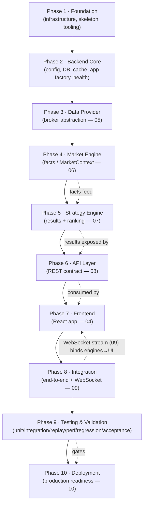

# 12 · Roadmap

> **Official Execution Roadmap for ApexScan**
> The architecture is **frozen** (documents `00`–`11`). This document defines **how to execute it**:
> what to build first, what depends on what, the Definition of Done and acceptance criteria for each
> phase, and the project milestones. It contains **no code, no implementation, no calendar timelines, and
> no effort estimates** — it is a sequencing and quality-gate document, not a schedule.

---

## Document Banner

| Field | Value |
|-------|-------|
| Document | `12_ROADMAP.md` |
| Title | Implementation & Execution Roadmap |
| Status | **Authoritative** — execution plan for a frozen architecture |
| Scope | Build order, dependencies, Definition of Done, acceptance, milestones, risks |
| Owner | Delivery / Technical Program Management |
| Depends on | `00`–`11` (all architecture is frozen) |
| Governed by | `11_CODING_GUIDELINES.md`, `docs/adr/` |

> **What this document is — and is not.**
> - **Is:** the ordered plan to turn a frozen architecture into a running system, with explicit gates.
> - **Is not:** a calendar, a sprint plan, a story-point estimate, or a re-opening of architectural
>   decisions. Sequencing is by **dependency and risk**, never by date.

---

## Mini Table of Contents

1. [Executive Summary](#1-executive-summary)
2. [Implementation Principles](#2-implementation-principles)
3. [Dependency Graph](#3-dependency-graph)
4. [Phase 1 — Foundation](#4-phase-1--foundation)
5. [Phase 2 — Backend Core](#5-phase-2--backend-core)
6. [Phase 3 — Data Provider](#6-phase-3--data-provider)
7. [Phase 4 — Market Engine](#7-phase-4--market-engine)
8. [Phase 5 — Strategy Engine](#8-phase-5--strategy-engine)
9. [Phase 6 — API Layer](#9-phase-6--api-layer)
10. [Phase 7 — Frontend](#10-phase-7--frontend)
11. [Phase 8 — Integration](#11-phase-8--integration)
12. [Phase 9 — Testing & Validation](#12-phase-9--testing--validation)
13. [Phase 10 — Deployment](#13-phase-10--deployment)
14. [Future Roadmap](#14-future-roadmap)
15. [Risk Register](#15-risk-register)
16. [Success Criteria](#16-success-criteria)
17. [Non-Negotiable Execution Rules](#17-non-negotiable-execution-rules)
18. [Delivery Checklist](#18-delivery-checklist)
19. [Summary](#19-summary)

---

## 1. Executive Summary

ApexScan's architecture is complete and frozen across twelve documents. What remains is **disciplined
execution**: building the system in an order that respects its dependencies, verifying each layer before
the next depends on it, and never letting delivery pressure erode the boundaries the architecture defines.

### 1.1 Roadmap Philosophy

- **Sequence by dependency, not by date.** A component is built when its prerequisites are proven, not
  when a calendar says so. This document deliberately contains no timelines or estimates.
- **Build inward-out, along the data flow.** Infrastructure → backend core → data → intelligence →
  interface → integration → deployment mirrors the direction facts flow through the system.
- **Every phase ends at a gate.** A phase is not "done" because work stopped; it is done when its
  **Definition of Done** and **acceptance criteria** are met and verified.

### 1.2 Incremental Delivery

The system is delivered in **small, verifiable increments** that each leave the codebase in a working,
tested state. There is never a "big bang" integration at the end; integration happens continuously as
each layer lands on top of a proven one.

### 1.3 Architecture-First

Execution serves the architecture, not the reverse. No phase re-opens a frozen decision to make delivery
easier; a genuine need to change the architecture is raised as an **ADR/RFC** (per `11` §14.2), reviewed,
and only then reflected here. **The roadmap adapts to the architecture; the architecture does not bend to
the roadmap.**

### 1.4 Quality-First

Each phase carries its **tests, docs, and observability with it** — not as a later "hardening phase."
Quality gates (`11` §18) are part of every phase's Definition of Done. A layer that is not tested is not
finished and cannot be depended upon.

### 1.5 Risk Reduction

The order is chosen to **retire the biggest risks earliest**: prove the boundary contracts (adapter,
MarketContext, strategy plug-in) before scale, and prove determinism before the UI depends on it.
Uncertainty is front-loaded; the later phases are increasingly mechanical because the hard questions were
answered first.

> **Architecture Callout — the roadmap is a proof order.** Each phase *proves* the layer beneath it is
> trustworthy before the next layer builds on it. Building out of order means building on unproven ground.

---

## 2. Implementation Principles

These principles govern *how* each phase is executed. They are the delivery-side complement to the
engineering principles in `11` §2.

### 2.1 Small Increments

Work is broken into the **smallest changes that add verifiable value** and keep the system green. Large,
long-lived branches are avoided; each increment is reviewed and merged behind passing gates (`11` §13,
§18).

### 2.2 Vertical Slices (Where They Add Value)

Once the foundational layers exist, prefer **thin vertical slices** — a small end-to-end path exercised
through every layer — over building one layer fully before touching the next. A vertical slice proves the
seams work together early and surfaces integration problems while they are cheap.

### 2.3 Module Isolation

Each module is built and tested **in isolation against its contract** before it is wired to its neighbors.
The broker adapter, the Market Engine, and each strategy are independently verifiable — a direct
consequence of the boundaries in `05`/`06`/`07`.

### 2.4 Continuous Verification

Automated verification (lint, type-check, tests, security scan) runs on **every change**, not at phase
boundaries. The gates are always on; a red build blocks progress immediately (`11` §18).

### 2.5 Testing Before Integration

A component is **tested against its contract before** anything integrates with it. Integration consumes
*proven* components, never hopeful ones — this is what makes continuous integration safe rather than
chaotic.

### 2.6 Documentation Synchronization

When execution reveals that a documented behaviour must change, the **document is updated in the same
change** (`11` §14.5). The `docs/` set stays true throughout; documentation drift is a defect, not a
follow-up task.

> ⚠️ **A phase that skips its tests or docs is not "ahead of schedule" — it is in debt.** Deferred
> quality is borrowed against the next phase at punitive interest. The gates exist to prevent this.

---

## 3. Dependency Graph

Implementation proceeds along the dependency order below. Each node may only begin once its predecessor's
Definition of Done is met (§4–§13). Testing & Validation and Deployment are shown as the culminating
gates, though verification is continuous throughout (§2.4).

### 3.1 Why This Order

| Position | Rationale |
|----------|-----------|
| **Foundation first** | Nothing can be built, run, or verified without the skeleton, tooling, and gates in place. |
| **Backend core before data** | Config, DB, cache, and health are prerequisites for every service that follows. |
| **Data before engines** | The Market Engine needs normalized data; building it first proves the adapter contract (`05`). |
| **Market before Strategy** | Strategies consume `MarketContext`; facts must exist and be trustworthy first (`06`→`07`). |
| **Engines before API** | The API exposes results; there must be results to expose (`07`→`08`). |
| **API before Frontend** | The frontend consumes the contract; the snapshot must exist before the UI renders it (`08`→`04`). |
| **Integration binds it** | The WebSocket stream (`09`) connects engines to the UI end-to-end. |
| **Testing gates Deployment** | Production readiness is earned by validation, never assumed. |

> **Note.** The solid arrows are the *hard build order*; the dashed arrows show the *runtime data flow*
> the order is designed to mirror. Vertical slices (§2.2) may thread through several phases at once, but a
> slice can only exercise a layer whose Definition of Done is already met.

---

## 4. Phase 1 — Foundation

**Objective:** establish the ground every later phase stands on — the project skeleton, the toolchain,
and the always-on quality gates.

### 4.1 Objectives
- A runnable, containerized skeleton for backend and frontend (already delivered in Phase 1 of the
  project) with the folder structure the architecture prescribes.
- Automated gates (formatting, linting, type-checking, tests, security scan) wired into CI.
- Local development composition and the environment/config model in place (`10` §4, §6).

### 4.2 Deliverables
- Project structure matching `03`/`04`; declarative local stack; base CI pipeline; settings abstraction;
  structured logging baseline; health endpoints stubbed.

### 4.3 Prerequisites
- The frozen architecture (`00`–`11`). None other.

### 4.4 Definition of Done
- The full stack builds and runs locally as one unit.
- All gates run on every change and are green.
- A trivial change can flow from branch → PR → review → merge behind passing checks.

### 4.5 Acceptance Criteria
- A new contributor (or AI assistant) can bring the stack up and make a green change without tribal
  knowledge.
- No layer boundary is pre-violated by the skeleton; the Dependency Rule holds from day one (`11` §3.4).

### 4.6 Risks
- **Under-invested tooling** → gates get added late and quality debt accrues. *Mitigation:* gates are part
  of this phase's DoD, not a later task (§2.4).

---

## 5. Phase 2 — Backend Core

**Objective:** stand up the shared backend foundation every service depends on.

### 5.1 Objectives
- Configuration loading + validation (fail-fast), database session management, cache/Redis client,
  application factory and lifecycle, and real health/readiness checks (`03`, `10` §8).

### 5.2 Deliverables
- Working config abstraction; async DB session lifecycle; Redis client; app factory with startup/shutdown;
  liveness/readiness/startup checks reflecting true dependency state.

### 5.3 Prerequisites
- Phase 1 Definition of Done met.

### 5.4 Definition of Done
- The application starts only when required configuration and dependencies are present (fail-fast).
- Health checks report the true state of DB and cache.
- Graceful startup and shutdown (draining) work.

### 5.5 Acceptance Criteria
- Killing a dependency flips readiness correctly (removed from traffic, not crash-looped — `10` §8.2).
- No business logic exists in the core; it is pure foundation.

### 5.6 Risks
- **Config sprawl** → env vars read ad hoc across the code. *Mitigation:* single settings abstraction is
  enforced (`11` §4.9, §19).

---

## 6. Phase 3 — Data Provider

**Objective:** prove the broker abstraction so the rest of the system is broker-agnostic (`05`).

### 6.1 Objectives
- Implement the broker adapter contract behind the abstraction; normalize raw feeds into the standardized
  internal shape; handle connect/disconnect/health/timeouts/reconnect.

### 6.2 Deliverables
- One working adapter behind the abstract contract; normalized data output; connectivity health signals
  (`05`, `09` §10.4); the seam for additional brokers (Dhan/Binance/Zerodha) left open (§14).

### 6.3 Prerequisites
- Phase 2 Definition of Done met.

### 6.4 Definition of Done
- The Market Engine can consume normalized data **without knowing which broker produced it**.
- Feed loss is detected and surfaced honestly; no fabricated data (`05`, `09` §10.4).

### 6.5 Acceptance Criteria
- Swapping the adapter requires **no change** above the abstraction (contract test passes for the
  abstraction, not a specific broker).
- Timeouts and reconnection behave per spec.

### 6.6 Risks
- **Broker leakage** → provider specifics bleed upward. *Mitigation:* the abstraction is contract-tested;
  no broker type appears above the Data Provider layer (`11` §19).

---

## 7. Phase 4 — Market Engine

**Objective:** transform normalized data into trustworthy, versioned **facts** (`06`).

### 7.1 Objectives
- Produce the immutable, versioned `MarketContext`; guarantee determinism and ordering; compute facts only
  — never decisions.

### 7.2 Deliverables
- The `MarketContext` production path; versioning/stamping; deterministic, ordered fact computation;
  fact-update events onto the bus (`01`/`09`).

### 7.3 Prerequisites
- Phase 3 Definition of Done met.

### 7.4 Definition of Done
- Given identical recorded inputs, the engine reproduces **identical** `MarketContext` output (determinism
  proven by replay — §12, `06`).
- Every context carries a monotonic version; ordering guarantees hold.

### 7.5 Acceptance Criteria
- The engine computes **no signals or decisions** (verified by review against `06`).
- Replay tests pass reproducibly.

### 7.6 Risks
- **Hidden non-determinism** (wall-clock, ordering, randomness). *Mitigation:* inject time/order/randomness;
  replay tests are a DoD gate (`11` §2.9, §12).

> ⚠️ **The Market Engine is the trust anchor.** If its facts are wrong or non-reproducible, every layer
> above inherits the error. Its Definition of Done is therefore the strictest in the roadmap.

---

## 8. Phase 5 — Strategy Engine

**Objective:** interpret facts into **results and rankings** via the plug-in contract (`07`).

### 8.1 Objectives
- Implement the strategy execution pipeline, the plug-in registration/contract, immutable `StrategyResult`,
  scoring representation, and ranking — without any strategy editing the engine (Open/Closed).

### 8.2 Deliverables
- The strategy runner and registry; the plug-in contract; result/ranking production; fault isolation
  (one failing strategy never affects another — `07` §20); strategy-execution events onto the bus.

### 8.3 Prerequisites
- Phase 4 Definition of Done met (trustworthy facts exist).

### 8.4 Definition of Done
- A strategy can be **added purely as a plug-in** with no change to the engine (`07` §19).
- Results are immutable; ranking is authoritative and never re-sorted downstream.
- A faulting strategy is isolated and auto-disabled without impacting others.

### 8.5 Acceptance Criteria
- Strategies **never access brokers** and **never mutate context** (verified against `07`/`11` §19).
- Determinism/replay holds for strategy execution.

### 8.6 Risks
- **Boundary erosion** (a strategy reaching for data or measuring the market). *Mitigation:* the contract
  forbids it; review + contract tests enforce it.

---

## 9. Phase 6 — API Layer

**Objective:** expose the platform's state through the frozen REST contract (`08`).

### 9.1 Objectives
- Implement versioned, resource-oriented endpoints per category; boundary validation; the uniform error
  model; pagination/filtering/sorting; DI wiring; service→repository delegation.

### 9.2 Deliverables
- The versioned API surface (health/system/scanner/strategy/config/historical/settings); uniform errors;
  bounded/paginated reads; auth/rate-limit **seams reserved** (`08` §4, §10).

### 9.3 Prerequisites
- Phase 5 Definition of Done met (there are results and rankings to expose).

### 9.4 Definition of Done
- Every endpoint validates at the boundary, returns the uniform shape/error model, and is versioned.
- No business logic lives in handlers; persistence is reached only via repositories.
- Authoritative rankings are preserved, never re-sorted by the API (`08` §3.6).

### 9.5 Acceptance Criteria
- Contract tests pass; a consumer can rely on the contract's stability within the major version.
- No unbounded collection is ever returned.

### 9.6 Risks
- **Logic creep into handlers.** *Mitigation:* review checklist (`11` §18) + non-negotiable rules (`11`
  §19).

---

## 10. Phase 7 — Frontend

**Objective:** render the platform's truth through the React application (`04`).

### 10.1 Objectives
- Build the layouts/pages/components/hooks; wire server state (TanStack Query) and client state (Zustand)
  separately; consume the REST snapshot; prepare for the live stream.

### 10.2 Deliverables
- The scanner/dashboard UI shell; typed contract consumption (single source of types — `11` §7.6);
  presentational/container separation; loading/error/empty states.

### 10.3 Prerequisites
- Phase 6 Definition of Done met (the contract exists and is stable).

### 10.4 Definition of Done
- The UI renders authoritative data **without re-computing or re-ranking** (`09`/`11` §6.6).
- Server and client state are cleanly separated; strict TypeScript passes.

### 10.5 Acceptance Criteria
- The initial view is seeded by the REST snapshot (`08` §8.2) and is ready to be kept live by the stream.
- No business/ranking logic exists in the client.

### 10.6 Risks
- **State conflation** (server data copied into client store). *Mitigation:* enforced separation (`11`
  §6.3, §19).

---

## 11. Phase 8 — Integration

**Objective:** bind engines to the UI end-to-end via the real-time layer (`09`).

### 11.1 Objectives
- Implement the WebSocket Manager, subscription model, fan-out, and the event chain from tick → context →
  result → ranking → broadcast → UI (`01`/`09`); connect the REST snapshot + live stream split.

### 11.2 Deliverables
- Working connection lifecycle, subscriptions, ordered fan-out, backpressure/graceful degradation, and the
  full data path from broker to browser (`09`).

### 11.3 Prerequisites
- Phases 4–7 Definition of Done met.

### 11.4 Definition of Done
- A market change propagates end-to-end to the UI within the delivery latency budget (`09` §11).
- Ordering, versioning, idempotency, and per-subject convergence hold; the transport computes nothing
  (`09` §9).
- Disconnect/reconnect/backpressure behave per spec; degraded modes are visible.

### 11.5 Acceptance Criteria
- A vertical slice (one instrument, one strategy) is **live end-to-end** and honest under a simulated feed
  stall (`09` §10.4).
- Losing a backend instance is survivable (reconnect + re-subscribe).

### 11.6 Risks
- **Latency/backpressure surprises under fan-out.** *Mitigation:* bounded queues + fresh-or-nothing policy
  (`09` §10); performance tests in Phase 9.

> **Architecture Callout — integration is where the boundaries are proven together.** Each layer passed
> its own gate in isolation; Phase 8 proves they compose without any layer overreaching into another's
> job.

---

## 12. Phase 9 — Testing & Validation

**Objective:** prove the whole system meets its contracts and guarantees before it can be deployed.
Verification has been continuous (§2.4); this phase is the **consolidated validation gate**.

| Test type | What it proves | Reference |
|-----------|----------------|-----------|
| **Unit** | Each unit behaves correctly in isolation, including edges/errors | `11` §12 |
| **Integration** | Layers collaborate correctly (service↔repo↔DB; engine↔bus↔transport) | `11` §12 |
| **Replay** | Engines reproduce identical results from recorded inputs (determinism) | `06`/`07` |
| **Performance** | API and end-to-end delivery latency budgets hold under load/fan-out | `08`/`09` §11 |
| **Regression** | Previously fixed defects stay fixed | `11` §12 |
| **Acceptance** | The system satisfies the success criteria (§16) end-to-end | §16 |

### 12.1 Definition of Done
- All six test types pass; critical paths are covered; no uncovered critical path remains (`11` §12.4).
- Determinism is proven by replay; latency budgets are measured and met.

### 12.2 Acceptance Criteria
- The acceptance suite maps 1:1 to the success criteria in §16 and is green.
- No open defect of severity high or above.

### 12.3 Risks
- **Testing treated as a phase rather than a habit.** *Mitigation:* gates run continuously (§2.4); this
  phase consolidates, it does not "start" testing.

---

## 13. Phase 10 — Deployment

**Objective:** achieve **production readiness** per `10`, and go live behind the deployment gates.

### 13.1 Production-Readiness Definition of Done
- Immutable, containerized artifacts promoted unchanged through the pipeline (`10` §14).
- TLS, firewall, secrets injection, least privilege in place (`10` §12).
- Health checks gate traffic; graceful drain on cutover; **rollback verified** (`10` §8, §14.8).
- Backups scheduled, off-host, encrypted, and **restore-validated** (`10` §11).
- Monitoring/alerting live for the priority signals (disk, DB, feed, latency — `10` §10).

### 13.2 Acceptance Criteria
- A full deploy → health-check → go-live → rollback cycle has been exercised successfully.
- A restore-from-backup has been performed and validated against RPO/RTO (`10` §11.4).
- The single-node SPOF and its DR posture are documented and accepted (`10` §5.3, §15).

### 13.3 Risks
- **"It works locally" ≠ production-ready.** *Mitigation:* the readiness DoD above is a hard gate; nothing
  ships until every item is met.

> ⚠️ **Go-live is a gate, not an event.** Production readiness is earned by meeting §13.1 in full. A
> deployment that cannot be rolled back or restored is not ready, regardless of feature completeness.

---

## 14. Future Roadmap

Everything below is **beyond the Phase 1 build** and is sequenced by dependency and value when it is
taken up. Nothing here re-opens the frozen architecture; each item slots into a **reserved seam**.

### 14.1 V1 (First Complete Product)
- The end-to-end scanner: live facts → strategies → rankings → real-time UI, deployed and observable.
  This is the culmination of Phases 1–10.

### 14.2 V2 (Depth & Breadth)
| Item | Slots into | Notes |
|------|-----------|-------|
| **Additional strategies** | Strategy plug-in seam (`07` §19) | Added as plug-ins; no engine change. |
| **Additional brokers** (Dhan/Binance/Zerodha) | Data Provider abstraction (`05`) | Added behind the adapter contract. |
| **Backtesting** | Replay/determinism foundation (`06`/`07`) | Runs strategies over historical facts. |
| **Authentication & RBAC** | Reserved auth seams (`08` §4, `09` §12) | Turns on enforcement; no redesign. |
| **Centralized logging / metrics stack** | Logging & monitoring seams (`10` §9, §10) | Prometheus/Grafana + log aggregation. |

### 14.3 Future
| Item | Slots into | Notes |
|------|-----------|-------|
| **Paper Trading** | Reserved API trading category (`08` §5) | Simulated orders/positions; no live risk. |
| **Live Trading** | Reserved API trading category (`08` §5) | Highest-guard surface: strongest auth/RBAC/audit/confirmation. |
| **AI Ranking** | Strategy/ranking seams (`07`) | Augments ranking as an additional, governed interpreter of facts. |
| **Marketplace / Plugin APIs** | Plugin API seam (`08` §14, `07`) | Third-party strategies under a governed, permissioned contract. |
| **Cloud scale-out** (ECS/EKS/K8s, multi-region, CDN) | Deployment evolution (`10` §16) | Extension of the container-first model. |

### 14.4 Ideas (Unscheduled)
- Additional asset classes, richer visualizations, alerting/notifications, and workspace collaboration —
  captured for consideration, none committed, none permitted to bend the architecture.

> ⚠️ **Trading capabilities are the highest-risk future work.** Paper and Live Trading are named to
> reserve their seams (`08` §5.1); when taken up they require the strongest controls in the platform and
> are never rushed to hit a milestone.

---

## 15. Risk Register

Risks are tracked by category with a standing mitigation. Severity reflects impact on the architecture's
integrity or the product's trustworthiness, not schedule.

### 15.1 Technical Risks
| Risk | Impact | Mitigation |
|------|--------|-----------|
| Hidden non-determinism in engines | Untrustworthy, unreproducible results | Inject time/order/randomness; replay tests as a DoD gate (§7/§8/§12). |
| Latency/backpressure under fan-out | Missed real-time budget; stale UI | Bounded queues, fresh-or-nothing, coalescing; perf tests (`09` §10/§11). |
| Broker feed instability | Gaps, false liveness | Honest degraded-mode signalling; no fabrication (`05`, `09` §10.4). |
| Data loss (the only irreplaceable asset) | Catastrophic | Off-host, encrypted, restore-validated backups (`10` §11). |

### 15.2 Operational Risks
| Risk | Impact | Mitigation |
|------|--------|-----------|
| Single-node production SPOF | Full outage on host loss | Documented DR posture; fresh-host rebuild + restore; cloud HA path (`10` §15/§16). |
| Deployment without rollback | Stuck on a bad release | Immutable artifacts; rollback verified as a DoD gate (`10` §14.8, §13). |
| Secret leakage | Security incident | Secrets never committed/imaged/logged; scanning + review (`10` §6/§12, `11` §15). |
| Alert fatigue / blind spots | Incidents missed | Actionable, tuned alerts on priority signals (`10` §10). |

### 15.3 Architecture Risks
| Risk | Impact | Mitigation |
|------|--------|-----------|
| Boundary erosion (logic in wrong layer) | Loss of the properties the architecture guarantees | Dependency Rule + review checklist + non-negotiable rules (`11` §3/§18/§19). |
| Scope creep re-opening frozen decisions | Architectural drift | Changes require ADR/RFC, never in-the-moment exceptions (§1.3, `11` §14.2). |
| AI-introduced plausible violations | Silent erosion at speed | AI contract + accountable human review (`11` §17/§18). |
| Duplicated business logic | Divergent behaviour | DRY + one authoritative implementation (`11` §19). |

### 15.4 Mitigation Strategy (Overall)
- **Front-load risk** (§1.5): prove the riskiest contracts earliest.
- **Gate every phase** (§2, §17): unmet DoD blocks progression.
- **Automate enforcement** (`11` §18): tooling catches what review can't, and vice versa.
- **Change through decisions, not exceptions** (§1.3): the architecture only changes via ADR/RFC.

---

## 16. Success Criteria

Success is defined in **measurable, verifiable** terms. Each criterion maps to an acceptance test in Phase
9 (§12).

| # | Success Criterion (measurable) |
|---|--------------------------------|
| S1 | A market change propagates broker→browser **within the defined end-to-end latency budget** at the target fan-out (`09` §11). |
| S2 | The Market Engine reproduces **identical** `MarketContext` from identical recorded inputs across runs (replay-proven determinism). |
| S3 | A **new strategy is added as a plug-in with zero engine changes** and appears in results/rankings. |
| S4 | A **new broker is added behind the adapter** with no change above the Data Provider layer. |
| S5 | A **feed stall is visibly signalled** to the UI and auto-recovers, with **no fabricated data**. |
| S6 | The API serves the **uniform contract and error model**, versioned, with no unbounded responses (contract tests green). |
| S7 | The UI renders authoritative rankings **without re-computing or re-ranking**, seeded by REST and kept live by WebSocket. |
| S8 | A **full deploy → health-check → rollback** cycle succeeds; a **restore-from-backup** meets RPO/RTO. |
| S9 | **Zero critical/high defects** open at the acceptance gate; all six test types green with critical-path coverage. |
| S10 | **No boundary violation** exists in the codebase (Dependency Rule, engine/strategy/transport boundaries verified). |
| S11 | Monitoring shows every platform guarantee has a **live signal**, and priority alerts fire correctly in a drill. |
| S12 | Documentation (`00`–`12`) is **synchronized** with the delivered system — no drift. |

---

## 17. Non-Negotiable Execution Rules

These rules are **binding** on delivery. A phase that violates any of them is not done, regardless of
apparent progress.

| # | Rule |
|---|------|
| 1 | **The architecture is frozen**; execution never re-opens a decision except via ADR/RFC. |
| 2 | **Build in dependency order**; a phase begins only when its predecessor's DoD is met. |
| 3 | **Every phase has an explicit Definition of Done** that must be met to progress. |
| 4 | **Every phase has acceptance criteria** verified before it is called complete. |
| 5 | **No calendar-driven shortcuts** — sequencing is by dependency and risk, not date. |
| 6 | **The gates are always on**; a red build blocks progress immediately. |
| 7 | **Tests ship with the code** in the same phase, never deferred to a later "hardening" phase. |
| 8 | **A component is contract-tested before anything integrates with it.** |
| 9 | **Documentation is updated in the same change** that alters documented behaviour. |
| 10 | **No big-bang integration**; integration is continuous on proven layers. |
| 11 | **Increments are small, reviewed, and kept green.** |
| 12 | **Determinism is proven by replay** before dependents rely on the engines. |
| 13 | **The Market Engine computes only facts**; verified before Strategy Engine work begins. |
| 14 | **Strategies are added as plug-ins**; the engine is never edited to add one. |
| 15 | **Strategies never access brokers and never mutate context.** |
| 16 | **The API contains no business logic**; persistence only via repositories. |
| 17 | **Authoritative rankings are never re-sorted** by API or UI. |
| 18 | **The transport computes nothing**; it only fans out. |
| 19 | **The frontend renders truth**; it never re-computes or re-ranks. |
| 20 | **Server and client state stay separated** in the frontend. |
| 21 | **Feed loss is signalled honestly**; the system never fabricates data. |
| 22 | **The Dependency Rule holds** at every phase; no boundary is pre-violated. |
| 23 | **No circular dependencies** are introduced at any phase. |
| 24 | **No duplicated business logic** across the codebase. |
| 25 | **Secrets are never committed, imaged, or logged** at any phase. |
| 26 | **All external input is validated at the boundary and fails closed.** |
| 27 | **Latency budgets are measured**, not assumed, before Deployment. |
| 28 | **Backpressure and graceful degradation are proven** in Integration. |
| 29 | **Rollback is verified** before go-live; no un-rollback-able deploy ships. |
| 30 | **Backups are restore-validated** before Deployment DoD is met. |
| 31 | **Health checks gate traffic**; no instance serves before readiness passes. |
| 32 | **Monitoring/alerting for priority signals is live** before go-live. |
| 33 | **Every merged change satisfies the review approval criteria** (`11` §18.3). |
| 34 | **AI-generated work follows `11` and is human-reviewed and accountable.** |
| 35 | **AI never invents modules/APIs/files** or bypasses the roadmap's gates. |
| 36 | **Zero warnings** across tooling at every phase. |
| 37 | **No phase declares done with an open critical/high defect.** |
| 38 | **Vertical slices only exercise layers whose DoD is met.** |
| 39 | **Success criteria (§16) map to acceptance tests** and must be green. |
| 40 | **Production readiness is a gate**, earned by meeting `10`'s DoD in full. |
| 41 | **Trading capabilities (future) are never rushed** to hit a milestone. |
| 42 | **Risk is front-loaded**; the riskiest contracts are proven earliest. |

---

## 18. Delivery Checklist

Grouped by phase. Every box is an execution commitment; a phase is done only when its group is fully
checked and its acceptance criteria are met.

### Foundation (Phase 1)
- [ ] Repository structure matches `03`/`04`.
- [ ] The full stack builds and runs locally as one unit.
- [ ] Formatting, linting, type-checking run in CI.
- [ ] Automated tests run in CI on every change.
- [ ] Security/dependency scanning runs in CI.
- [ ] The settings/config abstraction is in place.
- [ ] Structured logging baseline is in place.
- [ ] Health endpoints are stubbed and wired.
- [ ] Branch → PR → review → merge flows behind green gates.
- [ ] The Dependency Rule holds in the skeleton.
- [ ] A newcomer/AI can make a green change without tribal knowledge.
- [ ] The declarative local composition brings up the full stack.
- [ ] The environment/config model is documented and reproducible.
- [ ] No layer boundary is pre-violated by the skeleton.

### Backend Core (Phase 2)
- [ ] Config is loaded and validated at startup (fail-fast).
- [ ] Async database session lifecycle works and never leaks.
- [ ] Redis client and connection handling work.
- [ ] The application factory and lifecycle are in place.
- [ ] Liveness, readiness, and startup checks reflect true state.
- [ ] Graceful startup and shutdown (draining) work.
- [ ] Killing a dependency flips readiness correctly.
- [ ] No business logic exists in the core.
- [ ] Configuration precedence resolves deterministically.
- [ ] The core exposes no endpoints beyond health/meta.

### Data Provider (Phase 3)
- [ ] The broker adapter contract is implemented behind the abstraction.
- [ ] Raw feeds are normalized to the standard internal shape.
- [ ] Connect/disconnect/health/reconnect behave per `05`.
- [ ] External calls carry explicit timeouts.
- [ ] Feed loss is detected and surfaced honestly (no fabrication).
- [ ] The Market Engine can consume data without knowing the broker.
- [ ] Swapping the adapter needs no change above the abstraction.
- [ ] No broker specifics leak above the Data Provider layer.
- [ ] The abstraction is contract-tested (not a single broker).
- [ ] The seam for additional brokers is left open.
- [ ] Reconnection uses bounded backoff.

### Market Engine (Phase 4)
- [ ] The immutable, versioned `MarketContext` is produced.
- [ ] Facts are computed deterministically and in order.
- [ ] Every context carries a monotonic version.
- [ ] Fact-update events are published to the bus.
- [ ] Replay produces identical output from identical input.
- [ ] The engine computes no signals or decisions.
- [ ] Time/order/randomness are injected, not hidden.
- [ ] Determinism is a passing DoD gate.
- [ ] Ordering guarantees hold under load.
- [ ] Facts vs decisions boundary is verified by review against `06`.

### Strategy Engine (Phase 5)
- [ ] The strategy execution pipeline works.
- [ ] The plug-in registration/contract works.
- [ ] `StrategyResult` is immutable.
- [ ] Scoring and ranking are produced; ranking is authoritative.
- [ ] A strategy is added purely as a plug-in (no engine change).
- [ ] A faulting strategy is isolated and auto-disabled.
- [ ] Strategies never access brokers or mutate context.
- [ ] Strategy execution is deterministic/replayable.
- [ ] Strategy-execution events are published to the bus.
- [ ] One failing strategy never affects another (isolation verified).
- [ ] Strategy metadata/categories are discoverable per `07`.

### API Layer (Phase 6)
- [ ] Endpoints are versioned and grouped by category.
- [ ] Input is validated at the boundary (fail closed).
- [ ] The uniform response shape and error model are used.
- [ ] Reads are paginated/bounded; filtering/sorting per `08`.
- [ ] Cross-cutting resources are injected via DI.
- [ ] Handlers contain no business logic; persistence via repositories.
- [ ] Authoritative rankings are preserved, never re-sorted.
- [ ] Auth and rate-limit seams are reserved (not bolted in ad hoc).
- [ ] Contract tests pass.
- [ ] Correlation ids thread through requests.
- [ ] No unbounded collection is ever returned.

### Frontend (Phase 7)
- [ ] Layouts, pages, components, and hooks are built per `04`.
- [ ] Server state (query) and client state (store) are separated.
- [ ] Contract types have a single source.
- [ ] The initial view is seeded by the REST snapshot.
- [ ] Loading/error/empty states are handled.
- [ ] Strict TypeScript passes; no implicit `any`.
- [ ] The UI renders truth without re-computing/re-ranking.
- [ ] No business/ranking logic exists in the client.
- [ ] Presentational and container concerns are separated.
- [ ] The UI is ready to be kept live by the stream.

### Integration (Phase 8)
- [ ] The WebSocket Manager, subscriptions, and fan-out work.
- [ ] The full tick→context→result→ranking→broadcast→UI chain works.
- [ ] Ordering, versioning, idempotency, and convergence hold.
- [ ] The transport computes nothing.
- [ ] Disconnect/reconnect/re-subscribe behave per `09`.
- [ ] Backpressure and graceful degradation are proven.
- [ ] A feed stall is visible end-to-end and recovers.
- [ ] A vertical slice is live end-to-end.
- [ ] Losing a backend instance is survivable.
- [ ] The REST-snapshot + live-stream split works together.
- [ ] End-to-end latency is within budget at target fan-out.

### Testing & Validation (Phase 9)
- [ ] Unit tests pass, covering edges and errors.
- [ ] Integration tests pass across layers.
- [ ] Replay tests prove engine determinism.
- [ ] Performance tests prove latency budgets under fan-out.
- [ ] Regression tests lock in fixed defects.
- [ ] The acceptance suite maps 1:1 to success criteria (§16).
- [ ] Critical paths are covered; none uncovered.
- [ ] No open critical/high defect remains.
- [ ] The system degrades honestly under each simulated failure.
- [ ] Coverage of critical paths is verified, not assumed.

### Deployment (Phase 10)
- [ ] Immutable artifacts are promoted unchanged through the pipeline.
- [ ] TLS, firewall, and least-privilege are in place.
- [ ] Secrets are injected at runtime, never committed/imaged/logged.
- [ ] Health checks gate traffic; drain on cutover works.
- [ ] Rollback has been exercised and verified.
- [ ] Backups are scheduled, off-host, and encrypted.
- [ ] A restore-from-backup meets RPO/RTO.
- [ ] Monitoring/alerting for priority signals is live.
- [ ] The single-node SPOF and DR posture are documented and accepted.
- [ ] A full deploy → health-check → go-live cycle has been exercised.
- [ ] Certificates are managed and auto-renewed.

### Cross-Cutting & Governance
- [ ] Every phase met its Definition of Done before the next began.
- [ ] Every merged change satisfied the review approval criteria (`11` §18.3).
- [ ] Zero warnings across tooling at every phase.
- [ ] No boundary violation exists in the codebase.
- [ ] No frozen decision was re-opened outside an ADR/RFC.
- [ ] AI-generated work followed `11` and was human-reviewed.
- [ ] Documentation (`00`–`12`) is synchronized with the system.
- [ ] The risk register was reviewed and mitigations held.
- [ ] All 12 success criteria (§16) are green.
- [ ] Risk was front-loaded (riskiest contracts proven earliest).
- [ ] No frozen decision was changed except via ADR/RFC.
- [ ] Every phase's acceptance criteria were verified before progressing.

---

## 19. Summary

### 19.1 What This Document Is

`12_ROADMAP.md` is the **execution roadmap** that turns ApexScan's frozen architecture (`00`–`11`) into a
running system. It defines the **build order** (by dependency and risk, never by date), the **Definition
of Done and acceptance criteria** for each of ten phases, the **future roadmap** (V1 → V2 → Future →
Ideas, each slotting into a reserved seam), a **risk register** with standing mitigations, **measurable
success criteria**, **42 non-negotiable execution rules**, and a **phase-grouped delivery checklist**.

### 19.2 What It Owns and What It Never Owns

| Owns | Never Owns |
|------|------------|
| Build order and phase dependencies | The architecture (frozen in `00`–`11`) |
| Definition of Done & acceptance per phase | Calendar dates, timelines, estimates |
| Milestones, success criteria, risk register | Implementation detail or code |
| Execution rules and delivery checklist | Architectural decisions (owned by ADRs) |

### 19.3 Project Readiness Assessment

| Dimension | Status | Notes |
|-----------|--------|-------|
| Architecture completeness | ✅ Complete & frozen | `00`–`11` cover what, how, and (via ADRs) why. |
| Build order & dependencies | ✅ Defined | §3; inward-out along the data flow. |
| Per-phase DoD & acceptance | ✅ Defined | §4–§13; every phase gated. |
| Validation strategy | ✅ Defined | §12; six test types, replay + performance. |
| Production readiness definition | ✅ Defined | §13; rollback + restore verified as gates. |
| Future roadmap | ✅ Defined | §14; all future work slots into reserved seams. |
| Risk management | ✅ Defined | §15; technical/operational/architecture with mitigations. |
| Success criteria | ✅ Measurable | §16; each maps to an acceptance test. |
| Execution discipline | ✅ Defined | §17 (42 rules) + §18 (checklist). |

**Why ApexScan is ready to move from architecture into implementation:** the architecture is complete,
internally consistent, and frozen; the boundaries that give the system its guarantees are documented and
enforced by the engineering manual (`11`); and this roadmap now provides an **unambiguous, dependency-ordered
execution plan with a hard quality gate at every phase**. There is no open architectural question blocking
a start — Phase 1's prerequisites are simply the frozen docs themselves. A team of developers and AI
assistants can begin **Phase 1 → Backend Core → Data Provider → Market Engine → Strategy Engine → API →
Frontend → Integration → Testing → Deployment**, proving each layer before the next depends on it, with
success defined measurably (§16) and the architecture protected throughout (§17). **The design phase is
complete; execution can begin.**

---

*End of `12_ROADMAP.md` — Official Execution Roadmap for ApexScan.*
